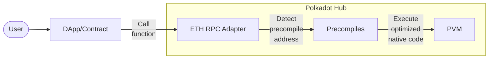
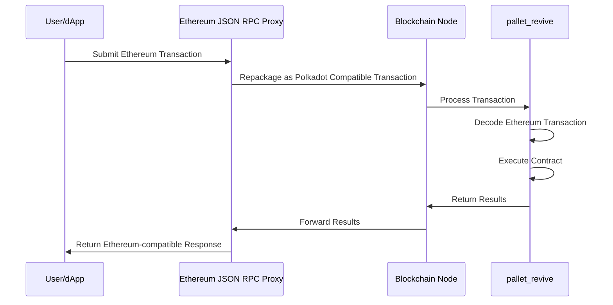
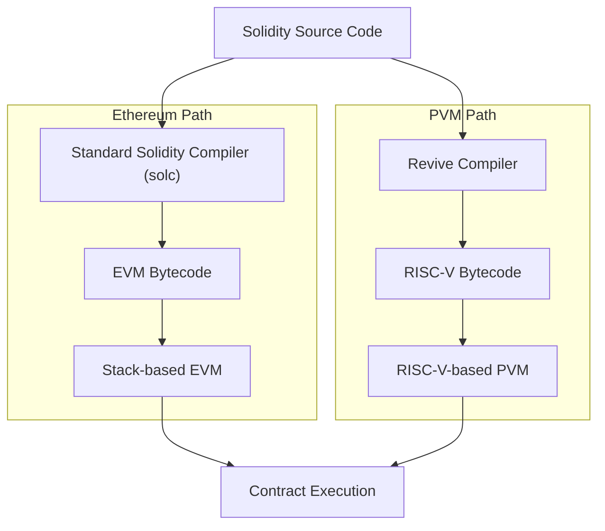
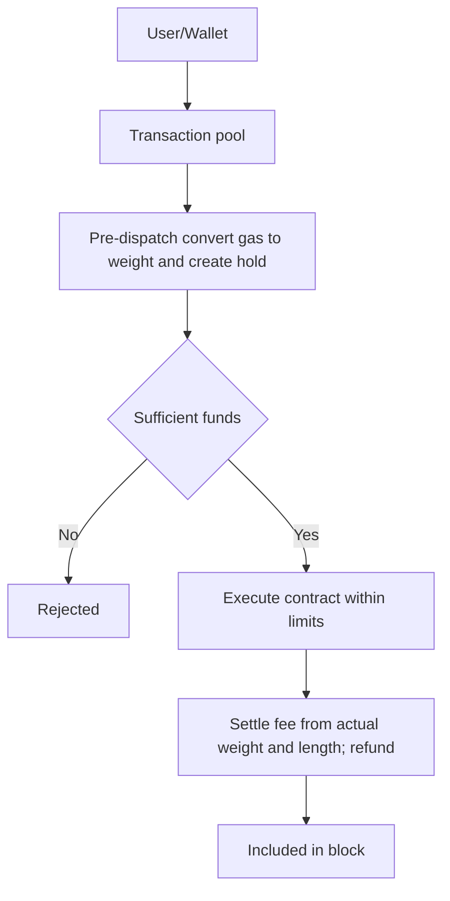
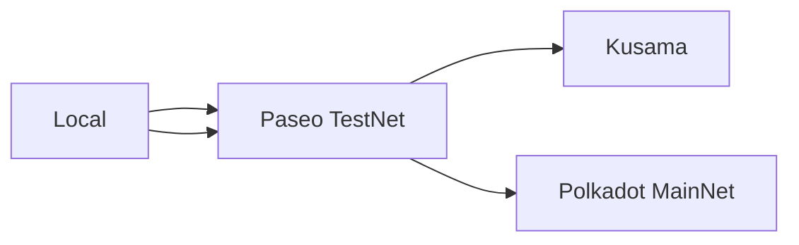
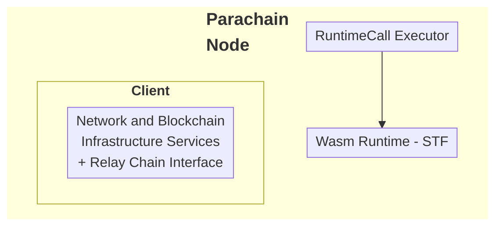
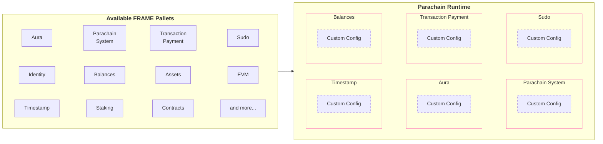

# Begin New Bundle: Smart Contracts
Includes shared base categories: basics, reference


---

Page Title: Accounts in Polkadot Hub Smart Contracts

- Resolved Markdown: https://docs.polkadot.com/smart-contracts/for-eth-devs/accounts.md
- Canonical (HTML): https://docs.polkadot.com/smart-contracts/for-eth-devs/accounts/
- Summary: Bridges Ethereum's 20-byte addresses with Polkadot's 32-byte accounts, enabling seamless interaction while maintaining compatibility with Ethereum tooling.
- Word Count: 1735; Token Estimate: 2652
- Last Updated: 2026-04-15T03:51:44+00:00
- Version Hash: sha256:a9b11d0a029d91bef0d2ab3185adc6e5c34995fb1549722afe2f7d09b9981382

# Accounts in Polkadot Hub Smart Contracts

!!! tip "Address Conversion Summary"
    Polkadot Hub automatically converts addresses between Ethereum (20-byte) and Polkadot (32-byte) formats:

    - **Ethereum to Polkadot**: The system adds twelve `0xEE` bytes to the end of the address, which is a reversible operation.
    - **Polkadot to Ethereum**: The system strips trailing `0xEE` bytes if present; otherwise, it hashes the account to derive a 20-byte address.

    ⚠️ Native Polkadot accounts must call [`map_account`](https://paritytech.github.io/polkadot-sdk/master/pallet_revive/pallet/dispatchables/fn.map_account.html) before interacting with smart contracts using Ethereum tools. See [Account Mapping](#account-mapping-for-native-polkadot-accounts) for details.

<div id="account-converter-root"></div>

## Introduction

Polkadot Hub natively utilizes Polkadot's 32-byte account system while providing interoperability with Ethereum's 20-byte addresses through an automatic conversion system. When interacting with smart contracts:

- Ethereum-compatible wallets (like MetaMask) can use their familiar 20-byte addresses.
- Polkadot accounts continue using their native 32-byte format.
- The Polkadot Hub chain automatically handles conversion between the two formats behind the scenes:

    - 20-byte Ethereum addresses are padded with `0xEE` bytes to create valid 32-byte Polkadot accounts.
    - 32-byte Polkadot accounts can optionally register a mapping to a 20-byte address for Ethereum compatibility.

This dual-format approach enables Polkadot Hub to maintain compatibility with Ethereum tooling while fully integrating with the Polkadot ecosystem.

## Address Types and Mappings

The platform handles two distinct address formats:

- [Ethereum-style addresses (20 bytes)](https://ethereum.org/developers/docs/accounts/#account-creation)
- [Polkadot native account IDs (32 bytes)](/polkadot-mkdocs/reference/parachains/accounts/)

### Ethereum to Polkadot Mapping

The [`AccountId32Mapper`](https://paritytech.github.io/polkadot-sdk/master/pallet_revive/struct.AccountId32Mapper.html) implementation in [`pallet_revive`](https://paritytech.github.io/polkadot-sdk/master/pallet_revive/index.html) handles the core address conversion logic. For converting a 20-byte Ethereum address to a 32-byte Polkadot address, the pallet uses a simple concatenation approach:

- [**Core mechanism**](https://paritytech.github.io/polkadot-sdk/master/pallet_revive/trait.AddressMapper.html#tymethod.to_fallback_account_id): Takes a 20-byte Ethereum address and extends it to 32 bytes by adding twelve `0xEE` bytes at the end. The key benefits of this approach are:
    - Able to fully revert, allowing a smooth transition back to the Ethereum format.
    - Provides clear identification of Ethereum-controlled accounts through the `0xEE` suffix pattern.
    - Maintains cryptographic security with a `2^96` difficulty for pattern reproduction.

### Polkadot to Ethereum Mapping

The conversion from 32-byte Polkadot accounts to 20-byte Ethereum addresses is more complex than the reverse direction due to the lossy nature of the conversion. The [`AccountId32Mapper`](https://paritytech.github.io/polkadot-sdk/master/pallet_revive/struct.AccountId32Mapper.html) handles this through two distinct approaches:

- **For Ethereum-derived accounts**: The system uses the [`is_eth_derived`](https://paritytech.github.io/polkadot-sdk/master/pallet_revive/fn.is_eth_derived.html) function to detect accounts that were originally Ethereum addresses (identified by the `0xEE` suffix pattern). For these accounts, the conversion strips the last 12 bytes to recover the original 20-byte Ethereum address.

- **For native Polkadot accounts**: Since these accounts utilize the whole 32-byte space and weren't derived from Ethereum addresses, direct truncation would result in lost information. Instead, the system:

    1. Hashes the entire 32-byte account using Keccak-256.
    2. Takes the last 20 bytes of the hash to create the Ethereum address.
    3. This ensures a deterministic mapping while avoiding simple truncation.

The conversion process is implemented through the [`to_address`](https://paritytech.github.io/polkadot-sdk/master/pallet_revive/trait.AddressMapper.html#tymethod.to_address) function, which automatically detects the account type and applies the appropriate conversion method.

**Stateful Mapping for Reversibility** : Since the conversion from 32-byte to 20-byte addresses is inherently lossy, the system provides an optional stateful mapping through the [`OriginalAccount`](https://paritytech.github.io/polkadot-sdk/master/pallet_revive/pallet/storage_types/struct.OriginalAccount.html) storage. When a Polkadot account registers a mapping (via the [`map`](https://paritytech.github.io/polkadot-sdk/master/pallet_revive/trait.AddressMapper.html#tymethod.map) function), the system stores the original 32-byte account ID, enabling the [`to_account_id`](https://paritytech.github.io/polkadot-sdk/master/pallet_revive/trait.AddressMapper.html#tymethod.to_account_id) function to recover the exact original account rather than falling back to a default conversion.


### Interacting with Unmapped Substrate Accounts

Native Polkadot accounts (32-byte format) that haven't been explicitly mapped have limited interaction capabilities with the Ethereum-compatible smart contract layer. Understanding these limitations and when mapping is required is essential for developers working with Polkadot Hub smart contracts.

#### Limitations of Unmapped Accounts

Unmapped Substrate accounts (those created with Ed25519 or Sr25519 keypairs) face the following restrictions:

- Cannot initiate transactions through Ethereum-compatible interfaces (like MetaMask or other EVM-compatible wallets).
- Cannot directly call smart contracts using Ethereum RPC methods.
- Cannot transfer funds to or from 20-byte Ethereum-compatible addresses without proper mapping.
- Limited interoperability with Ethereum tooling and existing EVM infrastructure.

The system can *receive* funds at the hashed 20-byte address derived from the 32-byte account, but the original account owner cannot control or access those funds through Ethereum-compatible methods without first establishing a proper mapping.

#### When Mapping is Required

Account mapping is **required** when:

- You want to interact with smart contracts using Ethereum-compatible tools (MetaMask, Web3.js, Ethers.js).
- You need to transfer funds using 20-byte address format.
- You want your existing Polkadot account to be accessible through EVM-compatible interfaces.
- You need bidirectional compatibility between Polkadot and Ethereum address formats.

Account mapping is **not required** when:

- Using native Polkadot addresses (32-byte) exclusively with Substrate-native interfaces.
- Interacting with parachains that don't use the Ethereum-compatible layer.
- Using accounts that were originally created with secp256k1 keys (Ethereum-compatible from the start).

### Account Mapping for Native Polkadot Accounts

If you have a native Polkadot account (32-byte format) that was created with a Polkadot/Substrate keypair (Ed25519/Sr25519) rather than an Ethereum-compatible keypair (secp256k1), you'll need to map your account to enable Ethereum compatibility.

To map your account, call the [`map_account`](https://paritytech.github.io/polkadot-sdk/master/pallet_revive/pallet/dispatchables/fn.map_account.html) extrinsic of the [`pallet_revive`](https://paritytech.github.io/polkadot-sdk/master/pallet_revive/index.html) pallet using your original Substrate account. This creates a stateful mapping that allows your 32-byte account to interact with the Ethereum-compatible smart contract system.

**Mapping Process:**

1. **Call the extrinsic**: Use your Substrate wallet to call `pallet_revive.map_account()`.
2. **Pay the deposit**: A deposit is required and held while the mapping exists (refundable upon unmapping).
3. **Receive confirmation**: Once mapped, your account can be used with both Polkadot and Ethereum interfaces.

Once mapped, you'll be able to:

- Transfer funds between 20-byte format addresses.
- Interact with smart contracts using Ethereum-compatible tools like MetaMask.
- Maintain full reversibility to your original 32-byte account format.
- Access funds at both your 32-byte Polkadot address and the mapped 20-byte Ethereum address.

!!! warning "Mapping Requirement"
    Without this mapping, native Polkadot accounts cannot transfer funds or interact with the Ethereum-compatible layer on the Hub. Attempting to send funds to an unmapped account's hashed Ethereum address may result in funds being inaccessible through standard Ethereum tools.

## Account Registration

The registration process is implemented through the [`map`](https://paritytech.github.io/polkadot-sdk/master/pallet_revive/trait.AddressMapper.html#tymethod.map) function. This process involves:

- Checking if the account is already mapped.
- Calculating and collecting required deposits based on data size.
- Storing the address suffix for future reference.
- Managing the currency holds for security.

## Fallback Accounts

The fallback mechanism is integrated into the [`to_account_id`](https://paritytech.github.io/polkadot-sdk/master/pallet_revive/trait.AddressMapper.html#tymethod.to_account_id) function. It provides a safety net for address conversion by:

- First, attempting to retrieve stored mapping data from [`OriginalAccount`](https://paritytech.github.io/polkadot-sdk/master/pallet_revive/pallet/storage_types/struct.OriginalAccount.html) storage.
- Falling back to the default conversion method (Keccak-256 hash) if no explicit mapping exists.
- Maintaining consistency in address representation across the system.

### How Fallback Works with Unmapped Accounts

When an unmapped 32-byte Polkadot account needs to be represented as a 20-byte Ethereum address, the system:

1. **Checks for explicit mapping**: First looks in the `OriginalAccount` storage to see if the account has been explicitly mapped via `map_account`.
2. **Applies fallback conversion**: If no mapping exists, automatically converts the 32-byte account to a 20-byte address by:
   - Hashing the full 32-byte account with Keccak-256.
   - Taking the last 20 bytes of the resulting hash.
3. **Uses the derived address**: This fallback address can receive funds, but the account owner cannot spend those funds through Ethereum-compatible interfaces without explicit mapping.

**Important Considerations:**

- The fallback mechanism is **one-way for unmapped accounts**. While you can derive the 20-byte address from a 32-byte account, you cannot recover the original 32-byte account from the 20-byte hash without the stored mapping.
- Funds sent to a fallback address of an unmapped account are not lost, but require explicit mapping to be accessible through Ethereum tools.
- For security and usability, it's recommended to establish explicit mappings rather than relying on fallback addresses for accounts that need Ethereum compatibility.

## Contract Address Generation

The system supports two methods for generating contract addresses:

- [CREATE1 method](https://paritytech.github.io/polkadot-sdk/master/pallet_revive/fn.create1.html):

    - Uses the deployer address and nonce.
    - Generates deterministic addresses for standard contract deployment.

- [CREATE2 method](https://paritytech.github.io/polkadot-sdk/master/pallet_revive/fn.create2.html):

    - Uses the deployer address, initialization code, input data, and salt.
    - Enables predictable address generation for advanced use cases.

## Security Considerations

The address mapping system maintains security through several design choices evident in the implementation:

- The stateless mapping requires no privileged operations, as shown in the [`to_fallback_account_id`](https://paritytech.github.io/polkadot-sdk/master/pallet_revive/trait.AddressMapper.html#tymethod.to_fallback_account_id) implementation.
- The stateful mapping requires a deposit managed through the [`Currency`](https://paritytech.github.io/polkadot-sdk/master/pallet_revive/pallet/trait.Config.html#associatedtype.Currency) trait.
- Mapping operations are protected against common errors through explicit checks.
- The system prevents double-mapping through the [`ensure!(!Self::is_mapped(account_id))`](https://github.com/paritytech/polkadot-sdk/blob/stable2412/substrate/frame/revive/src/address.rs#L125) check.

All source code references are from the [`address.rs`](https://github.com/paritytech/polkadot-sdk/blob/stable2412/substrate/frame/revive/src/address.rs) file in the Revive pallet of the Polkadot SDK repository.


---

Page Title: Advanced Functionalities via Precompiles

- Resolved Markdown: https://docs.polkadot.com/smart-contracts/precompiles.md
- Canonical (HTML): https://docs.polkadot.com/smart-contracts/precompiles/
- Summary: Explores how Polkadot integrates precompiles to run essential functions natively, improving the speed and efficiency of smart contracts on the Hub.
- Word Count: 303; Token Estimate: 410
- Last Updated: 2026-04-15T03:51:44+00:00
- Version Hash: sha256:09da868dba733e465844d0977a6686687ab7829f7264401148819c0e5f3a3cd7

# Advanced Functionalities via Precompiles

## Introduction

Precompiles serve a dual purpose in the Polkadot ecosystem: they not only enable high-performance smart contracts by providing native, optimized implementations of frequently used functions but will also eventually act as critical bridges, allowing contracts to interact with core platform capabilities.

This article explores how Polkadot leverages precompiles within the Revive pallet to enhance efficiency and how they will extend functionality for developers in the future, including planned access to native features like Cross-Consensus Messaging (XCM).

## What are Precompiles?

Precompiles are special contract implementations that run directly at the runtime level rather than as on-chain PVM contracts. In typical EVM environments, precompiles provide essential cryptographic and utility functionality at addresses that start with specific patterns. Revive follows this design pattern but with its own implementation optimized for PVM.

Users interact with the dApp/contract, which in turn calls the PVM. The PVM detects the precompile address and calls the corresponding precompile. The precompile executes the native code and returns the result to the dApp/contract. The dApp/contract then returns the result to the user.




## Conclusion

For smart contract developers, precompiles offer a powerful way to access both low-level, high-performance operations and core platform capabilities within the smart contract execution context. Through Revive, Polkadot exposes these native functionalities, allowing developers to build faster, more efficient contracts that can take full advantage of the Polkadot ecosystem.

Understanding and utilizing precompiles can unlock advanced functionality and performance gains, making them an essential tool for anyone building on the Polkadot Hub.


---

Page Title: Block Explorers

- Resolved Markdown: https://docs.polkadot.com/smart-contracts/explorers.md
- Canonical (HTML): https://docs.polkadot.com/smart-contracts/explorers/
- Summary: Access block explorers like Subscan, BlockScout, and Routescan to track transactions, analyze contracts, and view on-chain data from smart contracts.
- Word Count: 352; Token Estimate: 603
- Last Updated: 2026-04-15T03:51:44+00:00
- Version Hash: sha256:12bc208c4652c5cecd24ed85006140f41f2ed2af4a54b68a814722dec3233242

# Block Explorers

## Introduction

Block explorers serve as comprehensive blockchain analytics platforms that provide access to on-chain data. These web applications function as search engines for blockchain networks, allowing users to query, visualize, and analyze blockchain data in real time through intuitive interfaces.

## Core Functionality

Block explorers provide essential capabilities for interacting with smart contracts on Polkadot Hub:

- **Transaction tracking**: Monitor transaction status, confirmations, fees, and metadata.
- **Address analysis**: View account balances, transaction history, and associated contracts.
- **Block information**: Examine block contents.
- **Smart contract interaction**: Review contract code, verification status, and interaction history.
- **Token tracking**: Monitor ERC-20, ERC-721, and other token standards with transfer history and holder analytics.
- **Network statistics**: Access metrics on transaction volume, gas usage, and other network parameters.

## Available Block Explorers

The following block explorers are available for Polkadot Hub smart contracts, providing specialized tools for monitoring and analyzing contract activity.

### BlockScout

BlockScout is an open-source explorer platform hosted by Parity under the `polkadot.io` domain. It excels at EVM-focused analytics, contract verification without an API key, and provides developers with a full Etherscan-compatible API.

- [Polkadot Hub BlockScout](https://blockscout.polkadot.io/)
- [Polkadot Hub TestNet BlockScout](https://blockscout-testnet.polkadot.io/)
- [Kusama Hub BlockScout](https://blockscout-kusama.polkadot.io/)


### Routescan

Routescan delivers multi-chain explorer capabilities with an Etherscan-compatible interface and API. It provides contract verification using an API key and supports both Polkadot Hub mainnet and TestNet.

- [Polkadot Hub Routescan](https://polkadot.routescan.io/)
- [Polkadot Hub TestNet Routescan](https://polkadot.testnet.routescan.io/)
- [Kusama Hub Routescan](https://kusama.routescan.io/)


### Subscan

Subscan is the flagship Polkadot ecosystem block explorer. It is Substrate-native and provides comprehensive support for both Substrate-level data (pallets, extrinsics, events) and EVM transactions and smart contracts, making it well-suited for inspecting both layers simultaneously.

- [Polkadot Hub Subscan](https://assethub-polkadot.subscan.io/)
- [Polkadot Hub TestNet Subscan](https://assethub-paseo.subscan.io/)
- [Kusama Hub Subscan](https://assethub-kusama.subscan.io/)


---

Page Title: Blocks

- Resolved Markdown: https://docs.polkadot.com/reference/parachains/blocks-transactions-fees/blocks.md
- Canonical (HTML): https://docs.polkadot.com/reference/parachains/blocks-transactions-fees/blocks/
- Summary: Understand how blocks are produced, validated, and imported in Polkadot SDK-based blockchains, covering initialization, finalization, and authoring processes.
- Word Count: 890; Token Estimate: 1335
- Last Updated: 2026-04-15T03:51:44+00:00
- Version Hash: sha256:4fb6cc5ba09140a53c043322725a40d8591e2f38e0a2ab2357c4c8cef00114e5

# Blocks

## Introduction

In the Polkadot SDK, blocks are fundamental to the functioning of the blockchain, serving as containers for [transactions](/polkadot-mkdocs/reference/parachains/blocks-transactions-fees/transactions/) and changes to the chain's state. Blocks consist of headers and an array of transactions, ensuring the integrity and validity of operations on the network. This guide explores the essential components of a block, the process of block production, and how blocks are validated and imported across the network. By understanding these concepts, developers can better grasp how blockchains maintain security, consistency, and performance within the Polkadot ecosystem.

## What is a Block?

In the Polkadot SDK, a block is a fundamental unit that encapsulates both the header and an array of transactions. The block header includes critical metadata to ensure the integrity and sequence of the blockchain. Here's a breakdown of its components:

- **Block height**: Indicates the number of blocks created in the chain so far.
- **Parent hash**: The hash of the previous block, providing a link to maintain the blockchain's immutability.
- **Transaction root**: Cryptographic digest summarizing all transactions in the block.
- **State root**: A cryptographic digest representing the post-execution state.
- **Digest**: Additional information that can be attached to a block, such as consensus-related messages.

Each transaction is part of a series that is executed according to the runtime's rules. The transaction root is a cryptographic digest of this series, which prevents alterations and enables succinct verification by light clients. This verification process allows light clients to confirm whether a transaction exists in a block with only the block header, avoiding downloading the entire block.

## Block Production

When an authoring node is authorized to create a new block, it selects transactions from the transaction queue based on priority. This step, known as block production, relies heavily on the executive module to manage the initialization and finalization of blocks. The process is summarized as follows:

### Initialize Block

The block initialization process begins with a series of function calls that prepare the block for transaction execution:

1. **Call `on_initialize`**: The executive module calls the [`on_initialize`](https://paritytech.github.io/polkadot-sdk/master/frame_support/traits/trait.Hooks.html#method.on_initialize) hook from the system pallet and other runtime pallets to prepare for the block's transactions.
2. **Coordinate runtime calls**: Coordinates function calls in the order defined by the transaction queue.
3. **Verify information**: Once [`on_initialize`](https://paritytech.github.io/polkadot-sdk/master/frame_support/traits/trait.Hooks.html#method.on_initialize) functions are executed, the executive module checks the parent hash in the block header and the trie root to verify information is consistent.

### Finalize Block

Once transactions are processed, the block must be finalized before being broadcast to the network. The finalization steps are as follows:

1. **Call `on_finalize`**: The executive module calls the [`on_finalize`](https://paritytech.github.io/polkadot-sdk/master/frame_support/traits/trait.Hooks.html#method.on_finalize) hooks in each pallet to ensure any remaining state updates or checks are completed before the block is sealed and published.
2. **Verify information**: The block's digest and storage root in the header are checked against the initialized block to ensure consistency.
3. **Call `on_idle`**: The [`on_idle`](https://paritytech.github.io/polkadot-sdk/master/frame_support/traits/trait.Hooks.html#method.on_idle) hook is triggered to process any remaining tasks using the leftover weight from the block.

## Block Authoring and Import

Once the block is finalized, it is gossiped to other nodes in the network. Nodes follow this procedure:

1. **Receive transactions**: The authoring node collects transactions from the network.
2. **Validate**: Transactions are checked for validity.
3. **Queue**: Valid transactions are placed in the transaction pool for execution.
4. **Execute**: State changes are made as the transactions are executed.
5. **Publish**: The finalized block is broadcast to the network.

### Block Import Queue

After a block is published, other nodes on the network can import it into their chain state. The block import queue is part of the outer node in every Polkadot SDK-based node and ensures incoming blocks are valid before adding them to the node's state.

In most cases, you don't need to know details about how transactions are gossiped or how other nodes on the network import blocks. The following traits are relevant, however, if you plan to write any custom consensus logic or want a deeper dive into the block import queue:

- **[`ImportQueue`](https://paritytech.github.io/polkadot-sdk/master/sc_consensus/import_queue/trait.ImportQueue.html)**: The trait that defines the block import queue.
- **[`Link`](https://paritytech.github.io/polkadot-sdk/master/sc_consensus/import_queue/trait.Link.html)**: The trait that defines the link between the block import queue and the network.
- **[`BasicQueue`](https://paritytech.github.io/polkadot-sdk/master/sc_consensus/import_queue/struct.BasicQueue.html)**: A basic implementation of the block import queue.
- **[`Verifier`](https://paritytech.github.io/polkadot-sdk/master/sc_consensus/import_queue/trait.Verifier.html)**: The trait that defines the block verifier.
- **[`BlockImport`](https://paritytech.github.io/polkadot-sdk/master/sc_consensus/block_import/trait.BlockImport.html)**: The trait that defines the block import process.

These traits govern how blocks are validated and imported across the network, ensuring consistency and security.

## Additional Resources

To learn more about the block structure in the Polkadot SDK runtime, see the [`Block` reference](https://paritytech.github.io/polkadot-sdk/master/sp_runtime/traits/trait.Block.html) entry in the Rust Docs.


---

Page Title: Chain Data

- Resolved Markdown: https://docs.polkadot.com/reference/parachains/chain-data.md
- Canonical (HTML): https://docs.polkadot.com/reference/parachains/chain-data/
- Summary: Learn how to expose and utilize chain data for blockchain applications. Discover runtime metadata, RPC APIs, and tools for efficient development.
- Word Count: 2176; Token Estimate: 3653
- Last Updated: 2026-04-15T03:51:44+00:00
- Version Hash: sha256:ec51149e9fa0220e2a9ff9e53515049a599dbda51b226031773e17abb54aee84

# Chain Data

## Introduction

Understanding and leveraging on-chain data is a fundamental aspect of blockchain development. Whether you're building frontend applications or backend systems, accessing and decoding runtime metadata is vital to interacting with the blockchain. This guide introduces you to the tools and processes for generating and retrieving metadata, explains its role in application development, and outlines the additional APIs available for interacting with a Polkadot node. By mastering these components, you can ensure seamless communication between your applications and the blockchain.

## Application Development

You might not be directly involved in building frontend applications as a blockchain developer. However, most applications that run on a blockchain require some form of frontend or user-facing client to enable users or other programs to access and modify the data that the blockchain stores. For example, you might develop a browser-based, mobile, or desktop application that allows users to submit transactions, post articles, view their assets, or track previous activity. The backend for that application is configured in the runtime logic for your blockchain, but the frontend client makes the runtime features accessible to your users.

For your custom chain to be useful to others, you'll need to provide a client application that allows users to view, interact with, or update information that the blockchain keeps track of. In this article, you'll learn how to expose information about your runtime so that client applications can use it, see examples of the information exposed, and explore tools and libraries that use it.

## Understand Metadata

Polkadot SDK-based blockchain networks are designed to expose their runtime information, allowing developers to learn granular details regarding pallets, RPC calls, and runtime APIs. The metadata also exposes their related documentation. The chain's metadata is [SCALE-encoded](/polkadot-mkdocs/reference/parachains/data-encoding/), allowing for the development of browser-based, mobile, or desktop applications to support the chain's runtime upgrades seamlessly. It is also possible to develop applications compatible with multiple Polkadot SDK-based chains simultaneously.

## Expose Runtime Information as Metadata

To interact with a node or the state of the blockchain, you need to know how to connect to the chain and access the exposed runtime features. This interaction involves a Remote Procedure Call (RPC) through a node endpoint address, commonly through a secure web socket connection.

An application developer typically needs to know the contents of the runtime logic, including the following details:

- Version of the runtime the application is connecting to.
- Supported APIs.
- Implemented pallets.
- Defined functions and corresponding type signatures.
- Defined custom types.
- Exposed parameters users can set.

As the Polkadot SDK is modular and provides a composable framework for building blockchains, there are limitless opportunities to customize the schema of properties. Each runtime can be configured with its properties, including function calls and types, which can be changed over time with runtime upgrades.

The Polkadot SDK enables you to generate the runtime metadata schema to capture information unique to a runtime. The metadata for a runtime describes the pallets in use and types defined for a specific runtime version. The metadata includes information about each pallet's storage items, functions, events, errors, and constants. The metadata also provides type definitions for any custom types included in the runtime.

Metadata provides a complete inventory of a chain's runtime. It is key to enabling client applications to interact with the node, parse responses, and correctly format message payloads sent back to that chain.

## Generate Metadata

To efficiently use the blockchain's networking resources and minimize the data transmitted over the network, the metadata schema is encoded using the [Parity SCALE Codec](https://github.com/paritytech/parity-scale-codec?tab=readme-ov-file#parity-scale-codec). This encoding is done automatically through the [`scale-info`](https://docs.rs/scale-info/latest/scale_info/)crate.

At a high level, generating the metadata involves the following steps:

1. The pallets in the runtime logic expose callable functions, types, parameters, and documentation that need to be encoded in the metadata.
2. The `scale-info` crate collects type information for the pallets in the runtime, builds a registry of the pallets that exist in a particular runtime, and the relevant types for each pallet in the registry. The type information is detailed enough to enable encoding and decoding for every type.
3. The [`frame-metadata`](https://github.com/paritytech/frame-metadata) crate describes the structure of the runtime based on the registry provided by the `scale-info` crate.
4. Nodes provide the RPC method `state_getMetadata` to return a complete description of all the types in the current runtime as a hex-encoded vector of SCALE-encoded bytes.

## Retrieve Runtime Metadata

The type information provided by the metadata enables applications to communicate with nodes using different runtime versions and across chains that expose different calls, events, types, and storage items. The metadata also allows libraries to generate a substantial portion of the code needed to communicate with a given node, enabling libraries like [`subxt`](https://github.com/paritytech/subxt) to generate frontend interfaces that are specific to a target chain.

### Use Polkadot.js

Visit the [Polkadot.js Portal](https://polkadot.js.org/apps/#/rpc) and select the **Developer** dropdown in the top banner. Select **RPC Calls** to make the call to request metadata. Follow these steps to make the RPC call:

1. Select **state** as the endpoint to call.
2. Select **`getMetadata(at)`** as the method to call.
3. Click **Submit RPC call** to submit the call and return the metadata in JSON format.

### Use Curl 

You can fetch the metadata for the network by calling the node's RPC endpoint. This request returns the metadata in bytes rather than human-readable JSON:

```sh
curl -H "Content-Type: application/json" \
-d '{"id":1, "jsonrpc":"2.0", "method": "state_getMetadata"}' \
https://rpc.polkadot.io

```

### Use Subxt

[`subxt`](https://github.com/paritytech/subxt) may also be used to fetch the metadata of any data in a human-readable JSON format: 

```sh
subxt metadata  --url wss://rpc.polkadot.io --format json > spec.json
```

Another option is to use the [`subxt` explorer web UI](https://paritytech.github.io/subxt-explorer/#/).

## Client Applications and Metadata

The metadata exposes the expected way to decode each type, meaning applications can send, retrieve, and process application information without manual encoding and decoding. Client applications must use the [SCALE codec library](https://github.com/paritytech/parity-scale-codec?tab=readme-ov-file#parity-scale-codec) to encode and decode RPC payloads to use the metadata. Client applications use the metadata to interact with the node, parse responses, and format message payloads sent to the node.

## Metadata Format

Although the SCALE-encoded bytes can be decoded using the `frame-metadata` and [`parity-scale-codec`](https://github.com/paritytech/parity-scale-codec) libraries, there are other tools, such as `subxt` and the Polkadot-JS API, that can convert the raw data to human-readable JSON format.

The types and type definitions included in the metadata returned by the `state_getMetadata` RPC call depend on the runtime's metadata version.

In general, the metadata includes the following information:

- A constant identifying the file as containing metadata.
- The version of the metadata format used in the runtime.
- Type definitions for all types used in the runtime and generated by the `scale-info` crate.
- Pallet information for the pallets included in the runtime in the order that they are defined in the `construct_runtime` macro.

!!!tip 
    Depending on the frontend library used (such as the [Polkadot API](https://papi.how/)), they may format the metadata differently than the raw format shown.

The following example illustrates a condensed and annotated section of metadata decoded and converted to JSON:

```json
[
    1635018093,
    {
        "V14": {
            "types": {
                "types": [{}]
            },
            "pallets": [{}],
            "extrinsic": {
                "ty": 126,
                "version": 4,
                "signed_extensions": [{}]
            },
            "ty": 141
        }
    }
]
```

The constant `1635018093` is a magic number that identifies the file as a metadata file. The rest of the metadata is divided into the `types`, `pallets`, and `extrinsic` sections:

- The `types` section contains an index of the types and information about each type's type signature.
- The `pallets` section contains information about each pallet in the runtime.
- The `extrinsic` section describes the type identifier and transaction format version that the runtime uses.

Different extrinsic versions can have varying formats, especially when considering [signed transactions](/polkadot-mkdocs/reference/parachains/blocks-transactions-fees/transactions/#signed-transactions). 

### Pallets

The following is a condensed and annotated example of metadata for a single element in the `pallets` array (the [`sudo`](https://paritytech.github.io/polkadot-sdk/master/pallet_sudo/index.html) pallet):

```json
{
    "name": "Sudo",
    "storage": {
        "prefix": "Sudo",
        "entries": [
            {
                "name": "Key",
                "modifier": "Optional",
                "ty": {
                    "Plain": 0
                },
                "default": [0],
                "docs": ["The `AccountId` of the sudo key."]
            }
        ]
    },
    "calls": {
        "ty": 117
    },
    "event": {
        "ty": 42
    },
    "constants": [],
    "error": {
        "ty": 124
    },
    "index": 8
}
```

Every element metadata contains the name of the pallet it represents and information about its storage, calls, events, and errors. You can look up details about the definition of the calls, events, and errors by viewing the type index identifier. The type index identifier is the `u32` integer used to access the type information for that item. For example, the type index identifier for calls in the Sudo pallet is 117. If you view information for that type identifier in the `types` section of the metadata, it provides information about the available calls, including the documentation for each call.

For example, the following is a condensed excerpt of the calls for the Sudo pallet:

```json
{
    "id": 117,
    "type": {
        "path": ["pallet_sudo", "pallet", "Call"],
        "params": [
            {
                "name": "T",
                "type": null
            }
        ],
        "def": {
            "variant": {
                "variants": [
                    {
                        "name": "sudo",
                        "fields": [
                            {
                                "name": "call",
                                "type": 114,
                                "typeName": "Box<<T as Config>::RuntimeCall>"
                            }
                        ],
                        "index": 0,
                        "docs": [
                            "Authenticates sudo key, dispatches a function call with `Root` origin"
                        ]
                    },
                    {
                        "name": "sudo_unchecked_weight",
                        "fields": [
                            {
                                "name": "call",
                                "type": 114,
                                "typeName": "Box<<T as Config>::RuntimeCall>"
                            },
                            {
                                "name": "weight",
                                "type": 8,
                                "typeName": "Weight"
                            }
                        ],
                        "index": 1,
                        "docs": [
                            "Authenticates sudo key, dispatches a function call with `Root` origin"
                        ]
                    },
                    {
                        "name": "set_key",
                        "fields": [
                            {
                                "name": "new",
                                "type": 103,
                                "typeName": "AccountIdLookupOf<T>"
                            }
                        ],
                        "index": 2,
                        "docs": [
                            "Authenticates current sudo key, sets the given AccountId (`new`) as the new sudo"
                        ]
                    },
                    {
                        "name": "sudo_as",
                        "fields": [
                            {
                                "name": "who",
                                "type": 103,
                                "typeName": "AccountIdLookupOf<T>"
                            },
                            {
                                "name": "call",
                                "type": 114,
                                "typeName": "Box<<T as Config>::RuntimeCall>"
                            }
                        ],
                        "index": 3,
                        "docs": [
                            "Authenticates sudo key, dispatches a function call with `Signed` origin from a given account"
                        ]
                    }
                ]
            }
        }
    }
}
```

For each field, you can access type information and metadata for the following:

- **Storage metadata**: Provides the information required to enable applications to get information for specific storage items.
- **Call metadata**: Includes information about the runtime calls defined by the `#[pallet]` macro including call names, arguments and documentation.
- **Event metadata**: Provides the metadata generated by the `#[pallet::event]` macro, including the name, arguments, and documentation for each pallet event.
- **Constants metadata**: Provides metadata generated by the `#[pallet::constant]` macro, including the name, type, and hex-encoded value of the constant.
- **Error metadata**: Provides metadata generated by the `#[pallet::error]` macro, including the name and documentation for each pallet error.

!!!tip
    Type identifiers change from time to time, so you should avoid relying on specific type identifiers in your applications.

### Extrinsic

The runtime generates extrinsic metadata and provides useful information about transaction format. When decoded, the metadata contains the transaction version and the list of signed extensions.

For example:

```json
{
    "extrinsic": {
        "ty": 126,
        "version": 4,
        "signed_extensions": [
            {
                "identifier": "CheckNonZeroSender",
                "ty": 132,
                "additional_signed": 41
            },
            {
                "identifier": "CheckSpecVersion",
                "ty": 133,
                "additional_signed": 4
            },
            {
                "identifier": "CheckTxVersion",
                "ty": 134,
                "additional_signed": 4
            },
            {
                "identifier": "CheckGenesis",
                "ty": 135,
                "additional_signed": 11
            },
            {
                "identifier": "CheckMortality",
                "ty": 136,
                "additional_signed": 11
            },
            {
                "identifier": "CheckNonce",
                "ty": 138,
                "additional_signed": 41
            },
            {
                "identifier": "CheckWeight",
                "ty": 139,
                "additional_signed": 41
            },
            {
                "identifier": "ChargeTransactionPayment",
                "ty": 140,
                "additional_signed": 41
            }
        ]
    },
    "ty": 141
}
```

The type system is [composite](https://paritytech.github.io/polkadot-sdk/master/polkadot_sdk_docs/reference_docs/frame_runtime_types/index.html), meaning each type identifier contains a reference to a specific type or to another type identifier that provides information about the associated primitive types.

For example, you can encode the `BitVec<Order, Store>` type, but to decode it properly, you must know the types used for the `Order` and `Store` types. To find type information for `Order` and `Store`, you can use the path in the decoded JSON to locate their type identifiers.

## Included RPC APIs

A standard node comes with the following APIs to interact with a node:

- **[`AuthorApiServer`](https://paritytech.github.io/polkadot-sdk/master/sc_rpc/author/trait.AuthorApiServer.html)**: Make calls into a full node, including authoring extrinsics and verifying session keys.
- **[`ChainApiServer`](https://paritytech.github.io/polkadot-sdk/master/sc_rpc/chain/trait.ChainApiServer.html)**: Retrieve block header and finality information.
- **[`OffchainApiServer`](https://paritytech.github.io/polkadot-sdk/master/sc_rpc/offchain/trait.OffchainApiServer.html)**: Make RPC calls for off-chain workers.
- **[`StateApiServer`](https://paritytech.github.io/polkadot-sdk/master/sc_rpc/state/trait.StateApiServer.html)**: Query information about on-chain state such as runtime version, storage items, and proofs.
- **[`SystemApiServer`](https://paritytech.github.io/polkadot-sdk/master/sc_rpc/system/trait.SystemApiServer.html)**: Retrieve information about network state, such as connected peers and node roles.

## Additional Resources

The following tools can help you locate and decode metadata:

- [Subxt Explorer](https://paritytech.github.io/subxt-explorer/#/)
- [Metadata Portal 🌗](https://github.com/paritytech/metadata-portal)
- [De[code] Sub[strate]](https://github.com/paritytech/desub)


---

Page Title: Connect to Polkadot

- Resolved Markdown: https://docs.polkadot.com/smart-contracts/connect.md
- Canonical (HTML): https://docs.polkadot.com/smart-contracts/connect/
- Summary: Explore how to connect to Polkadot Hub, configure your wallet, and obtain test tokens for developing and testing smart contracts.
- Word Count: 659; Token Estimate: 1271
- Last Updated: 2026-04-15T03:51:44+00:00
- Version Hash: sha256:a221be5350f2b976342cfa15b32d98876c149bf1266addf3fc8b249db986c690

# Connect to Polkadot

<div class="button-wrapper">
  <a href="#" class="md-button connect-metamask" value="polkadotTestNet">
    Connect to Polkadot Hub TestNet
  </a>
  
  <a href="#" class="md-button connect-metamask" value="polkadot">
    Connect to Polkadot Hub
  </a>
</div>

For more information about how to connect to Polkadot Hub, please check the [Wallets for Polkadot Hub](/polkadot-mkdocs/smart-contracts/integrations/wallets/) guide.

!!! warning "Account Mapping"
    If you are using a native Polkadot account (32-byte format) that was created with a Polkadot/Substrate keypair (Ed25519/Sr25519) rather than an Ethereum-compatible keypair (secp256k1), you'll need to map your account to enable Ethereum compatibility. See the [Account Mapping](/polkadot-mkdocs/smart-contracts/for-eth-devs/accounts/#account-mapping-for-native-polkadot-accounts) section for more details.

## Networks Details

Developers can leverage smart contracts across diverse networks, from TestNets to MainNet. This section outlines the network specifications and connection details for each environment.

!!! note "WebSocket (WSS) endpoints"
    The WSS endpoints listed below are not behind an eth-rpc proxy. For Ethereum JSON-RPC compatibility, use the HTTP RPC URLs provided for each network instead.

=== "Polkadot Hub TestNet"

    Network name

    ```text
    Polkadot Hub TestNet
    ```

    ---

    Currency symbol
    
    ```text
    PAS
    ```

    ---
    
    Chain ID
    
    ```text
    420420417
    ```

    ---
    
    RPC URL
    
    === "Parity"

        ```text
        https://eth-rpc-testnet.polkadot.io/
        ```

    === "OpsLayer"

        ```text
        https://services.polkadothub-rpc.com/testnet/
        ```

    ---
    
    Block explorer URL

    === "Blockscout"

        ```text
        https://blockscout-testnet.polkadot.io/
        ```

    === "Routescan"

        ```text
        https://polkadot.testnet.routescan.io/
        ```

    ---

    WSS URL

    ```text
    wss://asset-hub-paseo-rpc.n.dwellir.com
    ```


=== "Polkadot Hub"

    Network name

    ```text
    Polkadot Hub
    ```

    ---

    Currency symbol
    
    ```text
    DOT
    ```

    ---
    
    Chain ID
    
    ```text
    420420419
    ```

    ---
    
    RPC URL

    === "Parity"

        ```text
        https://eth-rpc.polkadot.io/
        ```

    === "OpsLayer"

        ```text
        https://services.polkadothub-rpc.com/mainnet/
        ```

    ---
    
    Block explorer URL

    === "Blockscout"

        ```text
        https://blockscout.polkadot.io/
        ```

    ---

    WSS URL

    ```text
    wss://polkadot-asset-hub-rpc.polkadot.io
    ```

=== "Kusama Hub"

    Network name

    ```text
    Kusama Hub
    ```

    ---

    Currency symbol
    
    ```text
    KSM
    ```

    ---
    
    Chain ID
    
    ```text
    420420418
    ```

    ---
    
    RPC URL

    === "Parity"
    
        ```text
        https://eth-rpc-kusama.polkadot.io/
        ```

    ---

    Block explorer URL

    === "Blockscout"

        ```text
        https://blockscout-kusama.polkadot.io/
        ```

    ---

    WSS URL

    ```text
    wss://kusama-asset-hub-rpc.polkadot.io
    ```


## Test Tokens

You will need testnet tokens to perform transactions and engage with smart contracts on any chain. Here's how to obtain Paseo (PAS) tokens for testing purposes:

1. Navigate to the [Polkadot Faucet](https://faucet.polkadot.io/). If the desired network is not already selected, choose it from the Network drop-down.

2. Copy your address linked to the TestNet and paste it into the designated field.

    

3. Click the **Get Some PASs** button to request free test PAS tokens. These tokens will be sent to your wallet shortly.

    

Now that you have obtained PAS tokens in your wallet, you’re ready to deploy and interact with smart contracts on Polkadot Hub TestNet! These tokens will allow you to pay for gas fees when executing transactions, deploying contracts, and testing your dApp functionality in a secure testnet environment. 

## Where to Go Next

For your next steps, explore the various smart contract guides demonstrating how to use and integrate different tools and development environments into your workflow.

<div class="grid cards" markdown>

-   <span class="badge guide">Guide</span> __Get started with Remix__

    ---

    Learn how to get started with Remix, a browser-based IDE for writing, deploying, and interacting with smart contracts.

    [:octicons-arrow-right-24: Build with Remix IDE](/polkadot-mkdocs/smart-contracts/dev-environments/remix/)

-   <span class="badge guide">Guide</span> __Deploy a contract using Remix__

    ---

    Deploy your first contract on Polkadot Hub using the Remix IDE.

    [:octicons-arrow-right-24: Build with Remix IDE](/polkadot-mkdocs/smart-contracts/cookbook/smart-contracts/deploy-basic/basic-remix/)

-   <span class="badge guide">Guide</span> __Interact with the blockchain with viem__

    ---

    Use viem to deploy and interact with smart contracts on Polkadot Hub.

    [:octicons-arrow-right-24: Build with viem](/polkadot-mkdocs/smart-contracts/libraries/viem/)

</div>


---

Page Title: Contract Deployment

- Resolved Markdown: https://docs.polkadot.com/smart-contracts/for-eth-devs/contract-deployment.md
- Canonical (HTML): https://docs.polkadot.com/smart-contracts/for-eth-devs/contract-deployment/
- Summary: Compare deployment flows for REVM and PVM-based smart contracts on the Polkadot Hub. Includes single-step REVM flows and PVM's two-step deployment model.
- Word Count: 754; Token Estimate: 1150
- Last Updated: 2026-04-15T03:51:44+00:00
- Version Hash: sha256:b4d64a6b3f0ebc9b16a5cb6d856aea93991b4f807cafeb0b21329924085b0abf

# Contract Deployment

## Introduction

Polkadot's smart contract platform supports two distinct virtual machine backends: Rust Ethereum Virtual Machine (REVM) and PVM. Each backend has its own deployment characteristics and optimization strategies. REVM provides full Ethereum compatibility with familiar single-step deployment, while the RISC-V-based PVM uses a more structured two-step approach optimized for its architecture. Understanding these differences ensures smooth deployment regardless of which backend you choose for your smart contracts.

## REVM Deployment

The REVM backend enables seamless deployment of Ethereum contracts without modification. Contracts deploy exactly as they would on Ethereum, using familiar tools and workflows.

With REVM, deployment mirrors the Ethereum flow exactly including:

- Contracts are bundled and deployed in a single transaction.
- Factory contracts can create new contracts at runtime.
- Runtime code generation, including inline assembly, is supported.
- Existing familiar tools like Hardhat, Foundry, and Remix work out of the box.

## PVM Deployment

PVM implements a fundamentally different deployment model optimized for its RISC-V architecture. While simple contract deployments work seamlessly, advanced patterns like factory contracts require understanding the two-step deployment process.

### Standard Contract Deployment

For most use cases, such as deploying ERC-20 tokens, NFT collections, or standalone contracts, deployment is transparent and requires no special steps. The [Revive compiler](https://github.com/paritytech/revive) handles the deployment process automatically when using standard Solidity patterns.

### Two-Step Deployment Model

PVM separates contract deployment into distinct phases:

1. **Code upload**: Contract bytecode must be uploaded to the chain before instantiation.
2. **Contract instantiation**: Contracts are created by referencing previously uploaded code via its hash.

This architecture differs from the EVM's bundled approach and has important implications for specific deployment patterns.

### Factory Pattern Considerations

The common EVM pattern, where contracts dynamically create other contracts, requires adaptation for PVM as follows:

**EVM Factory Pattern:**
```solidity
// This works on REVM but requires modification for PVM
contract Factory {
    function createToken() public returns (address)
}
```

**PVM Requirements:**

- **Pre-upload dependent contracts**: All contracts that will be instantiated at runtime must be uploaded to the chain before the factory attempts to create them.
- **Code hash references**: Factory contracts work with pre-uploaded code hashes rather than embedding bytecode.
- **No runtime code generation**: Dynamic bytecode generation is not supported due to PVM's RISC-V format.

### Migration Strategy for Factory Contracts

When migrating factory contracts from Ethereum to PVM:

1. **Identify all contracts**: Determine which contracts will be instantiated at runtime.
2. **Upload dependencies first**: Deploy all dependent contracts to the chain before deploying the factory.
3. **Use on-chain constructors**: Leverage PVM's on-chain constructor feature for flexible instantiation.
4. **Avoid assembly creation**: Don't use `create` or `create2` opcodes in assembly blocks for manual deployment.

### Architecture-Specific Limitations

PVM's deployment model creates several specific constraints:

- **`EXTCODECOPY` limitations**: Contracts using `EXTCODECOPY` to manipulate code at runtime will encounter issues.
- **Runtime code modification**: Patterns that construct and mutate contract code on-the-fly are not supported.
- **Assembly-based factories**: Factory contracts written in YUL assembly that generate code at runtime will fail with `CodeNotFound` errors.

These patterns are rare in practice and typically require dropping down to assembly, making them non-issues for standard Solidity development.

### On-Chain Constructors

PVM provides on-chain constructors as an elegant alternative to runtime code modification:

- Enable contract instantiation without runtime code generation.
- Support flexible initialization patterns.
- Maintain separation between code upload and contract creation.
- Provide predictable deployment costs.

## Gas Estimation vs Actual Consumption

Both REVM and PVM deployments may show significant differences between gas estimation and actual consumption. You might see estimates that are several times higher than the actual gas consumed (often around 30% of the estimate). This is normal behavior because pre-dispatch estimation cannot distinguish between computation weight and storage deposits, leading to conservative overestimation. Contract deployments are particularly affected as they consume significant storage deposits for code storage.

## Deployment Comparison

|        Feature        |      REVM Backend       |           PVM Backend           |
|:---------------------:|:-----------------------:|:-------------------------------:|
| **Deployment Model**  |   Single-step bundled   | Two-step upload and instantiate |
| **Factory Patterns**  | Direct runtime creation |   Requires pre-uploaded code    |
|   **Code Bundling**   | Bytecode in transaction |      Code hash references       |
|  **Runtime Codegen**  |     Fully supported     |          Not supported          |
| **Simple Contracts**  | No modifications needed |     No modifications needed     |
| **Assembly Creation** |        Supported        |  Discouraged, limited support   |

## Conclusion

Both backends support contract deployment effectively, with REVM offering drop-in Ethereum compatibility and PVM providing a more structured two-step approach. For the majority of use cases—deploying standard contracts like tokens or applications—both backends work seamlessly. Advanced patterns like factory contracts may require adjustment for PVM, but these adaptations are straightforward with proper planning.


---

Page Title: Create an Account

- Resolved Markdown: https://docs.polkadot.com/chain-interactions/accounts/create-account.md
- Canonical (HTML): https://docs.polkadot.com/chain-interactions/accounts/create-account/
- Summary: Step-by-step guide to creating Polkadot accounts using different programming languages and libraries, including JavaScript, Python, and Rust examples.
- Word Count: 875; Token Estimate: 1606
- Last Updated: 2026-04-15T03:51:44+00:00
- Version Hash: sha256:39075af4108e37fb095f9283e296930092a99e37abc19d68909a0d28810f96ec

# Create an Account

## Introduction

Creating accounts is a fundamental operation when building applications on Polkadot and its parachains. Accounts serve as the basis for identity, asset ownership, and transaction signing. Understanding how to generate and manage accounts programmatically enables you to build wallets, automate operations, and create seamless user experiences.

Polkadot accounts are based on the SR25519 signature scheme by default, though ED25519 and ECDSA are also supported. Each account consists of a public key (address) and a private key (seed/mnemonic). **Keep your private keys secure and never share them**.

This tutorial will guide you through creating accounts using different programming languages and libraries.

## Prerequisites

Before starting, make sure you have:

- Basic understanding of public-key cryptography concepts
- Development environment set up for your chosen language
- Familiarity with the programming language you'll be using

## Use JavaScript/TypeScript

JavaScript/TypeScript developers can use the Polkadot.js API to create and manage Polkadot accounts.

1. Create a new project directory and initialize it:

    ```bash
    mkdir account-creator
    cd account-creator
    npm init -y && npm pkg set type=module
    ```

2. Install the required packages:

    ```bash
    npm install @polkadot/util-crypto @polkadot/keyring
    npm install --save-dev typescript tsx
    ```

3. Create a file named `create-account.ts` and add the following code to it:

    ```typescript title="create-account.ts"
    import { cryptoWaitReady, mnemonicGenerate } from '@polkadot/util-crypto';
    import { Keyring } from '@polkadot/keyring';

    async function main());
      const pair = keyring.addFromMnemonic(mnemonic);

      console.log(`Address: ${pair.address}`);
      console.log(`Mnemonic: ${mnemonic}`);
    }

    main().catch(console.error);
    ```

    Key aspects of the code:

    - **Mnemonic generation**: Uses `mnemonicGenerate()` to create a 12-word BIP39 mnemonic phrase for human-readable key backup.
    - **Keyring**: The `Keyring` class manages accounts with a specified signature scheme and address format.
    - **SS58 format**: Setting `ss58Format: 0` configures addresses for the Polkadot relay chain.

4. Execute the script using `tsx`:

    ```bash
    npx tsx create-account.ts
    ```

    You should see output similar to:

    <div class="termynal" data-termynal>
        <span data-ty="input"><span class="file-path"></span>npx tsx create-account.ts</span>
        <span data-ty="progress"></span>
        <span data-ty>Address: 15oF4uVJwmo4TdGW7VfQxNLavjCXviqxT9S1MgbjMNHr6Sp5</span>
        <span data-ty>Mnemonic: cushion dog echo people vendor curve truck begin latin romance rebuild ...</span>
    </div>
## Python

Python developers can use the `substrate-interface` library to create and manage Polkadot accounts.

1. Create a new project directory and set up a virtual environment:

    ```bash
    mkdir account-creator-python
    cd account-creator-python
    python3 -m venv venv
    source venv/bin/activate  # On Windows: venv\Scripts\activate
    ```

2. Install the required package:

    ```bash
    pip install substrate-interface
    ```

3. Create a file named `create_account.py`:

    ```python title="create_account.py"
    from substrateinterface import Keypair

    mnemonic = Keypair.generate_mnemonic()
    keypair = Keypair.create_from_mnemonic(mnemonic)

    print(f"Address: {keypair.ss58_address}")
    print(f"Mnemonic: {mnemonic}")
    ```

    Key aspects of the code:

    - **Mnemonic generation**: The `generate_mnemonic()` function creates a BIP39-compatible phrase.
    - **Keypair creation**: `Keypair.create_from_mnemonic()` derives keys from the mnemonic.

4. Execute the script:

    ```bash
    python create_account.py
    ```

    You should see output similar to:

    <div class="termynal" data-termynal>
        <span data-ty="input"><span class="file-path"></span>python create_account.py</span>
        <span data-ty>Address: 15oF4uVJwmo4TdGW7VfQxNLavjCXviqxT9S1MgbjMNHr6Sp5</span>
        <span data-ty>Mnemonic: cushion dog echo people vendor curve truck begin latin romance rebuild ...</span>
    </div>
## Rust

Rust provides low-level access to Substrate primitives for account creation through the `sp-core` and `sp-keyring` crates.

1. Create a new Rust project:

    ```bash
    cargo new account-creator-rust
    cd account-creator-rust
    ```

2. Add dependencies to your `Cargo.toml`:

    ```toml title="Cargo.toml"
    [package]
    name = "account-creator-rust"
    version = "0.1.0"
    edition = "2021"

    [dependencies]
    sp-core = "28.0"
    sp-runtime = "31.0"
    ```

3. Create your account generation code in `src/main.rs`:

    ```rust title="src/main.rs"
    use sp_core::{crypto::Ss58Codec, Pair};

    fn main()", address);
        println!("Mnemonic: {}", phrase);
    }
    ```

    Key aspects of the code:

    - **Keypair generation**: [`sr25519::Pair::generate_with_phrase()`](https://docs.rs/sp-core/latest/sp_core/crypto/trait.Pair.html#method.generate_with_phrase) creates a new key pair with mnemonic.
    - **Public key extraction**: The [`public()`](https://docs.rs/sp-core/latest/sp_core/crypto/trait.Pair.html#tymethod.public) method retrieves the public key from the pair.
    - **SS58 encoding**: Uses Polkadot's address format for the human-readable address.

4. Build and run the project:

    ```bash
    cargo run
    ```

    You should see output similar to:

    <div class="termynal" data-termynal>
        <span data-ty="input"><span class="file-path"></span>cargo run</span>
        <span data-ty>Address: 15oF4uVJwmo4TdGW7VfQxNLavjCXviqxT9S1MgbjMNHr6Sp5</span>
        <span data-ty>Mnemonic: cushion dog echo people vendor curve truck begin latin romance rebuild ...</span>
    </div>
## Where to Go Next

<div class="grid cards" markdown>

-   <span class="badge guide">Guide</span> __Send Transactions with SDKs__

    ---

    Learn how to send signed transactions using your newly created accounts with Polkadot-API and Polkadot.js API libraries.

    [:octicons-arrow-right-24: Get Started](/polkadot-mkdocs/chain-interactions/send-transactions/with-sdks/)

-   <span class="badge guide">Guide</span> __Calculate Transaction Fees__

    ---

    Learn how to estimate transaction fees before sending transactions from your accounts.

    [:octicons-arrow-right-24: Get Started](/polkadot-mkdocs/chain-interactions/send-transactions/calculate-transaction-fees/)

-   <span class="badge guide">Guide</span> __Query Chain Data__

    ---

    Explore different methods for querying blockchain data, including account balances and other chain state.

    [:octicons-arrow-right-24: Get Started](/polkadot-mkdocs/chain-interactions/query-data/query-sdks/)

</div>


---

Page Title: Cryptography

- Resolved Markdown: https://docs.polkadot.com/reference/parachains/cryptography.md
- Canonical (HTML): https://docs.polkadot.com/reference/parachains/cryptography/
- Summary: A concise guide to cryptography in blockchain, covering hash functions, encryption types, digital signatures, and elliptic curve applications.
- Word Count: 1267; Token Estimate: 1721
- Last Updated: 2026-04-15T03:51:44+00:00
- Version Hash: sha256:e4e5e1ec65d7ba78ce9b59e753c1707ad7e16b50de9e4d8d0f9c5940d57f6095

# Cryptography

## Introduction

Cryptography forms the backbone of blockchain technology, providing the mathematical verifiability crucial for consensus systems, data integrity, and user security. While a deep understanding of the underlying mathematical processes isn't necessary for most blockchain developers, grasping the fundamental applications of cryptography is essential. This page comprehensively overviews cryptographic implementations used across Polkadot SDK-based chains and the broader blockchain ecosystem.

## Hash Functions

Hash functions are fundamental to blockchain technology, creating a unique digital fingerprint for any piece of data, including simple text, images, or any other form of file. They map input data of any size to a fixed-size output (typically 32 bytes) using complex mathematical operations. Hashing is used to verify data integrity, create digital signatures, and provide a secure way to store passwords. This form of mapping is known as the ["pigeonhole principle,"](https://en.wikipedia.org/wiki/Pigeonhole_principle) it is primarily implemented to efficiently and verifiably identify data from large sets.

### Key Properties of Hash Functions

- **Deterministic**: The same input always produces the same output.
- **Quick computation**: It's easy to calculate the hash value for any given input.
- **Pre-image resistance**: It's infeasible to generate the input data from its hash.
- **Small changes in input yield large changes in output**: Known as the ["avalanche effect"](https://en.wikipedia.org/wiki/Avalanche_effect).
- **Collision resistance**: The probabilities are extremely low to find two different inputs with the same hash.

### Blake2

The Polkadot SDK utilizes Blake2, a state-of-the-art hashing method that offers:

- Equal or greater security compared to [SHA-2](https://en.wikipedia.org/wiki/SHA-2).
- Significantly faster performance than other algorithms.

These properties make Blake2 ideal for blockchain systems, reducing sync times for new nodes and lowering the resources required for validation. For detailed technical specifications about Blake2, see the [official Blake2 paper](https://www.blake2.net/blake2.pdf).

## Types of Cryptography

There are two different ways that cryptographic algorithms are implemented: symmetric cryptography and asymmetric cryptography.

### Symmetric Cryptography

Symmetric encryption is a branch of cryptography that isn't based on one-way functions, unlike asymmetric cryptography. It uses the same cryptographic key to encrypt plain text and decrypt the resulting ciphertext.

Symmetric cryptography is a type of encryption that has been used throughout history, such as the Enigma Cipher and the Caesar Cipher. It is still widely used today and can be found in Web2 and Web3 applications alike. There is only one single key, and a recipient must also have access to it to access the contained information.

#### Advantages {: #symmetric-advantages }

- Fast and efficient for large amounts of data.
- Requires less computational power.

#### Disadvantages {: #symmetric-disadvantages }

- Key distribution can be challenging.
- Scalability issues in systems with many users.

### Asymmetric Cryptography

Asymmetric encryption is a type of cryptography that uses two different keys, known as a keypair: a public key, used to encrypt plain text, and a private counterpart, used to decrypt the ciphertext.

The public key encrypts a fixed-length message that can only be decrypted with the recipient's private key and, sometimes, a set password. The public key can be used to cryptographically verify that the corresponding private key was used to create a piece of data without compromising the private key, such as with digital signatures. This has obvious implications for identity, ownership, and properties and is used in many different protocols across Web2 and Web3.

#### Advantages {: #asymmetric-advantages }

- Solves the key distribution problem.
- Enables digital signatures and secure key exchange.

#### Disadvantages {: #asymmetric-disadvantages }

- Slower than symmetric encryption.
- Requires more computational resources.

### Trade-offs and Compromises

Symmetric cryptography is faster and requires fewer bits in the key to achieve the same level of security that asymmetric cryptography provides. However, it requires a shared secret before communication can occur, which poses issues to its integrity and a potential compromise point. On the other hand, asymmetric cryptography doesn't require the secret to be shared ahead of time, allowing for far better end-user security.

Hybrid symmetric and asymmetric cryptography is often used to overcome the engineering issues of asymmetric cryptography, as it is slower and requires more bits in the key to achieve the same level of security. It encrypts a key and then uses the comparatively lightweight symmetric cipher to do the "heavy lifting" with the message.

## Digital Signatures

Digital signatures are a way of verifying the authenticity of a document or message using asymmetric keypairs. They are used to ensure that a sender or signer's document or message hasn't been tampered with in transit, and for recipients to verify that the data is accurate and from the expected sender.

Signing digital signatures only requires a low-level understanding of mathematics and cryptography. For a conceptual example -- when signing a check, it is expected that it cannot be cashed multiple times. This isn't a feature of the signature system but rather the check serialization system. The bank will check that the serial number on the check hasn't already been used. Digital signatures essentially combine these two concepts, allowing the signature to provide the serialization via a unique cryptographic fingerprint that cannot be reproduced.

Unlike pen-and-paper signatures, knowledge of a digital signature cannot be used to create other signatures. Digital signatures are often used in bureaucratic processes, as they are more secure than simply scanning in a signature and pasting it onto a document.

Polkadot SDK provides multiple different cryptographic schemes and is generic so that it can support anything that implements the [`Pair` trait](https://paritytech.github.io/polkadot-sdk/master/sp_core/crypto/trait.Pair.html).

### Example of Creating a Digital Signature

The process of creating and verifying a digital signature involves several steps:

1. The sender creates a hash of the message.
2. The hash is encrypted using the sender's private key, creating the signature.
3. The message and signature are sent to the recipient.
4. The recipient decrypts the signature using the sender's public key.
5. The recipient hashes the received message and compares it to the decrypted hash.

If the hashes match, the signature is valid, confirming the message's integrity and the sender's identity.

## Elliptic Curve

Blockchain technology requires the ability to have multiple keys creating a signature for block proposal and validation. To this end, Elliptic Curve Digital Signature Algorithm (ECDSA) and Schnorr signatures are two of the most commonly used methods. While ECDSA is a far simpler implementation, Schnorr signatures are more efficient when it comes to multi-signatures.

Schnorr signatures bring some noticeable features over the ECDSA/EdDSA schemes:

- It is better for hierarchical deterministic key derivations.
- It allows for native multi-signature through [signature aggregation](https://bitcoincore.org/en/2017/03/23/schnorr-signature-aggregation/).
- It is generally more resistant to misuse.

One sacrifice that is made when using Schnorr signatures over ECDSA is that both require 64 bytes, but only ECDSA signatures communicate their public key.

### Various Implementations

- **[ECDSA](https://en.wikipedia.org/wiki/Elliptic_Curve_Digital_Signature_Algorithm)**: Polkadot SDK provides an ECDSA signature scheme using the [secp256k1](https://en.bitcoin.it/wiki/Secp256k1) curve. This is the same cryptographic algorithm used to secure [Bitcoin](https://en.wikipedia.org/wiki/Bitcoin) and [Ethereum](https://en.wikipedia.org/wiki/Ethereum).

- **[Ed25519](https://en.wikipedia.org/wiki/EdDSA#Ed25519)**: An EdDSA signature scheme using [Curve25519](https://en.wikipedia.org/wiki/Curve25519). It is carefully engineered at several levels of design and implementation to achieve very high speeds without compromising security.

- **[SR25519](https://research.web3.foundation/Polkadot/security/keys/accounts-more)**: Based on the same underlying curve as Ed25519. However, it uses Schnorr signatures instead of the EdDSA scheme.


---

Page Title: Data Encoding

- Resolved Markdown: https://docs.polkadot.com/reference/parachains/data-encoding.md
- Canonical (HTML): https://docs.polkadot.com/reference/parachains/data-encoding/
- Summary: SCALE codec enables fast, efficient data encoding, ideal for resource-constrained environments like Wasm, supporting custom types and compact encoding.
- Word Count: 1263; Token Estimate: 3065
- Last Updated: 2026-04-15T03:51:44+00:00
- Version Hash: sha256:1c6090a30d51851cbcabcb41f73bbe56349770e6c62e978184677e94df3548db

# Data Encoding

## Introduction

The Polkadot SDK uses a lightweight and efficient encoding/decoding mechanism to optimize data transmission across the network. This mechanism, known as the _SCALE_ codec, is used for serializing and deserializing data.

The SCALE codec enables communication between the runtime and the outer node. This mechanism is designed for high-performance, copy-free data encoding and decoding in resource-constrained environments like the Polkadot SDK Wasm runtime.

It is not self-describing, meaning the decoding context must fully know the encoded data types. 

Parity's libraries utilize the [`parity-scale-codec`](https://github.com/paritytech/parity-scale-codec) crate (a Rust implementation of the SCALE codec) to handle encoding and decoding for interactions between RPCs and the runtime.

The `codec` mechanism is ideal for Polkadot SDK-based chains because:

- It is lightweight compared to generic serialization frameworks like [`serde`](https://serde.rs/), which add unnecessary bulk to binaries.
- It doesn’t rely on Rust’s `libstd`, making it compatible with `no_std` environments like Wasm runtime.
- It integrates seamlessly with Rust, allowing easy derivation of encoding and decoding logic for new types using `#[derive(Encode, Decode)]`.

Defining a custom encoding scheme in the Polkadot SDK-based chains, rather than using an existing Rust codec library, is crucial for enabling cross-platform and multi-language support. 

## SCALE Codec

The codec is implemented using the following traits:

- [`Encode`](#encode)
- [`Decode`](#decode)
- [`CompactAs`](#compactas)
- [`HasCompact`](#hascompact)
- [`EncodeLike`](#encodelike)

### Encode

The [`Encode`](https://docs.rs/parity-scale-codec/latest/parity_scale_codec/trait.Encode.html) trait handles data encoding into SCALE format and includes the following key functions:

- **`size_hint(&self) -> usize`**: Estimates the number of bytes required for encoding to prevent multiple memory allocations. This should be inexpensive and avoid complex operations. Optional if the size isn’t known.
- **`encode_to<T: Output>(&self, dest: &mut T)`**: Encodes the data, appending it to a destination buffer.
- **`encode(&self) -> Vec<u8>`**: Encodes the data and returns it as a byte vector.
- **`using_encoded<R, F: FnOnce(&[u8]) -> R>(&self, f: F) -> R`**: Encodes the data and passes it to a closure, returning the result.
- **`encoded_size(&self) -> usize`**: Calculates the encoded size. Should be used when the encoded data isn’t required.

!!!tip
    For best performance, value types should override `using_encoded`, and allocating types should override `encode_to`. It's recommended to implement `size_hint` for all types where possible.

### Decode

The [`Decode`](https://docs.rs/parity-scale-codec/latest/parity_scale_codec/trait.Decode.html) trait handles decoding SCALE-encoded data back into the appropriate types:

- **`fn decode<I: Input>(value: &mut I) -> Result<Self, Error>`**: Decodes data from the SCALE format, returning an error if decoding fails.

### CompactAs

The [`CompactAs`](https://docs.rs/parity-scale-codec/latest/parity_scale_codec/trait.CompactAs.html) trait wraps custom types for compact encoding:

- **`encode_as(&self) -> &Self::As`**: Encodes the type as a compact type.
- **`decode_from(_: Self::As) -> Result<Self, Error>`**: decodes from a compact encoded type.

### HasCompact

The [`HasCompact`](https://docs.rs/parity-scale-codec/latest/parity_scale_codec/trait.HasCompact.html) trait indicates a type supports compact encoding.

### EncodeLike

The [`EncodeLike`](https://docs.rs/parity-scale-codec/latest/parity_scale_codec/trait.EncodeLike.html) trait is used to ensure multiple types that encode similarly are accepted by the same function. When using `derive`, it is automatically implemented.

### Data Types

The table below outlines how the Rust implementation of the Parity SCALE codec encodes different data types.

| Type                          | Description                                                                                                                                                                                                                                                                                                                | Example SCALE Decoded Value                                                                                                                        | SCALE Encoded Value                                                     |
|-------------------------------|----------------------------------------------------------------------------------------------------------------------------------------------------------------------------------------------------------------------------------------------------------------------------------------------------------------------------|----------------------------------------------------------------------------------------------------------------------------------------------------|-------------------------------------------------------------------------|
| Boolean                       | Boolean values are encoded using the least significant bit of a single byte.                                                                                                                                                                                                                                               | `false` / `true`                                                                                                                                   | `0x00` / `0x01`                                                         |
| Compact/general integers      | A "compact" or general integer encoding is sufficient for encoding large integers (up to 2^536) and is more efficient at encoding most values than the fixed-width version.                                                                                                                                                | `unsigned integer 0` / `unsigned integer 1` / `unsigned integer 42` / `unsigned integer 69` / `unsigned integer 65535` / `BigInt(100000000000000)` | `0x00` / `0x04` / `0xa8` / `0x1501` / `0xfeff0300` / `0x0b00407a10f35a` |
| Enumerations (tagged-unions)  | A fixed number of variants, each mutually exclusive and potentially implying a further value or series of values. Encoded as the first byte identifying the index of the variant that the value is. Any further bytes are used to encode any data that the variant implies. Thus, no more than 256 variants are supported. | `Int(42)` and `Bool(true)` where `enum IntOrBool { Int(u8), Bool(bool) }`                                                                          | `0x002a` and `0x0101`                                                   |
| Fixed-width integers          | Basic integers are encoded using a fixed-width little-endian (LE) format.                                                                                                                                                                                                                                                  | `signed 8-bit integer 69` / `unsigned 16-bit integer 42` / `unsigned 32-bit integer 16777215`                                                      | `0x45` / `0x2a00` / `0xffffff00`                                        |
| Options                       | One or zero values of a particular type.                                                                                                                                                                                                                                                                                   | `Some` / `None`                                                                                                                                    | `0x01` followed by the encoded value / `0x00`                           |
| Results                       | Results are commonly used enumerations which indicate whether certain operations were successful or unsuccessful.                                                                                                                                                                                                          | `Ok(42)` / `Err(false)`                                                                                                                            | `0x002a` / `0x0100`                                                     |
| Strings                       | Strings are Vectors of bytes (Vec<u8>) containing a valid UTF8 sequence.                                                                                                                                                                                                                                                   |                                                                                                                                                    |                                                                         |
| Structs                       | For structures, the values are named, but that is irrelevant for the encoding (names are ignored - only order matters).                                                                                                                                                                                                    | `SortedVecAsc::from([3, 5, 2, 8])`                                                                                                                 | `[3, 2, 5, 8] `                                                         |
| Tuples                        | A fixed-size series of values, each with a possibly different but predetermined and fixed type. This is simply the concatenation of each encoded value.                                                                                                                                                                    | Tuple of compact unsigned integer and boolean: `(3, false)`                                                                                        | `0x0c00`                                                                |
| Vectors (lists, series, sets) | A collection of same-typed values is encoded, prefixed with a compact encoding of the number of items, followed by each item's encoding concatenated in turn.                                                                                                                                                              | Vector of unsigned `16`-bit integers: `[4, 8, 15, 16, 23, 42]`                                                                                     | `0x18040008000f00100017002a00`                                          |

## Encode and Decode Rust Trait Implementations

Here's how the `Encode` and `Decode` traits are implemented:


```rust
use parity_scale_codec::{Encode, Decode};

[derive(Debug, PartialEq, Encode, Decode)]
enum EnumType {
    #[codec(index = 15)]
    A,
    B(u32, u64),
    C {
        a: u32,
        b: u64,
    },
}

let a = EnumType::A;
let b = EnumType::B(1, 2);
let c = EnumType::C { a: 1, b: 2 };

a.using_encoded(|ref slice| {
    assert_eq!(slice, &b"\x0f");
});

b.using_encoded(|ref slice| {
    assert_eq!(slice, &b"\x01\x01\0\0\0\x02\0\0\0\0\0\0\0");
});

c.using_encoded(|ref slice| {
    assert_eq!(slice, &b"\x02\x01\0\0\0\x02\0\0\0\0\0\0\0");
});

let mut da: &[u8] = b"\x0f";
assert_eq!(EnumType::decode(&mut da).ok(), Some(a));

let mut db: &[u8] = b"\x01\x01\0\0\0\x02\0\0\0\0\0\0\0";
assert_eq!(EnumType::decode(&mut db).ok(), Some(b));

let mut dc: &[u8] = b"\x02\x01\0\0\0\x02\0\0\0\0\0\0\0";
assert_eq!(EnumType::decode(&mut dc).ok(), Some(c));

let mut dz: &[u8] = &[0];
assert_eq!(EnumType::decode(&mut dz).ok(), None);
```

## SCALE Codec Libraries

Several SCALE codec implementations are available in various languages. Here's a list of them:

- **AssemblyScript**: [`LimeChain/as-scale-codec`](https://github.com/LimeChain/as-scale-codec)
- **C**: [`MatthewDarnell/cScale`](https://github.com/MatthewDarnell/cScale)
- **C++**: [`qdrvm/scale-codec-cpp`](https://github.com/qdrvm/scale-codec-cpp)
- **JavaScript**: [`polkadot-js/api`](https://github.com/polkadot-js/api)
- **Dart**: [`leonardocustodio/polkadart`](https://github.com/leonardocustodio/polkadart)
- **Haskell**: [`airalab/hs-web3`](https://github.com/airalab/hs-web3/tree/master/packages/scale)
- **Golang**: [`itering/scale.go`](https://github.com/itering/scale.go)
- **Java**: [`splix/polkaj`](https://github.com/splix/polkaj)
- **Python**: [`polkascan/py-scale-codec`](https://github.com/polkascan/py-scale-codec)
- **Ruby**: [` wuminzhe/scale_rb`](https://github.com/wuminzhe/scale_rb)
- **TypeScript**: [`parity-scale-codec-ts`](https://github.com/tjjfvi/subshape), [`scale-ts`](https://github.com/unstoppablejs/unstoppablejs/tree/main/packages/scale-ts#scale-ts), [`soramitsu/scale-codec-js-library`](https://github.com/soramitsu/scale-codec-js-library), [`subsquid/scale-codec`](https://github.com/subsquid/squid-sdk/tree/master/substrate/scale-codec)


---

Page Title: Deploy a Basic Contract with Hardhat

- Resolved Markdown: https://docs.polkadot.com/smart-contracts/cookbook/smart-contracts/deploy-basic/basic-hardhat.md
- Canonical (HTML): https://docs.polkadot.com/smart-contracts/cookbook/smart-contracts/deploy-basic/basic-hardhat/
- Summary: Learn how to deploy a basic smart contract to Polkadot Hub using Hardhat, ideal for professional workflows that require comprehensive testing and debugging.
- Word Count: 785; Token Estimate: 1450
- Last Updated: 2026-04-15T03:51:44+00:00
- Version Hash: sha256:740be52ba59162f962a20aaea6b0ee24b3491668520a6c4a194767398e316e1e

# Deploy a Basic Contract with Hardhat

## Introduction

This guide demonstrates how to deploy a basic Solidity smart contract to Polkadot Hub TestNet using [Hardhat](https://hardhat.org/), which provides a comprehensive development environment with built-in testing, debugging, and deployment capabilities. It's ideal for professional development workflows and team projects.

## Prerequisites

Before you begin, ensure you have the following:

- A basic understanding of [Solidity](https://www.soliditylang.org/) programming.
- [Node.js](https://nodejs.org/en/download) v22.13.1 or later installed.
- Test tokens for gas fees, available from the [Polkadot faucet](https://faucet.polkadot.io/). See [Get Test Tokens](/polkadot-mkdocs/smart-contracts/faucet/#get-test-tokens) for a guide to using the faucet.
- A wallet with a private key for signing transactions.

## Set Up Your Project

Use the following terminal commands to create a directory and initialize your Hardhat project inside of it:

```bash
mkdir hardhat-deployment
cd hardhat-deployment
npx hardhat@^2.27.0 init
```

## Configure Hardhat

Open `hardhat.config.ts` and update to add `polkadotTestnet` to the `networks` configuration as highlighted in the following example code:

```typescript title='hardhat.config.ts' hl_lines='19-23'
import type { HardhatUserConfig } from 'hardhat/config';

import hardhatToolboxViemPlugin from '@nomicfoundation/hardhat-toolbox-viem';
import { vars } from 'hardhat/config';


const config: HardhatUserConfig = {
  plugins: [hardhatToolboxViemPlugin],
  solidity: {
    version: '0.8.28',
    settings: {
      optimizer: {
        enabled: true,
        runs: 200,
      },
    },
  },
  networks: {
    polkadotTestnet: {
      url: 'https://services.polkadothub-rpc.com/testnet',
      chainId: 420420417,
      accounts: [vars.get('PRIVATE_KEY')],
    },
  },
};

export default config;
```

!!! tip
    Visit the Hardhat [Configuration variables](https://v2.hardhat.org/hardhat-runner/docs/guides/configuration-variables) documentation to learn how to use Hardhat to handle your private keys securely.

## Create the Contract

Follow these steps to create your smart contract:

1. Delete the default contract file(s) in the `contracts` directory.

2. Create a new file named `Storage.sol` inside the `contracts` directory.

3. Add the following code to create the `Storage.sol` smart contract:

    ```solidity title="Storage.sol"
    // SPDX-License-Identifier: MIT
    pragma solidity ^0.8.9;

    contract Storage {
        uint256 private storedNumber;

        function store(uint256 num) public {
            storedNumber = num;
        }

        function retrieve() public view returns (uint256)
    }
    ```

## Compile the Contract

Compile your `Storage.sol` contract using the following command:

```bash
npx hardhat compile
```

You will see a message in the terminal confirming the contract was successfully compiled, similar to the following:

<div id="termynal" data-termynal>
  <span data-ty="input"><span class="file-path"></span>npx hardhat compile</span>
  <span data-ty>Downloading solc 0.8.28</span>
  <span data-ty>Downloading solc 0.8.28 (WASM build)</span>
  <span data-ty>Compiled 1 Solidity file with solc 0.8.28 (evm target: cancun)</span>
  <span data-ty="input"><span class="file-path"></span></span>
</div>
## Deploy the Contract

You are now ready to deploy the contract to your chosen network. This example demonstrates deployment to the Polkadot TestNet. Deploy the contract as follows:

1. Delete the default file(s) inside the `ignition/modules` directory.

2. Create a new file named `Storage.ts` inside the `ignition/modules` directory.

3. Open `ignition/modules/Storage.ts` and add the following code to create your deployment module:

    ```typescript title="ignition/modules/Storage.ts"
    import { buildModule } from '@nomicfoundation/hardhat-ignition/modules';

    export default buildModule('StorageModule', (m) => {
      const storage = m.contract('Storage');
      return { storage };
    });
    ```

4. Deploy your contract to Polkadot Hub TestNet using the following command:

    ```bash
    npx hardhat ignition deploy ignition/modules/Storage.ts --network polkadotTestnet 
    ```

5. Confirm the target deployment network name and chain ID when prompted:

    <div id="termynal" data-termynal markdown>
      <span data-ty="input">npx hardhat ignition deploy ignition/modules/Storage.ts --network polkadotTestnet</span>
      <span data-ty>✔ Confirm deploy to network polkadotTestnet (420420417)? … yes</span>
      <span data-ty>&nbsp;</span>
      <span data-ty>Hardhat Ignition 🚀</span>
      <span data-ty>&nbsp;</span>
      <span data-ty>Deploying [ StorageModule ]</span>
      <span data-ty>&nbsp;</span>
      <span data-ty>[ StorageModule ] successfully deployed 🚀</span>
      <span data-ty>&nbsp;</span>
      <span data-ty>Deployed Addresses</span>
      <span data-ty>&nbsp;</span>
      <span data-ty>Storage - 0x12345.....</span>
      <span data-ty="input"><span class="file-path"></span></span>
    </div>
Congratulations! You've now deployed a basic smart contract to Polkadot Hub TestNet using Hardhat. Consider the following resources to build upon your progress.

## Where to Go Next

<div class="grid cards" markdown>

-   <span class="badge guide">Guide</span> __Deploy an ERC-20__

    ---

    Walk through deploying a fully-functional ERC-20 to the Polkadot Hub using Hardhat.

    [:octicons-arrow-right-24: Get Started](/polkadot-mkdocs/smart-contracts/cookbook/smart-contracts/deploy-erc20/erc20-hardhat/)

-   <span class="badge guide">Guide</span> __Deploy an NFT__

    ---

    Walk through deploying an NFT to the Polkadot Hub using Hardhat.

    [:octicons-arrow-right-24: Get Started](/polkadot-mkdocs/smart-contracts/cookbook/smart-contracts/deploy-nft/nft-hardhat/)

</div>


---

Page Title: Deploy a Basic Contract with Remix IDE

- Resolved Markdown: https://docs.polkadot.com/smart-contracts/cookbook/smart-contracts/deploy-basic/basic-remix.md
- Canonical (HTML): https://docs.polkadot.com/smart-contracts/cookbook/smart-contracts/deploy-basic/basic-remix/
- Summary: Learn how to deploy a basic smart contract to Polkadot Hub using Remix IDE, ideal for rapid prototyping, learning, and visual development.
- Word Count: 547; Token Estimate: 875
- Last Updated: 2026-04-15T03:51:44+00:00
- Version Hash: sha256:bcb307ecb9b90a2564be8a53becad09cc82323aec5b3580fae5075f902bdf311

# Deploy a Basic Contract with Remix IDE

## Introduction

This guide demonstrates how to deploy a basic Solidity smart contract to Polkadot Hub using [Remix IDE](https://remix.ethereum.org/), which offers a visual, browser-based environment perfect for rapid prototyping and learning. It requires no local installation and provides an intuitive interface for contract development.

## Prerequisites

Before you begin, ensure you have the following:

- A basic understanding of [Solidity](https://www.soliditylang.org/) programming.
- An EVM-compatible [wallet](/polkadot-mkdocs/smart-contracts/connect/) connected to Polkadot Hub. This example utilizes [MetaMask](https://metamask.io/).
- Test tokens for gas fees, available from the [Polkadot faucet](https://faucet.polkadot.io/). See [Get Test Tokens](/polkadot-mkdocs/smart-contracts/faucet/#get-test-tokens) for a guide to using the faucet.

## Locate Your Contract

This guide uses a default contract contract provided by Remix IDE. Follow these steps to locate the contract in Remix:

1. Navigate to [Remix IDE](https://remix.ethereum.org/) in your web browser.

2. Once the default workspace loads, locate the `contracts` folder. Inside `contracts`, locate the `Storage.sol` file which you will use as your sample contract throughout this guide.


## Compile the Contract

Solidity source code compiles into bytecode that can be deployed on the blockchain. During this process, the compiler checks the contract for syntax errors, ensures type safety, and generates the machine-readable instructions needed for blockchain execution. 

Ensure your `Storage.sol` contract is open in the Remix IDE editor, and use the following steps to compile:

1. Select the **Solidity Compiler** plugin from the left panel.
2. Select the **Compile Storage.sol** button.


The **Solidity Compiler** icon will display a green checkmark once the contract compiles successfully. If any issues arise during contract compilation, errors and warnings will appear in the terminal panel at the bottom of the screen.

## Deploy the Contract

Follow these steps to deploy the contract using Remix: 

1. Select **Deploy & Run Transactions** from the left panel.
2. Ensure your MetaMask wallet is connected to Polkadot Hub TestNet, then select the **Environment** dropdown and select **Injected Provider - MetaMask**.
3. Select the **Deploy** button to initiate the deployment.


When prompted, approve the transaction in your MetaMask wallet. After the deployment succeeds, the terminal will display the transaction details, including the contract address and transaction hash, and your contract will appear in the **Deployed Contracts** section.

Congratulations! You've successfully deployed a basic smart contract to Polkadot Hub TestNet using Remix IDE. Consider the following resources to build upon your progress.

## Where to Go Next

<div class="grid cards" markdown>

-   <span class="badge guide">Guide</span> __Deploy an ERC-20__

    ---

    Walk through deploying a fully-functional ERC-20 to Polkadot Hub using Remix.

    [:octicons-arrow-right-24: Get Started](/polkadot-mkdocs/smart-contracts/cookbook/smart-contracts/deploy-erc20/erc20-remix/)

-   <span class="badge guide">Guide</span> __Deploy an NFT__

    ---

    Walk through deploying an NFT to Polkadot Hub using Remix.

    [:octicons-arrow-right-24: Get Started](/polkadot-mkdocs/smart-contracts/cookbook/smart-contracts/deploy-nft/nft-remix/)        

</div>


---

Page Title: Deploy an ERC-20 Using Hardhat

- Resolved Markdown: https://docs.polkadot.com/smart-contracts/cookbook/smart-contracts/deploy-erc20/erc20-hardhat.md
- Canonical (HTML): https://docs.polkadot.com/smart-contracts/cookbook/smart-contracts/deploy-erc20/erc20-hardhat/
- Summary: Deploy an ERC-20 token on Polkadot Hub using PVM. This guide covers contract creation, compilation, deployment, and interaction via Hardhat.
- Word Count: 1093; Token Estimate: 2058
- Last Updated: 2026-04-15T03:51:44+00:00
- Version Hash: sha256:8fe76718aaab4f6d366a15590c32bb6ac8daf03d3f3a8bd2f9a25904a402b9a8

# Deploy an ERC-20 Using Hardhat

## Introduction

[ERC-20](https://eips.ethereum.org/EIPS/eip-20) tokens are fungible tokens commonly used for creating cryptocurrencies, governance tokens, and staking mechanisms. Polkadot Hub enables easy deployment of ERC-20 tokens via Ethereum-compatible smart contracts and tools.

This guide demonstrates how to deploy an ERC-20 contract on Polkadot Hub TestNet using [Hardhat](https://hardhat.org/), an Ethereum development environment. The ERC-20 contract can be retrieved from OpenZeppelin's [GitHub repository](https://github.com/OpenZeppelin/openzeppelin-contracts/tree/v5.6.1/contracts/token/ERC20) or generated with the [OpenZeppelin Contracts Wizard for Polkadot](https://wizard.openzeppelin.com/polkadot).

## Prerequisites

Before you begin, ensure you have the following:

- A basic understanding of [Solidity](https://www.soliditylang.org/) programming and [ERC-20](https://ethereum.org/developers/docs/standards/tokens/erc-20/) fungible tokens.
- [Node.js](https://nodejs.org/en/download) v22.13.1 or later installed.
- Test tokens for gas fees, available from the [Polkadot faucet](https://faucet.polkadot.io/). See [Get Test Tokens](/polkadot-mkdocs/smart-contracts/faucet/#get-test-tokens) for a guide to using the faucet.
- A wallet with a private key for signing transactions.

## Set Up Your Project

This tutorial uses a [Hardhat ERC-20 template](https://github.com/polkadot-developers/revm-hardhat-examples/tree/master/erc20-hardhat) that contains all the necessary files. 

To get started, take the following steps:

1. Clone the GitHub repository locally:

    ```bash
    git clone https://github.com/polkadot-developers/revm-hardhat-examples/
    cd revm-hardhat-examples/erc20-hardhat
    ```

2. Install the dependencies using the following command:

    ```bash
    npm i
    ```
    
    This command will fetch all the necessary packages to help you use Hardhat to deploy an ERC-20 to Polkadot.

## Configure Hardhat

If you started with the cloned Hardhat ERC-20 template, `hardhat.config.ts` is already configured to deploy to the Polkadot TestNet as shown in the example below:

```ts title="hardhat.config.ts" hl_lines="14-19"
import { HardhatUserConfig, vars } from "hardhat/config";
import "@nomicfoundation/hardhat-toolbox";
const config: HardhatUserConfig = {
  solidity: {
    version: "0.8.28",
    settings: {
      optimizer: {
        enabled: true,
        runs: 200,
      },
    },
  },
  networks: {
    polkadotTestnet: {
      url: "https://services.polkadothub-rpc.com/testnet",
      accounts: vars.has("TESTNET_PRIVATE_KEY") ? [vars.get("TESTNET_PRIVATE_KEY")] : [],
    },
  },
  mocha: {
    timeout: 40000,
  },
};

export default config;
```

!!! tip
    Visit the Hardhat [Configuration variables](https://v2.hardhat.org/hardhat-runner/docs/guides/configuration-variables) documentation to learn how to use Hardhat to handle your private keys securely.

## Compile the Contract 

Next, compile the contract included with the template by running the following command:

```bash
npx hardhat compile
```

If everything compiles successfully, you will see output similar to the following:

<div id="termynal" data-termynal markdown>
  <span data-ty="input">npx hardhat compile</span>
  <span data-ty>Generating typings for: 23 artifacts in dir: typechain-types for target: ethers-v6</span>
  <span data-ty>Successfully generated 62 typings!</span>
  <span data-ty>Compiled 21 Solidity files successfully (evm target: paris).</span>
  <span data-ty="input"><span class="file-path"></span></span>
</div>
## Test the Contract

You can view the predefined test file at [`test/MyToken.test.ts`](https://github.com/polkadot-developers/revm-hardhat-examples/blob/master/erc20-hardhat/test/MyToken.test.ts). This example test includes verification of the following:

- The token name and symbol exist (confirms deployment) and are correct.
- The token owner is correctly configured.
- The initial token supply is zero.
- The owner can mint tokens.
- The total supply increases after a mint.
- Successful mints to different test addresses with expected account balance and total supply changes.

Run the tests using the following command:

```bash
npx hardhat test --network polkadotTestnet
```

If tests are successful, you will see outputs similar to the following:

<div id="termynal" data-termynal markdown>
  <span data-ty="input">npx hardhat test --network polkadotTestnet</span>
  <span data-ty></span>
  <span data-ty>&nbsp;&nbsp;MyToken</span>
  <span data-ty>&nbsp;&nbsp;&nbsp;&nbsp;Deployment</span>
  <span data-ty>&nbsp;&nbsp;&nbsp;&nbsp;&nbsp;&nbsp;✔ Should have correct name and symbol</span>
  <span data-ty>&nbsp;&nbsp;&nbsp;&nbsp;&nbsp;&nbsp;✔ Should set the right owner</span>
  <span data-ty>&nbsp;&nbsp;&nbsp;&nbsp;&nbsp;&nbsp;✔ Should have zero initial supply</span>
  <span data-ty>&nbsp;&nbsp;&nbsp;&nbsp;Minting</span>
  <span data-ty>&nbsp;&nbsp;&nbsp;&nbsp;&nbsp;&nbsp;✔ Should allow owner to mint tokens</span>
  <span data-ty>&nbsp;&nbsp;&nbsp;&nbsp;&nbsp;&nbsp;✔ Should increase total supply on mint</span>
  <span data-ty>&nbsp;&nbsp;&nbsp;&nbsp;Multiple mints</span>
  <span data-ty>&nbsp;&nbsp;&nbsp;&nbsp;&nbsp;&nbsp;✔ Should correctly track balance after multiple mints</span>
  <span data-ty></span>
  <span data-ty>&nbsp;&nbsp;6 passing (369ms)</span>
  <span data-ty="input"><span class="file-path"></span></span>
</div>
## Deploy the Contract

You are now ready to deploy the contract to your chosen network. This example demonstrates deployment to the Polkadot TestNet. Deploy the contract as follows:

1. Run the following command in your terminal:

    ```bash
    npx hardhat ignition deploy ./ignition/modules/MyToken.ts --network polkadotTestnet
    ```

2. Confirm the target deployment network name and chain ID when prompted:

    <div id="termynal" data-termynal markdown>
      <span data-ty="input">npx hardhat ignition deploy ./ignition/modules/MyToken.ts --network polkadotTestnet</span>
      <span data-ty>✔ Confirm deploy to network polkadotTestnet (420420417)? … yes</span>
      <span data-ty>&nbsp;</span>
      <span data-ty>Hardhat Ignition 🚀</span>
      <span data-ty>&nbsp;</span>
      <span data-ty>Deploying [ TokenModule ]</span>
      <span data-ty>&nbsp;</span>
      <span data-ty>Batch #1</span>
      <span data-ty> Executed TokenModule#MyToken</span>
      <span data-ty>&nbsp;</span>
      <span data-ty>Batch #2</span>
      <span data-ty> Executed TokenModule#MyToken.mint</span>
      <span data-ty>&nbsp;</span>
      <span data-ty>[ TokenModule ] successfully deployed 🚀</span>
      <span data-ty>&nbsp;</span>
      <span data-ty>Deployed Addresses</span>
      <span data-ty>&nbsp;</span>
      <span data-ty>TokenModule#MyToken - 0xc01Ee7f10EA4aF4673cFff62710E1D7792aBa8f3</span>
      <span data-ty="input"><span class="file-path"></span></span>
    </div>
Congratulations! You've successfully deployed an ERC-20 token contract to Polkadot Hub TestNet using Hardhat. Consider the following resources to build upon your progress.

## Where to Go Next

<div class="grid cards" markdown>

-   <span class="badge guide">Guide</span> __Deploy an NFT__

    ---

    Walk through deploying an NFT to the Polkadot Hub using Hardhat.

    [:octicons-arrow-right-24: Get Started](/polkadot-mkdocs/smart-contracts/cookbook/smart-contracts/deploy-nft/nft-hardhat/)

-   <span class="badge guide">Guide</span> __Create a DApp__

    ---

    Learn step-by-step how to build a fully functional dApp that interacts with a smart contract deployed via Hardhat.

    [:octicons-arrow-right-24: Get Started](/polkadot-mkdocs/smart-contracts/cookbook/dapps/zero-to-hero/)

</div>


---

Page Title: Deploy an ERC-20 Using Remix IDE

- Resolved Markdown: https://docs.polkadot.com/smart-contracts/cookbook/smart-contracts/deploy-erc20/erc20-remix.md
- Canonical (HTML): https://docs.polkadot.com/smart-contracts/cookbook/smart-contracts/deploy-erc20/erc20-remix/
- Summary: Deploy an ERC-20 token contract on Polkadot Hub. This guide covers contract creation, compilation, deployment, and interaction via the Remix IDE.
- Word Count: 879; Token Estimate: 1430
- Last Updated: 2026-04-15T03:51:44+00:00
- Version Hash: sha256:c4410cd05d44b29483176c2f706014aba11d3b0c68bfe5a7b23d9f412dc5423c

# Deploy an ERC-20 Using Remix IDE

## Introduction

[ERC-20](https://eips.ethereum.org/EIPS/eip-20) tokens are fungible tokens commonly used for creating cryptocurrencies, governance tokens, and staking mechanisms. Polkadot Hub enables easy token deployment with Ethereum-compatible smart contracts and tools via the EVM backend.

This tutorial covers deploying an ERC-20 contract on Polkadot Hub TestNet using [Remix IDE](https://remix.ethereum.org/), a web-based development tool. The ERC-20 contract can be retrieved from OpenZeppelin's [GitHub repository](https://github.com/OpenZeppelin/openzeppelin-contracts/tree/v5.6.1/contracts/token/ERC20) or generated with the [OpenZeppelin Contracts Wizard for Polkadot](https://wizard.openzeppelin.com/polkadot).

## Prerequisites

Before you begin, ensure you have:

- A basic understanding of [Solidity](https://www.soliditylang.org/) programming and [ERC-20](https://ethereum.org/developers/docs/standards/tokens/erc-20/) fungible tokens.
- An EVM-compatible [wallet](/polkadot-mkdocs/smart-contracts/connect/) connected to Polkadot Hub. This example utilizes [MetaMask](https://metamask.io/).
- Test tokens for gas fees, available from the [Polkadot faucet](https://faucet.polkadot.io/). See [Get Test Tokens](/polkadot-mkdocs/smart-contracts/faucet/#get-test-tokens) for a guide to using the faucet.

## Create Your Contract

Follow the steps below to create the ERC-20 contract:

1. Navigate to [Remix IDE](https://remix.ethereum.org/) in your web browser.
2. Select the **Create new file** button under the **contracts** folder, and name your contract `MyToken.sol`.

    

3. Now, paste the following ERC-20 contract code into `MyToken.sol`:

    ```solidity title="MyToken.sol"
    // SPDX-License-Identifier: MIT
    // Compatible with OpenZeppelin Contracts ^5.4.0
    pragma solidity ^0.8.27;

    import {ERC20} from "@openzeppelin/contracts/token/ERC20/ERC20.sol";
    import {ERC20Permit} from "@openzeppelin/contracts/token/ERC20/extensions/ERC20Permit.sol";
    import {Ownable} from "@openzeppelin/contracts/access/Ownable.sol";

    contract MyToken is ERC20, Ownable, ERC20Permit {
        constructor(address initialOwner)
            ERC20("MyToken", "MTK")
            Ownable(initialOwner)
            ERC20Permit("MyToken")
        {}

        function mint(address to, uint256 amount) public onlyOwner {
            _mint(to, amount);
        }
    }
    ```
    
    !!! tip
        The [OpenZeppelin Contracts Wizard for Polkadot](https://wizard.openzeppelin.com/polkadot) was used to generate this example ERC-20 contract. Use it to customize and generate your own ERC-20, ERC-721, or other OpenZeppelin-standard contracts for Polkadot Hub.
        
## Compile the Contract

Solidity source code compiles into bytecode that can be deployed on the blockchain. During this process, the compiler checks the contract for syntax errors, ensures type safety, and generates the machine-readable instructions needed for blockchain execution.

Ensure your `MyToken.sol` contract is open in the Remix IDE Editor, and use the following steps to compile:

1. Select the **Solidity Compiler** plugin from the left panel.
2. Select the **Compile MyToken.sol** button.

The **Solidity Compiler** icon will display a green checkmark once the contract compiles successfully. If any issues arise during contract compilation, errors and warnings will appear in the terminal panel at the bottom of the screen.


## Deploy the Contract

Follow these steps to deploy the contract using Remix:

1. Select **Deploy & Run Transactions** from the left panel.
2. Ensure your MetaMask wallet is connected to Polkadot Hub TestNet, then select the **Environment** dropdown and select **Injected Provider - MetaMask**.
3. Configure the contract parameters by entering the address that will own the deployed token contract.
4. Select the **Deploy** button to initiate the deployment.
4. Approve the transaction in your MetaMask wallet when prompted.
6. You will see the transaction details in the terminal when the deployment succeeds, including the contract address and deployment transaction hash.


Once successfully deployed, your contract will appear in the **Deployed Contracts** section, ready for interaction.

## Interact with the Contract

Once deployed, you can interact with your contract through Remix. Find your contract under **Deployed/Unpinned Contracts**, and select it to expand the available methods. In this example, you'll mint some tokens to a given address using the following steps:

1. Expand the **mint** function, then enter the recipient address and the amount (remember to add 18 zeros for one whole token).
2. Select **transact**.
3. Approve the transaction in your MetaMask wallet when prompted.
4. You will see a green check mark in the terminal when the transaction is successful.
5. You can also call the **balanceOf** function by passing the address of the **mint** call to confirm the new balance.


Feel free to explore and interact with the contract's other functions by selecting the method, providing any required parameters, and confirming the transaction in MetaMask when prompted.

Congratulations! You've successfully deployed an ERC-20 token contract to Polkadot Hub TestNet using Remix IDE. Consider the following resources to build upon your progress. 

## Where to Go Next

<div class="grid cards" markdown>

-   <span class="badge guide">Guide</span> __Deploy an NFT with Remix__

    ---

    Walk through deploying an ERC-721 Non-Fungible Token (NFT) using OpenZeppelin's battle-tested NFT implementation and Remix.

    [:octicons-arrow-right-24: Get Started](/polkadot-mkdocs/smart-contracts/cookbook/smart-contracts/deploy-nft/nft-remix/)

</div>


---

Page Title: Deploy an ERC-721 NFT Using Remix

- Resolved Markdown: https://docs.polkadot.com/smart-contracts/cookbook/smart-contracts/deploy-nft/nft-remix.md
- Canonical (HTML): https://docs.polkadot.com/smart-contracts/cookbook/smart-contracts/deploy-nft/nft-remix/
- Summary: Learn how to deploy an ERC-721 NFT contract to Polkadot Hub using Remix, a browser-based IDE for quick prototyping and learning.
- Word Count: 689; Token Estimate: 1167
- Last Updated: 2026-04-15T03:51:44+00:00
- Version Hash: sha256:464fc3ffeecef8527fb0c55638ac6cd79e81dd9ca9d7faca40ac6055cc89f5b1

# Deploy an NFT with Remix

## Introduction

Non-Fungible Tokens (NFTs) represent unique digital assets commonly used for digital art, collectibles, gaming, and identity verification.

This guide demonstrates how to deploy an [ERC-721](https://eips.ethereum.org/EIPS/eip-721) NFT contract to [Polkadot Hub](/polkadot-mkdocs/smart-contracts/overview/#smart-contract-development). You'll use [OpenZeppelin's battle-tested NFT implementation](https://github.com/OpenZeppelin/openzeppelin-contracts) and [Remix](https://remix.ethereum.org/), a visual, browser-based environment perfect for rapid prototyping and learning. It requires no local installation and provides an intuitive interface for contract development.

## Prerequisites

- A basic understanding of [Solidity](https://www.soliditylang.org/) programming and [ERC-721 NFT](https://ethereum.org/developers/docs/standards/tokens/erc-721/) standards.
- An EVM-compatible [wallet](/polkadot-mkdocs/smart-contracts/connect/) connected to Polkadot Hub. This example utilizes [MetaMask](https://metamask.io/).
- Test tokens for gas fees (available from the [Polkadot faucet](https://faucet.polkadot.io/)). See [Get Test Tokens](/polkadot-mkdocs/smart-contracts/faucet/#get-test-tokens) for a guide to using the faucet.

## Create Your Contract

Follow the steps below to create the ERC-721 contract:

1. Navigate to [Remix IDE](https://remix.ethereum.org/) in your web browser.
2. Select the **Create new file** button under the **contracts** folder, and name your contract `MyNFT.sol`.

    

3. Now, paste the following ERC-721 contract code into `MyNFT.sol`:

    ```solidity title="contracts/MyNFT.sol"
    // SPDX-License-Identifier: MIT
    pragma solidity ^0.8.20;

    import "@openzeppelin/contracts/token/ERC721/ERC721.sol";
    import "@openzeppelin/contracts/access/Ownable.sol";

    contract MyNFT is ERC721, Ownable {
        uint256 private _nextTokenId;

        constructor(
            address initialOwner
        ) ERC721("MyToken", "MTK") Ownable(initialOwner) {}

        function safeMint(address to) public onlyOwner {
            uint256 tokenId = _nextTokenId++;
            _safeMint(to, tokenId);
        }
    }
    ```

    !!! tip
        The [OpenZeppelin Contracts Wizard for Polkadot](https://wizard.openzeppelin.com/polkadot) was used to generate this example ERC-721 contract. Use it to customize and generate your own ERC-20, ERC-721, or other OpenZeppelin-standard contracts for Polkadot Hub.

## Compile the Contract

Solidity source code compiles into bytecode that can be deployed on the blockchain. During this process, the compiler checks the contract for syntax errors, ensures type safety, and generates the machine-readable instructions needed for blockchain execution.

Ensure your `MyNFT.sol` contract is open in the Remix IDE Editor, and use the following steps to compile:

1. Select the **Solidity Compiler** plugin from the left panel.
2. Select the **Compile MyToken.sol** button.

The **Solidity Compiler** icon will display a green checkmark once the contract compiles successfully. If any issues arise during contract compilation, errors and warnings will appear in the terminal panel at the bottom of the screen.


## Deploy the Contract

Follow these steps to deploy the contract using Remix:

1. Select **Deploy & Run Transactions** from the left panel.
2. Ensure your MetaMask wallet is connected to Polkadot Hub TestNet, then select the **Environment** dropdown and select **Injected Provider - MetaMask**.

    

3. Configure the contract parameters by entering the address that will own the deployed NFT contract.
4. Select the **Deploy** button to initiate the deployment.
5. Approve the transaction in your MetaMask wallet when prompted.
6. You will see the transaction details in the terminal when the deployment succeeds, including the contract address and deployment transaction hash.


Once successfully deployed, your contract will appear in the **Deployed Contracts** section, ready for interaction.

Congratulations! You've successfully deployed an ERC-721 NFT contract to Polkadot Hub TestNet using Remix IDE. Consider the following resources to build upon your progress.

## Where to Go Next

<div class="grid cards" markdown>

-   <span class="badge guide">Guide</span> __Deploy an ERC-20__

    ---

    Walk through deploying a fully-functional ERC-20 to Polkadot Hub using Remix.

    [:octicons-arrow-right-24: Get Started](/polkadot-mkdocs/smart-contracts/cookbook/smart-contracts/deploy-erc20/erc20-remix/)

</div>


---

Page Title: Deploy an ERC-721 Using Hardhat

- Resolved Markdown: https://docs.polkadot.com/smart-contracts/cookbook/smart-contracts/deploy-nft/nft-hardhat.md
- Canonical (HTML): https://docs.polkadot.com/smart-contracts/cookbook/smart-contracts/deploy-nft/nft-hardhat/
- Summary: Learn how to deploy an ERC-721 NFT contract to Polkadot Hub using Hardhat, a comprehensive development environment with built-in deployment capabilities.
- Word Count: 984; Token Estimate: 1842
- Last Updated: 2026-04-15T03:51:44+00:00
- Version Hash: sha256:e00dccaf2062e05f1c6c63e8f80c2b638948999c6bffe7e291d8410e39e44c6f

# Deploy an ERC-721 Using Hardhat

## Introduction

Non-Fungible Tokens (NFTs) represent unique digital assets commonly used for digital art, collectibles, gaming, and identity verification.

This guide demonstrates how to deploy an [ERC-721](https://eips.ethereum.org/EIPS/eip-721) NFT contract to [Polkadot Hub](/polkadot-mkdocs/smart-contracts/overview/#smart-contract-development) TestNet. You'll use OpenZeppelin's battle-tested [NFT implementation](https://github.com/OpenZeppelin/openzeppelin-contracts) and [Hardhat](https://hardhat.org/docs/getting-started), a comprehensive development environment with built-in testing, debugging, and deployment capabilities. You can generate a custom NFT contract with the [OpenZeppelin Contracts Wizard for Polkadot](https://wizard.openzeppelin.com/polkadot), then use it in this Hardhat workflow. Hardhat uses standard Solidity compilation to generate EVM bytecode, making it fully compatible with Polkadot Hub's EVM environment.

## Prerequisites

Before you begin, ensure you have the following:

- A basic understanding of [Solidity](https://www.soliditylang.org/) programming and [ERC-721](https://ethereum.org/developers/docs/standards/tokens/erc-721/) non-fungible tokens.
- [Node.js](https://nodejs.org/en/download) v22.13.1 or later installed.
- Test tokens for gas fees, available from the [Polkadot faucet](https://faucet.polkadot.io/). See [Get Test Tokens](/polkadot-mkdocs/smart-contracts/faucet/#get-test-tokens) for a guide to using the faucet.
- A wallet with a private key for signing transactions.

## Set Up Your Project

1. Use the following terminal commands to create a directory and initialize your Hardhat project inside of it:

    ```bash
    mkdir hardhat-nft-deployment
    cd hardhat-nft-deployment
    npx hardhat@^2.27.0 init
    ```

2. Install the OpenZeppelin contract dependencies using the command:

    ```bash
    npm install @openzeppelin/contracts
    ```

## Configure Hardhat

Open `hardhat.config.ts` and update to add `polkadotTestnet` to the `networks` configuration as highlighted in the following example code:

```typescript title="hardhat.config.ts" hl_lines='18-23'
import type { HardhatUserConfig } from 'hardhat/config';

import hardhatToolboxViemPlugin from '@nomicfoundation/hardhat-toolbox-viem';
import { vars } from 'hardhat/config';

const config: HardhatUserConfig = {
  plugins: [hardhatToolboxViemPlugin],
  solidity: {
    version: '0.8.28',
    settings: {
      optimizer: {
        enabled: true,
        runs: 200,
      },
    },
  },
  networks: {
    polkadotTestnet: {
      url: 'https://services.polkadothub-rpc.com/testnet',
      chainId: 420420417,
      accounts: [vars.get('PRIVATE_KEY')],
    },
  },
};

export default config;
```

!!! tip
    Visit the Hardhat [Configuration variables](https://v2.hardhat.org/hardhat-runner/docs/guides/configuration-variables) documentation to learn how to use Hardhat to handle your private keys securely.

## Create the Contract

Follow these steps to create your smart contract:

1. Delete the default contract file(s) in the `contracts` directory.

2. Create a new file named `MyNFT.sol` inside the `contracts` directory.

3. Add the following code to create the `MyNFT.sol` smart contract:
    ```solidity title="contracts/MyNFT.sol"
    // SPDX-License-Identifier: MIT
    pragma solidity ^0.8.20;

    import "@openzeppelin/contracts/token/ERC721/ERC721.sol";
    import "@openzeppelin/contracts/access/Ownable.sol";

    contract MyNFT is ERC721, Ownable {
        uint256 private _nextTokenId;

        constructor(
            address initialOwner
        ) ERC721("MyToken", "MTK") Ownable(initialOwner) {}

        function safeMint(address to) public onlyOwner {
            uint256 tokenId = _nextTokenId++;
            _safeMint(to, tokenId);
        }
    }
    ```

## Compile the Contract

Compile your `MyNFT.sol` contract using the following command:

```bash
npx hardhat compile
```

You will see a message in the terminal confirming the contract was successfully compiled, similar to the following:

<div id="termynal" data-termynal>
  <span data-ty="input"><span class="file-path"></span>npx hardhat compile</span>
  <span data-ty>Downloading solc 0.8.28</span>
  <span data-ty>Downloading solc 0.8.28 (WASM build)</span>
  <span data-ty>Compiled 1 Solidity file with solc 0.8.28 (evm target: cancun)</span>
  <span data-ty="input"><span class="file-path"></span></span>
</div>
## Deploy the Contract

You are now ready to deploy the contract to your chosen network. This example demonstrates deployment to the Polkadot TestNet. Deploy the contract as follows:

1. Delete the default file(s) inside the `ignition/modules` directory.

2. Create a new file named `MyNFT.ts` inside the `ignition/modules` directory.

3. Open `ignition/modules/MyNFT.ts` and add the following code to create your deployment module:
    ```typescript title="ignition/modules/MyNFT.ts"
    import { buildModule } from '@nomicfoundation/hardhat-ignition/modules';

    export default buildModule('MyNFTModule', (m) => {
      const initialOwner = m.getParameter('initialOwner', 'INSERT_OWNER_ADDRESS');
      const myNFT = m.contract('MyNFT', [initialOwner]);
      return { myNFT };
    });
    ```

    Replace `INSERT_OWNER_ADDRESS` with your desired owner address.

4. Deploy your contract to Polkadot Hub TestNet using the following command:

    ```bash
    npx hardhat ignition deploy ignition/modules/MyNFT.ts --network polkadotTestnet
    ```

5. Confirm the target deployment network name and chain ID when prompted:

    <div id="termynal" data-termynal markdown>
      <span data-ty="input">npx hardhat ignition deploy ignition/modules/MyNFT.ts --network polkadotHubTestnet</span>
      <span data-ty>✔ Confirm deploy to network polkadotTestnet (420420417)? … yes</span>
      <span data-ty>&nbsp;</span>
      <span data-ty>Hardhat Ignition 🚀</span>
      <span data-ty>&nbsp;</span>
      <span data-ty>Deploying [ MyNFTModule ]</span>
      <span data-ty>&nbsp;</span>
      <span data-ty>Batch #1</span>
      <span data-ty> Executed MyNFTModule#MyNFT</span>
      <span data-ty>&nbsp;</span>
      <span data-ty>Batch #2</span>
      <span data-ty> Executed MyNFTModule#MyNFT.safeMint</span>
      <span data-ty>&nbsp;</span>
      <span data-ty>[ TokenModule ] successfully deployed 🚀</span>
      <span data-ty>&nbsp;</span>
      <span data-ty>Deployed Addresses</span>
      <span data-ty>&nbsp;</span>
      <span data-ty>MyNFTModule#MyNFT - 0x1234.......</span>
      <span data-ty="input"><span class="file-path"></span></span>
    </div>
Congratulations! You've successfully deployed an ERC-721 NFT contract to Polkadot Hub TestNet using Hardhat. Consider the following resources to build upon your progress. 

## Where to Go Next

<div class="grid cards" markdown>

-   <span class="badge guide">Guide</span> __Deploy an ERC-20__

    ---

    Walk through deploying a fully-functional ERC-20 to Polkadot Hub using Hardhat.

    [:octicons-arrow-right-24: Get Started](/polkadot-mkdocs/smart-contracts/cookbook/smart-contracts/deploy-erc20/erc20-hardhat/)

-   <span class="badge guide">Guide</span> __Create a DApp__

    ---

    Learn step-by-step how to build a fully functional dApp that interacts with a smart contract deployed via Hardhat.

    [:octicons-arrow-right-24: Get Started](/polkadot-mkdocs/smart-contracts/cookbook/dapps/zero-to-hero/)

</div>


---

Page Title: Deploy Contracts to Polkadot Hub with Ethers.js

- Resolved Markdown: https://docs.polkadot.com/smart-contracts/libraries/ethers-js.md
- Canonical (HTML): https://docs.polkadot.com/smart-contracts/libraries/ethers-js/
- Summary: Learn how to interact with Polkadot Hub using Ethers.js, from compiling and deploying Solidity contracts to interacting with deployed smart contracts.
- Word Count: 2249; Token Estimate: 4387
- Last Updated: 2026-04-15T03:51:44+00:00
- Version Hash: sha256:5da58c6e15b7214c7374a98891a44eb92f49e8310b52d361facdba45546ba084

# Ethers.js

## Introduction

[Ethers.js](https://docs.ethers.org/v6/) is a lightweight library that enables interaction with Ethereum Virtual Machine (EVM)-compatible blockchains through JavaScript. Ethers is widely used as a toolkit to establish connections and read and write blockchain data. This article demonstrates using Ethers.js to interact and deploy smart contracts to Polkadot Hub.

This guide is intended for developers who are familiar with JavaScript and want to interact with Polkadot Hub using Ethers.js.

## Prerequisites

Before getting started, ensure you have the following installed:

- **Node.js**: v22.13.1 or later, check the [Node.js installation guide](https://nodejs.org/en/download/current/).
- **npm**: v6.13.4 or later (comes bundled with Node.js).
- **Solidity**: This guide uses Solidity `^0.8.9` for smart contract development.

## Project Structure

This project organizes contracts, scripts, and compiled artifacts for easy development and deployment.

```text title="Ethers.js Polkadot Hub"
ethers-project
├── contracts
│   ├── Storage.sol
├── scripts
│   ├── connectToProvider.js
│   ├── fetchLastBlock.js
│   ├── compile.js
│   ├── deploy.js
│   ├── checkStorage.js
├── abis
│   ├── Storage.json
├── artifacts
│   ├── Storage.bin
├── contract-address.json
├── node_modules/
├── package.json
├── package-lock.json
└── README.md
```

## Set Up the Project

To start working with Ethers.js, create a new folder and initialize your project by running the following commands in your terminal:

```bash
mkdir ethers-project
cd ethers-project
npm init -y
```

## Install Dependencies

Next, run the following command to install the Ethers.js library:

```bash
npm install ethers
```

Add the Solidity compiler so you can generate standard EVM bytecode:

```bash
npm install --save-dev solc
```

This guide uses `solc` version `0.8.34`.

!!! tip
    The sample scripts use ECMAScript modules. Add `"type": "module"` to your `package.json` (or rename the files to `.mjs`) so that `node` can run the `import` statements.

## Set Up the Ethers.js Provider

A [`Provider`](https://docs.ethers.org/v6/api/providers/#Provider) is an abstraction of a connection to the Ethereum network, allowing you to query blockchain data and send transactions. It serves as a bridge between your application and the blockchain.

To interact with Polkadot Hub, you must set up an Ethers.js provider. This provider connects to a blockchain node, allowing you to query blockchain data and interact with smart contracts. In the root of your project, create a file named `connectToProvider.js` and add the following code:

```js title="scripts/connectToProvider.js"
const { JsonRpcProvider } = require('ethers');

const createProvider = (rpcUrl, chainId, chainName) => {
  const provider = new JsonRpcProvider(rpcUrl, {
    chainId: chainId,
    name: chainName,
  });

  return provider;
};

const PROVIDER_RPC = {
  rpc: 'INSERT_RPC_URL',
  chainId: 'INSERT_CHAIN_ID',
  name: 'INSERT_CHAIN_NAME',
};

createProvider(PROVIDER_RPC.rpc, PROVIDER_RPC.chainId, PROVIDER_RPC.name);
```

!!! note
    Replace `INSERT_RPC_URL`, `INSERT_CHAIN_ID`, and `INSERT_CHAIN_NAME` with the appropriate values. For example, to connect to Polkadot Hub TestNet's Ethereum RPC instance, you can use the following parameters:

    ```js
    const PROVIDER_RPC = {
        rpc: 'https://services.polkadothub-rpc.com/testnet',
        chainId: 420420417,
        name: 'polkadot-hub-testnet'
    };
    ```

To connect to the provider, execute:

```bash
node scripts/connectToProvider.js
```

With the provider set up, you can start querying the blockchain. For instance, to fetch the latest block number:

??? code "fetchLastBlock.js code"

    ```js title="scripts/fetchLastBlock.js"
    const { JsonRpcProvider } = require('ethers');

    const createProvider = (rpcUrl, chainId, chainName) => {
      const provider = new JsonRpcProvider(rpcUrl, {
        chainId: chainId,
        name: chainName,
      });

      return provider;
    };

    const PROVIDER_RPC = {
      rpc: 'https://services.polkadothub-rpc.com/testnet',
      chainId: 420420417,
      name: 'polkadot-hub-testnet',
    };

    const main = async () => {
      try {
        const provider = createProvider(
          PROVIDER_RPC.rpc,
          PROVIDER_RPC.chainId,
          PROVIDER_RPC.name,
        );
        const latestBlock = await provider.getBlockNumber();
        console.log(`Latest block: ${latestBlock}`);
      } catch (error)
    };

    main();
    ```

## Compile Contracts

Polkadot Hub exposes an Ethereum JSON-RPC endpoint, so you can compile Solidity contracts to familiar EVM bytecode with the upstream [`solc`](https://www.npmjs.com/package/solc) compiler. The resulting artifacts work with any EVM-compatible toolchain and can be deployed through Ethers.js.

### Sample Storage Smart Contract

This example demonstrates compiling a `Storage.sol` Solidity contract for deployment to Polkadot Hub. The contract's functionality stores a number and permits users to update it with a new value.

```solidity title="contracts/Storage.sol"
//SPDX-License-Identifier: MIT

// Solidity files have to start with this pragma.
// It will be used by the Solidity compiler to validate its version.
pragma solidity ^0.8.9;

contract Storage {
    // Public state variable to store a number
    uint256 public storedNumber;

    /**
    * Updates the stored number.
    *
    * The `public` modifier allows anyone to call this function.
    *
    * @param _newNumber - The new value to store.
    */
    function setNumber(uint256 _newNumber) public {
        storedNumber = _newNumber;
    }
}
```

### Compile the Smart Contract

To compile this contract, use the following script:

```js title="scripts/compile.js"
const solc = require('solc');
const { readFileSync, writeFileSync, mkdirSync, existsSync } = require('fs');
const { basename, join } = require('path');

const ensureDir = (dirPath) => {
  if (!existsSync(dirPath)));
  }
};

const compileContract = (solidityFilePath, abiDir, artifactsDir) => {
  try {
    // Read the Solidity file
    const source = readFileSync(solidityFilePath, 'utf8');
    const fileName = basename(solidityFilePath);
    
    // Construct the input object for the Solidity compiler
    const input = {
      language: 'Solidity',
      sources: {
        [fileName]: {
          content: source,
        },
      },
      settings: {
        outputSelection: {
          '*': {
            '*': ['abi', 'evm.bytecode'],
          },
        },
      },
    };
    
    console.log(`Compiling contract: ${fileName}...`);
    
    // Compile the contract
    const output = JSON.parse(solc.compile(JSON.stringify(input)));
    
    // Check for errors
    if (output.errors)
      // Show warnings
      const warnings = output.errors.filter(error => error.severity === 'warning');
      warnings.forEach(warn => console.warn(warn.formattedMessage));
    }
    
    // Ensure output directories exist
    ensureDir(abiDir);
    ensureDir(artifactsDir);

    // Process compiled contracts
    for (const [sourceFile, contracts] of Object.entries(output.contracts))`);
        
        // Write the ABI
        const abiPath = join(abiDir, `${contractName}.json`);
        writeFileSync(abiPath, JSON.stringify(contract.abi, null, 2));
        console.log(`ABI saved to ${abiPath}`);
        
        // Write the bytecode
        const bytecodePath = join(artifactsDir, `${contractName}.bin`);
        writeFileSync(bytecodePath, contract.evm.bytecode.object);
        console.log(`Bytecode saved to ${bytecodePath}`);
      }
    }
  } catch (error)
};

const solidityFilePath = join(__dirname, '../contracts/Storage.sol');
const abiDir = join(__dirname, '../abis');
const artifactsDir = join(__dirname, '../artifacts');

compileContract(solidityFilePath, abiDir, artifactsDir);
```

!!! note 
     The script above is tailored to the `Storage.sol` contract. It can be adjusted for other contracts by changing the file name or modifying the ABI and bytecode paths.

The ABI (Application Binary Interface) is a JSON representation of your contract's functions, events, and their parameters. It serves as the interface between your JavaScript code and the deployed smart contract, allowing your application to know how to format function calls and interpret returned data.

Execute the script above by running:

```bash
node scripts/compile.js
```

After executing the script, the Solidity contract is compiled into standard EVM bytecode. The ABI and bytecode are saved into files with `.json` and `.bin` extensions, respectively. You can now proceed with deploying the contract to Polkadot Hub, as outlined in the next section.

## Deploy the Compiled Contract

To deploy your compiled contract to Polkadot Hub, you'll need a wallet with a private key to sign the deployment transaction.

You can create a `deploy.js` script in the root of your project to achieve this. The deployment script can be divided into key components:

1. Set up the required imports and utilities:

    ```js title="scripts/deploy.js"
    const { writeFileSync, existsSync, readFileSync } = require('fs');
    const { join } = require('path');
    const { ethers, JsonRpcProvider } = require('ethers');
    ```

2. Create a provider to connect to Polkadot Hub:

    ```js title="scripts/deploy.js"

    // Creates a provider with specified RPC URL and chain details
    const createProvider = (rpcUrl, chainId, chainName) => {
      const provider = new JsonRpcProvider(rpcUrl, {
        chainId: chainId,
        name: chainName,
      });
      return provider;
    };
    ```
 
3. Set up functions to read contract artifacts:

    ```js title="scripts/deploy.js"
    // Reads and parses the ABI file for a given contract
    const getAbi = (contractName) => {
      try {
        const abiPath = join(artifactsDir, `${contractName}.json`);
        return JSON.parse(readFileSync(abiPath, 'utf8'));
      } catch (error):`,
          error.message,
        );
        throw error;
      }
    };

    // Reads the compiled bytecode for a given contract
    const getByteCode = (contractName) => {
      try {
        const bytecodePath = join(artifactsDir, `${contractName}.bin`);
        const bytecode = readFileSync(bytecodePath, 'utf8').trim();
        // Add 0x prefix if not present
        return bytecode.startsWith('0x') ? bytecode : `0x${bytecode}`;
      } catch (error):`,
          error.message,
        );
        throw error;
      }
    };
    ```

4. Create the main deployment function:

    ```js title="scripts/deploy.js"
    const deployContract = async (contractName, mnemonic, providerConfig) => {
      console.log(`Deploying ${contractName}...`);
      try {
        // Step 1: Set up provider and wallet
        const provider = createProvider(
          providerConfig.rpc,
          providerConfig.chainId,
          providerConfig.name,
        );
        const walletMnemonic = ethers.Wallet.fromPhrase(mnemonic);
        const wallet = walletMnemonic.connect(provider);

        // Step 2: Create and deploy the contract
        const factory = new ethers.ContractFactory(
          getAbi(contractName),
          getByteCode(contractName),
          wallet,
        );
        const contract = await factory.deploy();
        await contract.waitForDeployment();

        // Step 3: Save deployment information
        const address = await contract.getAddress();
        console.log(`Contract ${contractName} deployed at: ${address}`);

        const addressesFile = join(scriptsDir, 'contract-address.json');
        const addresses = existsSync(addressesFile)
          ? JSON.parse(readFileSync(addressesFile, 'utf8'))
          : {};

        addresses[contractName] = address;
        writeFileSync(addressesFile, JSON.stringify(addresses, null, 2), 'utf8');
      } catch (error):`, error);
      }
    };
    ```

5. Configure and execute the deployment:

    ```js title="scripts/deploy.js"
    const providerConfig = {
      rpc: 'https://services.polkadothub-rpc.com/testnet',
      chainId: 420420417,
      name: 'polkadot-hub-testnet',
    };

    const mnemonic = 'INSERT_MNEMONIC';

    deployContract('Storage', mnemonic, providerConfig);
    ```

    !!! note
        A mnemonic (seed phrase) is a series of words that can generate multiple private keys and their corresponding addresses. It's used here to derive the wallet that will sign and pay for the deployment transaction. **Always keep your mnemonic secure and never share it publicly**.

        Ensure to replace the `INSERT_MNEMONIC` placeholder with your actual mnemonic.

??? code "View complete script"

    ```js title="scripts/deploy.js"
    const { writeFileSync, existsSync, readFileSync } = require('fs');
    const { join } = require('path');
    const { ethers, JsonRpcProvider } = require('ethers');

    const scriptsDir = __dirname;
    const artifactsDir = join(__dirname, '../contracts');

    // Creates a provider with specified RPC URL and chain details
    const createProvider = (rpcUrl, chainId, chainName) => {
      const provider = new JsonRpcProvider(rpcUrl, {
        chainId: chainId,
        name: chainName,
      });
      return provider;
    };

    // Reads and parses the ABI file for a given contract
    const getAbi = (contractName) => {
      try {
        const abiPath = join(artifactsDir, `${contractName}.json`);
        return JSON.parse(readFileSync(abiPath, 'utf8'));
      } catch (error):`,
          error.message,
        );
        throw error;
      }
    };

    // Reads the compiled bytecode for a given contract
    const getByteCode = (contractName) => {
      try {
        const bytecodePath = join(artifactsDir, `${contractName}.bin`);
        const bytecode = readFileSync(bytecodePath, 'utf8').trim();
        // Add 0x prefix if not present
        return bytecode.startsWith('0x') ? bytecode : `0x${bytecode}`;
      } catch (error):`,
          error.message,
        );
        throw error;
      }
    };

    const deployContract = async (contractName, mnemonic, providerConfig) => {
      console.log(`Deploying ${contractName}...`);
      try {
        // Step 1: Set up provider and wallet
        const provider = createProvider(
          providerConfig.rpc,
          providerConfig.chainId,
          providerConfig.name,
        );
        const walletMnemonic = ethers.Wallet.fromPhrase(mnemonic);
        const wallet = walletMnemonic.connect(provider);

        // Step 2: Create and deploy the contract
        const factory = new ethers.ContractFactory(
          getAbi(contractName),
          getByteCode(contractName),
          wallet,
        );
        const contract = await factory.deploy();
        await contract.waitForDeployment();

        // Step 3: Save deployment information
        const address = await contract.getAddress();
        console.log(`Contract ${contractName} deployed at: ${address}`);

        const addressesFile = join(scriptsDir, 'contract-address.json');
        const addresses = existsSync(addressesFile)
          ? JSON.parse(readFileSync(addressesFile, 'utf8'))
          : {};

        addresses[contractName] = address;
        writeFileSync(addressesFile, JSON.stringify(addresses, null, 2), 'utf8');
      } catch (error):`, error);
      }
    };

    const providerConfig = {
      rpc: 'https://services.polkadothub-rpc.com/testnet',
      chainId: 420420417,
      name: 'polkadot-hub-testnet',
    };

    const mnemonic = 'INSERT_MNEMONIC';

    deployContract('Storage', mnemonic, providerConfig);
    ```

To run the script, execute the following command:

```bash
node scripts/deploy.js
```

After running this script, your contract will be deployed to Polkadot Hub, and its address will be saved in `contract-address.json` within your project directory. You can use this address for future contract interactions.

## Interact with the Contract

Once the contract is deployed, you can interact with it by calling its functions. For example, to set a number, read it and then modify that number by its double, you can create a file named `checkStorage.js` in the root of your project and add the following code:

```js title="scripts/checkStorage.js"
const { ethers } = require('ethers');
const { readFileSync } = require('fs');
const { join } = require('path');

const artifactsDir = join(__dirname, '../contracts');

const createProvider = (providerConfig) => {
  return new ethers.JsonRpcProvider(providerConfig.rpc, {
    chainId: providerConfig.chainId,
    name: providerConfig.name,
  });
};

const createWallet = (mnemonic, provider) => {
  return ethers.Wallet.fromPhrase(mnemonic).connect(provider);
};

const loadContractAbi = (contractName, directory = artifactsDir) => {
  const contractPath = join(directory, `${contractName}.json`);
  const contractJson = JSON.parse(readFileSync(contractPath, 'utf8'));
  return contractJson.abi || contractJson; // Depending on JSON structure
};

const createContract = (contractAddress, abi, wallet) => {
  return new ethers.Contract(contractAddress, abi, wallet);
};

const interactWithStorageContract = async (
  contractName,
  contractAddress,
  mnemonic,
  providerConfig,
  numberToSet,
) => {
  try {
    console.log(`Setting new number in Storage contract: ${numberToSet}`);

    // Create provider and wallet
    const provider = createProvider(providerConfig);
    const wallet = createWallet(mnemonic, provider);

    // Load the contract ABI and create the contract instance
    const abi = loadContractAbi(contractName);
    const contract = createContract(contractAddress, abi, wallet);

    // Send a transaction to set the stored number
    const tx1 = await contract.setNumber(numberToSet);
    await tx1.wait(); // Wait for the transaction to be mined
    console.log(`Number successfully set to ${numberToSet}`);

    // Retrieve the updated number
    const storedNumber = await contract.storedNumber();
    console.log(`Retrieved stored number:`, storedNumber.toString());

    // Send a transaction to set the stored number
    const tx2 = await contract.setNumber(numberToSet * 2);
    await tx2.wait(); // Wait for the transaction to be mined
    console.log(`Number successfully set to ${numberToSet * 2}`);

    // Retrieve the updated number
    const updatedNumber = await contract.storedNumber();
    console.log(`Retrieved stored number:`, updatedNumber.toString());
  } catch (error)
};

const providerConfig = {
  name: 'polkadot-hub',
  rpc: 'https://services.polkadothub-rpc.com/testnet',
  chainId: 420420417,
};

const mnemonic = 'INSERT_MNEMONIC'
const contractName = 'Storage';
const contractAddress = 'INSERT_CONTRACT_ADDRESS'
const newNumber = 42;

interactWithStorageContract(
  contractName,
  contractAddress,
  mnemonic,
  providerConfig,
  newNumber,
);
```

Ensure you replace the `INSERT_MNEMONIC` and `INSERT_CONTRACT_ADDRESS` placeholders with actual values. Also, ensure the contract ABI file (`Storage.json`) is correctly referenced. The script prints the balance for `ADDRESS_TO_CHECK` before it writes and doubles the stored value, so pick any account you want to monitor.

To interact with the contract, run:

```bash
node scripts/checkStorage.js
```

## Where to Go Next

Now that you have the foundational knowledge to use Ethers.js with Polkadot Hub, you can:

- **Dive into Ethers.js utilities**: Discover additional Ethers.js features, such as wallet management, signing messages, etc.
- **Implement batch transactions**: Use Ethers.js to execute batch transactions for efficient multi-step contract interactions.
- **Build scalable applications**: Combine Ethers.js with frameworks like [`Next.js`](https://nextjs.org/docs) or [`Node.js`](https://nodejs.org/en) to create full-stack decentralized applications (dApps).


---

Page Title: Deploy Contracts to Polkadot Hub with Web3.js

- Resolved Markdown: https://docs.polkadot.com/smart-contracts/libraries/web3-js.md
- Canonical (HTML): https://docs.polkadot.com/smart-contracts/libraries/web3-js/
- Summary: Learn how to interact with Polkadot Hub using Web3.js, from compiling and deploying Solidity contracts to interacting with deployed smart contracts.
- Word Count: 2079; Token Estimate: 4240
- Last Updated: 2026-04-15T03:51:44+00:00
- Version Hash: sha256:e3c483a454cb643b8f07b91aeab86a19748573d6c0dda1b6cf8b2a7cb78029b2

# Web3.js

!!! warning
    Web3.js has been sunset. You can find guides on using [Ethers.js](/polkadot-mkdocs/smart-contracts/libraries/ethers-js/) and [viem](/polkadot-mkdocs/smart-contracts/libraries/viem/) in the Libraries section. 

## Introduction

Interacting with blockchains typically requires an interface between your application and the network. [Web3.js](https://web3js.readthedocs.io/) offers this interface through a comprehensive collection of libraries, facilitating seamless interaction with the nodes using HTTP or WebSocket protocols. This guide illustrates how to utilize Web3.js specifically for interactions with Polkadot Hub.

This guide is intended for developers who are familiar with JavaScript and want to interact with the Polkadot Hub using Web3.js.

## Prerequisites

Before getting started, ensure you have the following installed:

- **Node.js**: v22.13.1 or later, check the [Node.js installation guide](https://nodejs.org/en/download/current/).
- **npm**: v6.13.4 or later (comes bundled with Node.js).
- **Solidity**: This guide uses Solidity `^0.8.9` for smart contract development.

## Project Structure

This project organizes contracts, scripts, and compiled artifacts for easy development and deployment.

```text
web3js-project
├── contracts
│   ├── Storage.sol
├── scripts
│   ├── connectToProvider.js
│   ├── fetchLastBlock.js
│   ├── compile.js
│   ├── deploy.js
│   ├── updateStorage.js
├── abis
│   ├── Storage.json
├── artifacts
│   ├── Storage.bin
├── contract-address.json
├── node_modules/
├── package.json
├── package-lock.json
└── README.md
```

## Set Up the Project

To start working with Web3.js, create a new folder and initialize your project by running the following commands in your terminal:

```bash
mkdir web3js-project
cd web3js-project
npm init -y
```

## Install Dependencies

Next, run the following command to install the Web3.js library:

```bash
npm install web3
```

Add the Solidity compiler so you can generate standard EVM bytecode:

```bash
npm install --save-dev solc
```

## Set Up the Web3 Provider

The provider configuration is the foundation of any Web3.js application. It serves as a bridge between your application and the blockchain, allowing you to query blockchain data and interact with smart contracts.

To interact with Polkadot Hub, you must set up a Web3.js provider. This provider connects to a blockchain node, allowing you to query blockchain data and interact with smart contracts. In the `scripts` directory of your project, create a file named `connectToProvider.js` and add the following code:

```js title="scripts/connectToProvider.js"
const { Web3 } = require('web3');

const createProvider = (rpcUrl) => {
  const web3 = new Web3(rpcUrl);
  return web3;
};

const PROVIDER_RPC = {
  rpc: 'INSERT_RPC_URL',
  chainId: 'INSERT_CHAIN_ID',
  name: 'INSERT_CHAIN_NAME',
};

createProvider(PROVIDER_RPC.rpc);
```

!!! note
    Replace `INSERT_RPC_URL`, `INSERT_CHAIN_ID`, and `INSERT_CHAIN_NAME` with the appropriate values. For example, to connect to Polkadot Hub TestNet's Ethereum RPC instance, you can use the following parameters:

    ```js
    const PROVIDER_RPC = {
      rpc: 'https://services.polkadothub-rpc.com/testnet',
      chainId: 420420417,
      name: 'polkadot-hub-testnet'
    };
    ```

To connect to the provider, execute:

```bash
node scripts/connectToProvider.js
```

With the provider set up, you can start querying the blockchain. For instance, to fetch the latest block number.

??? code "Fetch last block example"

    ```js title="scripts/fetchLastBlock.js"
    const { Web3 } = require('web3');

    const createProvider = (rpcUrl) => {
      const web3 = new Web3(rpcUrl);
      return web3;
    };

    const PROVIDER_RPC = {
      rpc: 'https://services.polkadothub-rpc.com/testnet',
      chainId: 420420417,
      name: 'polkadotTestNet',
    };

    const main = async () => {
      try {
        const web3 = createProvider(PROVIDER_RPC.rpc);
        const latestBlock = await web3.eth.getBlockNumber();
        console.log('Last block: ' + latestBlock);
      } catch (error)
    };

    main();
    ```

## Compile Contracts

Polkadot Hub exposes an Ethereum JSON-RPC endpoint, so you can compile Solidity contracts to familiar EVM bytecode with the upstream [`solc`](https://www.npmjs.com/package/solc) compiler. The resulting artifacts work with any EVM-compatible toolchain and can be deployed through Web3.js.

### Sample Storage Smart Contract

This example demonstrates compiling a `Storage.sol` Solidity contract for deployment to Polkadot Hub. The contract's functionality stores a number and permits users to update it with a new value.

```solidity title="contracts/Storage.sol"
//SPDX-License-Identifier: MIT
pragma solidity ^0.8.9;

contract Storage {
    // Public state variable to store a number
    uint256 public storedNumber;

    /**
    * Updates the stored number.
    *
    * The `public` modifier allows anyone to call this function.
    *
    * @param _newNumber - The new value to store.
    */
    function setNumber(uint256 _newNumber) public {
        storedNumber = _newNumber;
    }
}
```

### Compile the Smart Contract

To compile this contract, use the following script:

```js title="scripts/compile.js"
const solc = require('solc');
const { readFileSync, writeFileSync, mkdirSync, existsSync } = require('fs');
const { basename, join } = require('path');

const ensureDir = (dirPath) => {
  if (!existsSync(dirPath)));
  }
};

const compileContract = (solidityFilePath, abiDir, artifactsDir) => {
  try {
    // Read the Solidity file
    const source = readFileSync(solidityFilePath, 'utf8');
    const fileName = basename(solidityFilePath);
    
    // Construct the input object for the Solidity compiler
    const input = {
      language: 'Solidity',
      sources: {
        [fileName]: {
          content: source,
        },
      },
      settings: {
        outputSelection: {
          '*': {
            '*': ['abi', 'evm.bytecode'],
          },
        },
      },
    };
    
    console.log(`Compiling contract: ${fileName}...`);
    
    // Compile the contract
    const output = JSON.parse(solc.compile(JSON.stringify(input)));
    
    // Check for errors
    if (output.errors)
      // Show warnings
      const warnings = output.errors.filter(error => error.severity === 'warning');
      warnings.forEach(warn => console.warn(warn.formattedMessage));
    }
    
    // Ensure output directories exist
    ensureDir(abiDir);
    ensureDir(artifactsDir);

    // Process compiled contracts
    for (const [sourceFile, contracts] of Object.entries(output.contracts))`);
        
        // Write the ABI
        const abiPath = join(abiDir, `${contractName}.json`);
        writeFileSync(abiPath, JSON.stringify(contract.abi, null, 2));
        console.log(`ABI saved to ${abiPath}`);
        
        // Write the bytecode
        const bytecodePath = join(artifactsDir, `${contractName}.bin`);
        writeFileSync(bytecodePath, contract.evm.bytecode.object);
        console.log(`Bytecode saved to ${bytecodePath}`);
      }
    }
  } catch (error)
};

const solidityFilePath = join(__dirname, '../contracts/Storage.sol');
const abiDir = join(__dirname, '../abis');
const artifactsDir = join(__dirname, '../artifacts');

compileContract(solidityFilePath, abiDir, artifactsDir);
```

!!! note 
     The script above is tailored to the `Storage.sol` contract. It can be adjusted for other contracts by changing the file name or modifying the ABI and bytecode paths.

The ABI (Application Binary Interface) is a JSON representation of your contract's functions, events, and their parameters. It serves as the interface between your JavaScript code and the deployed smart contract, allowing your application to know how to format function calls and interpret returned data.

Execute the script above by running:

```bash
node scripts/compile.js
```

After executing the script, the Solidity contract is compiled into standard EVM bytecode. The ABI and bytecode are saved into files with `.json` and `.bin` extensions, respectively. You can now proceed with deploying the contract to Polkadot Hub, as outlined in the next section.

## Deploy the Compiled Contract

To deploy your compiled contract to Polkadot Hub, you'll need a wallet with a private key to sign the deployment transaction.

You can create a `deploy.js` script in the `scripts` directory of your project to achieve this. The deployment script can be divided into key components:

1. Set up the required imports and utilities:

    ```js title="scripts/deploy.js"
    const { writeFileSync, existsSync, readFileSync } = require('fs');
    const { join } = require('path');
    const { Web3 } = require('web3');

    const scriptsDir = __dirname;
    const abisDir = join(__dirname, '../abis');
    const artifactsDir = join(__dirname, '../artifacts');
    ```

2. Create a provider to connect to Polkadot Hub:

    ```js title="scripts/deploy.js"
    const createProvider = (rpcUrl, chainId, chainName) => {
      const web3 = new Web3(rpcUrl);
      return web3;
    };
    ```

3. Set up functions to read contract artifacts:

    ```js title="scripts/deploy.js"
    const getAbi = (contractName) => {
      try {
        const abiPath = join(abisDir, `${contractName}.json`);
        return JSON.parse(readFileSync(abiPath, 'utf8'));
      } catch (error):`,
          error.message,
        );
        throw error;
      }
    };

    const getByteCode = (contractName) => {
      try {
        const bytecodePath = join(artifactsDir, `${contractName}.bin`);
        const bytecode = readFileSync(bytecodePath, 'utf8').trim();
        return bytecode.startsWith('0x') ? bytecode : `0x${bytecode}`;
      } catch (error):`,
          error.message,
        );
        throw error;
      }
    };
    ```

4. Create the main deployment function:

    ```js title="scripts/deploy.js"
    const deployContract = async (contractName, privateKey, providerConfig) => {
      console.log(`Deploying ${contractName}...`);
      try {
        const web3 = createProvider(
          providerConfig.rpc,
          providerConfig.chainId,
          providerConfig.name,
        );

        const formattedPrivateKey = privateKey.startsWith('0x') ? privateKey : `0x${privateKey}`;
        const account = web3.eth.accounts.privateKeyToAccount(formattedPrivateKey);
        web3.eth.accounts.wallet.add(account);
        web3.eth.defaultAccount = account.address;

        const abi = getAbi(contractName);
        const bytecode = getByteCode(contractName);
        const contract = new web3.eth.Contract(abi);
        const deployTx = contract.deploy({
          data: bytecode,
        });

        const gas = await deployTx.estimateGas();
        const gasPrice = await web3.eth.getGasPrice();

        console.log(`Estimated gas: ${gas}`);
        console.log(`Gas price: ${web3.utils.fromWei(gasPrice, 'gwei')} gwei`);

        const deployedContract = await deployTx.send({
          from: account.address,
          gas: gas,
          gasPrice: gasPrice,
        });

        const address = deployedContract.options.address;
        console.log(`Contract ${contractName} deployed at: ${address}`);

        const addressesFile = join(scriptsDir, 'contract-address.json');
        const addresses = existsSync(addressesFile)
          ? JSON.parse(readFileSync(addressesFile, 'utf8'))
          : {};

        addresses[contractName] = address;
        writeFileSync(addressesFile, JSON.stringify(addresses, null, 2), 'utf8');
      } catch (error):`, error);
      }
    };
    ```

5. Configure and execute the deployment:

    ```js title="scripts/deploy.js"
    const providerConfig = {
      rpc: 'https://services.polkadothub-rpc.com/testnet',
      chainId: 420420417,
      name: 'polkadotTestNet',
    };

    const privateKey = 'INSERT_PRIVATE_KEY';

    deployContract('Storage', privateKey, providerConfig);
    ```

    !!! note

        A private key is a hexadecimal string that is used to sign and pay for the deployment transaction. **Always keep your private key secure and never share it publicly**.

        Ensure to replace the `INSERT_PRIVATE_KEY` placeholder with your actual private key.

??? code "View complete script"

    ```js title="scripts/deploy.js"
    const { writeFileSync, existsSync, readFileSync } = require('fs');
    const { join } = require('path');
    const { Web3 } = require('web3');

    const scriptsDir = __dirname;
    const abisDir = join(__dirname, '../abis');
    const artifactsDir = join(__dirname, '../artifacts');

    const createProvider = (rpcUrl, chainId, chainName) => {
      const web3 = new Web3(rpcUrl);
      return web3;
    };

    const getAbi = (contractName) => {
      try {
        const abiPath = join(abisDir, `${contractName}.json`);
        return JSON.parse(readFileSync(abiPath, 'utf8'));
      } catch (error):`,
          error.message,
        );
        throw error;
      }
    };

    const getByteCode = (contractName) => {
      try {
        const bytecodePath = join(artifactsDir, `${contractName}.bin`);
        const bytecode = readFileSync(bytecodePath, 'utf8').trim();
        return bytecode.startsWith('0x') ? bytecode : `0x${bytecode}`;
      } catch (error):`,
          error.message,
        );
        throw error;
      }
    };

    const deployContract = async (contractName, privateKey, providerConfig) => {
      console.log(`Deploying ${contractName}...`);
      try {
        const web3 = createProvider(
          providerConfig.rpc,
          providerConfig.chainId,
          providerConfig.name,
        );

        const formattedPrivateKey = privateKey.startsWith('0x') ? privateKey : `0x${privateKey}`;
        const account = web3.eth.accounts.privateKeyToAccount(formattedPrivateKey);
        web3.eth.accounts.wallet.add(account);
        web3.eth.defaultAccount = account.address;

        const abi = getAbi(contractName);
        const bytecode = getByteCode(contractName);
        const contract = new web3.eth.Contract(abi);
        const deployTx = contract.deploy({
          data: bytecode,
        });

        const gas = await deployTx.estimateGas();
        const gasPrice = await web3.eth.getGasPrice();

        console.log(`Estimated gas: ${gas}`);
        console.log(`Gas price: ${web3.utils.fromWei(gasPrice, 'gwei')} gwei`);

        const deployedContract = await deployTx.send({
          from: account.address,
          gas: gas,
          gasPrice: gasPrice,
        });

        const address = deployedContract.options.address;
        console.log(`Contract ${contractName} deployed at: ${address}`);

        const addressesFile = join(scriptsDir, 'contract-address.json');
        const addresses = existsSync(addressesFile)
          ? JSON.parse(readFileSync(addressesFile, 'utf8'))
          : {};

        addresses[contractName] = address;
        writeFileSync(addressesFile, JSON.stringify(addresses, null, 2), 'utf8');
      } catch (error):`, error);
      }
    };

    const providerConfig = {
      rpc: 'https://services.polkadothub-rpc.com/testnet',
      chainId: 420420417,
      name: 'polkadotTestNet',
    };

    const privateKey = 'INSERT_PRIVATE_KEY';

    deployContract('Storage', privateKey, providerConfig);

    ```

To run the script, execute the following command:

```bash
node scripts/deploy.js
```

After running this script, your contract will be deployed to Polkadot Hub, and its address will be saved in `contract-address.json` within your project directory. You can use this address for future contract interactions.

## Interact with the Contract

Once the contract is deployed, you can interact with it by calling its functions. For example, to read the current stored value and then update it to a new value, you can create a file named `updateStorage.js` in the `scripts` directory of your project and add the following code:

```js title="scripts/updateStorage.js"
const { readFileSync } = require('fs');
const { join } = require('path');
const { Web3 } = require('web3');

const abisDir = join(__dirname, '../abis');

const getAbi = (contractName) => {
  try {
    const abiPath = join(abisDir, `${contractName}.json`);
    return JSON.parse(readFileSync(abiPath, 'utf8'));
  } catch (error):`,
      error.message,
    );
    throw error;
  }
};

const updateStorage = async (config) => {
  try {
    const web3 = new Web3(config.rpcUrl);
    const formattedPrivateKey = config.privateKey.startsWith('0x') ? config.privateKey : `0x${config.privateKey}`;
    const account = web3.eth.accounts.privateKeyToAccount(formattedPrivateKey);
    web3.eth.accounts.wallet.add(account);

    const abi = getAbi('Storage');
    const contract = new web3.eth.Contract(abi, config.contractAddress);

    const initialValue = await contract.methods.storedNumber().call();
    console.log('Current stored value:', initialValue);

    const updateTransaction = contract.methods.setNumber(1);
    const gasEstimate = await updateTransaction.estimateGas({
      from: account.address,
    });
    const gasPrice = await web3.eth.getGasPrice();

    const receipt = await updateTransaction.send({
      from: account.address,
      gas: gasEstimate,
      gasPrice: gasPrice,
    });

    console.log(`Transaction hash: ${receipt.transactionHash}`);

    const newValue = await contract.methods.storedNumber().call();
    console.log('New stored value:', newValue);

    return receipt;
  } catch (error)
};

const config = {
  rpcUrl: 'https://services.polkadothub-rpc.com/testnet',
  privateKey: 'INSERT_PRIVATE_KEY',
  contractAddress: 'INSERT_CONTRACT_ADDRESS',
};

updateStorage(config)
  .then((receipt) => console.log('Update successful'))
  .catch((error) => console.error('Update error'));
```

Ensure you replace the `INSERT_PRIVATE_KEY` and `INSERT_CONTRACT_ADDRESS` placeholders with actual values. Also, ensure the contract ABI file (`Storage.json`) is correctly referenced. The script reads the current stored value, sets it to 1, and then displays the updated value.

To interact with the contract, run:

```bash
node scripts/updateStorage.js
```

## Where to Go Next

<div class="grid cards" markdown>

-   <span class="badge external">External</span> __Web3.js Docs__

    ---

    Explore the Web3.js documentation to learn how to use additional features, such as wallet management, signing messages, subscribing to events, and more.

    [:octicons-arrow-right-24: Get Started](https://web3js.readthedocs.io/en/v1.10.0/)

</div>


---

Page Title: Deploying Uniswap V2 Core on Polkadot

- Resolved Markdown: https://docs.polkadot.com/smart-contracts/cookbook/eth-dapps/uniswap-v2/core-v2-pvm.md
- Canonical (HTML): https://docs.polkadot.com/smart-contracts/cookbook/eth-dapps/uniswap-v2/core-v2-pvm/
- Summary: Learn how to deploy and test Uniswap V2 Core on Polkadot Hub using Hardhat, bringing AMM-based token swaps to the Polkadot ecosystem.
- Word Count: 1435; Token Estimate: 2469
- Last Updated: 2026-04-15T03:51:44+00:00
- Version Hash: sha256:50054d16aa043b3b8d382c50bab86361cbf4b97566b499eb060c4d38e1b279cd

# Deploy Uniswap V2 Core

## Introduction

Decentralized exchanges (DEXs) are a cornerstone of the DeFi ecosystem, allowing for permissionless token swaps without intermediaries. [Uniswap V2](https://docs.uniswap.org/contracts/v2/overview), with its Automated Market Maker (AMM) model, revolutionized DEXs by enabling liquidity provision for any ERC-20 token pair.

This tutorial will guide you through how Uniswap V2 works so you can take advantage of it in your projects deployed to Polkadot Hub. By understanding these contracts, you'll gain hands-on experience with one of the most influential DeFi protocols and understand how it functions across blockchain ecosystems.

## Prerequisites

Before starting, make sure you have:

- Node.js (v16.0.0 or later) and npm installed.
- Basic understanding of Solidity and JavaScript.
- Familiarity with [Hardhat](/polkadot-mkdocs/smart-contracts/dev-environments/hardhat/) development environment.
- Some test tokens to cover transaction fees (obtained from the [Polkadot faucet](https://faucet.polkadot.io/?parachain=1111)).
- Basic understanding of how AMMs and liquidity pools work.

## Set Up the Project

Start by cloning the Uniswap V2 project:

1. Clone the Uniswap V2 repository:

    ```
    git clone https://github.com/polkadot-developers/polkavm-hardhat-examples.git
    git checkout hardhat-polkadot-evm
    cd polkavm-hardhat-examples/uniswap-v2-polkadot/
    ```

2. Install the required dependencies:

    ```bash
    npm install
    ```

3. Create a `.env` file in your project root to store your private keys (you can use as an example the `env.example` file):

    ```text title=".env"
    LOCAL_PRIV_KEY="INSERT_LOCAL_PRIVATE_KEY"
    AH_PRIV_KEY="INSERT_AH_PRIVATE_KEY"
    ```

    Ensure to replace `"INSERT_LOCAL_PRIVATE_KEY"` with a private key available in the local environment (you can get them from this [file](https://github.com/paritytech/hardhat-polkadot/blob/main/packages/hardhat-polkadot-node/src/constants.ts#L21)). And `"INSERT_AH_PRIVATE_KEY"` with the account's private key you want to use to deploy the contracts. You can get this by exporting the private key from your wallet (e.g., MetaMask).

    !!! warning
        Keep your private key safe, and never share it with anyone. If it is compromised, your funds can be stolen.

5. Compile the contracts:

    ```bash
    npx hardhat compile
    ```

If the compilation is successful, you should see the following output:

<div id="termynal" data-termynal>
  <span data-ty="input"><span class="file-path"></span>npx hardhat compile</span>
  <span data-ty>Compiling 12 Solidity files</span>
  <span data-ty>Successfully compiled 12 Solidity files</span>
</div>
After running the above command, you should see the compiled contracts in the `artifacts` directory. This directory contains the ABI and bytecode of your contracts.

## Understanding Uniswap V2 Architecture

Before interacting with the contracts, it's essential to understand the core architecture that powers Uniswap V2. This model forms the basis of nearly every modern DEX implementation and operates under automated market making, token pair liquidity pools, and deterministic pricing principles.

At the heart of Uniswap V2 lies a simple but powerful system composed of two major smart contracts:

- **Factory contract**: The factory acts as a registry and creator of new trading pairs. When two ERC-20 tokens are to be traded, the Factory contract is responsible for generating a new Pair contract that will manage that specific token pair’s liquidity pool. It keeps track of all deployed pairs and ensures uniqueness—no duplicate pools can exist for the same token combination.
- **Pair contract**: Each pair contract is a decentralized liquidity pool that holds reserves of two ERC-20 tokens. These contracts implement the core logic of the AMM, maintaining a constant product invariant (x \* y = k) to facilitate swaps and price determination. Users can contribute tokens to these pools in return for LP (liquidity provider) tokens, which represent their proportional share of the reserves.

This minimal architecture enables Uniswap to be highly modular, trustless, and extensible. By distributing responsibilities across these components, developers, and users can engage with the protocol in a composable and predictable manner, making it an ideal foundation for DEX functionality across ecosystems, including Polkadot Hub.

The project scaffolding is as follows:

```bash
uniswap-V2-polkadot
├── bin/
├── contracts/
│   ├── interfaces/
│   │   ├── IERC20.sol
│   │   ├── IUniswapV2Callee.sol
│   │   ├── IUniswapV2ERC20.sol
│   │   ├── IUniswapV2Factory.sol
│   │   └── IUniswapV2Pair.sol
│   ├── libraries/
│   │   ├── Math.sol
│   │   ├── SafeMath.sol
│   │   └── UQ112x112.sol
│   ├── test/
│   │   └── ERC20.sol
│   ├── UniswapV2ERC20.sol
│   ├── UniswapV2Factory.sol
│   └── UniswapV2Pair.sol
├── ignition/
├── scripts/
│   └── deploy.js
├── node_modules/
├── test/
│   ├── shared/
│   │   ├── fixtures.js
│   │   └── utilities.js
│   ├── UniswapV2ERC20.js
│   ├── UniswapV2Factory.js
│   └── UniswapV2Pair.js
├── .env.example
├── .gitignore
├── hardhat.config.js
├── package.json
└── README.md
```

## Test the Contracts

You can run the provided test suite to ensure the contracts are working as expected. The tests cover various scenarios, including creating pairs, adding liquidity, and executing swaps.

To test it locally, you can run the following commands:

1. Run the local `revive-dev-node`, for this, you can check the [Local Development Node](/polkadot-mkdocs/smart-contracts/dev-environments/local-dev-node/) guide.

2. In a new terminal, run the tests:

    ```bash
    npx hardhat test --network localNode
    ```

The result should look like this:

<div id="termynal" data-termynal>
  <span data-ty="input"><span class="file-path"></span>npx hardhat test --network localNode</span>
  <span data-ty>Compiling 12 Solidity files</span>
  <span data-ty>Successfully compiled 12 Solidity files</span>
  <span data-ty></span>
  <span data-ty>UniswapV2ERC20</span>
  <span data-ty> ✔ name, symbol, decimals, totalSupply, balanceOf, DOMAIN_SEPARATOR, PERMIT_TYPEHASH (44ms)</span>
  <span data-ty> ✔ approve (5128ms)</span>
  <span data-ty> ✔ transfer (5133ms)</span>
  <span data-ty> ✔ transfer:fail</span>
  <span data-ty> ✔ transferFrom (6270ms)</span>
  <span data-ty> ✔ transferFrom:max (6306ms)</span>
  <span data-ty></span>
  <span data-ty>UniswapV2Factory</span>
  <span data-ty> ✔ feeTo, feeToSetter, allPairsLength</span>
  <span data-ty> ✔ createPair (176ms)</span>
  <span data-ty> ✔ createPair:reverse (1224ms)</span>
  <span data-ty> ✔ setFeeTo (1138ms)</span>
  <span data-ty> ✔ setFeeToSetter (1125ms)</span>
  <span data-ty></span>
  <span data-ty>UniswapV2Pair</span>
  <span data-ty> ✔ mint (11425ms)</span>
  <span data-ty> ✔ getInputPrice:0 (12590ms)</span>
  <span data-ty> ✔ getInputPrice:1 (17600ms)</span>
  <span data-ty> ✔ getInputPrice:2 (17618ms)</span>
  <span data-ty> ✔ getInputPrice:3 (17704ms)</span>
  <span data-ty> ✔ getInputPrice:4 (17649ms)</span>
  <span data-ty> ✔ getInputPrice:5 (17594ms)</span>
  <span data-ty> ✔ getInputPrice:6 (13643ms)</span>
  <span data-ty> ✔ optimistic:0 (17647ms)</span>
  <span data-ty> ✔ optimistic:1 (17946ms)</span>
  <span data-ty> ✔ optimistic:2 (17657ms)</span>
  <span data-ty> ✔ optimistic:3 (21625ms)</span>
  <span data-ty> ✔ swap:token0 (12665ms)</span>
  <span data-ty> ✔ swap:token1 (17631ms)</span>
  <span data-ty> ✔ burn (17690ms)</span>
  <span data-ty> ✔ feeTo:off (23900ms)</span>
  <span data-ty> ✔ feeTo:on (24991ms)</span>
  <span data-ty></span>
  <span data-ty>28 passing (12m)</span>
</div>
## Deploy the Contracts

After successfully testing the contracts, you can deploy them to the local node or Polkadot Hub. The deployment script is located in the `scripts` directory and is named `deploy.js`. This script deploys the `Factory` and `Pair` contracts to the network.

To deploy the contracts, run the following command:

```bash
npx hardhat run scripts/deploy.js --network localNode
```

This command deploys the contracts to your local blockchain for development and testing. If you want to deploy to Polkadot Hub, you can use the following command:

```bash
npx hardhat run scripts/deploy.js --network polkadotHubTestNet
```

The command above deploys to the actual Polkadot Hub TestNet. It requires test tokens, persists on the network, and operates under real network conditions.

The deployment script will output the addresses of the deployed contracts. Save these addresses, as you will need them to interact with the contracts. For example, the output should look like this:

<div id="termynal" data-termynal>
  <span data-ty="input"><span class="file-path"></span>npx hardhat run scripts/deploy.js --network localNode</span>
  <span data-ty>Successfully compiled 12 Solidity files</span>
  <span data-ty>Deploying contracts using 0xf24FF3a9CF04c71Dbc94D0b566f7A27B94566cac</span>
  <span data-ty>Deploying UniswapV2ERC20...</span>
  <span data-ty>ETH deployed to : 0x7acc1aC65892CF3547b1b0590066FB93199b430D</span>
  <span data-ty>Deploying UniswapV2Factory...</span>
  <span data-ty>Factory deployed to : 0x85b108660f47caDfAB9e0503104C08C1c96e0DA9</span>
  <span data-ty>Deploying UniswapV2Pair with JsonRpcProvider workaround...</span>
  <span data-ty>Pair deployed to : 0xF0e46847c8bFD122C4b5EEE1D4494FF7C5FC5104</span>
</div>
## Conclusion

This tutorial guided you through deploying Uniswap V2 contracts to Polkadot Hub. This implementation brings the powerful AMM architecture to the Polkadot ecosystem, laying the foundation for the decentralized trading of ERC-20 token pairs.

By following this guide, you've gained practical experience with:

- Setting up a Hardhat project for deploying to Polkadot Hub.
- Understanding the Uniswap V2 architecture.
- Testing Uniswap V2 contracts in a local environment.
- Deploying contracts to both local and testnet environments.

To build on this foundation, you could extend this project by implementing functionality to create liquidity pools, execute token swaps, and build a user interface for interacting with your deployment.

This knowledge can be leveraged to build more complex DeFi applications or to integrate Uniswap V2 functionality into your existing projects on Polkadot.


---

Page Title: Dual Virtual Machine Stack

- Resolved Markdown: https://docs.polkadot.com/smart-contracts/for-eth-devs/dual-vm-stack.md
- Canonical (HTML): https://docs.polkadot.com/smart-contracts/for-eth-devs/dual-vm-stack/
- Summary: Compare Polkadot’s dual smart contract VMs—REVM for EVM compatibility and PolkaVM for RISC-V performance, flexibility, and efficiency.
- Word Count: 478; Token Estimate: 708
- Last Updated: 2026-04-15T03:51:44+00:00
- Version Hash: sha256:33d9f996f80c5631dfe90d997ab920ae5682af74b206bb1db641a5c7ebe8ec36

# Dual Virtual Machine Stack

## Introduction

Polkadot's smart contract platform supports two distinct virtual machine (VM) architectures, providing developers with flexibility in selecting the optimal execution backend for their specific needs. This approach strikes a balance between immediate Ethereum compatibility and long-term innovation, enabling developers to deploy either unmodified (Ethereum Virtual Machine) EVM contracts using Rust Ethereum Virtual Machine (REVM) or optimize for higher performance using PolkaVM (PVM).

Both VM options share common infrastructure, including RPC interfaces, tooling support, and precompiles. The following sections compare architectures and guide you in selecting the best VM for your project's needs.

## REVM Backend

The [REVM backend](https://github.com/bluealloy/revm) is a complete Rust implementation of the Ethereum Virtual Machine, enabling Solidity contracts to run unchanged on Polkadot Hub.

### Key Benefits

- **Zero modifications required**: Deploy existing Ethereum contracts exactly as they are.
- **Full EVM compatibility**: Exact EVM behavior for audit tools and bytecode inspection.
- **Familiar tooling**: Use Hardhat, Foundry, Remix, and all standard Ethereum development tools.
- **Rapid deployment**: Get your contracts running on Polkadot immediately.
- **Established infrastructure**: Work with the Ethereum tooling ecosystem you already know.

### How It Works

REVM enables Ethereum developers to seamlessly migrate to Polkadot, achieving improved performance and lower fees without modifying their existing contracts or development workflows.

## Architecture

### Revive Pallet

[**`pallet_revive`**](https://paritytech.github.io/polkadot-sdk/master/pallet_revive/index.html) is the runtime module that executes smart contracts. It processes Ethereum-style transactions through the following workflow:



This proxy-based approach eliminates the need for node binary modifications, maintaining compatibility across different client implementations. Preserving the original Ethereum transaction payload simplifies the adaptation of existing tools, which can continue processing familiar transaction formats.

## Alternative: PVM Backend

For advanced use cases requiring maximum performance, Polkadot Hub also supports the [PVM (Polkadot Virtual Machine)](https://github.com/paritytech/polkavm) backend. PVM uses a RISC-V-based architecture that can provide performance optimizations for computationally intensive workloads. Solidity contracts can be compiled to PVM bytecode using the `resolc` compiler.

Rust is also well-suited for PVM. Tooling is still limited, so consider using LLMs and coding agents to supplement development.

Most developers should start with REVM for its simplicity and full Ethereum compatibility. PVM is available for projects with specific performance requirements.

## Where To Go Next

<div class="grid cards" markdown>

-   <span class="badge learn">Learn</span> __Contract Deployment__

    ---

    Understand deployment mechanics, gas estimation behavior, and storage considerations.

    [:octicons-arrow-right-24: Reference](/polkadot-mkdocs/smart-contracts/for-eth-devs/contract-deployment/)

</div>


---

Page Title: Ethereum-Native Precompiles

- Resolved Markdown: https://docs.polkadot.com/smart-contracts/precompiles/eth-native.md
- Canonical (HTML): https://docs.polkadot.com/smart-contracts/precompiles/eth-native/
- Summary: General overview of Ethereum-native precompiles in Polkadot Hub’s Revive pallet, including usage basics and details on standard precompiles for smart contracts.
- Word Count: 526; Token Estimate: 1161
- Last Updated: 2026-04-15T03:51:44+00:00
- Version Hash: sha256:0272a145c66e5b60feae47bf0c0bd1d24333f1e23fbcd81aa4927cf8a31a074c

# Ethereum-Native Precompiles

## Introduction

Ethereum-native precompiles are special contract implementations that provide essential cryptographic and utility functions at the runtime level. These precompiles are available at predefined addresses and offer optimized, native implementations of commonly used operations that would be computationally expensive or impractical to implement in pure contract code.

In Polkadot Hub's Revive pallet, these precompiles maintain compatibility with standard Ethereum addresses, allowing developers familiar with Ethereum to seamlessly transition their smart contracts while benefiting from the performance optimizations of the PVM runtime.

## How to Use Precompiles

To use a precompile in your smart contract, simply call the precompile's address as you would any other contract. Each precompile has a specific address (shown in the table below) and expects input data in a particular format. The precompile executes natively at the runtime level and returns the result directly to your contract.

For example, to use the ECRecover precompile to verify a signature, you would call address `0x0000000000000000000000000000000000000001` with the properly formatted signature data. The precompile handles the complex cryptographic operations efficiently and returns the recovered public key.

You can find sample contracts for each precompile in the [`precompiles-hardhat`](https://github.com/polkadot-developers/polkavm-hardhat-examples/tree/master/precompiles-hardhat/contracts) project.

## Standard Precompiles in Polkadot Hub

Revive implements the standard set of Ethereum precompiles:

|                                                                                   Contract Name                                                                                   | Address (Last Byte) |                                           Description                                           |
| :-------------------------------------------------------------------------------------------------------------------------------------------------------------------------------: | :-----------------: | :---------------------------------------------------------------------------------------------: |
|  [ECRecover](https://github.com/paritytech/polkadot-sdk/tree/polkadot-stable2512-3/substrate/frame/revive/src/precompiles/builtin/ecrecover.rs)   |        0x01         |                       Recovers the public key associated with a signature                       |
|     [Sha256](https://github.com/paritytech/polkadot-sdk/tree/polkadot-stable2512-3/substrate/frame/revive/src/precompiles/builtin/sha256.rs)      |        0x02         |                              Implements the SHA-256 hash function                               |
|  [Ripemd160](https://github.com/paritytech/polkadot-sdk/tree/polkadot-stable2512-3/substrate/frame/revive/src/precompiles/builtin/ripemd160.rs)   |        0x03         |                             Implements the RIPEMD-160 hash function                             |
|   [Identity](https://github.com/paritytech/polkadot-sdk/tree/polkadot-stable2512-3/substrate/frame/revive/src/precompiles/builtin/identity.rs)    |        0x04         |                          Data copy function (returns input as output)                           |
|     [Modexp](https://github.com/paritytech/polkadot-sdk/tree/polkadot-stable2512-3/substrate/frame/revive/src/precompiles/builtin/modexp.rs)      |        0x05         |                                     Modular exponentiation                                      |
|   [Bn128Add](https://github.com/paritytech/polkadot-sdk/blob/polkadot-stable2512-3/substrate/frame/revive/src/precompiles/builtin/bn128.rs#L31)   |        0x06         |    Addition on the [alt_bn128 curve](https://eips.ethereum.org/EIPS/eip-196)    |
|   [Bn128Mul](https://github.com/paritytech/polkadot-sdk/blob/polkadot-stable2512-3/substrate/frame/revive/src/precompiles/builtin/bn128.rs#L59)   |        0x07         | Multiplication on the [alt_bn128 curve](https://eips.ethereum.org/EIPS/eip-196) |
| [Bn128Pairing](https://github.com/paritytech/polkadot-sdk/blob/polkadot-stable2512-3/substrate/frame/revive/src/precompiles/builtin/bn128.rs#L87) |        0x08         |                              Pairing check on the alt_bn128 curve                               |
|    [Blake2F](https://github.com/paritytech/polkadot-sdk/tree/polkadot-stable2512-3/substrate/frame/revive/src/precompiles/builtin/blake2f.rs)     |        0x09         |                                  Blake2 compression function F                                  |

## Conclusion

Ethereum-native precompiles provide a powerful foundation for smart contract development on Polkadot Hub, offering high-performance implementations of essential cryptographic and utility functions. By maintaining compatibility with standard Ethereum precompile addresses and interfaces, Revive ensures that developers can leverage existing knowledge and tools while benefiting from the enhanced performance of native execution.


---

Page Title: EVM vs PVM

- Resolved Markdown: https://docs.polkadot.com/smart-contracts/for-eth-devs/evm-vs-pvm.md
- Canonical (HTML): https://docs.polkadot.com/smart-contracts/for-eth-devs/evm-vs-pvm/
- Summary: Compares EVM and PVM, highlighting key architectural differences, gas models, memory management, and account handling while ensuring Solidity compatibility.
- Word Count: 3344; Token Estimate: 5225
- Last Updated: 2026-04-15T03:51:44+00:00
- Version Hash: sha256:51a535edf3094188611964f03d6acf8b3292472889ef784e6bcd602333b2f0e4

# EVM vs PVM

## Introduction

While [PVM](/polkadot-mkdocs/reference/glossary#pvm) strives for maximum Ethereum compatibility, several fundamental design decisions create necessary divergences from the [EVM](https://ethereum.org/developers/docs/evm/). These differences represent trade-offs that enhance performance and resource management while maintaining accessibility for Solidity developers.

## Core Virtual Machine Architecture

The most significant departure from Ethereum comes from PVM's foundation itself. Rather than implementing the EVM, PVM utilizes a RISC-V instruction set. For most Solidity developers, this architectural change remains transparent thanks to the [Revive compiler's](https://github.com/paritytech/revive) complete Solidity support, including inline assembler functionality.



However, this architectural difference becomes relevant in specific scenarios. Tools that attempt to download and inspect contract bytecode will fail, as they expect EVM bytecode rather than PVM's RISC-V format. Most applications typically pass bytecode as an opaque blob, making this a non-issue for standard use cases.

This primarily affects contracts using [`EXTCODECOPY`](https://www.evm.codes/?fork=cancun#3c) to manipulate code at runtime. A contract encounters problems specifically when it uses `EXTCODECOPY` to copy contract code into memory and then attempts to mutate it. This pattern is not possible in standard Solidity and requires dropping down to YUL assembly. An example would be a factory contract written in assembly that constructs and instantiates new contracts by generating code at runtime. Such contracts are rare in practice.

PVM offers an elegant alternative through its [on-chain constructors](https://paritytech.github.io/polkadot-sdk/master/pallet_revive/pallet/struct.Pallet.html#method.bare_instantiate), enabling contract instantiation without runtime code modification, making this pattern unnecessary. This architectural difference also impacts how contract deployment works more broadly, as discussed in the [Contract Deployment](#contract-deployment) section.

### High-Level Architecture Comparison

|            Feature            |                            Ethereum Virtual Machine (EVM)                            |                        PVM                         |
|:-----------------------------:|:------------------------------------------------------------------------------------:|:------------------------------------------------------:|
|      **Instruction Set**      |                               Stack-based architecture                               |                 RISC-V instruction set                 |
|      **Bytecode Format**      |                                     EVM bytecode                                     |                     RISC-V format                      |
|    **Contract Size Limit**    |                                 24KB code size limit                                 |            Contract-specific memory limits             |
|         **Compiler**          |                                  Solidity Compiler                                   |                    Revive Compiler                     |
|      **Inline Assembly**      |                                      Supported                                       |         Supported with the compatibility layer         |
|    **Code Introspection**     | Supported via [`EXTCODECOPY`](https://www.evm.codes/?fork=cancun#3c) | Limited support, alternative via on-chain constructors |
|     **Resource Metering**     |                                  Single gas metric                                   |                   Multi-dimensional                    |
| **Runtime Code Modification** |                                      Supported                                       |               Limited, with alternatives               |
|  **Contract Instantiation**   |                                 Standard deployment                                  |    On-chain constructors for flexible instantiation    |

## Gas Model

Ethereum's resource model relies on a single metric: [gas](https://ethereum.org/developers/docs/gas/#what-is-gas), which serves as the universal unit for measuring computational costs. Each operation on the network consumes a specific amount of gas. Most platforms aiming for Ethereum compatibility typically adopt identical gas values to ensure seamless integration.

The significant changes to Ethereum's gas model will be outlined in the following sections.

### Dynamic Gas Value Scaling

Instead of adhering to Ethereum's fixed gas values, PVM implements benchmark-based pricing that better reflects its improved execution performance. This makes instructions cheaper relative to I/O-bound operations but requires developers to avoid hardcoding gas values, particularly in cross-contract calls.

### Multi-Dimensional Resource Metering

Moving beyond Ethereum's single gas metric, PVM meters three distinct resources:

- **`ref_time`**: Equivalent to traditional gas, measuring computation time.
- **`proof_size`**: Tracks state proof size for validator verification.
- **`storage_deposit`**: Manages state bloat through a deposit system.

All three resources can be limited at the transaction level, just like gas on Ethereum. The [Ethereum RPC proxy](https://github.com/paritytech/polkadot-sdk/tree/master/substrate/frame/revive/rpc) maps all three dimensions into the single gas dimension, ensuring everything behaves as expected for users.

These resources can also be limited when making cross-contract calls, which is essential for security when interacting with untrusted contracts. However, Solidity only allows specifying `gas_limit` for cross-contract calls. The `gas_limit` is most similar to Polkadots `ref_time_limit`, but the Revive compiler doesn't supply any imposed `gas_limit` for cross-contract calls for two key reasons:

- **Semantic differences**: `gas_limit` and `ref_time_limit` are not semantically identical; blindly passing EVM gas as `ref_time_limit` can lead to unexpected behavior.
- **Incomplete protection**: The other two resources (`proof_size` and `storage_deposit`) would remain uncapped anyway, making it insufficient to prevent malicious callees from performing DOS attacks.

When resources are "uncapped" in cross-contract calls, they remain constrained by transaction-specified limits, preventing abuse of the transaction signer.

!!! note
    The runtime will provide a special precompile, allowing cross-contract calls with limits specified for all weight dimensions in the future.

All gas-related opcodes like [`GAS`](https://www.evm.codes/?fork=cancun#5a) or [`GAS_LIMIT`](https://www.evm.codes/?fork=cancun#45) return only the `ref_time` value as it's the closest match to traditional gas. Extended APIs will be provided through precompiles to make full use of all resources, including cross-contract calls with all three resources specified.

## Memory Management

The EVM and the PVM take fundamentally different approaches to memory constraints:

|         Feature          |      Ethereum Virtual Machine (EVM)       |                    PVM                     |
|:------------------------:|:-----------------------------------------:|:----------------------------------------------:|
|  **Memory Constraints**  |      Indirect control via gas costs       |        Hard memory limits per contract         |
|      **Cost Model**      | Increasing gas curve with allocation size |    Fixed costs separated from execution gas    |
|    **Memory Limits**     | Soft limits through prohibitive gas costs |         Hard fixed limits per contract         |
|  **Pricing Efficiency**  |     Potential overcharging for memory     | More efficient through separation of concerns  |
|   **Contract Nesting**   |         Limited by available gas          |    Limited by constant memory per contract     |
|   **Memory Metering**    |     Dynamic based on total allocation     |      Static limits per contract instance       |
| **Future Improvements**  |       Incremental gas cost updates        | Potential dynamic metering for deeper nesting  |
| **Cross-Contract Calls** |      Handled through gas forwarding       | Requires careful boundary limit implementation |

The architecture establishes a constant memory limit per contract, which is the basis for calculating maximum contract nesting depth. This calculation assumes worst-case memory usage for each nested contract, resulting in a straightforward but conservative limit that operates independently of actual memory consumption. Future iterations may introduce dynamic memory metering, allowing deeper nesting depths for contracts with smaller memory footprints. However, such an enhancement would require careful implementation of cross-contract boundary limits before API stabilization, as it would introduce an additional resource metric to the system.

### Current Memory Limits

The following table depicts memory-related limits at the time of writing:

|                   Limit                    |     Maximum     |
|:------------------------------------------:|:---------------:|
|              Call stack depth              |        5        |
|                Event topics                |        4        |
| Event data payload size (including topics) |    416 bytes    |
|             Storage value size             |    416 bytes    |
|        Transient storage variables         | 128 uint values |
|            Immutable variables             | 16 uint values  |
|          Contract code blob size           | ~100 kilobytes  |

!!! note
    Limits might be increased in the future. To guarantee existing contracts work as expected, limits will never be decreased.

## Account Management - Existential Deposit

Ethereum and Polkadot handle account persistence differently, affecting state management and contract interactions:

### Account Management Comparison

|          Feature          |                   Ethereum Approach                   |               PVM/Polkadot Approach                |
|:-------------------------:|:-----------------------------------------------------:|:------------------------------------------------------:|
|  **Account Persistence**  | Accounts persist indefinitely, even with zero balance | Requires existential deposit (ED) to maintain account  |
|    **Minimum Balance**    |                         None                          |                      ED required                       |
|   **Account Deletion**    |               Accounts remain in state                |      Accounts below ED are automatically deleted       |
|   **Contract Accounts**   |                  Exist indefinitely                   |                    Must maintain ED                    |
|   **Balance Reporting**   |                 Reports full balance                  |      Reports ED-adjusted balance via Ethereum RPC      |
| **New Account Transfers** |                   Standard transfer                   |     Includes ED automatically with extra fee cost      |
| **Contract-to-Contract**  |                   Direct transfers                    | ED drawn from transaction signer, not sending contract |
|   **State Management**    |      Potential bloat from zero-balance accounts       |     Optimized with auto-deletion of dust accounts      |

This difference introduces potential compatibility challenges for Ethereum-based contracts and tools, particularly wallets. To mitigate this, PVM implements several transparent adjustments:

- Balance queries via Ethereum RPC automatically deduct the ED, ensuring reported balances match spendable amounts.
- Account balance checks through EVM opcodes reflect the ED-adjusted balance.
- Transfers to new accounts automatically include the ED (`x + ED`), with the extra cost incorporated into transaction fees.
- Contract-to-contract transfers handle ED requirements by:
    - Drawing ED from the transaction signer instead of the sending contract.
    - Keeping transfer amounts transparent for contract logic.
    - Treating ED like other storage deposit costs.

This approach ensures that Ethereum contracts work without modifications while maintaining Polkadot's optimized state management.

## Contract Deployment

For most users deploying contracts (like ERC-20 tokens), contract deployment works seamlessly without requiring special steps. However, when using advanced patterns like factory contracts that dynamically create other contracts at runtime, you'll need to understand PVM's unique deployment model.

In the PVM, contract deployment follows a fundamentally different model from EVM. The EVM allows contracts to be deployed with a single transaction, where the contract code is bundled with the deployment transaction. In contrast, PVM has a different process for contract instantiation.

- **Code must be pre-uploaded**: Unlike EVM, where contract code is bundled within the deploying contract, PVM requires all contract bytecode to be uploaded to the chain before instantiation.
- **Factory pattern limitations**: The common EVM pattern, where contracts dynamically create other contracts, will fail with a `CodeNotFound` error unless the dependent contract code was previously uploaded.
- **Separate upload and instantiation**: This creates a two-step process where developers must first upload all contract code, then instantiate relationships between contracts.

This architecture impacts several common EVM patterns and requires developers to adapt their deployment strategies accordingly. _Factory contracts must be modified to work with pre-uploaded code rather than embedding bytecode_, and runtime code generation is not supported due to PVM's RISC-V bytecode format. The specific behavior of contract creation opcodes is detailed in the [YUL IR Translation](#yul-function-translation-differences) section.

When migrating EVM projects to PVM, developers should identify all contracts that will be instantiated at runtime and ensure they are pre-uploaded to the chain before any instantiation attempts.

## Solidity and YUL IR Translation Incompatibilities

While PVM maintains high-level compatibility with Solidity, several low-level differences exist in the translation of YUL IR and specific Solidity constructs. These differences are particularly relevant for developers working with assembly code or utilizing advanced contract patterns.

### Contract Code Structure

PVM's contract runtime does not differentiate between runtime code and deploy (constructor) code. Instead, both are emitted into a single PVM contract code blob and live on-chain. Therefore, in EVM terminology, the deploy code equals the runtime code. For most standard Solidity contracts, this is transparent. However, if you are analyzing raw bytecode or building tools that expect separate deploy and runtime sections, you'll need to adjust for this unified structure.

In the constructor code, the `codesize` instruction returns the call data size instead of the actual code blob size, which differs from standard EVM behavior. Developers might consider that the constructor logic uses `codesize` to inspect the deployed contract's size (e.g., for self-validation or specific deployment patterns); this will return an incorrect value on PVM. Re-evaluate such logic or use alternative methods to achieve your goal.

### Solidity-Specific Differences

Solidity constructs behave differently under PVM:

- **`address.creationCode`**: Returns the bytecode keccak256 hash instead of the actual creation code, reflecting PVM's hash-based code referencing system.
    - If your contract relies on `address.creationCode` to verify or interact with the full raw bytecode of a newly deployed contract, this will not work as expected. You will receive a hash, not the code itself. This typically affects highly specialized factory contracts or introspection tools.

### YUL Function Translation Differences

The following YUL functions exhibit notable behavioral differences in PVM:

- Memory operations:

    - **`mload`, `mstore`, `msize`, `mcopy`**: PVM preserves memory layout but implements several constraints.

        - EVM linear heap memory is emulated using a fixed 64KB byte buffer, limiting maximum contract memory usage.
        - Accessing memory offsets larger than the buffer size traps the contract with an `OutOfBound` error.
        - Compiler optimizations may eliminate unused memory operations, potentially causing `msize` to differ from EVM behavior.

        For Solidity developers, the compiler generally handles memory efficiently within this 64KB limit. However, if you are writing low-level YUL assembly and perform direct memory manipulations, you must respect the 64KB buffer limit. Attempting to access memory outside this range will cause your transaction to revert. Be aware that `msize` might not always reflect the exact EVM behavior if compiler optimizations occur.

- Call data operations:

    - **`calldataload`, `calldatacopy`**: In constructor code, the offset parameter is ignored and these functions always return `0`, diverging from EVM behavior where call data represents constructor arguments.

        - If your constructor logic in YUL assembly attempts to read constructor arguments using `calldataload` or `calldatacopy` with specific offsets, this will not yield the expected constructor arguments. Instead, these functions will return `zeroed` values. Standard Solidity constructors are handled correctly by the compiler, but manual YUL assembly for constructor argument parsing will need adjustment.

- Code operations:

    - **`codecopy`**: Only supported within constructor code, reflecting PVM's different approach to code handling and the unified code blob structure.

        - If your contracts use `codecopy` (e.g., for self-modifying code or inspecting other contract's runtime bytecode) outside of the constructor, this will not be supported and will likely result in a compile-time error or runtime trap. This implies that patterns like dynamically generating or modifying contract code at runtime are not directly feasible with `codecopy` on PVM.

- Control flow:

    - **`invalid`**: Traps the contract execution but does not consume remaining gas, unlike EVM where it consumes all available gas.

        - While `invalid` still reverts the transaction, the difference in gas consumption could subtly affect very specific error handling or gas accounting patterns that rely on `invalid` to consume all remaining gas. For most error scenarios, `revert()` is the standard and recommended practice.

- Cross-contract calls:

    - **`call`, `delegatecall`, `staticall`**: These functions ignore supplied gas limits and forward all remaining resources due to PVM's multi-dimensional resource model. This creates important security implications:

        - Contract authors must implement reentrancy protection since gas stipends don't provide protection.
        - The compiler detects `address payable.{send,transfer}` patterns and disables call reentrancy as a protective heuristic.
        - Using `address payable.{send,transfer}` is already deprecated; PVM will provide dedicated precompiles for safe balance transfers.

        The traditional EVM pattern of limiting gas in cross-contract calls (especially with the 2300 gas stipend for send/transfer) does not provide reentrancy protection on PVM. Developers must explicitly implement reentrancy guards (e.g., using a reentrancy lock mutex) in their Solidity code when making external calls to untrusted contracts. Relying on gas limits alone for reentrancy prevention is unsafe and will lead to vulnerabilities on PVM.

        !!! warning
            The 2300 gas stipend that is provided by solc for address payable.{send, transfer} calls offers no reentrancy protection in PVM. While the compiler attempts to detect and mitigate this pattern, developers should avoid these deprecated functions.

- Contract creation:

    - **`create`, `create2`**: Contract instantiation works fundamentally differently in PVM. Instead of supplying deploy code concatenated with constructor arguments, the runtime expects:

        1. A buffer containing the code hash to deploy.
        2. The constructor arguments buffer.

        PVM translates `dataoffset` and `datasize` instructions to handle contract hashes instead of contract code, enabling seamless use of the `new` keyword in Solidity. However, this translation may fail for contracts creating other contracts within `assembly` blocks.

        If you use the Solidity `new` keyword to deploy contracts, the Revive compiler handles this transparently. However, if you are creating contracts manually in YUL assembly using `create` or `create2` opcodes, you must provide the code hash of the contract to be deployed, not its raw bytecode. Attempting to pass raw bytecode will fail. This fundamentally changes how manual contract creation is performed in assembly.

        !!! warning
            Avoid using `create` family opcodes for manual deployment crafting in `assembly` blocks. This pattern is discouraged due to translation complexity and offers no gas savings benefits in PVM.

- Data operations:

    - **`dataoffset`**: Returns the contract hash instead of code offset, aligning with PVM's hash-based code referencing.
    - **`datasize`**: Returns the constant contract hash size (32 bytes) rather than variable code size.

    These changes are primarily relevant for low-level YUL assembly developers who are trying to inspect or manipulate contract code directly. `dataoffset` will provide a hash, not a memory offset to the code, and `datasize` will always be 32 bytes (the size of a hash). This reinforces that direct manipulation of contract bytecode at runtime, as might be done in some EVM patterns, is not supported.

- Resource queries:

    - **`gas`, `gaslimit`**: Return only the `ref_time` component of PVM's multi-dimensional weight system, providing the closest analog to traditional gas measurements.

        - While `gas` and `gaslimit` still provide a useful metric, consider that they represent `ref_time` (computation time) only. If your contract logic depends on precise knowledge of other resource costs (like `proof_size` or `storage_deposit`), you won't get that information from these opcodes. You'll need to use future precompiles for full multi-dimensional resource queries.

- Blockchain state:

    - **`prevrandao`, `difficulty`**: Both translate to a constant value of `2500000000000000`, as PVM doesn't implement Ethereum's difficulty adjustment or randomness mechanisms.

        - If your Solidity contract relies on `block.difficulty` (or its equivalent YUL opcode `difficulty`) for randomness generation or any logic tied to Ethereum's proof-of-work difficulty, this will not provide true randomness on PVM. The value will always be constant. Developers needing on-chain randomness should utilize Polkadot's native randomness sources or dedicated VRF (Verifiable Random Function) solutions if available. 

### Unsupported Operations

Several EVM operations are not supported in PVM and produce compile-time errors:

- **`pc`, `extcodecopy`**: These operations are EVM-specific and have no equivalent functionality in PVM's RISC-V architecture.

    - Any Solidity contracts that utilize inline assembly to interact with `pc` (program counter) or `extcodecopy` will fail to compile or behave unexpectedly. This means patterns involving introspection of the current execution location or copying external contract bytecode at runtime are not supported.

- **`blobhash`, `blobbasefee`**: Related to Ethereum's rollup model and blob data handling, these operations are unnecessary given Polkadot's superior rollup architecture.

    - If you are porting contracts designed for Ethereum's EIP-4844 (proto-danksharding) and rely on these blob-related opcodes, they will not be available on PVM.

- **`extcodecopy`, `selfdestruct`**: These deprecated operations are not supported and generate compile-time errors.

    - The `selfdestruct` opcode, which allowed contracts to remove themselves from the blockchain, is not supported. Contracts cannot be self-destroyed on PVM. This affects contract upgradeability patterns that rely on self-destruction and redeployment. Similarly, `extcodecopy` is unsupported, impacting contracts that intend to inspect or copy the bytecode of other deployed contracts.

### Compilation Pipeline Considerations

PVM processes YUL IR exclusively, meaning all contracts exhibit behavior consistent with Solidity's `via-ir` compilation mode. Developers familiar with the legacy compilation pipeline should expect [IR-based codegen behavior](https://docs.soliditylang.org/en/latest/ir-breaking-changes.html) when working with PVM contracts.

If you've previously worked with older Solidity compilers that did not use the `via-ir` pipeline by default, you might observe subtle differences in compiled bytecode size or gas usage. It's recommended to familiarize yourself with Solidity's IR-based codegen behavior, as this is the standard for PVM.

### Memory Pointer Limitations

YUL functions accepting memory buffer offset pointers or size arguments are limited by PVM's 32-bit pointer size. Supplying values above `2^32-1` will trap the contract immediately. The Solidity compiler typically generates valid memory references, making this primarily a concern for low-level assembly code.

For standard Solidity development, this limitation is unlikely to be hit as the compiler handles memory addresses correctly within typical contract sizes. However, if you are writing extremely large contracts using YUL assembly that manually and extensively manipulate memory addresses, ensure that your memory offsets and sizes do not exceed PVM's **fixed 64KB memory limit per contract**. While the YUL functions might accept 32-bit pointers (up to 2^32-1), attempting to access memory beyond the allocated 64KB buffer will trap the contract immediately.

These incompatibilities reflect the fundamental architectural differences between EVM and PVM while maintaining high-level Solidity compatibility. Most developers using standard Solidity patterns will encounter no issues, but those working with assembly code or advanced contract patterns should carefully review these differences during migration.


---

Page Title: Gas Model on the Polkadot Hub

- Resolved Markdown: https://docs.polkadot.com/smart-contracts/for-eth-devs/gas-model.md
- Canonical (HTML): https://docs.polkadot.com/smart-contracts/for-eth-devs/gas-model/
- Summary: Learn how gas estimation, pricing, and weight mapping work in the Polkadot Hub.
- Word Count: 749; Token Estimate: 1043
- Last Updated: 2026-04-15T03:51:44+00:00
- Version Hash: sha256:6262b9e98da257cc01770e9318f9f2669495bc232e8c89535e818f9beaed9cdb

# Gas Model

## Introduction

The Polkadot Hub implements a gas model that bridges Ethereum's familiar gas concept with Polkadot's more sophisticated resource metering system. This page explains how gas works in the Polkadot Hub and what developers need to know when building smart contracts.

## Understanding Resources in the Polkadot Hub

Unlike Ethereum, which uses a single gas value to measure everything, the Polkadot Hub tracks three separate resources:

- **`ref_time`**: Measures computational time. It is the closest equivalent to traditional gas and represents the amount of CPU time your contract execution consumes.
- **`proof_size`**: Measures the amount of state data that validators need to verify. When your contract reads from storage or makes state queries, this metric tracks the size of the proofs needed to validate those operations.
- **`storage_deposit`**: Is a native balance that gets temporarily locked when your contract creates new storage entries. This prevents state bloat by requiring contracts to pay for the storage they use. The deposit is returned when the storage is freed.

For Ethereum wallet compatibility, the Polkadot Hub's RPC layer automatically maps these three dimensions into a single gas value that wallets can understand and display to users.

## Gas vs Weight

When you interact with the Polkadot Hub through an Ethereum wallet, you see familiar gas values. Under the hood, the runtime works with `weight` - a two-dimensional metric that combines `ref_time` and `proof_size`.

The system continuously translates between these representations: converting `weight` to gas when estimating costs, and converting gas back to `weight` when executing transactions.

## How Gas Estimation Works

When your wallet requests a gas estimate (`eth_estimateGas`), the Polkadot Hub performs a dry-run of your transaction. This test execution discovers:

- How much computational time the contract will consume (`ref_time`).
- How much state data needs to be verified (`proof_size`).
- Whether any storage deposits are required (`storage_deposit`).

The system then calculates a gas estimate that covers all these costs, including:

- Base transaction overhead (intrinsic costs like signature verification, nonce/account checks, and dispatch setup).
- Transaction length fees (charges for the transaction size in bytes).
- The actual contract execution costs.
- Any storage deposits.

The gas estimate also includes a small safety buffer to account for slight differences between the test run and actual execution.

## Dynamic Gas Pricing

Pallet revive uses dynamic pricing through a "fee multiplier" that adjusts based on network congestion:

- When blocks are full, the multiplier increases, making transactions more expensive.
- When blocks are empty, the multiplier decreases, making transactions cheaper.
- The multiplier updates after every block based on utilization.

This creates a market-based pricing mechanism similar to Ethereum's base fee, helping to manage network resources efficiently.

The gas price returned during estimation is simply the current fee multiplier value.

!!! warning "Important for Users"
    Because the fee multiplier can change between when you estimate gas and when your transaction executes, you can add a safety buffer (10-20%) to both your gas limit and gas price. This ensures your transaction will execute successfully even if network conditions change slightly.

## Transaction Execution Flow

The following diagram illustrates the complete lifecycle of a transaction from submission to settlement:



The transaction execution flow is as follows:

- **Pool and pre-dispatch**: The transaction enters the pool, `gas` is mapped to `weight`, and a temporary hold is created for the maximum fee exposure. Weight is a two-dimensional tuple (`ref_time`, `proof_size`). Each dimension is tracked independently. The [`WeightToFee`](https://docs.rs/pallet-transaction-payment/latest/pallet_transaction_payment/pallet/trait.Config.html#associatedtype.WeightToFee) conversion takes the maximum of the two dimensions (after applying their respective coefficients) to determine the fee.
- **Funds check**: If the hold is insufficient, the transaction is rejected before any execution.
- **Execution**: If sufficient, the contract runs within the derived weight limits; a `storage_deposit` may be reserved when new storage is created.
- **Settlement**: Fees are charged from the actual `weight` used plus the length fee; any unused hold is refunded.
- **Inclusion**: After settlement, the transaction is included in the block.

## Conclusion

The Polkadot Hub's gas model is designed to be Ethereum-compatible while providing the flexibility and efficiency of Polkadot's resource metering system. Developers can build on Ethereum tooling while leveraging Polkadot's advanced features like multi-dimensional resource tracking.


---

Page Title: Get Started with Parachain Development

- Resolved Markdown: https://docs.polkadot.com/parachains/get-started.md
- Canonical (HTML): https://docs.polkadot.com/parachains/get-started/
- Summary: Practical examples and tutorials for building and deploying Polkadot parachains, covering everything from launch to customization and cross-chain messaging.
- Word Count: 632; Token Estimate: 2346
- Last Updated: 2026-04-15T03:51:44+00:00
- Version Hash: sha256:73644c031ad9b4cd3591cf794ea700d71b988a11af2445fbbb7ad84d3193d837

# Get Started

The following sections provide practical recipes for building parachains on Polkadot—each focused on specific development scenarios with step-by-step, hands-on examples.

## Quick Start Guides

Quick start guides help developers set up and interact with the Polkadot parachain ecosystem using various tools and frameworks.

|                                            Tutorial                                            |         Tools         |                               Description                               |
|:----------------------------------------------------------------------------------------------:|:---------------------:|:-----------------------------------------------------------------------:|
| [Set Up the Parachain Template](/polkadot-mkdocs/parachains/launch-a-parachain/set-up-the-parachain-template/) |     Polkadot SDK      | Learn how to set up and run the Polkadot SDK Parachain Template locally |
|            [Launch a Local Parachain](/polkadot-mkdocs/parachains/testing/run-a-parachain-network/)            | Zombienet, Chopsticks |           Set up a local development environment for testing            |
|              [Fork an Existing Parachain](/polkadot-mkdocs/parachains/testing/fork-a-parachain/)               |      Chopsticks       |           Create a local fork of a live parachain for testing           |

## Launch a Simple Parachain

Learn the fundamentals of launching and deploying a parachain to the Polkadot network.

|                                            Tutorial                                            |                                Description                                |
|:----------------------------------------------------------------------------------------------:|:-------------------------------------------------------------------------:|
| [Set Up the Parachain Template](/polkadot-mkdocs/parachains/launch-a-parachain/set-up-the-parachain-template/) |                               Polkadot SDK                                |
|            [Deploy to Polkadot](/polkadot-mkdocs/parachains/launch-a-parachain/deploy-to-polkadot/)            |       Step-by-step tutorial to deploying your parachain to Polkadot       |
|               [Obtain Coretime](/polkadot-mkdocs/parachains/launch-a-parachain/obtain-coretime/)               | Learn how to acquire blockspace using Polkadot's coretime model (RegionX) |

## Customize Your Runtime

Build custom functionality for your parachain by composing and creating pallets.

|                                              Tutorial                                               |                            Description                            |
|:---------------------------------------------------------------------------------------------------:|:-----------------------------------------------------------------:|
|     [Add Existing Pallets to the Runtime](/polkadot-mkdocs/parachains/customize-runtime/add-existing-pallets/)      |       Integrate pre-built pallets from the FRAME ecosystem        |
|      [Add Multiple Instances of a Pallet](/polkadot-mkdocs/parachains/customize-runtime/add-pallet-instances/)      |      Configure and use multiple instances of the same pallet      |
| [Add Smart Contract Functionality](/polkadot-mkdocs/parachains/customize-runtime/add-smart-contract-functionality/) | Enable smart contract capabilities using Contracts or EVM pallets |

### Pallet Development

Deep dive into creating and managing custom pallets for your parachain.

|                                             Tutorial                                              |                        Description                        |
|:-------------------------------------------------------------------------------------------------:|:---------------------------------------------------------:|
|    [Create a Custom Pallet](/polkadot-mkdocs/parachains/customize-runtime/pallet-development/create-a-pallet/)    |       Build a pallet from scratch with custom logic       |
|        [Mock Your Runtime](/polkadot-mkdocs/parachains/customize-runtime/pallet-development/mock-runtime/)        |       Set up a mock runtime environment for testing       |
|      [Pallet Unit Testing](/polkadot-mkdocs/parachains/customize-runtime/pallet-development/pallet-testing/)      |      Write comprehensive tests for your pallet logic      |
| [Benchmark the Custom Pallet](/polkadot-mkdocs/parachains/customize-runtime/pallet-development/benchmark-pallet/) | Measure and optimize pallet performance with benchmarking |

## Testing

Test your parachain in various environments before production deployment.

|                                Tutorial                                 |                       Description                       |
|:-----------------------------------------------------------------------:|:-------------------------------------------------------:|
|        [Fork a Parachain](/polkadot-mkdocs/parachains/testing/fork-a-parachain/)        |    Use Chopsticks to create a local fork for testing    |
| [Run a Parachain Network](/polkadot-mkdocs/parachains/testing/run-a-parachain-network/) | Launch a complete parachain test network with Zombienet |

## Runtime Upgrades and Maintenance

Manage your parachain's lifecycle with forkless upgrades and maintenance operations.

|                                 Tutorial                                  |                     Description                      |
|:-------------------------------------------------------------------------:|:----------------------------------------------------:|
|   [Runtime Upgrades](/polkadot-mkdocs/parachains/runtime-maintenance/runtime-upgrades/)   |   Perform forkless runtime upgrades via governance   |
| [Storage Migrations](/polkadot-mkdocs/parachains/runtime-maintenance/storage-migrations/) |  Safely migrate storage when updating runtime logic  |
|  [Unlock Parachains](/polkadot-mkdocs/parachains/runtime-maintenance/unlock-parachains/)  | Understand parachain lifecycle and unlock mechanisms |

## Interoperability

Configure your parachain for cross-chain communication using XCM (Cross-Consensus Messaging).

|                                                  Tutorial                                                  |                      Description                       |
|:----------------------------------------------------------------------------------------------------------:|:------------------------------------------------------:|
|     [Open HRMP Channels Between Parachains](/polkadot-mkdocs/parachains/interoperability/channels-between-parachains/)     | Establish communication channels with other parachains |
| [Open HRMP Channels with System Parachains](/polkadot-mkdocs/parachains/interoperability/channels-with-system-parachains/) |   Connect with Asset Hub and other system parachains   |

## Integrations

Integrate your parachain with essential ecosystem tools and services.

|                    Tutorial                    |                      Description                       |
|:----------------------------------------------:|:------------------------------------------------------:|
|  [Wallets](/polkadot-mkdocs/parachains/integrations/wallets/)  |     Integrate wallet support for user interactions     |
| [Indexers](/polkadot-mkdocs/parachains/integrations/indexers/) | Set up indexing solutions for querying blockchain data |
|  [Oracles](/polkadot-mkdocs/parachains/integrations/oracles/)  |    Connect your parachain to off-chain data sources    |

## Additional Resources

- [Polkadot SDK Documentation](https://paritytech.github.io/polkadot-sdk/master/polkadot_sdk_docs/polkadot_sdk/index.html)
- [Polkadot Wiki - Parachains](https://wiki.polkadot.com/learn/learn-parachains/)


---

Page Title: Get Started with Smart Contracts

- Resolved Markdown: https://docs.polkadot.com/smart-contracts/get-started.md
- Canonical (HTML): https://docs.polkadot.com/smart-contracts/get-started/
- Summary: Practical examples for building and deploying smart contracts on Polkadot Hub, from connecting and tooling to deployment, integrations, and precompiles.
- Word Count: 964; Token Estimate: 2665
- Last Updated: 2026-04-15T03:51:44+00:00
- Version Hash: sha256:ba4bc97fc0e0f9d0708af65ff123f8f05f5f628b0a4a6b26c54a54262d836775

# Get Started with Smart Contracts

This resource provides quick-starts for building smart contracts on Polkadot Hub. Use the tables below to jump directly to the tools and workflows you need.

## Quick Starts

Use these curated links to get connected, get funded, and deploy your first contract.

|                     Quick Start                     |         Tools         |                           Description                           |
|:---------------------------------------------------:|:---------------------:|:---------------------------------------------------------------:|
|  [Connect to Polkadot](/polkadot-mkdocs/smart-contracts/connect/)   | Polkadot.js, MetaMask | Add the network, configure RPC, verify activity in the explorer |
|     [Get Test Tokens](/polkadot-mkdocs/smart-contracts/faucet/)     |           -           |    Request test funds to deploy and interact with contracts     |
| [Explore Transactions](/polkadot-mkdocs/smart-contracts/explorers/) | BlockScout, Routescan, Subscan | Inspect transactions, logs, token transfers, and contract state |

## Build and Test Locally

Set up local environments and CI-friendly workflows to iterate quickly and validate changes before deploying.

|                          Build and Test Locally                           |       Tools       |                  Description                   |
|:-------------------------------------------------------------------------:|:-----------------:|:----------------------------------------------:|
| [Run a Local Dev Node](/polkadot-mkdocs/smart-contracts/dev-environments/local-dev-node/) | Polkadot SDK node | Spin up a local node for iterative development |
|   [Use Remix for Development](/polkadot-mkdocs/smart-contracts/dev-environments/remix/)   |       Remix       |         Connect Remix to Polkadot Hub          |
| [Use Hardhat for Development](/polkadot-mkdocs/smart-contracts/dev-environments/hardhat/) |      Hardhat      |     Project scaffolding and configuration      |
| [Use Foundry for Development](/polkadot-mkdocs/smart-contracts/dev-environments/foundry/) |      Foundry      |     Compile, test, deploy, and verify contracts  |
| [OpenZeppelin Contracts Wizard for Polkadot](https://wizard.openzeppelin.com/polkadot) | OpenZeppelin | Generate secure ERC-20, ERC-721, and other OpenZeppelin-standard contracts for Polkadot Hub |
| [Rust for PVM](/polkadot-mkdocs/smart-contracts/for-eth-devs/dual-vm-stack/#alternative-pvm-backend) | LLMs, coding agents | Write PVM contracts in Rust; use AI assistants while tooling matures |

## Ethereum Tool Differences on Polkadot EVM

Tools like **Foundry** and **Hardhat** are built for standard Ethereum nodes. Polkadot EVM networks (such as Polkadot Hub) use the same [Ethereum JSON-RPC](https://ethereum.org/developers/docs/apis/json-rpc/) interface, but run on a different execution environment (Substrate with REVM or PVM). As a result:

- **Local tests** (e.g., `forge test`, Hardhat's default network) run in the tool's own EVM, not Polkadot's—so behavior can differ from the real chain.
- **Time and snapshot helpers** (e.g., `evm_increaseTime`, `loadFixture`) are often not supported on Polkadot nodes.
- **Gas reports** from these tools may not match what you see on-chain.

**Recommendation:** To check chain-specific behavior, run your contracts against a [local dev node](/polkadot-mkdocs/smart-contracts/dev-environments/local-dev-node/) or a TestNet. For more details, see [EVM vs PVM](/polkadot-mkdocs/smart-contracts/for-eth-devs/evm-vs-pvm/) and [Contract Deployment](/polkadot-mkdocs/smart-contracts/for-eth-devs/contract-deployment/).

## Ethereum Developer Resources

Bridge your Ethereum knowledge with Polkadot Hub specifics: account mapping, fees, JSON-RPC, and deployment.

|                                 Ethereum Developer Guides                                 |                           Description                           |
|:-----------------------------------------------------------------------------------------:|:---------------------------------------------------------------:|
|                    [Accounts](/polkadot-mkdocs/smart-contracts/for-eth-devs/accounts/)                    | How 20‑byte Ethereum addresses map to 32‑byte Polkadot accounts |
| [Blocks, Transactions, and Fees](/polkadot-mkdocs/smart-contracts/for-eth-devs/blocks-transactions-fees/) |     Transaction types, fees, and multi‑dimensional metering     |
|                   [Gas Model](/polkadot-mkdocs/smart-contracts/for-eth-devs/gas-model/)                   |        Gas vs. weight, proof size, and storage deposits         |
|         [Contract Deployment](/polkadot-mkdocs/smart-contracts/for-eth-devs/contract-deployment/)         |     Deployment mechanics, gas estimation, and storage model     |
|               [JSON-RPC APIs](/polkadot-mkdocs/smart-contracts/for-eth-devs/json-rpc-apis/)               |        Supported Ethereum JSON-RPC methods and examples         |
|               [Dual VM Stack](/polkadot-mkdocs/smart-contracts/for-eth-devs/dual-vm-stack/)               |         Overview of EVM and native execution on the Hub         |
| [Differences: Ethereum Tools vs Polkadot EVM](/polkadot-mkdocs/smart-contracts/get-started/#ethereum-tool-differences-on-polkadot-evm) | Limitations and differences when using Foundry, Hardhat, and other tools against Polkadot nodes |

## Cookbook: Hands-on Tutorials

Follow step-by-step guides that walk through common tasks and complete dApp examples.

|                                            Tutorial                                            |        Tools        |                Description                |
|:----------------------------------------------------------------------------------------------:|:-------------------:|:-----------------------------------------:|
| [Deploy a Basic Contract](/polkadot-mkdocs/smart-contracts/cookbook/smart-contracts/deploy-basic/basic-remix/) |        Remix        |      Minimal deployment walkthrough       |
|    [Deploy an ERC-20](/polkadot-mkdocs/smart-contracts/cookbook/smart-contracts/deploy-erc20/erc20-remix/)     | Remix, OpenZeppelin | Create, deploy, and mint a fungible token |
|   [Deploy an NFT (ERC-721)](/polkadot-mkdocs/smart-contracts/cookbook/smart-contracts/deploy-nft/nft-remix/)   | Remix, OpenZeppelin |    Build and deploy an NFT collection     |
|                 [Uniswap V2](/polkadot-mkdocs/smart-contracts/cookbook/eth-dapps/uniswap-v2/)                  |       Hardhat       | Full dApp project: compile, test, deploy  |
|               [Zero‑to‑Hero dApp](/polkadot-mkdocs/smart-contracts/cookbook/dapps/zero-to-hero/)               |      Multiple       |  End‑to‑end dApp patterns and practices   |

## Libraries

Choose the client libraries that fit your stack for connecting wallets and calling contracts.

|                      Library                       |                       Description                       |
|:--------------------------------------------------:|:-------------------------------------------------------:|
| [Ethers.js](/polkadot-mkdocs/smart-contracts/libraries/ethers-js/) | Connect, sign, and interact with contracts using Ethers |
|      [viem](/polkadot-mkdocs/smart-contracts/libraries/viem/)      |        Type‑safe EVM interactions and utilities         |
|     [Wagmi](/polkadot-mkdocs/smart-contracts/libraries/wagmi/)     |  React hooks for wallet connections and contract calls  |
|   [Web3.js](/polkadot-mkdocs/smart-contracts/libraries/web3-js/)   |             Web3 provider and contract APIs             |
|   [Web3.py](/polkadot-mkdocs/smart-contracts/libraries/web3-py/)   |  Python toolkit for on‑chain interactions and scripts   |

## Integrations

Integrate essential services like wallets, indexers, and oracles to round out your dApp.

|                    Integration                    |                Description                |
|:-------------------------------------------------:|:-----------------------------------------:|
| [Wallets](/polkadot-mkdocs/smart-contracts/integrations/wallets/) | Supported wallets and configuration notes |

## Precompiles

Discover precompiled system contracts available on the Hub and how to use them.

|                          Topic                           |                 Description                 |
|:--------------------------------------------------------:|:-------------------------------------------:|
| [Overview of Precompiles](/polkadot-mkdocs/smart-contracts/precompiles/) |  What precompiles are available on the Hub  |
|  [ETH Native](/polkadot-mkdocs/smart-contracts/precompiles/eth-native/)  |       EVM precompiles and interfaces        |
|         [XCM](/polkadot-mkdocs/smart-contracts/precompiles/xcm/)         | Cross‑chain messaging helpers for contracts |

From here, follow the quick starts to get connected, iterate locally with your preferred tools, and use the guides, libraries, integrations, and precompiles as you grow into production‑ready dApps. If you get stuck, [open an issue](https://github.com/polkadot-developers/polkadot-docs/issues/new?template=docs-issue.yml) or reach out in the community channels.


---

Page Title: Get Started with XCM

- Resolved Markdown: https://docs.polkadot.com/parachains/interoperability/get-started.md
- Canonical (HTML): https://docs.polkadot.com/parachains/interoperability/get-started/
- Summary: Unlock blockchain interoperability with XCM — Polkadot's Cross-Consensus Messaging format for cross-chain interactions.
- Word Count: 965; Token Estimate: 1472
- Last Updated: 2026-04-15T03:51:44+00:00
- Version Hash: sha256:40aaca9978d2098aa1140669290dca07481249954679025a9d5d1d130f3703fb

# Get Started with XCM

## Introduction

Polkadot’s unique value lies in its ability to enable interoperability between parachains and other blockchain systems. At the core of this capability is XCM (Cross-Consensus Messaging)—a flexible messaging format that facilitates communication and collaboration between independent consensus systems.

With XCM, one chain can send intents to another one, fostering a more interconnected ecosystem. Although it was developed specifically for Polkadot, XCM is a universal format, usable in any blockchain environment. This guide provides an overview of XCM’s core principles, design, and functionality, alongside practical examples of its implementation.

## Messaging Format

XCM is not a protocol but a standardized [messaging format](https://github.com/polkadot-fellows/xcm-format). It defines the structure and behavior of messages but does not handle their delivery. This separation allows developers to focus on crafting instructions for target systems without worrying about transmission mechanics.

XCM messages are intent-driven, outlining desired actions for the receiving blockchain to consider and potentially alter its state. These messages do not directly execute changes; instead, they rely on the host chain's environment to interpret and implement them. By utilizing asynchronous composability, XCM facilitates efficient execution where messages can be processed independently of their original order, similar to how RESTful services handle HTTP requests without requiring sequential processing.

## The Four Principles of XCM

XCM adheres to four guiding principles that ensure robust and reliable communication across consensus systems:

- **Asynchronous**: XCM messages operate independently of sender acknowledgment, avoiding delays due to blocked processes.
- **Absolute**: XCM messages are guaranteed to be delivered and interpreted accurately, in order, and timely. Once a message is sent, one can be sure it will be processed as intended.
- **Asymmetric**: XCM messages follow the 'fire and forget' paradigm meaning no automatic feedback is provided to the sender. Any results must be communicated separately to the sender with an additional message back to the origin.
- **Agnostic**: XCM operates independently of the specific consensus mechanisms, making it compatible across diverse systems.

These principles guarantee that XCM provides a reliable framework for cross-chain communication, even in complex environments.

## The XCM Tech Stack


The XCM tech stack is designed to facilitate seamless interoperable communication between chains that reside within the Polkadot ecosystem. XCM can be used to express the meaning of the messages over each of the communication channels.

## Core Functionalities of XCM

XCM enhances cross-consensus communication by introducing several powerful features:

- **Programmability**: Supports dynamic message handling, allowing for more comprehensive use cases. Includes branching logic, safe dispatches for version checks, and asset operations like NFT management.
- **Functional Multichain Decomposition**: Enables mechanisms such as remote asset locking, asset namespacing, and inter-chain state referencing, with contextual message identification.
- **Bridging**: Establishes a universal reference framework for multi-hop setups, connecting disparate systems like Ethereum and Bitcoin with the Polkadot relay chain acting as a universal location.

The standardized format for messages allows parachains to handle tasks like user balances, governance, and staking, freeing the Polkadot relay chain to focus on shared security. These features make XCM indispensable for implementing scalable and interoperable blockchain applications. 

## XCM Example

The following is a simplified XCM message demonstrating a token transfer from Alice to Bob on the same chain (ParaA).

```rust
let message = Xcm(vec![
    WithdrawAsset((Here, amount).into()),
    BuyExecution { 
        fees: (Here, amount).into(), 
        weight_limit: WeightLimit::Unlimited 
    },
    DepositAsset {
        assets: All.into(),
        beneficiary: MultiLocation {
            parents: 0,
            interior: Junction::AccountId32 {
                network: None,
                id: BOB.clone().into()
            }.into(),
        }.into()
    }
]);
```

The message consists of three instructions described as follows:

- **[WithdrawAsset](https://github.com/polkadot-fellows/xcm-format?tab=readme-ov-file#withdrawasset)**: Transfers a specified number of tokens from Alice's account to a holding register.

    ```rust
        WithdrawAsset((Here, amount).into()),
    ```

    - **`Here`**: The native parachain token.
    - **`amount`**: The number of tokens that are transferred.

    The first instruction takes as an input the MultiAsset that should be withdrawn. The MultiAsset describes the native parachain token with the `Here` keyword. The `amount` parameter is the number of tokens that are transferred. The withdrawal account depends on the origin of the message. In this example the origin of the message is Alice. The `WithdrawAsset` instruction moves `amount` number of native tokens from Alice's account into the holding register.

- **[BuyExecution](https://github.com/polkadot-fellows/xcm-format?tab=readme-ov-file#buyexecution)**: Allocates fees to cover the execution [weight](/polkadot-mkdocs/reference/glossary/#weight) of the XCM instructions.

    ```rust
        BuyExecution { 
            fees: (Here, amount).into(), 
            weight_limit: WeightLimit::Unlimited 
        },
    ```

    - **`fees`**: Describes the asset in the holding register that should be used to pay for the weight.
    - **`weight_limit`**: Defines the maximum fees that can be used to buy weight.

- **[DepositAsset](https://github.com/polkadot-fellows/xcm-format?tab=readme-ov-file#depositasset)**: Moves the remaining tokens from the holding register to Bob’s account.

    ```rust
        DepositAsset {
            assets: All.into(),
            beneficiary: MultiLocation {
                parents: 0,
                interior: Junction::AccountId32 {
                    network: None,
                    id: BOB.clone().into()
                }.into(),
            }.into()
        }
    ```

    - **`All`**: The wildcard for the asset(s) to be deposited. In this case, all assets in the holding register should be deposited.
    
This step-by-step process showcases how XCM enables precise state changes within a blockchain system. You can find a complete XCM message example in the [XCM repository](https://github.com/paritytech/xcm-docs/blob/main/examples/src/0_first_look/mod.rs).

## Overview

XCM revolutionizes cross-chain communication by enabling use cases such as:

- Token transfers between blockchains.
- Asset locking for cross-chain smart contract interactions.
- Remote execution of functions on other blockchains.

These functionalities empower developers to build innovative, multi-chain applications, leveraging the strengths of various blockchain networks. To stay updated on XCM’s evolving format or contribute, visit the [XCM repository](https://github.com/paritytech/xcm-docs/blob/main/examples/src/0_first_look/mod.rs).


---

Page Title: Get Tokens from the Official Faucet

- Resolved Markdown: https://docs.polkadot.com/smart-contracts/faucet.md
- Canonical (HTML): https://docs.polkadot.com/smart-contracts/faucet/
- Summary: Learn how to obtain test tokens from Polkadot faucets for development and testing purposes across different networks.
- Word Count: 273; Token Estimate: 371
- Last Updated: 2026-04-15T03:51:44+00:00
- Version Hash: sha256:d81a2bf3a6551bbd0e0baecf94986e29948481f40e29f03f026db12573d11863

# Faucet

Test tokens allow you to experiment with smart contracts, test transactions, and validate your dApp functionality without using real cryptocurrency. 

Polkadot has a faucet that distributes free TestNet tokens to developers for testing purposes:

- Execute transactions on TestNet networks.
- Pay for gas fees when deploying smart contracts.
- Test dApp functionality before MainNet deployment.
- Experiment with blockchain interactions without financial risk.


## Get Test Tokens

For Polkadot Hub TestNet, you can use the [Polkadot Faucet](https://faucet.polkadot.io/) to obtain test tokens. Here's how to do it:

1. Navigate to the [Polkadot Faucet](https://faucet.polkadot.io/). If the desired network is not already selected, choose it from the **Network** drop-down. This example uses the Polkadot Hub TestNet.
2. Copy your address linked to the TestNet and paste it into the designated field.
3. Click the **Get Some PASs** button to request free test PAS tokens. These tokens will be sent to your wallet shortly.


## Things to Consider

!!! info "Rate Limiting"
    Faucets typically implement rate limiting to prevent abuse. You may need to wait between requests if you've recently obtained tokens from the same faucet.

!!! warning "Network Compatibility"
    Ensure your wallet is connected to the correct network (Polkadot Hub TestNet) before requesting tokens. Tokens sent to addresses on different networks will not be accessible.

## Using Your Test Tokens

Getting started with test tokens is the first step in your Polkadot development journey. These free resources enable you to build, experiment with, and refine your applications without financial constraints, ensuring your projects are robust and ready for deployment on MainNet.


---

Page Title: Glossary

- Resolved Markdown: https://docs.polkadot.com/reference/glossary.md
- Canonical (HTML): https://docs.polkadot.com/reference/glossary/
- Summary: Glossary of terms used within the Polkadot ecosystem, Polkadot SDK, its subsequent libraries, and other relevant Web3 terminology.
- Word Count: 3541; Token Estimate: 5123
- Last Updated: 2026-04-15T03:51:44+00:00
- Version Hash: sha256:bbe75bcf42d35a441a8e98382339ac54586123233fd520c574b79dfb4006fe1b

# Glossary

Key definitions, concepts, and terminology specific to the Polkadot ecosystem are included here.

Additional glossaries from around the ecosystem you might find helpful:

- [Polkadot Wiki Glossary](https://wiki.polkadot.com/general/glossary)
- [Polkadot SDK Glossary](https://paritytech.github.io/polkadot-sdk/master/polkadot_sdk_docs/reference_docs/glossary/index.html)

## Authority

The role in a blockchain that can participate in consensus mechanisms. 

- **[GRANDPA](#grandpa)**: The authorities vote on chains they consider final.
- **[Blind Assignment of Blockchain Extension](#blind-assignment-of-blockchain-extension-babe) (BABE)**: The authorities are also [block authors](#block-author).

Authority sets can be used as a basis for consensus mechanisms such as the [Nominated Proof of Stake (NPoS)](#nominated-proof-of-stake-npos) protocol.

## Authority Round (Aura)

A deterministic [consensus](#consensus) protocol where block production is limited to a rotating list of [authorities](#authority) that take turns creating blocks. In authority round (Aura) consensus, most online authorities are assumed to be honest. It is often used in combination with [GRANDPA](#grandpa) as a [hybrid consensus](#hybrid-consensus) protocol.

Learn more by reading the official [Aura consensus algorithm](https://openethereum.github.io/Aura) wiki article.

## Blind Assignment of Blockchain Extension (BABE)

A [block authoring](#block-author) protocol similar to [Aura](#authority-round-aura), except [authorities](#authority) win [slots](#slot) based on a Verifiable Random Function (VRF) instead of the round-robin selection method. The winning authority can select a chain and submit a new block.

Learn more by reading the official Web3 Foundation [BABE research document](https://research.web3.foundation/Polkadot/protocols/block-production/Babe).

## Block Author

The node responsible for the creation of a block, also called _block producers_. In a Proof of Work (PoW) blockchain, these nodes are called _miners_.

## Byzantine Fault Tolerance (BFT)

The ability of a distributed computer network to remain operational if a certain proportion of its nodes or [authorities](#authority) are defective or behaving maliciously. A distributed network is typically considered Byzantine fault tolerant if it can remain functional, with up to one-third of nodes assumed to be defective, offline, actively malicious, and part of a coordinated attack.

### Byzantine Failure

The loss of a network service due to node failures that exceed the proportion of nodes required to reach consensus.

### Practical Byzantine Fault Tolerance (pBFT)

An early approach to Byzantine fault tolerance (BFT), practical Byzantine fault tolerance (pBFT) systems tolerate Byzantine behavior from up to one-third of participants.

The communication overhead for such systems is `O(n²)`, where `n` is the number of nodes (participants) in the system.

### Preimage

A preimage is the data that is input into a hash function to calculate a hash. Since a hash function is a [one-way function](https://en.wikipedia.org/wiki/One-way_function), the output, the hash, cannot be used to reveal the input, the preimage.

## Call

In the context of pallets containing functions to be dispatched to the runtime, `Call` is an enumeration data type that describes the functions that can be dispatched with one variant per pallet. A `Call` represents a [dispatch](#dispatchable) data structure object.

## Chain Specification 

A chain specification file defines the properties required to run a node in an active or new Polkadot SDK-built network. It often contains the initial genesis runtime code, network properties (such as the network's name), the initial state for some pallets, and the boot node list. The chain specification file makes it easy to use a single Polkadot SDK codebase as the foundation for multiple independently configured chains.

## Collator

An [author](#block-author) of a [parachain](#parachain) network.
They aren't [authorities](#authority) in themselves, as they require a [relay chain](#relay-chain) to coordinate [consensus](#consensus).

More details are found on the [Polkadot Collator Wiki](https://wiki.polkadot.com/learn/learn-collator/).

## Collective

Most often used to refer to an instance of the Collective pallet on Polkadot SDK-based networks such as [Kusama](#kusama) or [Polkadot](#polkadot) if the Collective pallet is part of the FRAME-based runtime for the network.

## Consensus

Consensus is the process blockchain nodes use to agree on a chain's canonical fork. It is composed of [authorship](#block-author), finality, and [fork-choice rule](#fork-choice-rulestrategy). In the Polkadot ecosystem, these three components are usually separate and the term consensus often refers specifically to authorship.

See also [hybrid consensus](#hybrid-consensus).

## Consensus Algorithm

Ensures a set of [actors](#authority)—who don't necessarily trust each other—can reach an agreement about the state as the result of some computation. Most consensus algorithms assume that up to one-third of the actors or nodes can be [Byzantine fault tolerant](#byzantine-fault-tolerance-bft).

Consensus algorithms are generally concerned with ensuring two properties:

- **Safety**: Indicating that all honest nodes eventually agreed on the state of the chain.
- **Liveness**: Indicating the ability of the chain to keep progressing.

## Consensus Engine

The node subsystem responsible for consensus tasks.

For detailed information about the consensus strategies of the [Polkadot](#polkadot) network, see the [Polkadot Consensus](/polkadot-mkdocs/reference/polkadot-hub/consensus-and-security/pos-consensus/) blog series.

See also [hybrid consensus](#hybrid-consensus).

## Coretime

The time allocated for utilizing a core, measured in relay chain blocks. There are two types of coretime: *on-demand* and *bulk*.

On-demand coretime refers to coretime acquired through bidding in near real-time for the validation of a single parachain block on one of the cores reserved specifically for on-demand orders. They are available as an on-demand coretime pool. Set of cores that are available on-demand. Cores reserved through bulk coretime could also be made available in the on-demand coretime pool, in parts or in entirety.

Bulk coretime is a fixed duration of continuous coretime represented by an NFT that can be split, shared, or resold. It is managed by the [Broker pallet](https://paritytech.github.io/polkadot-sdk/master/pallet_broker/index.html).

## Development Phrase

A [mnemonic phrase](https://en.wikipedia.org/wiki/Mnemonic#For_numerical_sequences_and_mathematical_operations) that is intentionally made public.

Well-known development accounts, such as Alice, Bob, Charlie, Dave, Eve, and Ferdie, are generated from the same secret phrase:

```
bottom drive obey lake curtain smoke basket hold race lonely fit walk
```

Many tools in the Polkadot SDK ecosystem, such as [`subkey`](https://github.com/paritytech/polkadot-sdk/tree/polkadot-stable2512-3/substrate/bin/utils/subkey), allow you to implicitly specify an account using a derivation path such as `//Alice`.

## Digest

An extensible field of the [block header](#header) that encodes information needed by several actors in a blockchain network, including:

- [Light clients](#light-client) for chain synchronization.
- Consensus engines for block verification.
- The runtime itself, in the case of pre-runtime digests.

## Dispatchable

Function objects that act as the entry points in FRAME [pallets](#pallet). Internal or external entities can call them to interact with the blockchain’s state. They are a core aspect of the runtime logic, handling [transactions](#transaction) and other state-changing operations.

## Events

A means of recording that some particular [state](#state) transition happened.

In the context of [FRAME](#frame-framework-for-runtime-aggregation-of-modularized-entities), events are composable data types that each [pallet](#pallet) can individually define. Events in FRAME are implemented as a set of transient storage items inspected immediately after a block has been executed and reset during block initialization.

## Executor

A means of executing a function call in a given [runtime](#runtime) with a set of dependencies.
There are two orchestration engines in Polkadot SDK, _WebAssembly_ and _native_.

- The _native executor_ uses a natively compiled runtime embedded in the node to execute calls. This is a performance optimization available to up-to-date nodes.

- The _WebAssembly executor_ uses a [Wasm](#webassembly-wasm) binary and a Wasm interpreter to execute calls. The binary is guaranteed to be up-to-date regardless of the version of the blockchain node because it is persisted in the [state](#state) of the Polkadot SDK-based chain.

## Existential Deposit

The minimum balance an account is allowed to have in the [Balances pallet](https://paritytech.github.io/polkadot-sdk/master/pallet_balances/index.html). Accounts cannot be created with a balance less than the existential deposit amount. 

If an account balance drops below this amount, the Balances pallet uses [a FRAME System API](https://paritytech.github.io/substrate/master/frame_system/pallet/struct.Pallet.html#method.dec_ref) to drop its references to that account.

If the Balances pallet reference to an account is dropped, the account can be [reaped](https://paritytech.github.io/substrate/master/frame_system/pallet/struct.Pallet.html#method.allow_death).

## Extrinsic

A general term for data that originates outside the runtime, is included in a block, and leads to some action. This includes user-initiated transactions and inherent transactions placed into the block by the block builder.

It is a SCALE-encoded array typically consisting of a version number, signature, and varying data types indicating the resulting runtime function to be called. Extrinsics can take two forms: [inherents](#inherent-transactions) and [transactions](#transaction). 

## Fork Choice Rule/Strategy

A fork choice rule or strategy helps determine which chain is valid when reconciling several network forks. A common fork choice rule is the [longest chain](https://paritytech.github.io/polkadot-sdk/master/sc_consensus/struct.LongestChain.html), in which the chain with the most blocks is selected.

## FRAME (Framework for Runtime Aggregation of Modularized Entities)

Enables developers to create blockchain [runtime](#runtime) environments from a modular set of components called [pallets](#pallet). It utilizes a set of procedural macros to construct runtimes.

[Visit the Polkadot SDK docs for more details on FRAME.](https://paritytech.github.io/polkadot-sdk/master/polkadot_sdk_docs/polkadot_sdk/frame_runtime/index.html)

## Full Node

A node that prunes historical states, keeping only recently finalized block states to reduce storage needs. Full nodes provide current chain state access and allow direct submission and validation of [extrinsics](#extrinsic), maintaining network decentralization.

## Genesis Configuration

A mechanism for specifying the initial state of a blockchain. By convention, this initial state or first block is commonly referred to as the genesis state or genesis block. The genesis configuration for Polkadot SDK-based chains is accomplished by way of a [chain specification](#chain-specification) file.

## GRANDPA

A deterministic finality mechanism for blockchains that is implemented in the [Rust](https://rust-lang.org/) programming language.

The [formal specification](https://github.com/w3f/consensus/blob/master/pdf/grandpa-old.pdf) is maintained by the [Web3 Foundation](https://web3.foundation/).

## Header

A structure that aggregates the information used to summarize a block. Primarily, it consists of cryptographic information used by [light clients](#light-client) to get minimally secure but very efficient chain synchronization.

## Hybrid Consensus

A blockchain consensus protocol that consists of independent or loosely coupled mechanisms for [block production](#block-author) and finality.

Hybrid consensus allows the chain to grow as fast as probabilistic consensus protocols, such as [Aura](#authority-round-aura), while maintaining the same level of security as deterministic finality consensus protocols, such as [GRANDPA](#grandpa).

## Inherent Transactions

A special type of unsigned transaction, referred to as _inherents_, that enables a block authoring node to insert information that doesn't require validation directly into a block.

Only the block-authoring node that calls the inherent transaction function can insert data into its block. In general, validators assume the data inserted using an inherent transaction is valid and reasonable even if it can't be deterministically verified.

## JSON-RPC

A stateless, lightweight remote procedure call protocol encoded in JavaScript Object Notation (JSON). JSON-RPC provides a standard way to call functions on a remote system by using JSON.

For Polkadot SDK, this protocol is implemented through the [Parity JSON-RPC](https://github.com/paritytech/jsonrpc) crate.

## Keystore

A subsystem for managing keys for the purpose of producing new blocks.

## Kusama

[Kusama](https://kusama.network/) is a Polkadot SDK-based blockchain that implements a design similar to the [Polkadot](#polkadot) network.

Kusama is a [canary](https://en.wiktionary.org/wiki/canary_in_a_coal_mine) network and is referred to as [Polkadot's "wild cousin."](https://wiki.polkadot.com/learn/learn-comparisons-kusama/).

As a canary network, Kusama is expected to be more stable than a test network like [Westend](#westend) but less stable than a production network like [Polkadot](#polkadot). Kusama is controlled by its network participants and is intended to be stable enough to encourage meaningful experimentation.

## libp2p

A peer-to-peer networking stack that allows the use of many transport mechanisms, including WebSockets (usable in a web browser).

Polkadot SDK uses the [Rust implementation](https://github.com/libp2p/rust-libp2p) of the `libp2p` networking stack.

## Light Client

A type of blockchain node that doesn't store the [chain state](#state) or produce blocks.

A light client can verify cryptographic primitives and provides a [remote procedure call (RPC)](https://en.wikipedia.org/wiki/Remote_procedure_call) server, enabling blockchain users to interact with the network.

## Metadata

Data that provides information about one or more aspects of a system.
The metadata that exposes information about a Polkadot SDK blockchain enables you to interact with that system.

## Nominated Proof of Stake (NPoS)

A method for determining [validators](#validator) or _[authorities](#authority)_ based on a willingness to commit their stake to the proper functioning of one or more block-producing nodes.

## Oracle

An entity that connects a blockchain to a non-blockchain data source. Oracles enable the blockchain to access and act upon information from existing data sources and incorporate data from non-blockchain systems and services.

## Origin

A [FRAME](#frame-framework-for-runtime-aggregation-of-modularized-entities) primitive that identifies the source of a [dispatched](#dispatchable) function call into the [runtime](#runtime). The FRAME System pallet defines three built-in [origins](#origin). As a [pallet](#pallet) developer, you can also define custom origins, such as those defined by the [Collective pallet](https://paritytech.github.io/substrate/master/pallet_collective/enum.RawOrigin.html).

## Pallet

A module that can be used to extend the capabilities of a [FRAME](#frame-framework-for-runtime-aggregation-of-modularized-entities)-based [runtime](#runtime).
Pallets bundle domain-specific logic with runtime primitives like [events](#events) and [storage items](#storage-item).

## Parachain

A parachain is a blockchain that derives shared infrastructure and security from a _[relay chain](#relay-chain)_.
You can learn more about parachains on the [Polkadot Wiki](https://wiki.polkadot.com/learn/learn-parachains/).

## Paseo

Paseo TestNet provisions testing on Polkadot's "production" runtime, which means less chance of feature or code mismatch when developing parachain apps. Specifically, after the [Polkadot Technical fellowship](https://wiki.polkadot.com/learn/learn-polkadot-technical-fellowship/) proposes a runtime upgrade for Polkadot, this TestNet is updated, giving a period where the TestNet will be ahead of Polkadot to allow for testing.

## Polkadot

The [Polkadot network](https://polkadot.com/) is a blockchain that serves as the central hub of a heterogeneous blockchain network. It serves the role of the [relay chain](#relay-chain) and provides shared infrastructure and security to support [parachains](#parachain).

## Polkadot Cloud

Polkadot Cloud is a platform for deploying resilient, customizable and scalable Web3 applications through Polkadot's functionality. It encompasses the wider Polkadot network infrastructure and security layer where parachains operate. The platform enables users to launch Ethereum-compatible chains, build specialized blockchains, and flexibly manage computing resources through on-demand or bulk coretime purchases. Initially launched with basic parachain functionality, Polkadot Cloud has evolved to offer enhanced flexibility with features like coretime, elastic scaling, and async backing for improved performance.

## Polkadot Hub

Polkadot Hub is a Layer 1 platform that serves as the primary entry point to the Polkadot ecosystem, providing essential functionality without requiring parachain deployment. It offers core services including smart contracts, identity management, staking, governance, and interoperability with other ecosystems, making it simple and fast for both builders and users to get started in Web3.

## PVM

The Polkadot Virtual Machine (PVM) is a custom virtual machine optimized for performance, leveraging a RISC-V-based architecture to support Solidity and any language that compiles to RISC-V. It is specifically designed for the Polkadot ecosystem, enabling smart contract deployment and execution.

## Relay Chain

Relay chains are blockchains that provide shared infrastructure and security to the [parachains](#parachain) in the network. In addition to providing [consensus](#consensus) capabilities, relay chains allow parachains to communicate and exchange digital assets without needing to trust one another.

## Rococo

A [parachain](#parachain) test network for the Polkadot network. The [Rococo](#rococo) network is a Polkadot SDK-based blockchain with an October 14, 2024 deprecation date. Development teams are encouraged to use the Paseo TestNet instead.

## Runtime

The runtime represents the [state transition function](#state-transition-function-stf) for a blockchain. In Polkadot SDK, the runtime is stored as a [Wasm](#webassembly-wasm) binary in the chain state. The Runtime is stored under a unique state key and can be modified during the execution of the state transition function.

## Slot

A fixed, equal interval of time used by consensus engines such as [Aura](#authority-round-aura) and [BABE](#blind-assignment-of-blockchain-extension-babe). In each slot, a subset of [authorities](#authority) is permitted, or obliged, to [author](#block-author) a block.

## Sovereign Account

The unique account identifier for each chain in the relay chain ecosystem. It is often used in cross-consensus (XCM) interactions to sign XCM messages sent to the relay chain or other chains in the ecosystem.

The sovereign account for each chain is a root-level account that can only be accessed using the Sudo pallet or through governance. The account identifier is calculated by concatenating the Blake2 hash of a specific text string and the registered parachain identifier.

## SS58 Address Format

A public key address based on the Bitcoin [`Base-58-check`](https://en.bitcoin.it/wiki/Base58Check_encoding) encoding. Each Polkadot SDK SS58 address uses a `base-58` encoded value to identify a specific account on a specific Polkadot SDK-based chain

The [canonical `ss58-registry`](https://github.com/paritytech/ss58-registry) provides additional details about the address format used by different Polkadot SDK-based chains, including the network prefix and website used for different networks

## State Transition Function (STF)

The logic of a blockchain that determines how the state changes when a block is processed. In Polkadot SDK, the state transition function is effectively equivalent to the [runtime](#runtime).

## Storage Item

[FRAME](#frame-framework-for-runtime-aggregation-of-modularized-entities) primitives that provide type-safe data persistence capabilities to the [runtime](#runtime).
Learn more in the [storage items](https://paritytech.github.io/polkadot-sdk/master/frame_support/storage/types/index.html) reference document in the Polkadot SDK.

## Substrate

A flexible framework for building modular, efficient, and upgradeable blockchains. Substrate is written in the [Rust](https://rust-lang.org/) programming language and is maintained by [Parity Technologies](https://www.parity.io/).

## Transaction

An [extrinsic](#extrinsic) that includes a signature that can be used to verify the account authorizing it inherently or via [signed extensions](https://paritytech.github.io/polkadot-sdk/master/polkadot_sdk_docs/reference_docs/signed_extensions/index.html).

## Transaction Era

A definable period expressed as a range of block numbers during which a transaction can be included in a block.
Transaction eras are used to protect against transaction replay attacks if an account is reaped and its replay-protecting nonce is reset to zero.

## Trie (Patricia Merkle Tree)

A data structure used to represent sets of key-value pairs and enables the items in the data set to be stored and retrieved using a cryptographic hash. Because incremental changes to the data set result in a new hash, retrieving data is efficient even if the data set is very large. With this data structure, you can also prove whether the data set includes any particular key-value pair without access to the entire data set.

In Polkadot SDK-based blockchains, state is stored in a trie data structure that supports the efficient creation of incremental digests. This trie is exposed to the [runtime](#runtime) as [a simple key/value map](#storage-item) where both keys and values can be arbitrary byte arrays.

## Validator

A validator is a node that participates in the consensus mechanism of the network. Its roles include block production, transaction validation, network integrity, and security maintenance.

## WebAssembly (Wasm)

An execution architecture that allows for the efficient, platform-neutral expression of
deterministic, machine-executable logic.

[Wasm](https://webassembly.org/) can be compiled from many languages, including
the [Rust](https://rust-lang.org/) programming language. Polkadot SDK-based chains use a Wasm binary to provide portable [runtimes](#runtime) that can be included as part of the chain's state.

## Weight

A convention used in Polkadot SDK-based blockchains to measure and manage the time it takes to validate a block.
Polkadot SDK defines one unit of weight as one picosecond of execution time on reference hardware.

The maximum block weight should be equivalent to one-third of the target block time with an allocation of one-third each for:

- Block construction
- Network propagation
- Import and verification

By defining weights, you can trade-off the number of transactions per second and the hardware required to maintain the target block time appropriate for your use case. Weights are defined in the runtime, meaning you can tune them using runtime updates to keep up with hardware and software improvements.

## Westend

Westend is a Parity-maintained, Polkadot SDK-based blockchain that serves as a test network for the [Polkadot](#polkadot) network.


---

Page Title: Install Polkadot SDK

- Resolved Markdown: https://docs.polkadot.com/parachains/install-polkadot-sdk.md
- Canonical (HTML): https://docs.polkadot.com/parachains/install-polkadot-sdk/
- Summary: Install all required Polkadot SDK dependencies, set up the SDK itself, and verify that it runs correctly on your machine.
- Word Count: 3240; Token Estimate: 5132
- Last Updated: 2026-04-15T03:51:44+00:00
- Version Hash: sha256:e918ef47de5e02071a396ea96361fba42562133a8d431f99b9fb7a8e3049bd63

# Install Polkadot SDK

This guide provides step-by-step instructions for installing the Polkadot SDK on macOS, Linux, and Windows. The installation process consists of two main parts:

- **Installing dependencies**: Setting up Rust, required system packages, and development tools.
- **Building the Polkadot SDK**: Cloning and compiling the Polkadot SDK repository.

Follow the appropriate section for your operating system to ensure all necessary tools are installed and configured properly.

## Install Dependencies: macOS

You can install Rust and set up a Substrate development environment on Apple macOS computers with Intel or Apple M1 processors.

### Before You Begin {: #before-you-begin-mac-os }

Before you install Rust and set up your development environment on macOS, verify that your computer meets the following basic requirements:

- Operating system version is 10.7 Lion or later.
- Processor speed of at least 2 GHz. Note that 3 GHz is recommended.
- Memory of at least 8 GB RAM. Note that 16 GB is recommended.
- Storage of at least 10 GB of available space.
- Broadband Internet connection.

### Install Command Line Tools

Xcode Command Line Tools provide essential build dependencies including `clang`, `make`, and other tools required to compile native crates like `librocksdb-sys`. To install them, run:

```bash
xcode-select --install
```

### Install Homebrew

In most cases, you should use Homebrew to install and manage packages on macOS computers. If you don't already have Homebrew installed on your local computer, you should download and install it before continuing.

To install Homebrew:

1. Open the Terminal application.
2. Download and install Homebrew by running the following command:

    ```bash
    /bin/bash -c "$(curl -fsSL https://raw.githubusercontent.com/Homebrew/install/master/install.sh)"
    ```

3. Verify Homebrew has been successfully installed by running the following command:

    ```bash
    brew --version
    ```

    The command displays output similar to the following:

    <div id="termynal" data-termynal markdown>
      <span data-ty="input"><span class="file-path"></span>brew --version</span>
      <span data-ty>Homebrew 4.3.15</span>
    </div>
### Support for Apple Silicon

Protobuf must be installed before the build process can begin. To install it, run the following command:

```bash
brew install protobuf
```

### Install Required Packages and Rust {: #install-required-packages-and-rust-mac-os }

Because the blockchain requires standard cryptography to support the generation of public/private key pairs and the validation of transaction signatures, you must also have a package that provides cryptography, such as `openssl`.

To install `openssl` and the Rust toolchain on macOS:

1. Open the Terminal application.
2. Ensure you have an updated version of Homebrew by running the following command:

    ```bash
    brew update
    ```

3. Install the `openssl` package by running the following command:

    ```bash
    brew install openssl
    ```

4. Download the `rustup` installation program and use it to install Rust by running the following command:

    ```bash
    curl --proto '=https' --tlsv1.2 -sSf https://sh.rustup.rs | sh
    ```

5. Follow the prompts displayed to proceed with a default installation.
6. Update your current shell to include Cargo by running the following command:

    ```bash
    source ~/.cargo/env
    ```

7. Configure the Rust toolchain to default to the latest stable version by running the following commands:

    ```bash
    rustup default stable
    rustup update
    rustup target add wasm32-unknown-unknown
    rustup component add rust-src
    ```

8. Proceed to [Build the Polkadot SDK](#build-the-polkadot-sdk).

## Install Dependencies: Linux

Rust supports most Linux distributions. Depending on the specific distribution and version of the operating system you use, you might need to add some software dependencies to your environment. In general, your development environment should include a linker or a C-compatible compiler, such as `clang`, and an appropriate integrated development environment (IDE).

### Before You Begin {: #before-you-begin-linux }

Check the documentation for your operating system for information about the installed packages and how to download and install any additional packages you might need. For example, if you use Ubuntu, you can use the Ubuntu Advanced Packaging Tool (`apt`) to install the `build-essential` package:

```bash
sudo apt install build-essential
```

At a minimum, you need the following packages before you install Rust:

```text
clang curl git make
```

Because the blockchain requires standard cryptography to support the generation of public/private key pairs and the validation of transaction signatures, you must also have a package that provides cryptography, such as `libssl-dev` or `openssl-devel`.

### Install Required Packages and Rust {: #install-required-packages-and-rust-linux }

To install the Rust toolchain on Linux:

1. Open a terminal shell.
2. Check the packages installed on the local computer by running the appropriate package management command for your Linux distribution.
3. Add any package dependencies you are missing to your local development environment by running the appropriate package management command for your Linux distribution:

    === "Ubuntu"

        ```bash
        sudo apt install --assume-yes git clang curl libssl-dev llvm libclang-dev libudev-dev make protobuf-compiler
        ```

    === "Debian"

        ```sh
        sudo apt install --assume-yes git clang curl libssl-dev llvm libclang-dev libudev-dev make protobuf-compiler
        ```

    === "Arch"

        ```sh
        pacman -Syu --needed --noconfirm curl git clang make protobuf
        ```

    === "Fedora"

        ```sh
        sudo dnf update
        sudo dnf install clang curl git openssl-devel make protobuf-compiler
        ```

    === "OpenSUSE"

        ```sh
        sudo zypper install clang curl git openssl-devel llvm-devel libudev-devel make protobuf
        ```

    Remember that different distributions might use different package managers and bundle packages in different ways. For example, depending on your installation selections, Ubuntu Desktop and Ubuntu Server might have different packages and different requirements. However, the packages listed in the command-line examples are applicable to many common Linux distributions, including Debian, Linux Mint, MX Linux, and Elementary OS.

4. Download the `rustup` installation program and use it to install Rust by running the following command:

    ```bash
    curl --proto '=https' --tlsv1.2 -sSf https://sh.rustup.rs | sh
    ```

5. Follow the prompts displayed to proceed with a default installation.
6. Update your current shell to include Cargo by running the following command:

    ```bash
    source $HOME/.cargo/env
    ```

7. Verify your installation by running the following command:

    ```bash
    rustc --version
    ```

8. Configure the Rust toolchain to default to the latest stable version by running the following commands:

    ```bash
    rustup default stable
    rustup update
    rustup target add wasm32-unknown-unknown
    rustup component add rust-src
    ```

9. Proceed to [Build the Polkadot SDK](#build-the-polkadot-sdk).

## Install Dependencies: Windows (WSL)

In general, UNIX-based operating systems—like macOS or Linux—provide a better development environment for building Substrate-based blockchains.

However, suppose your local computer uses Microsoft Windows instead of a UNIX-based operating system. In that case, you can configure it with additional software to make it a suitable development environment for building Substrate-based blockchains. To prepare a development environment on a Microsoft Windows computer, you can use Windows Subsystem for Linux (WSL) to emulate a UNIX operating environment.

### Before You Begin {: #before-you-begin-windows-wls }

Before installing on Microsoft Windows, verify the following basic requirements:

- You have a computer running a supported Microsoft Windows operating system:
    - **For Windows desktop**: You must be running Microsoft Windows 10, version 2004 or later, or Microsoft Windows 11 to install WSL.
    - **For Windows server**: You must be running Microsoft Windows Server 2019, or later, to install WSL on a server operating system.
- You have a good internet connection and access to a shell terminal on your local computer.

### Set Up Windows Subsystem for Linux

WSL enables you to emulate a Linux environment on a computer that uses the Windows operating system. The primary advantage of this approach for Substrate development is that you can use all of the code and command-line examples as described in the Substrate documentation. For example, you can run common commands—such as `ls` and `ps`—unmodified. By using WSL, you can avoid configuring a virtual machine image or a dual-boot operating system.

To prepare a development environment using WSL:

1. Check your Windows version and build number to see if WSL is enabled by default.

    If you have Microsoft Windows 10, version 2004 (Build 19041 and higher), or Microsoft Windows 11, WSL is available by default and you can continue to the next step.

    If you have an older version of Microsoft Windows installed, see the [WSL manual installation steps for older versions](https://learn.microsoft.com/en-us/windows/wsl/install-manual). If you are installing on an older version of Microsoft Windows, you can download and install WLS 2 if your computer has Windows 10, version 1903 or higher.

2. Select **Windows PowerShell** or **Command Prompt** from the **Start** menu, right-click, then **Run as administrator**.

3. In the PowerShell or Command Prompt terminal, run the following command:

    ```bash
    wsl --install
    ```

    This command enables the required WSL 2 components that are part of the Windows operating system, downloads the latest Linux kernel, and installs the Ubuntu Linux distribution by default.

    If you want to review the other Linux distributions available, run the following command:

    ```bash
    wsl --list --online
    ```

4. After the distribution is downloaded, close the terminal.

5. Click the **Start** menu, select **Shut down or sign out**, then click **Restart** to restart the computer.

    Restarting the computer is required to start the installation of the Linux distribution. It can take a few minutes for the installation to complete after you restart.

    For more information about setting up WSL as a development environment, see the [Set up a WSL development environment](https://learn.microsoft.com/en-us/windows/wsl/setup/environment) docs.

### Install Required Packages and Rust {: #install-required-packages-and-rust-windows-wls }

To install the Rust toolchain on WSL:

1. Click the **Start** menu, then select **Ubuntu**.
2. Type a UNIX user name to create a user account.
3. Type a password for your UNIX user, then retype the password to confirm it.
4. Download the latest updates for the Ubuntu distribution using the Ubuntu Advanced Packaging Tool (`apt`) by running the following command:

    ```bash
    sudo apt update
    ```

5. Add the required packages for the Ubuntu distribution by running the following command:

    ```bash
    sudo apt install --assume-yes git clang curl libssl-dev llvm libclang-dev libudev-dev make protobuf-compiler
    ```

6. Download the `rustup` installation program and use it to install Rust for the Ubuntu distribution by running the following command:

    ```bash
    curl --proto '=https' --tlsv1.2 -sSf https://sh.rustup.rs | sh
    ```

7. Follow the prompts displayed to proceed with a default installation.

8. Update your current shell to include Cargo by running the following command:

    ```bash
    source ~/.cargo/env
    ```

9. Verify your installation by running the following command:

    ```bash
    rustc --version
    ```

10. Configure the Rust toolchain to use the latest stable version as the default toolchain by running the following commands:

    ```bash
    rustup default stable
    rustup update
    rustup target add wasm32-unknown-unknown
    rustup component add rust-src
    ```

11. Proceed to [Build the Polkadot SDK](#build-the-polkadot-sdk).

## Build the Polkadot SDK

After installing all dependencies, you can now clone and compile the Polkadot SDK repository to verify your setup.

### Clone the Polkadot SDK

1. Clone the Polkadot SDK repository:

    ```bash
    git clone https://github.com/paritytech/polkadot-sdk.git
    ```

2. Navigate into the project directory:

    ```bash
    cd polkadot-sdk
    ```

### Compile the Polkadot SDK

Compile the entire Polkadot SDK repository to ensure your environment is properly configured:

```bash
cargo build --release --locked
```

!!!note
    This initial compilation will take significant time, depending on your machine specifications. It compiles all components of the Polkadot SDK to verify your toolchain is correctly configured.

### Verify the Build

Once the build completes successfully, verify the installation by checking the compiled binaries:

```bash
ls target/release
```

You should see several binaries, including:

- `polkadot`: The Polkadot relay chain node.
- `polkadot-parachain`: The parachain collator node.
- `polkadot-omni-node`:The omni node for running parachains.
- `substrate-node`: The kitchensink node with many pre-configured pallets.

Verify the Polkadot binary works by checking its version:

```bash
./target/release/polkadot --version
```

This should display version information similar to:

```bash
polkadot 1.16.0-1234abcd567
```

If you see the version output without errors, your development environment is correctly configured and ready for Polkadot SDK development!

## Optional: Run the Kitchensink Node

The Polkadot SDK includes a feature-rich node called "kitchensink" located at `substrate/bin/node`. This node comes pre-configured with many pallets and features from the Polkadot SDK, making it an excellent reference for exploring capabilities and understanding how different components work together.

!!!note
    If you've already compiled the Polkadot SDK in the previous step, the `substrate-node` binary is already built and ready to use. You can skip directly to running the node.

### Run the Kitchensink Node in Development Mode

From the `polkadot-sdk` root directory, start the kitchensink node in development mode:

```bash
./target/release/substrate-node --dev
```

The `--dev` flag enables development mode, which:

- Runs a single-node development chain.
- Produces and finalizes blocks automatically.
- Uses pre-configured development accounts (Alice, Bob, etc.).
- Deletes all data when stopped, ensuring a clean state on restart.

<div id="termynal" data-termynal>
  <span data-ty="input"><span class="file-path"></span>./target/release/substrate-node --dev</span>
  <span data-ty>2025-10-25 09:08:53 Substrate Node</span>
  <span data-ty>2025-10-25 09:08:53 ✌️  version 3.0.0-dev-7304295748b</span>
  <span data-ty>2025-10-25 09:08:53 ❤️  by Parity Technologies &lt;admin@parity.io&gt;, 2017-2025</span>
  <span data-ty>2025-10-25 09:08:53 📋 Chain specification: Development</span>
  <span data-ty>2025-10-25 09:08:53 🏷  Node name: squalid-shelf-0944</span>
  <span data-ty>2025-10-25 09:08:53 👤 Role: AUTHORITY</span>
  <span data-ty>2025-10-25 09:08:53 💾 Database: RocksDb at /var/folders/6t/fw37yfvx14qgwv5sl5p0lcph0000gn/T/substrate0XFsh7/chains/dev/db/full</span>
  <span data-ty>2025-10-25 09:08:57 🔨 Initializing Genesis block/state (state: 0x9831…a36f, header-hash: 0x6eaf…0764)</span>
  <span data-ty>2025-10-25 09:08:57 Creating transaction pool txpool_type=ForkAware ready=Limit { count: 8192, total_bytes: 20971520 } future=Limit { count: 819, total_bytes: 2097152 }</span>
  <span data-ty>2025-10-25 09:08:57 👴 Loading GRANDPA authority set from genesis on what appears to be first startup.</span>
  <span data-ty>2025-10-25 09:08:57 👶 Creating empty BABE epoch changes on what appears to be first startup.</span>
  <span data-ty>2025-10-25 09:08:57 Using default protocol ID "sup" because none is configured in the chain specs</span>
  <span data-ty>2025-10-25 09:08:57 Local node identity is: 12D3KooWFug81ps95nGBDXidDv8K9zth3JBwVw3nm8KanZ3Rdi4J</span>
  <span data-ty>2025-10-25 09:08:57 Running litep2p network backend</span>
  <span data-ty>2025-10-25 09:08:57 💻 Operating system: macos</span>
  <span data-ty>2025-10-25 09:08:57 💻 CPU architecture: aarch64</span>
  <span data-ty>2025-10-25 09:08:57 📦 Highest known block at #0</span>
  <span data-ty>2025-10-25 09:08:57 〽️ Prometheus exporter started at 127.0.0.1:9615</span>
  <span data-ty>2025-10-25 09:08:57 Running JSON-RPC server: addr=127.0.0.1:9944,[::1]:9944</span>
  <span data-ty>2025-10-25 09:08:57 🏁 CPU single core score: 1.55 GiBs, parallelism score: 1.43 GiBs with expected cores: 8</span>
  <span data-ty>2025-10-25 09:08:57 🏁 Memory score: 65.81 GiBs</span>
  <span data-ty>2025-10-25 09:08:57 🏁 Disk score (seq. writes): 3.20 GiBs</span>
  <span data-ty>2025-10-25 09:08:57 🏁 Disk score (rand. writes): 760.04 MiBs</span>
  <span data-ty>2025-10-25 09:08:57 👶 Starting BABE Authorship worker</span>
  <span data-ty>2025-10-25 09:08:57 Failed to load AddrCache from file, using empty instead: Failed to encode or decode AddrCache.</span>
  <span data-ty>2025-10-25 09:08:57 Loaded persisted AddrCache with 0 authority ids.</span>
  <span data-ty>2025-10-25 09:08:57 🥩 BEEFY gadget waiting for BEEFY pallet to become available...</span>
  <span data-ty>2025-10-25 09:08:57 Successfully persisted AddrCache on disk</span>
  <span data-ty>2025-10-25 09:09:00 🙌 Starting consensus session on top of parent 0x6eaf6f7689b01e21821690ce221c6f5a4eeab997242f60d232234b6c1da20764 (#0)</span>
  <span data-ty>2025-10-25 09:09:00 🎁 Prepared block for proposing at 1 (5 ms) hash: 0xf1937d6bec79950210463b701e187abe7d0d5e3eb6e089f1c15e5857966471ca; parent_hash: 0x6eaf…0764; end: NoMoreTransactions; extrinsics_count: 2</span>
  <span data-ty>2025-10-25 09:09:00 🔖 Pre-sealed block for proposal at 1. Hash now 0xcf78ec71ff34797161bfeaa325d21f14745b74cbaa59122ed879af024c7a1400, previously 0xf1937d6bec79950210463b701e187abe7d0d5e3eb6e089f1c15e5857966471ca.</span>
  <span data-ty>2025-10-25 09:09:00 👶 New epoch 0 launching at block 0xcf78…1400 (block slot 587119380 &gt;= start slot 587119380).</span>
  <span data-ty>2025-10-25 09:09:00 👶 Next epoch starts at slot 587119580</span>
  <span data-ty>2025-10-25 09:09:00 🏆 Imported #1 (0x6eaf…0764 → 0xcf78…1400)</span>
  <span data-ty>2025-10-25 09:09:00 maintain txs=(0, 0) a=1 i=1 views=[(1, 0, 0)] event=NewBestBlock { hash: 0xcf78ec71ff34797161bfeaa325d21f14745b74cbaa59122ed879af024c7a1400, tree_route: None } duration=2.034958ms</span>
  <span data-ty>2025-10-25 09:09:02 💤 Idle (0 peers), best: #1 (0xcf78…1400), finalized #0 (0x6eaf…0764), ⬇ 0 ⬆ 0</span>
  <span data-ty>2025-10-25 09:09:03 🙌 Starting consensus session on top of parent 0xcf78ec71ff34797161bfeaa325d21f14745b74cbaa59122ed879af024c7a1400 (#1)</span>
  <span data-ty>2025-10-25 09:09:03 🎁 Prepared block for proposing at 2 (4 ms) hash: 0xc5cc68c6f3dcda8bae3028f2e17a8dcd348c65750332f31af7972f25bf7a7d60; parent_hash: 0xcf78…1400; end: NoMoreTransactions; extrinsics_count: 2</span>
  <span data-ty>2025-10-25 09:09:03 🔖 Pre-sealed block for proposal at 2. Hash now 0x67d0adc440feeb28c239da9650744d3dbda899b3ca3b8dc00050ce7269ea6aee, previously 0xc5cc68c6f3dcda8bae3028f2e17a8dcd348c65750332f31af7972f25bf7a7d60.</span>
  <span data-ty>2025-10-25 09:09:03 🏆 Imported #2 (0xcf78…1400 → 0x67d0…6aee)</span>
  <span data-ty>2025-10-25 09:09:03 maintain txs=(0, 0) a=1 i=2 views=[(2, 0, 0)] event=NewBestBlock { hash: 0x67d0adc440feeb28c239da9650744d3dbda899b3ca3b8dc00050ce7269ea6aee, tree_route: None } duration=301µs</span>
  <span data-ty>2025-10-25 09:09:06 🙌 Starting consensus session on top of parent 0x67d0adc440feeb28c239da9650744d3dbda899b3ca3b8dc00050ce7269ea6aee (#2)</span>
  <span data-ty>2025-10-25 09:09:06 🎁 Prepared block for proposing at 3 (5 ms) hash: 0x29eaa5f82783284b25e9c81e851ae5be63c54de28c94f438cbd733f680172ea2; parent_hash: 0x67d0…6aee; end: NoMoreTransactions; extrinsics_count: 2</span>
  <span data-ty>2025-10-25 09:09:06 🔖 Pre-sealed block for proposal at 3. Hash now 0x8fb26c9192f8738b8971107072f9d106d364ee7f1ece94d8ae5acc9f69cc522f, previously 0x29eaa5f82783284b25e9c81e851ae5be63c54de28c94f438cbd733f680172ea2.</span>
  <span data-ty="input"><span class="file-path"></span></span>
</div>
You should see log output indicating the node is running and producing blocks, with increasing block numbers after `finalized`.

### Interact with the Kitchensink Node

The kitchensink node is accessible at `ws://localhost:9944`. Open [Polkadot.js Apps](https://polkadot.js.org/apps/#/explorer) in your browser to explore its features and connect to the local node.

1. Click the network icon in the top left corner.
2. Scroll to **Development** and select **Local Node**.
3. Click **Switch** to connect to your local node.


Once connected, the interface updates its color scheme to indicate a successful connection to the local node.


You can now explore the various pallets and features included in the kitchensink node, making it a valuable reference as you develop your own blockchain applications.

To stop the node, press `Control-C` in the terminal.

## Where to Go Next

<div class="grid cards" markdown>

-   __Get Started with Parachain Development__

    ---

    Practical examples and tutorials for building and deploying Polkadot parachains, covering everything from launch to customization and cross-chain messaging.

    [:octicons-arrow-right-24: Get Started](/polkadot-mkdocs/parachains/get-started/)
 
</div>


---

Page Title: Interact with the ERC20 Precompile

- Resolved Markdown: https://docs.polkadot.com/smart-contracts/precompiles/erc20.md
- Canonical (HTML): https://docs.polkadot.com/smart-contracts/precompiles/erc20/
- Summary: Learn how to use the ERC20 precompile to interact with assets from the assets pallet using standard ERC20 token interfaces in your smart contracts.
- Word Count: 1757; Token Estimate: 3370
- Last Updated: 2026-04-15T03:51:44+00:00
- Version Hash: sha256:f7a3a76009c6364df5316066bde05f7e895abfb4cae37786cfd9d1168d4570ad

# ERC20 Precompile

<div class="erc20-asset-converter-container">
  <h2 class="erc20-asset-converter-heading">ERC20 Precompile Address Converter</h2>
  <p class="erc20-asset-converter-subtitle">Convert asset IDs and foreign asset indexes to ERC20 precompile addresses</p>
  <div class="erc20-asset-converter-box">
    <div class="erc20-asset-converter-type-selector">
      <label class="erc20-asset-converter-type-option">
        <input type="radio" name="erc20AssetType" class="erc20-asset-converter-type-radio" value="trustBacked" checked> Trust-Backed Asset
      </label>
      <label class="erc20-asset-converter-type-option">
        <input type="radio" name="erc20AssetType" class="erc20-asset-converter-type-radio" value="foreign"> Foreign Asset
      </label>
      <label class="erc20-asset-converter-type-option">
        <input type="radio" name="erc20AssetType" class="erc20-asset-converter-type-radio" value="pool"> Pool Asset
      </label>
    </div>
    <div class="erc20-asset-converter-input-section">
      <div class="erc20-asset-converter-input-wrapper">
        <label class="erc20-asset-converter-label" id="erc20AssetIdLabel" for="erc20AssetId">Asset ID (Decimal)</label>
        <input type="number" id="erc20AssetId" class="erc20-asset-converter-input" min="0" max="4294967295" placeholder="1984" inputmode="numeric">
      </div>
      <div id="erc20AssetIdError" class="erc20-asset-converter-error"></div>
    </div>
    <div id="erc20Results" class="erc20-asset-converter-results hidden">
      <div class="erc20-asset-converter-result-item">
        <span class="erc20-asset-converter-result-label" id="erc20ResultLabel">ERC20 Precompile Address</span>
        <div class="erc20-asset-converter-output-wrapper">
          <input type="text" id="erc20AddressOutput" class="erc20-asset-converter-output" readonly spellcheck="false">
          <button type="button" class="erc20-asset-converter-copy-button" title="Copy to clipboard" aria-label="Copy to clipboard">
            <svg class="erc20-asset-converter-copy-icon" viewBox="0 0 24 24" fill="none" xmlns="http://www.w3.org/2000/svg"><rect x="9" y="9" width="13" height="13" rx="2" stroke-width="1.5" stroke-linecap="round" stroke-linejoin="round"/><path d="M5 15H4C2.89543 15 2 14.1046 2 13V4C2 2.89543 2.89543 2 4 2H13C14.1046 2 15 2.89543 15 4V5" stroke-width="1.5" stroke-linecap="round" stroke-linejoin="round"/></svg>
            <svg class="erc20-asset-converter-check-icon" viewBox="0 0 24 24" fill="none" xmlns="http://www.w3.org/2000/svg"><path d="M20 6L9 17L4 12" stroke-width="2" stroke-linecap="round" stroke-linejoin="round"/></svg>
            <span class="erc20-asset-converter-copy-feedback" aria-live="polite">Copied!</span>
          </button>
        </div>
      </div>
    </div>
    <div id="erc20FormatInfo" class="erc20-asset-converter-info"></div>
  </div>
</div>
## Introduction

The ERC20 precompile provides a standard ERC20 token interface for interacting with assets managed by the [Assets pallet](https://paritytech.github.io/polkadot-sdk/master/pallet_assets/index.html), helping smart contracts to interact with native Polkadot assets (such as USDT, USDC, and other tokens) using familiar Ethereum-style ERC20 calls. Polkadot Hub runs three instances of the Assets pallet — Trust-Backed Assets, Foreign Assets, and Pool Assets — each mapped to a distinct ERC20 precompile address suffix.

Each asset is mapped to a unique precompile address based on its asset ID or foreign asset index. The precompile implements core ERC20 functionality:

- **Token transfers**: Send assets between accounts using standard `transfer` and `transferFrom` methods.
- **Approvals and allowances**: Manage spending permissions with `approve` and `allowance`.
- **Balance queries**: Check token balances with `balanceOf` and total supply with `totalSupply`.

## Supported Asset Types

The ERC20 precompile supports three categories of assets, each with its own address suffix.

### Trust-Backed Assets

Trust-Backed Assets are created directly in the Assets pallet on Polkadot Hub and assigned a u32 asset ID.

- **Address suffix**: `01200000`
- **Address format**: `0x` + assetId (8 hex digits, zero-padded) + 24 zero digits + `01200000`
- **Example**: Asset ID `1984` → `0x000007C000000000000000000000000001200000`

### Foreign Assets

Foreign Assets originate from other chains and are identified on-chain by their XCM Location. The ERC20 precompile uses a u32 index—not the XCM Location directly—to derive the precompile address.

- **Address suffix**: `02200000`
- **Address format**: `0x` + foreignAssetIndex (8 hex digits, zero-padded) + 24 zero digits + `02200000`
- **Example**: Foreign Asset Index `0` → `0x0000000000000000000000000000000002200000`

#### Deriving the Foreign Asset Index

Since foreign asset IDs are XCM Locations (not simple integers), the runtime assigns each foreign asset a sequential u32 index when it is registered. To derive the ERC20 precompile address for a foreign asset, follow these steps:

1. Get the XCM location of the foreign asset (for example, `{ parents: 1, interior: X1(Parachain(2313)) }`).
2. Query the index in [Polkadot.js Apps](https://polkadot.js.org/apps/):

    1. Navigate to **Developer > Chain State**.
    2. Select **assetsPrecompiles** from the module dropdown.
    3. Select **foreignAssetIdToAssetIndex** from the call dropdown.
    4. Pass the XCM Location and note the returned u32 value (for example, `5`).

    

3. Enter that u32 index into the Foreign Asset mode of the converter above to derive the ERC20 precompile address.

### Pool Assets

Pool Assets are created by liquidity pool operations on Polkadot Hub and assigned a u32 asset ID.

- **Address suffix**: `03200000`
- **Address format**: `0x` + assetId (8 hex digits, zero-padded) + 24 zero digits + `03200000`
- **Example**: Pool Asset ID `0` → `0x0000000000000000000000000000000003200000`

## Precompile Interface

The ERC20 precompile implements a subset of the standard ERC20 interface. The following functions are available:

```solidity title="IERC20-precompile.sol"
// SPDX-License-Identifier: MIT
pragma solidity ^0.8.0;

interface IERC20 {
    // Implemented functions
    function totalSupply() external view returns (uint256);
    function transfer(address to, uint256 amount) external returns (bool);
    function balanceOf(address account) external view returns (uint256);
    function allowance(address owner, address spender) external view returns (uint256);
    function approve(address spender, uint256 amount) external returns (bool);
    function transferFrom(address from, address to, uint256 amount) external returns (bool);
}
```

!!!warning "Metadata Functions Not Available"
    The optional ERC20 metadata functions (`name()`, `symbol()`, `decimals()`) are **not implemented** in this precompile. These functions are only available through the Assets pallet's storage, not via the ERC20 interface.

## Query Functions

### Get Total Supply

Returns the total number of tokens in circulation for this asset.

```solidity
function totalSupply() external view returns (uint256);
```

**Returns:**

- **`uint256`**: The total supply of tokens

**Example usage:**

```solidity
IERC20 token = IERC20(0x000007C000000000000000000000000001200000);
uint256 supply = token.totalSupply();
```

### Get Balance

Returns the token balance of a specific account address.

```solidity
function balanceOf(address account) external view returns (uint256);
```

**Parameters:**

- **`account`**: The address to query

**Returns:**

- **`uint256`**: The token balance of the account

**Example usage:**

```solidity
IERC20 token = IERC20(0x000007C000000000000000000000000001200000);
address user = 0x1234567890123456789012345678901234567890;
uint256 balance = token.balanceOf(user);
```

### Check Allowance

Returns the amount of tokens that the spender is allowed to spend on behalf of the owner.

```solidity
function allowance(address owner, address spender) external view returns (uint256);
```

**Parameters:**

- **`owner`**: The account that owns the tokens
- **`spender`**: The account authorized to spend

**Returns:**

- **`uint256`**: The remaining allowance

**Example usage:**

```solidity
IERC20 token = IERC20(0x000007C000000000000000000000000001200000);
address owner = 0x1111111111111111111111111111111111111111;
address spender = 0x2222222222222222222222222222222222222222;
uint256 remaining = token.allowance(owner, spender);
```

## Token Operations

### Transfer Tokens

Transfers tokens from the caller's account to the recipient address.

```solidity
function transfer(address to, uint256 amount) external returns (bool);
```

**Parameters:**

- **`to`**: The recipient address
- **`amount`**: The amount of tokens to transfer

**Returns:**

- **`bool`**: `true` if the transfer was successful

**Example usage:**

```solidity
IERC20 token = IERC20(0x000007C000000000000000000000000001200000);
address recipient = 0x3333333333333333333333333333333333333333;
uint256 amount = 1000 * 10**10; // Assuming 10 decimals

bool success = token.transfer(recipient, amount);
require(success, "Transfer failed");
```

!!!warning
    The transfer will fail if the caller doesn't have sufficient balance.

### Approve Spending

Approves the spender to withdraw up to a specified amount from the caller's account.

```solidity
function approve(address spender, uint256 amount) external returns (bool);
```

**Parameters:**

- **`spender`**: The address authorized to spend tokens
- **`amount`**: The maximum amount the spender can withdraw

**Returns:**

- **`bool`**: `true` if the approval was successful

**Example usage:**

```solidity
IERC20 token = IERC20(0x000007C000000000000000000000000001200000);
address spender = 0x4444444444444444444444444444444444444444;
uint256 amount = 500 * 10**10;

bool success = token.approve(spender, amount);
require(success, "Approval failed");
```

### Transfer From

Transfers tokens from one account to another using the allowance mechanism. The caller must have sufficient allowance from the `from` account.

```solidity
function transferFrom(address from, address to, uint256 amount) external returns (bool);
```

**Parameters:**

- **`from`**: The account to transfer from
- **`to`**: The recipient address
- **`amount`**: The amount of tokens to transfer

**Returns:**

- **`bool`**: `true` if the transfer was successful

**Example usage:**

```solidity
IERC20 token = IERC20(0x000007C000000000000000000000000001200000);
address owner = 0x5555555555555555555555555555555555555555;
address recipient = 0x6666666666666666666666666666666666666666;
uint256 amount = 250 * 10**10;

bool success = token.transferFrom(owner, recipient, amount);
require(success, "Transfer from failed");
```

For the complete implementation, refer to the [ERC20 precompile source code](https://github.com/paritytech/polkadot-sdk/blob/11be995be95ac1e25a5b2a6dd941006e7097bffc/substrate/frame/assets/precompiles/src/lib.rs) in the Polkadot SDK.

## Common Trust-Backed Asset IDs

The following well-known Trust-Backed Assets are registered on Polkadot Hub and accessible via the ERC20 precompile:

| Asset ID | Symbol | Name | Decimals | ERC20 Precompile Address |
|:---:|:---:|:---:|:---:|:---:|
| 1984 | USDt | Tether USD | 6 | `0x000007C000000000000000000000000001200000` |
| 1337 | USDC | USD Coin | 6 | `0x0000053900000000000000000000000001200000` |

!!! note
    The on-chain symbol for Tether on Polkadot Hub is `USDt`, which is commonly referred to as "USDT" on exchanges and in wallets.

## Interact with the ERC20 Precompile

To interact with the ERC20 precompile in [Remix IDE](/polkadot-mkdocs/smart-contracts/dev-environments/remix/):

1. Create a new file called `IERC20-precompile.sol` in Remix
2. Copy and paste the `IERC20` interface code shown above into the file

    

3. Compile the interface by selecting the compile button or using **Ctrl + S**
4. Calculate the ERC20 precompile address for your asset using the converter above. Select the appropriate asset type (Trust-Backed, Foreign, or Pool), then enter the asset ID or foreign asset index.

    - **Trust-Backed example**: Asset ID `1984` (USDt) → `0x000007C000000000000000000000000001200000`
    - **Foreign Asset example**: Foreign Asset Index `0` → `0x0000000000000000000000000000000002200000`

5. In the **Deploy & Run Transactions** tab, select the `IERC20` interface from the contract dropdown
6. Enter the calculated precompile address in the **At Address** input field
7. Select the **At Address** button to connect to the precompile

    

Once connected, you can interact with any of the ERC20 precompile functions directly through the Remix interface.


## Conclusion

The ERC20 precompile provides seamless integration between Polkadot's native asset management and Ethereum's familiar token standard. By mapping asset IDs to deterministic precompile addresses, developers can interact with native Polkadot assets using standard ERC20 interfaces.

Whether you're building DeFi protocols, token swaps, or any application requiring asset interactions, the ERC20 precompile enables you to leverage Polkadot's rich asset ecosystem with the same tools and patterns used in Ethereum development.

## Reference

- [ERC20 precompile source code](https://github.com/paritytech/polkadot-sdk/blob/11be995be95ac1e25a5b2a6dd941006e7097bffc/substrate/frame/assets/precompiles/src/lib.rs)
- [Assets pallet documentation](https://paritytech.github.io/polkadot-sdk/master/pallet_assets/index.html)
- [EIP-20: Token Standard](https://eips.ethereum.org/EIPS/eip-20)


---

Page Title: Interact with the Storage Precompile

- Resolved Markdown: https://docs.polkadot.com/smart-contracts/precompiles/storage.md
- Canonical (HTML): https://docs.polkadot.com/smart-contracts/precompiles/storage/
- Summary: Learn how to use the Storage precompile for low-level contract storage access, including reads, writes, partial reads, key inspection, and storage management.
- Word Count: 1338; Token Estimate: 2449
- Last Updated: 2026-04-15T03:51:44+00:00
- Version Hash: sha256:aa9a16a3f94c4f16c3e067328fc975363eb77567e8edfd42b88202d791175dbb

# Storage Precompile

## Introduction

The Storage precompile provides low-level access to contract storage operations at the runtime level. Located at the fixed address `0x0000000000000000000000000000000000000901`, it offers a comprehensive set of utilities, including:

- **Direct storage access**: Read and write raw storage keys and values.
- **Partial reads**: Retrieve specific segments of large values to optimize gas costs.
- **Storage inspection**: Check for key existence and value sizes.
- **Storage management**: Efficiently remove and manage storage entries.

This precompile is particularly useful for contracts that need fine-grained control over storage layout, want to optimize gas costs for large data structures, or need to implement custom storage patterns.

## Precompile Interface

The Storage precompile implements the `IStorage` interface, which is defined in the Polkadot SDK. The source code for the interface is as follows:

```solidity title="IStorage.sol"
// SPDX-License-Identifier: MIT
pragma solidity ^0.8.0;

address constant STORAGE_ADDR = 0x0000000000000000000000000000000000000901;

interface IStorage {
	/// Clear the value at the given key in the contract storage.
	///
	/// # Important
	///
	/// This function can only be called via a delegate call! For Solidity, the low level
	/// `delegatecall` function has to be used. For languages that use the FFI
	/// of `pallet-revive`, the [`crate::HostFn::delegate_call`] function can be used.
	///
	/// # Parameters
	///
	/// - `key`: The storage key.
	///
	/// # Return
	///
	/// If no entry existed for this key, `containedKey` is `false` and
	/// `valueLen` is `0`.
	function clearStorage(uint32 flags, bool isFixedKey, bytes memory key)
		external returns (bool containedKey, uint valueLen);

	/// Checks whether there is a value stored under the given key.
	///
	/// The key length must not exceed the maximum defined by the contracts module parameter.
	///
	/// # Important
	///
	/// This function can only be called via a delegate call! For Solidity, the low level
	/// `delegatecall` function has to be used. For languages that use the FFI
	/// of `pallet-revive`, the [`crate::HostFn::delegate_call`] function can be used.
	///
	/// # Parameters
	///
	/// - `key`: The storage key.
	///
	/// # Return
	///
	/// Returns the size of the pre-existing value at the specified key.
	/// If no entry exists for this key `containedKey` is `false` and
	/// `valueLen` is `0`.
	function containsStorage(uint32 flags, bool isFixedKey, bytes memory key)
		external view returns (bool containedKey, uint valueLen);

	/// Retrieve and remove the value under the given key from storage.
	///
	/// # Important
	///
	/// This function can only be called via a delegate call! For Solidity, the low level
	/// `delegatecall` function has to be used. For languages that use the FFI
	/// of `pallet-revive`, the [`crate::HostFn::delegate_call`] function can be used.
	///
	/// # Parameters
	///
	/// - `key`: The storage key.
	///
	/// # Errors
	///
	/// Returns empty bytes if no value was found under `key`.
	function takeStorage(uint32 flags, bool isFixedKey, bytes memory key)
		external returns (bytes memory);
}
```

For the complete implementation, refer to the [IStorage.sol](https://github.com/paritytech/polkadot-sdk/blob/62fa27df30d985600963fd5bcec1080e4c63fd4b/substrate/frame/revive/uapi/sol/IStorage.sol) file in the Polkadot SDK.

## Reading Storage

### Read Full Value

Retrieves the complete value stored at a given storage key. This is the most straightforward way to access storage data.

```solidity
function get(bytes32 key) external view returns (bytes memory);
```

**Parameters:**

- **`key`**: The storage key to read from.

**Returns:**

- **`bytes memory`**: The complete value stored at the key.

**Example usage:**

```solidity
IStorage storage = IStorage(STORAGE_ADDR);
bytes32 key = keccak256("myStorageKey");
bytes memory value = storage.get(key);
```

!!!note
    This function will revert if the key does not exist in storage. Use `has_key` to check existence first if needed.

### Read Partial Value

Reads a specific segment of a stored value, defined by an offset and length. This is useful for handling large values efficiently without loading the entire data into memory.

```solidity
function get_range(bytes32 key, uint32 offset, uint32 length) external view returns (bytes memory);
```

**Parameters:**

- **`key`**: The storage key to read from.
- **`offset`**: Starting byte position within the stored value.
- **`length`**: Number of bytes to read.

**Returns:**

- **`bytes memory`**: The requested segment of the stored value.

**Example usage:**

```solidity
IStorage storage = IStorage(STORAGE_ADDR);
bytes32 key = keccak256("largeData");

// Read bytes 100-200 of a large stored value
bytes memory segment = storage.get_range(key, 100, 100);
```

!!!warning
    This function will revert if the sum of offset and length exceeds the actual length of the stored value.

### Read Value Prefix

Retrieves up to a specified number of bytes from the beginning of a stored value. If the stored value is shorter than the requested length, only the available bytes are returned.

```solidity
function get_prefix(bytes32 key, uint32 max_length) external view returns (bytes memory);
```

**Parameters:**

- **`key`**: The storage key to read from.
- **`max_length`**: Maximum number of bytes to read from the start.

**Returns:**

- **`bytes memory`**: The prefix of the stored value (up to `max_length` bytes).

**Example usage:**

```solidity
IStorage storage = IStorage(STORAGE_ADDR);
bytes32 key = keccak256("userData");

// Read first 32 bytes (might be a header or metadata)
bytes memory header = storage.get_prefix(key, 32);
```

## Writing Storage

### Write Value

Writes or overwrites a value at a specified storage key. This operation completely replaces any existing value at the key.

```solidity
function set(bytes32 key, bytes memory value) external;
```

**Parameters:**

- **`key`**: The storage key to write to.
- **`value`**: The data to store.

**Example usage:**

```solidity
IStorage storage = IStorage(STORAGE_ADDR);
bytes32 key = keccak256("myData");
bytes memory data = abi.encode("Hello Polkadot!");

storage.set(key, data);
```

!!!note
    Large storage writes can be expensive in terms of gas. Breaking large data into smaller chunks is recommended.

### Remove Value

Deletes the value stored at a specified key, freeing up storage space and potentially refunding gas.

```solidity
function remove(bytes32 key) external;
```

**Parameters:**

- **`key`**: The storage key to delete.

**Example usage:**

```solidity
IStorage storage = IStorage(STORAGE_ADDR);
bytes32 key = keccak256("obsoleteData");

storage.remove(key);
```

## Storage Inspection

### Check Key Existence

Checks whether a given storage key exists, even if the stored value is empty.

```solidity
function has_key(bytes32 key) external view returns (bool);
```

**Parameters:**

- **`key`**: The storage key to check.

**Returns:**

- **`bool`**: `true` if the key exists, `false` otherwise.

**Example usage:**

```solidity
IStorage storage = IStorage(STORAGE_ADDR);
bytes32 key = keccak256("maybeExists");

if (storage.has_key(key)) else {
    // Handle missing data...
}
```

### Get Value Length

Returns the byte length of the value stored at a key without reading the actual data. This is useful for determining how much data exists before reading it.

```solidity
function length(bytes32 key) external view returns (uint32);
```

**Parameters:**

- **`key`**: The storage key to query.

**Returns:**

- **`uint32`**: The length in bytes of the stored value.

**Example usage:**

```solidity
IStorage storage = IStorage(STORAGE_ADDR);
bytes32 key = keccak256("largeFile");

uint32 size = storage.length(key);
if (size > 10000) else {
    // Small enough to read in full
    bytes memory value = storage.get(key);
}
```

!!!note
    This function will revert if the key does not exist.

## Interact with the Storage Precompile

To interact with the Storage precompile in [Remix IDE](/polkadot-mkdocs/smart-contracts/dev-environments/remix/):

1. Create a new file called `IStorage.sol` in Remix.
2. Copy and paste the `IStorage` interface code into the file.

    

3. Compile the interface using the **Compile** button at the top or press **Ctrl + S**.
4. In the **Deploy & Run Transactions** tab, select the `IStorage` interface from the contract dropdown.
5. Enter the precompile address `0x0000000000000000000000000000000000000901` in the **At Address** input field.
6. Select the **At Address** button to connect to the precompile.

    

Once connected, you can interact with any Storage precompile function directly through the Remix interface.


## Conclusion

The Storage precompile provides essential building blocks for smart contracts that need low-level access to storage operations. By offering direct control over storage keys and values, partial reads for optimization, and efficient storage management functions, it enables developers to build sophisticated applications with fine-grained storage control.

Whether you're building custom data structures that require specific storage layouts, optimizing gas costs for large datasets through chunked reads, or implementing specialized storage systems, the Storage precompile offers the necessary tools to work directly with the runtime's storage layer.

## Reference

- [IStorage.sol source code](https://github.com/paritytech/polkadot-sdk/blob/62fa27df30d985600963fd5bcec1080e4c63fd4b/substrate/frame/revive/uapi/sol/IStorage.sol)
- [Revive uapi directory](https://github.com/paritytech/polkadot-sdk/tree/62fa27df30d985600963fd5bcec1080e4c63fd4b/substrate/frame/revive/uapi)


---

Page Title: Interact with the System Precompile

- Resolved Markdown: https://docs.polkadot.com/smart-contracts/precompiles/system.md
- Canonical (HTML): https://docs.polkadot.com/smart-contracts/precompiles/system/
- Summary: Learn how to use the System precompile to access core runtime functionality, cryptographic operations, and system utilities from your smart contracts.
- Word Count: 1604; Token Estimate: 2842
- Last Updated: 2026-04-15T03:51:44+00:00
- Version Hash: sha256:44dc5891d373e17297479b1e0c4ade5221fc8a0ab808b1a815448ec145d66c4c

# System Precompile

## Introduction

The System precompile provides access to essential runtime-level functionality that smart contracts frequently need. Located at the fixed address `0x0000000000000000000000000000000000000900`, it offers a comprehensive set of utilities, including:

- **Cryptographic operations**: BLAKE2 hashing, sr25519 signature verification, and ECDSA operations.
- **Account management**: Account ID conversions and balance queries.
- **Runtime queries**: Origin checks, code hash retrieval, and weight tracking.
- **Contract lifecycle**: Safe contract termination.

This precompile is particularly useful for contracts that need to interact with Polkadot-native cryptographic primitives or query runtime state information.

## Precompile Interface

The System precompile implements the `ISystem` interface, which is defined in the Polkadot SDK. The source code for the interface is as follows:

```solidity title="ISystem.sol"
// SPDX-License-Identifier: MIT
pragma solidity ^0.8.0;

address constant SYSTEM_ADDR = 0x0000000000000000000000000000000000000900;

interface ISystem {
	/// Computes the BLAKE2 256-bit hash on the given input.
	function hashBlake256(bytes memory input) external pure returns (bytes32 digest);

	/// Computes the BLAKE2 128-bit hash on the given input.
	function hashBlake128(bytes memory input) external pure returns (bytes32 digest);

	/// Retrieve the account id for a specified `H160` address.
	///
	/// Calling this function on a native `H160` chain (`type AccountId = H160`)
	/// does not make sense, as it would just return the `address` that it was
	/// called with.
	///
	/// # Note
	///
	/// If no mapping exists for `addr`, the fallback account id will be returned.
	function toAccountId(address input) external view returns (bytes memory account_id);

	/// Checks whether the caller of the contract calling this function is the origin
	/// of the whole call stack.
	function callerIsOrigin() external view returns (bool);

	/// Checks whether the caller of the contract calling this function is root.
	///
	/// Note that only the origin of the call stack can be root. Hence this
	/// function returning `true` implies that the contract is being called by the origin.
	///
	/// A return value of `true` indicates that this contract is being called by a root origin,
	/// and `false` indicates that the caller is a signed origin.
	function callerIsRoot() external view returns (bool);

	/// Returns the minimum balance that is required for creating an account
	/// (the existential deposit).
	function minimumBalance() external view returns (uint);

	/// Returns the code hash of the caller.
	function ownCodeHash() external view returns (bytes32);

	/// Returns the amount of `Weight` left.
	function weightLeft() external view returns (uint64 refTime, uint64 proofSize);

	/// Terminate the calling contract of this function and send balance to `beneficiary`.
	/// This will revert if:
	/// - called from constructor
	/// - called from static context
	/// - called from delegate context
	/// - the contract introduced balance locks
	function terminate(address beneficiary) external;

	/// Verify a sr25519 signature
	///
	/// # Parameters
	///
	/// - `signature`: The signature bytes.
	/// - `message`: The message bytes.
	/// - `publicKey`: The public key bytes.
	function sr25519Verify(uint8[64] calldata signature, bytes calldata message, bytes32 publicKey) external view returns (bool);

	/// Calculates the Ethereum address from the ECDSA compressed public key.
	/// This fails if ECDSA recovery of the provided key fails. 
	///
	/// # Parameters
	///
	/// - `publicKey`: The public key bytes.
	function ecdsaToEthAddress(uint8[33] calldata publicKey) external view returns (bytes20);
}
```

For the complete implementation, refer to the [ISystem.sol](https://github.com/paritytech/polkadot-sdk/blob/62fa27df30d985600963fd5bcec1080e4c63fd4b/substrate/frame/revive/uapi/sol/ISystem.sol) file in the Polkadot SDK.

## Cryptographic Operations

### Compute BLAKE2-256 Hash

Computes the BLAKE2 256-bit hash of the provided input data. BLAKE2 is the native hashing algorithm used throughout the Polkadot ecosystem and is more efficient than SHA-256 for most operations.

```solidity
function hashBlake256(bytes memory input) external pure returns (bytes32 digest);
```

**Parameters:**

- **`input`**: The data to hash.

**Returns:**

- **`digest`**: The 32-byte BLAKE2-256 hash.

**Example usage:**

```solidity
ISystem system = ISystem(SYSTEM_ADDR);
bytes memory data = "Hello Polkadot!";
bytes32 hash = system.hashBlake256(data);
```

### Compute BLAKE2-128 Hash

Computes the BLAKE2 128-bit hash of the provided input data. This variant is useful when a shorter hash is acceptable for your use case.

```solidity
function hashBlake128(bytes memory input) external pure returns (bytes32 digest);
```

**Parameters:**

- **`input`**: The data to hash.

**Returns:**

- **`digest`**: The 16-byte BLAKE2-128 hash (returned as bytes32 with padding).

### Verify SR25519 Signature

Verifies a sr25519 signature. Sr25519 is the signature scheme used by most accounts on Polkadot and is essential for verifying signatures from Polkadot native wallets.

```solidity
function sr25519Verify(uint8[64] calldata signature, bytes calldata message, bytes32 publicKey) external view returns (bool);
```

**Parameters:**

- **`signature`**: The 64-byte signature to verify.
- **`message`**: The message that was signed.
- **`publicKey`**: The 32-byte public key.

**Returns:**

- **`bool`**: `true` if the signature is valid, `false` otherwise.

**Example usage:**

```solidity
ISystem system = ISystem(SYSTEM_ADDR);
uint8[64] memory sig = ...; // The signature bytes
bytes memory message = "Sign this message";
bytes32 pubKey = 0x...; // The sr25519 public key

bool isValid = system.sr25519Verify(sig, message, pubKey);
require(isValid, "Invalid signature");
```

### Convert ECDSA Public Key to Ethereum Address

Converts a compressed ECDSA public key to an Ethereum address. This is useful when working with Ethereum-style accounts, and you need to derive addresses from public keys.

```solidity
function ecdsaToEthAddress(uint8[33] calldata publicKey) external view returns (bytes20);
```

**Parameters:**

- **`publicKey`**: The 33-byte compressed ECDSA public key.

**Returns:**

- **`bytes20`**: The derived Ethereum address.

## Account Management

### Convert Address to Account ID

Converts an H160 Ethereum-style address to the native account ID format used by the runtime. This is crucial when contracts need to interact with runtime functionality that expects account IDs rather than addresses.

```solidity
function toAccountId(address input) external view returns (bytes memory account_id);
```

**Parameters:**

- **`input`**: The Ethereum address to convert.

**Returns:**

- **`account_id`**: The native account ID bytes.

!!!note
    If no mapping exists for the provided address, a fallback account ID will be returned.

**Example usage:**

```solidity
ISystem system = ISystem(SYSTEM_ADDR);
address ethAddr = 0x1234567890123456789012345678901234567890;
bytes memory accountId = system.toAccountId(ethAddr);
```

## Runtime Queries

### Check if Caller is Origin

Checks whether the immediate caller of your contract is the origin (the initial caller) of the entire call stack. This is useful for determining if your contract was called directly by a user or through another contract.

```solidity
function callerIsOrigin() external view returns (bool);
```

**Returns:**

- **`bool`**: `true` if the caller is the origin, `false` if called through another contract.

**Example usage:**

```solidity
ISystem system = ISystem(SYSTEM_ADDR);
require(system.callerIsOrigin(), "Must be called directly by user");
```

### Check if Caller is Root

Checks whether the caller is a root origin. Root origins have elevated privileges and can perform privileged operations. Note that if this returns `true`, `callerIsOrigin()` will also return `true`, as only the origin can be root.

```solidity
function callerIsRoot() external view returns (bool);
```

**Returns:**

- **`bool`**: `true` if the caller is root, `false` otherwise.

### Get Minimum Balance

Returns the existential deposit - the minimum balance required for an account to exist on the chain. Accounts with balances below this threshold are reaped (removed) from state.

```solidity
function minimumBalance() external view returns (uint);
```

**Returns:**

- **`uint`**: The minimum balance in the smallest unit of the native token.

**Example usage:**

```solidity
ISystem system = ISystem(SYSTEM_ADDR);
uint minBalance = system.minimumBalance();
require(msg.value >= minBalance, "Below existential deposit");
```

### Get Own Code Hash

Returns the code hash of the calling contract. This can be used for contract identity verification or to check if a contract has been upgraded.

```solidity
function ownCodeHash() external view returns (bytes32);
```

**Returns:**

- **`bytes32`**: The BLAKE2-256 hash of the contract's code.

### Get Weight Left

Returns the amount of computational resources (weight) remaining in the current execution context. Weight is Polkadot's measure of computational cost, consisting of two components:

```solidity
function weightLeft() external view returns (uint64 refTime, uint64 proofSize);
```

**Returns:**

- **`refTime`**: Remaining reference time (computational cycles).
- **`proofSize`**: Remaining proof size allowance (storage proof bytes).

**Example usage:**

```solidity
ISystem system = ISystem(SYSTEM_ADDR);
(uint64 refTime, uint64 proofSize) = system.weightLeft();
require(refTime > 1000000, "Insufficient weight remaining");
```

## Contract Lifecycle

### Terminate Contract

Terminates the calling contract and transfers its remaining balance to a specified beneficiary. This is useful for cleanup or when a contract has fulfilled its purpose.

```solidity
function terminate(address beneficiary) external;
```

**Parameters:**

- **`beneficiary`**: The address that will receive the contract's remaining balance.

!!!warning
    This function will revert if called from:
    
    - A constructor
    - A static context
    - A delegate context
    - A contract with balance locks

**Example usage:**

```solidity
ISystem system = ISystem(SYSTEM_ADDR);
address beneficiary = 0x1234567890123456789012345678901234567890;
system.terminate(beneficiary); // Contract is terminated after this call
```

## Interact with the System Precompile

To interact with the System precompile in the [Remix IDE](/polkadot-mkdocs/smart-contracts/dev-environments/remix/):

1. Create a new file called `ISystem.sol` in Remix.
2. Copy and paste the `ISystem` interface code into the file.

    

3. Compile the interface using the **Compile** button at the top or press **Ctrl + S**.
4. In the **Deploy & Run Transactions** tab, select the `ISystem` interface from the contract dropdown.
5. Enter the precompile address `0x0000000000000000000000000000000000000900` in the **At Address** input field.
6. Select the **At Address** button to connect to the precompile.

    

Once connected, you can interact with any of the System precompile functions directly through the Remix interface.


## Conclusion

The System precompile provides essential building blocks for smart contracts that need to interact with Polkadot-native functionality. By offering access to cryptographic primitives, runtime queries, and system utilities, it enables developers to build sophisticated applications that leverage the full power of the Polkadot runtime.

Whether you're building identity systems that verify sr25519 signatures, contracts that need precise weight management, or applications that interact with Polkadot's native account system, the System precompile offers the necessary tools to bridge the gap between smart contract logic and runtime functionality.

## Reference

- [ISystem.sol source code](https://github.com/paritytech/polkadot-sdk/blob/62fa27df30d985600963fd5bcec1080e4c63fd4b/substrate/frame/revive/uapi/sol/ISystem.sol)
- [Revive uapi directory](https://github.com/paritytech/polkadot-sdk/tree/62fa27df30d985600963fd5bcec1080e4c63fd4b/substrate/frame/revive/uapi)


---

Page Title: Interact with the XCM Precompile

- Resolved Markdown: https://docs.polkadot.com/smart-contracts/precompiles/xcm.md
- Canonical (HTML): https://docs.polkadot.com/smart-contracts/precompiles/xcm/
- Summary: Learn how to use the XCM precompile to send cross-chain messages, execute XCM instructions, and estimate costs from your smart contracts.
- Word Count: 1421; Token Estimate: 2271
- Last Updated: 2026-04-15T03:51:44+00:00
- Version Hash: sha256:c20d54282a6330ce3dce5ba398333fce6f24293ce99a8b6a51214fd857dea516

# XCM Precompile

## Introduction

The [XCM (Cross-Consensus Message)](/polkadot-mkdocs/parachains/interoperability/get-started/) precompile enables Polkadot Hub developers to access XCM functionality directly from their smart contracts using a Solidity interface.

Located at the fixed address `0x00000000000000000000000000000000000a0000`, the XCM precompile offers three primary functions:

- **`execute`**: For local XCM execution.
- **`send`**: For cross-chain message transmission.
- **`weighMessage`**: For cost estimation.

This guide demonstrates how to interact with the XCM precompile through Solidity smart contracts using [Remix IDE](/polkadot-mkdocs/smart-contracts/dev-environments/remix/).

!!!note
    The XCM precompile provides the barebones XCM functionality. While it provides a lot of flexibility, it doesn't provide abstractions to hide away XCM details. These have to be built on top.

## Precompile Interface

The XCM precompile implements the `IXcm` interface, which defines the structure for interacting with XCM functionality. The source code for the interface is as follows:

```solidity title="IXcm.sol"
// SPDX-License-Identifier: MIT
pragma solidity ^0.8.20;

/// @dev The on-chain address of the XCM (Cross-Consensus Messaging) precompile.
address constant XCM_PRECOMPILE_ADDRESS = address(0xA0000);

/// @title XCM Precompile Interface
/// @notice A low-level interface for interacting with `pallet_xcm`.
/// It forwards calls directly to the corresponding dispatchable functions,
/// providing access to XCM execution and message passing.
/// @dev Documentation:
/// @dev - XCM: https://docs.polkadot.com/develop/interoperability
/// @dev - SCALE codec: https://docs.polkadot.com/polkadot-protocol/parachain-basics/data-encoding
/// @dev - Weights: https://docs.polkadot.com/polkadot-protocol/parachain-basics/blocks-transactions-fees/fees/#transactions-weights-and-fees
interface IXcm {
    /// @notice Weight v2 used for measurement for an XCM execution
    struct Weight {
        /// @custom:property The computational time used to execute some logic based on reference hardware.
        uint64 refTime;
        /// @custom:property The size of the proof needed to execute some logic.
        uint64 proofSize;
    }

    /// @notice Executes an XCM message locally on the current chain with the caller's origin.
    /// @dev Internally calls `pallet_xcm::execute`.
    /// @param message A SCALE-encoded Versioned XCM message.
    /// @param weight The maximum allowed `Weight` for execution.
    /// @dev Call @custom:function weighMessage(message) to ensure sufficient weight allocation.
    function execute(bytes calldata message, Weight calldata weight) external;

    /// @notice Sends an XCM message to another parachain or consensus system.
    /// @dev Internally calls `pallet_xcm::send`.
    /// @param destination SCALE-encoded destination MultiLocation.
    /// @param message SCALE-encoded Versioned XCM message.
    function send(bytes calldata destination, bytes calldata message) external;

    /// @notice Estimates the `Weight` required to execute a given XCM message.
    /// @param message SCALE-encoded Versioned XCM message to analyze.
    /// @return weight Struct containing estimated `refTime` and `proofSize`.
    function weighMessage(bytes calldata message) external view returns (Weight memory weight);
}
```

The interface defines a `Weight` struct that represents the computational cost of XCM operations. Weight has two components: 

- **`refTime`**: Computational time on reference hardware.
- **`proofSize`**: The size of the proof required for execution.

All XCM messages must be encoded using the [SCALE codec](/polkadot-mkdocs/reference/parachains/data-encoding/#data-encoding), Polkadot's standard serialization format.

For further information, check the [`precompiles/IXCM.sol`](https://github.com/paritytech/polkadot-sdk/blob/cb629d46ebf00aa65624013a61f9c69ebf02b0b4/polkadot/xcm/pallet-xcm/src/precompiles/IXcm.sol) file present in `pallet-xcm`.

## Interact with the XCM Precompile

To interact with the XCM precompile, you can use the precompile interface directly in [Remix IDE](/polkadot-mkdocs/smart-contracts/dev-environments/remix/):

1. Create a new file called `IXcm.sol` in Remix.
2. Copy and paste the `IXcm` interface code into the file.
3. Compile the interface by selecting the button or using **Ctrl +S** keys:

    

4. In the **Deploy & Run Transactions** tab, select the `IXcm` interface from the contract dropdown.
5. Enter the precompile address `0x00000000000000000000000000000000000a0000` in the **At Address** input field.
6. Select the **At Address** button to connect to the precompile.

    

7. Once connected, you can use the Remix interface to interact with the XCM precompile's  `execute`, `send`, and `weighMessage` functions.

    

The main entrypoint of the precompile is the `execute` function. However, it's necessary to first call `weighMessage` to fill in the required parameters.

### Weigh a Message

The `weighMessage` function estimates the computational cost required to execute an XCM message. This estimate is crucial for understanding the resources needed before actually executing or sending a message.

To test this functionality in Remix, you can call `callWeighMessage` with a SCALE-encoded XCM message. For example, for testing, you can use the following encoded XCM message:

```text title="encoded-xcm-message-example"
0x050c000401000003008c86471301000003008c8647000d010101000000010100368e8759910dab756d344995f1d3c79374ca8f70066d3a709e48029f6bf0ee7e
```


This encoded message represents a sequence of XCM instructions:

- **[Withdraw Asset](https://github.com/polkadot-fellows/xcm-format?tab=readme-ov-file#withdrawasset)**: This instruction removes assets from the local chain's sovereign account or the caller's account, making them available for use in subsequent XCM instructions.
- **[Buy Execution](https://github.com/polkadot-fellows/xcm-format?tab=readme-ov-file#buyexecution)**: This instruction purchases execution time on the destination chain using the withdrawn assets, ensuring the message can be processed.
- **[Deposit Asset](https://github.com/polkadot-fellows/xcm-format?tab=readme-ov-file#depositasset)**: This instruction deposits the remaining assets into a specified account on the destination chain after execution costs have been deducted.

This encoded message is provided as an example. You can craft your own XCM message tailored to your specific use case as needed.

The function returns a `Weight` struct containing `refTime` and `proofSize` values, which indicate the estimated computational cost of executing this message. If successful, after calling the `callWeighMessage` function, you should see the `refTime` and `proofSize` of the message:


!!!note
    You can find many more examples of XCMs in this [gist](https://gist.github.com/franciscoaguirre/a6dea0c55e81faba65bedf700033a1a2), which connects to the Polkadot Hub TestNet.

### Execute a Message

The `execute` function runs an XCM message locally using the caller's origin.
This function is the main entrypoint to cross-chain interactions.

Follow these steps to execute a message:

1. Call `weighMessage` with your message to get the required weight.
2. Pass the same message bytes and the weight obtained from the previous step to `execute`.
For example, using the same message from the weighing example, you would call `execute` with:

    - **`message`**: The encoded XCM message bytes.
    - **`weight`**: The `Weight` struct returned from `weighMessage`.

    You can use the [papi console](https://dev.papi.how/extrinsics#networkId=localhost&endpoint=wss%3A%2F%2Ftestnet-passet-hub.polkadot.io&data=0x1f03050c000401000003008c86471301000003008c8647000d010101000000010100368e8759910dab756d344995f1d3c79374ca8f70066d3a709e48029f6bf0ee7e0750c61e2901daad0600) to examine the complete extrinsic structure for this operation.

3. On Remix, click on the **Transact** button to execute the XCM message:
  
    

    If successful, you will see the following output in the Remix terminal:

    

Additionally, you can verify that the execution of this specific message was successful by checking that the beneficiary account associated with the XCM message has received the funds accordingly.

### Send a Message

While most cross-chain operations can be performed via `execute`, `send` is sometimes necessary, for example, when opening HRMP channels.

To send a message:

1. Prepare your destination location encoded in XCM format.
2. Prepare your XCM message (similar to the execute example).
3. Call `send` with both parameters.

The destination parameter must be encoded according to XCM's location format, specifying the target parachain or consensus system. The message parameter contains the XCM instructions to be executed on the destination chain.

Unlike `execute`, the `send` function doesn't require a weight parameter since the destination chain will handle execution costs according to its fee structure.

## Cross Contract Calls

Beyond direct interaction and wrapper contracts, you can integrate XCM functionality directly into your existing smart contracts by inheriting from or importing the `IXcm` interface. This approach enables you to embed cross-chain capabilities into your application logic seamlessly.

Whether you're building DeFi protocols, governance systems, or any application requiring cross-chain coordination, you can incorporate XCM calls directly within your contract's functions.

## Conclusion

The XCM precompile provides a simple yet powerful interface for cross-chain interactions within the Polkadot ecosystem and beyond.
By building and executing XCM programs, developers can build cross-chain applications that leverage the full potential of Polkadot's interoperability features.

## Next Steps

Head to the Polkadot Hub TestNet and start playing around with the precompile using [Hardhat](/polkadot-mkdocs/smart-contracts/dev-environments/hardhat/).

You can use PAPI to build XCM programs and test them with Chopsticks.


---

Page Title: Interoperability

- Resolved Markdown: https://docs.polkadot.com/reference/parachains/interoperability.md
- Canonical (HTML): https://docs.polkadot.com/reference/parachains/interoperability/
- Summary: Explore the importance of interoperability in the Polkadot ecosystem, covering XCM, bridges, and cross-chain communication.
- Word Count: 585; Token Estimate: 771
- Last Updated: 2026-04-15T03:51:44+00:00
- Version Hash: sha256:8aa33264653787e25ff7726b96faee18b4b33f8015dae9253b21da11c0b92fad

# Interoperability

## Introduction

Interoperability lies at the heart of the Polkadot ecosystem, enabling communication and collaboration across a diverse range of blockchains. By bridging the gaps between parachains, relay chains, and even external networks, Polkadot unlocks the potential for truly decentralized applications, efficient resource sharing, and scalable solutions.

Polkadot’s design ensures that blockchains can transcend their individual limitations by working together as part of a unified system. This cooperative architecture is what sets Polkadot apart in the blockchain landscape.

## Why Interoperability Matters

The blockchain ecosystem is inherently fragmented. Different blockchains excel in specialized domains such as finance, gaming, or supply chain management, but these chains function in isolation without interoperability. This lack of connectivity stifles the broader utility of blockchain technology.

Interoperability solves this problem by enabling blockchains to:

- **Collaborate across networks**: Chains can interact to share assets, functionality, and data, creating synergies that amplify their individual strengths.
- **Achieve greater scalability**: Specialized chains can offload tasks to others, optimizing performance and resource utilization.
- **Expand use-case potential**: Cross-chain applications can leverage features from multiple blockchains, unlocking novel user experiences and solutions.

In the Polkadot ecosystem, interoperability transforms a collection of isolated chains into a cohesive, efficient network, pushing the boundaries of what blockchains can achieve together.

## Key Mechanisms for Interoperability

At the core of Polkadot's cross-chain collaboration are foundational technologies designed to break down barriers between networks. These mechanisms empower blockchains to communicate, share resources, and operate as a cohesive ecosystem.

### Cross-Consensus Messaging (XCM): The Backbone of Communication

Polkadot's Cross-Consensus Messaging (XCM) is the standard framework for interaction between parachains, relay chains, and, eventually, external blockchains. XCM provides a trustless, secure messaging format for exchanging assets, sharing data, and executing cross-chain operations.

Through XCM, decentralized applications can:

- Transfer tokens and other assets across chains.
- Coordinate complex workflows that span multiple blockchains.
- Enable seamless user experiences where underlying blockchain differences are invisible.
- XCM exemplifies Polkadot’s commitment to creating a robust and interoperable ecosystem.

For further information about XCM, check the [Get Started with XCM](/polkadot-mkdocs/parachains/interoperability/get-started/) article.

### Bridges: Connecting External Networks

While XCM enables interoperability within the Polkadot ecosystem, bridges extend this functionality to external blockchains such as Ethereum and Bitcoin. By connecting these networks, bridges allow Polkadot-based chains to access external liquidity, additional functionalities, and broader user bases.

With bridges, developers and users gain the ability to:

- Integrate external assets into Polkadot-based applications.
- Combine the strengths of Polkadot’s scalability with the liquidity of other networks.
- Facilitate accurate multi-chain applications that transcend ecosystem boundaries.

For more information about bridges in the Polkadot ecosystem, see the [Bridge Hub](/polkadot-mkdocs/reference/polkadot-hub/bridging/) guide.

## The Polkadot Advantage

Polkadot was purpose-built for interoperability. Unlike networks that add interoperability as an afterthought, Polkadot integrates it as a fundamental design principle. This approach offers several distinct advantages:

- **Developer empowerment**: Polkadot’s interoperability tools allow developers to build applications that leverage multiple chains’ capabilities without added complexity.
- **Enhanced ecosystem collaboration**: Chains in Polkadot can focus on their unique strengths while contributing to the ecosystem’s overall growth.
- **Future-proofing blockchain**: By enabling seamless communication, Polkadot ensures its ecosystem can adapt to evolving demands and technologies.

## Looking Ahead

Polkadot’s vision of interoperability extends beyond technical functionality, representing a shift towards a more collaborative blockchain landscape. By enabling chains to work together, Polkadot fosters innovation, efficiency, and accessibility, paving the way for a decentralized future where blockchains are not isolated competitors but interconnected collaborators.


---

Page Title: JSON-RPC APIs

- Resolved Markdown: https://docs.polkadot.com/smart-contracts/for-eth-devs/json-rpc-apis.md
- Canonical (HTML): https://docs.polkadot.com/smart-contracts/for-eth-devs/json-rpc-apis/
- Summary: JSON-RPC APIs guide for Polkadot Hub, covering supported methods, parameters, and examples for interacting with the chain.
- Word Count: 4012; Token Estimate: 9712
- Last Updated: 2026-04-15T03:51:44+00:00
- Version Hash: sha256:f07175cbe34280c5145ffeabf00bff70df102d7435c9d0c07700f8eb19cd69bc

# JSON-RPC APIs

## Introduction

Polkadot Hub provides Ethereum compatibility through its JSON-RPC interface, allowing developers to interact with the chain using familiar Ethereum tooling and methods. This document outlines the supported [Ethereum JSON-RPC methods](https://ethereum.org/developers/docs/apis/json-rpc/#json-rpc-methods) and provides examples of how to use them.

This guide uses the Polkadot Hub TestNet endpoint:

```text
https://services.polkadothub-rpc.com/testnet
```

## Available Methods

### eth_accounts

Returns a list of addresses owned by the client. [Reference](https://ethereum.org/developers/docs/apis/json-rpc/#eth_accounts).

**Parameters**:

None.

**Example**:

```bash title="eth_accounts"
curl -X POST https://services.polkadothub-rpc.com/testnet \
-H "Content-Type: application/json" \
--data '{
    "jsonrpc":"2.0",
    "method":"eth_accounts",
    "params":[],
    "id":1
}'
```

---

### eth_blockNumber

Returns the number of the most recent block. [Reference](https://ethereum.org/developers/docs/apis/json-rpc/#eth_blocknumber).

**Parameters**:

None.

**Example**:

```bash title="eth_blockNumber"
curl -X POST https://services.polkadothub-rpc.com/testnet \
-H "Content-Type: application/json" \
--data '{
    "jsonrpc":"2.0",
    "method":"eth_blockNumber",
    "params":[],
    "id":1
}'
```

---

### eth_call

Executes a new message call immediately without creating a transaction. [Reference](https://ethereum.org/developers/docs/apis/json-rpc/#eth_call).

**Parameters**:

- **`transaction` ++"object"++**: The transaction call object.
    - **`to` ++"string"++**: Recipient address of the call. Must be a [20-byte data](https://ethereum.org/developers/docs/apis/json-rpc/#unformatted-data-encoding) string.
    - **`data` ++"string"++**: Hash of the method signature and encoded parameters. Must be a [data](https://ethereum.org/developers/docs/apis/json-rpc/#unformatted-data-encoding) string.
    - **`from` ++"string"++**: (Optional) Sender's address for the call. Must be a [20-byte data](https://ethereum.org/developers/docs/apis/json-rpc/#unformatted-data-encoding) string.
    - **`gas` ++"string"++**: (Optional) Gas limit to execute the call. Must be a [quantity](https://ethereum.org/developers/docs/apis/json-rpc/#quantities-encoding) string.
    - **`gasPrice` ++"string"++**: (Optional) Gas price per unit of gas. Must be a [quantity](https://ethereum.org/developers/docs/apis/json-rpc/#quantities-encoding) string.
    - **`value` ++"string"++**: (Optional) Value in wei to send with the call. Must be a [quantity](https://ethereum.org/developers/docs/apis/json-rpc/#quantities-encoding) string.
- **`blockValue` ++"string"++**: (Optional) Block tag or block number to execute the call at. Must be a [quantity](https://ethereum.org/developers/docs/apis/json-rpc/#quantities-encoding) string or a [default block parameter](https://ethereum.org/developers/docs/apis/json-rpc/#default-block).
- **`stateOverrides` ++"object"++**: (Optional) A mapping of addresses to state overrides. Allows temporary modification of account state for the duration of the call without persisting changes on-chain. Conforms to the [Geth state override specification](https://geth.ethereum.org/docs/interacting-with-geth/rpc/ns-eth#state-override-set).
    - **Key**: Account address as a hex string (e.g., `"0x1234..."`)
    - **Value**: An object with the following optional fields:
        - **`balance` ++"string"++**: (Optional) Fake balance to set for the account. Must be a quantity string.
        - **`nonce` ++"string"++**: (Optional) Fake nonce to set for the account. Must be a quantity string.
        - **`code` ++"string"++**: (Optional) Fake bytecode to inject at the account address. On Polkadot Hub, this field accepts both EVM bytecode and PolkaVM (PVM) bytecode, which is detected automatically via magic bytes.
        - **`state` ++"object"++**: (Optional) Completely replaces all storage slots for the account. A mapping of storage keys to storage values (both as 32-byte hex strings). Unspecified slots are zeroed. Mutually exclusive with `stateDiff`.
        - **`stateDiff` ++"object"++**: (Optional) Patches only the specified storage slots, leaving all other slots unchanged. A mapping of storage keys to storage values (both as 32-byte hex strings). Mutually exclusive with `state`.
        - **`movePrecompileToAddress` ++"string"++**: (Optional) Accepted for Geth compatibility but has no effect, as Polkadot Hub does not use relocatable precompile addresses.

**Example**:

=== "Basic"

    ```bash
    curl -X POST https://services.polkadothub-rpc.com/testnet \
    -H "Content-Type: application/json" \
    --data '{
        "jsonrpc":"2.0",
        "method":"eth_call",
        "params":[{
            "to": "INSERT_RECIPIENT_ADDRESS",
            "data": "INSERT_ENCODED_CALL"
        }, "INSERT_BLOCK_VALUE"],
        "id":1
    }'
    ```

    Ensure to replace `INSERT_RECIPIENT_ADDRESS`, `INSERT_ENCODED_CALL`, and `INSERT_BLOCK_VALUE` with the appropriate values.

=== "With state overrides"

    ```bash
    curl -X POST https://services.polkadothub-rpc.com/testnet \
    -H "Content-Type: application/json" \
    --data '{
        "jsonrpc":"2.0",
        "method":"eth_call",
        "params":[{
            "to": "INSERT_RECIPIENT_ADDRESS",
            "data": "INSERT_ENCODED_CALL"
        }, "latest", {
            "INSERT_ADDRESS": {
                "balance": "0xDE0B6B3A7640000"
            }
        }],
        "id":1
    }'
    ```

    In this example, the account at `INSERT_ADDRESS` is temporarily assigned a balance of 1 native token (10^18 in its smallest denomination) for the duration of the call. Ensure to replace `INSERT_RECIPIENT_ADDRESS`, `INSERT_ENCODED_CALL`, and `INSERT_ADDRESS` with the appropriate values.

!!! note "Differences from Ethereum"
    Polkadot Hub's `eth_call` state overrides are fully compatible with the [Geth state override specification](https://geth.ethereum.org/docs/interacting-with-geth/rpc/ns-eth#state-override-set). One Polkadot-specific extension is that the `code` field accepts both EVM bytecode and PolkaVM (PVM) bytecode, detected automatically via magic bytes at the start of the blob.

---

### eth_chainId

Returns the chain ID used for signing transactions. [Reference](https://ethereum.org/developers/docs/apis/json-rpc/#eth_chainid).

**Parameters**:

None.

**Example**:

```bash title="eth_chainId"
curl -X POST https://services.polkadothub-rpc.com/testnet \
-H "Content-Type: application/json" \
--data '{
    "jsonrpc":"2.0",
    "method":"eth_chainId",
    "params":[],
    "id":1
}'
```

---

### eth_estimateGas

Estimates gas required for a transaction. [Reference](https://ethereum.org/developers/docs/apis/json-rpc/#eth_estimategas).

**Parameters**:

- **`transaction` ++"object"++**: The transaction call object.
    - **`to` ++"string"++**: Recipient address of the call. Must be a [20-byte data](https://ethereum.org/developers/docs/apis/json-rpc/#unformatted-data-encoding) string.
    - **`data` ++"string"++**: Hash of the method signature and encoded parameters. Must be a [data](https://ethereum.org/developers/docs/apis/json-rpc/#unformatted-data-encoding) string.
    - **`from` ++"string"++**: (Optional) Sender's address for the call. Must be a [20-byte data](https://ethereum.org/developers/docs/apis/json-rpc/#unformatted-data-encoding) string.
    - **`gas` ++"string"++**: (Optional) Gas limit to execute the call. Must be a [quantity](https://ethereum.org/developers/docs/apis/json-rpc/#quantities-encoding) string.
    - **`gasPrice` ++"string"++**: (Optional) Gas price per unit of gas. Must be a [quantity](https://ethereum.org/developers/docs/apis/json-rpc/#quantities-encoding) string.
    - **`value` ++"string"++**: (Optional) Value in wei to send with the call. Must be a [quantity](https://ethereum.org/developers/docs/apis/json-rpc/#quantities-encoding) string.
- **`blockValue` ++"string"++**: (Optional) Block tag or block number to execute the call at. Must be a [quantity](https://ethereum.org/developers/docs/apis/json-rpc/#quantities-encoding) string or a [default block parameter](https://ethereum.org/developers/docs/apis/json-rpc/#default-block).

**Example**:

```bash title="eth_estimateGas"
curl -X POST https://services.polkadothub-rpc.com/testnet \
-H "Content-Type: application/json" \
--data '{
    "jsonrpc":"2.0",
    "method":"eth_estimateGas",
    "params":[{
        "to": "INSERT_RECIPIENT_ADDRESS",
        "data": "INSERT_ENCODED_FUNCTION_CALL"
    }],
    "id":1
}'
```

Ensure to replace the `INSERT_RECIPIENT_ADDRESS` and `INSERT_ENCODED_CALL` with the proper values.

---

### eth_gasPrice

Returns the current gas price in Wei. [Reference](https://ethereum.org/developers/docs/apis/json-rpc/#eth_gasprice).

**Parameters**:

None.

**Example**:

```bash title="eth_gasPrice"
curl -X POST https://services.polkadothub-rpc.com/testnet \
-H "Content-Type: application/json" \
--data '{
    "jsonrpc":"2.0",
    "method":"eth_gasPrice",
    "params":[],
    "id":1
}'
```

---

### eth_getBalance

Returns the balance of a given address. [Reference](https://ethereum.org/developers/docs/apis/json-rpc/#eth_getbalance).

**Parameters**:

- **`address` ++"string"++**: Address to query balance. Must be a [20-byte data](https://ethereum.org/developers/docs/apis/json-rpc/#unformatted-data-encoding) string.
- **`blockValue` ++"string"++**: (Optional) The block value to be fetched. Must be a [quantity](https://ethereum.org/developers/docs/apis/json-rpc/#quantities-encoding) string or a [default block parameter](https://ethereum.org/developers/docs/apis/json-rpc/#default-block).

**Example**:

```bash title="eth_getBalance"
curl -X POST https://services.polkadothub-rpc.com/testnet \
-H "Content-Type: application/json" \
--data '{
    "jsonrpc":"2.0",
    "method":"eth_getBalance",
    "params":["INSERT_ADDRESS", "INSERT_BLOCK_VALUE"],
    "id":1
}'
```

Ensure to replace the `INSERT_ADDRESS` and `INSERT_BLOCK_VALUE` with the proper values.

---

### eth_getBlockByHash

Returns information about a block by its hash. [Reference](https://ethereum.org/developers/docs/apis/json-rpc/#eth_getblockbyhash).

**Parameters**:

- **`blockHash` ++"string"++**: The hash of the block to retrieve. Must be a [32 byte data](https://ethereum.org/developers/docs/apis/json-rpc/#unformatted-data-encoding) string.
- **`fullTransactions` ++"boolean"++**: If `true`, returns full transaction details; if `false`, returns only transaction hashes.

**Example**:

```bash title="eth_getBlockByHash"
curl -X POST https://services.polkadothub-rpc.com/testnet \
-H "Content-Type: application/json" \
--data '{
    "jsonrpc":"2.0",
    "method":"eth_getBlockByHash",
    "params":["INSERT_BLOCK_HASH", INSERT_BOOLEAN],
    "id":1
}'
```

Ensure to replace the `INSERT_BLOCK_HASH` and `INSERT_BOOLEAN` with the proper values.

---

### eth_getBlockByNumber

Returns information about a block by its number. [Reference](https://ethereum.org/developers/docs/apis/json-rpc/#eth_getblockbynumber).

**Parameters**:

- **`blockValue` ++"string"++**: (Optional) The block value to be fetched. Must be a [quantity](https://ethereum.org/developers/docs/apis/json-rpc/#quantities-encoding) string or a [default block parameter](https://ethereum.org/developers/docs/apis/json-rpc/#default-block).
- **`fullTransactions` ++"boolean"++**: If `true`, returns full transaction details; if `false`, returns only transaction hashes.

**Example**:

```bash title="eth_getBlockByNumber"
curl -X POST https://services.polkadothub-rpc.com/testnet \
-H "Content-Type: application/json" \
--data '{
    "jsonrpc":"2.0",
    "method":"eth_getBlockByNumber",
    "params":["INSERT_BLOCK_VALUE", INSERT_BOOLEAN],
    "id":1
}'
```

Ensure to replace the `INSERT_BLOCK_VALUE` and `INSERT_BOOLEAN` with the proper values.

---

### eth_getBlockTransactionCountByNumber

Returns the number of transactions in a block from a block number. [Reference](https://ethereum.org/developers/docs/apis/json-rpc/#eth_getblocktransactioncountbynumber).

**Parameters**:

- **`blockValue` ++"string"++**: The block value to be fetched. Must be a [quantity](https://ethereum.org/developers/docs/apis/json-rpc/#quantities-encoding) string or a [default block parameter](https://ethereum.org/developers/docs/apis/json-rpc/#default-block).

**Example**:

```bash title="eth_getBlockTransactionCountByNumber"
curl -X POST https://services.polkadothub-rpc.com/testnet \
-H "Content-Type: application/json" \
--data '{
    "jsonrpc":"2.0",
    "method":"eth_getBlockTransactionCountByNumber",
    "params":["INSERT_BLOCK_VALUE"],
    "id":1
}'
```

Ensure to replace the `INSERT_BLOCK_VALUE` with the proper values.

---

### eth_getBlockTransactionCountByHash

Returns the number of transactions in a block from a block hash. [Reference](https://ethereum.org/developers/docs/apis/json-rpc/#eth_getblocktransactioncountbyhash).

**Parameters**:

- **`blockHash` ++"string"++**: The hash of the block to retrieve. Must be a [32 byte data](https://ethereum.org/developers/docs/apis/json-rpc/#unformatted-data-encoding) string.

**Example**:

```bash title="eth_getBlockTransactionCountByHash"
curl -X POST https://services.polkadothub-rpc.com/testnet \
-H "Content-Type: application/json" \
--data '{
    "jsonrpc":"2.0",
    "method":"eth_getBlockTransactionCountByHash",
    "params":["INSERT_BLOCK_HASH"],
    "id":1
}'
```

Ensure to replace the `INSERT_BLOCK_HASH` with the proper values.

---

### eth_getCode

Returns the code at a given address. [Reference](https://ethereum.org/developers/docs/apis/json-rpc/#eth_getcode).

**Parameters**:

- **`address` ++"string"++**: Contract or account address to query code. Must be a [20-byte data](https://ethereum.org/developers/docs/apis/json-rpc/#unformatted-data-encoding) string.
- **`blockValue` ++"string"++**: (Optional) The block value to be fetched. Must be a [quantity](https://ethereum.org/developers/docs/apis/json-rpc/#quantities-encoding) string or a [default block parameter](https://ethereum.org/developers/docs/apis/json-rpc/#default-block).

**Example**:

```bash title="eth_getCode"
curl -X POST https://services.polkadothub-rpc.com/testnet \
-H "Content-Type: application/json" \
--data '{
    "jsonrpc":"2.0",
    "method":"eth_getCode",
    "params":["INSERT_ADDRESS", "INSERT_BLOCK_VALUE"],
    "id":1
}'
```

Ensure to replace the `INSERT_ADDRESS` and `INSERT_BLOCK_VALUE` with the proper values.

---

### eth_getLogs

Returns an array of all logs matching a given filter object. [Reference](https://ethereum.org/developers/docs/apis/json-rpc/#eth_getlogs).

**Parameters**:

- **`filter` ++"object"++**: The filter object.
    - **`fromBlock` ++"string"++**: (Optional) Block number or tag to start from. Must be a [quantity](https://ethereum.org/developers/docs/apis/json-rpc/#quantities-encoding) string or a [default block parameter](https://ethereum.org/developers/docs/apis/json-rpc/#default-block).
    - **`toBlock` ++"string"++**: (Optional) Block number or tag to end at. Must be a [quantity](https://ethereum.org/developers/docs/apis/json-rpc/#quantities-encoding) string or a [default block parameter](https://ethereum.org/developers/docs/apis/json-rpc/#default-block).
    - **`address` ++"string" or "array of strings"++**: (Optional) Contract address or a list of addresses from which to get logs. Must be a [20-byte data](https://ethereum.org/developers/docs/apis/json-rpc/#unformatted-data-encoding) string.
    - **`topics` ++"array of strings"++**: (Optional) Array of topics for filtering logs. Each topic can be a single [32 byte data](https://ethereum.org/developers/docs/apis/json-rpc/#unformatted-data-encoding) string or an array of such strings (meaning OR).
    - **`blockhash` ++"string"++**: (Optional) Hash of a specific block. Cannot be used with `fromBlock` or `toBlock`. Must be a [32 byte data](https://ethereum.org/developers/docs/apis/json-rpc/#unformatted-data-encoding) string.

**Example**:

```bash title="eth_getLogs"
curl -X POST https://services.polkadothub-rpc.com/testnet \
-H "Content-Type: application/json" \
--data '{
    "jsonrpc":"2.0",
    "method":"eth_getLogs",
    "params":[{
        "fromBlock": "latest",
        "toBlock": "latest"
    }],
    "id":1
}'
```

---

### eth_getStorageAt

Returns the value from a storage position at a given address. [Reference](https://ethereum.org/developers/docs/apis/json-rpc/#eth_getstorageat).

**Parameters**:

- **`address` ++"string"++**: Contract or account address to query code. Must be a [20-byte data](https://ethereum.org/developers/docs/apis/json-rpc/#unformatted-data-encoding) string.
- **`storageKey` ++"string"++**: Position in storage to retrieve data from. Must be a [quantity](https://ethereum.org/developers/docs/apis/json-rpc/#quantities-encoding) string.
- **`blockValue` ++"string"++**: (Optional) The block value to be fetched. Must be a [quantity](https://ethereum.org/developers/docs/apis/json-rpc/#quantities-encoding) string or a [default block parameter](https://ethereum.org/developers/docs/apis/json-rpc/#default-block).

**Example**:

```bash title="eth_getStorageAt"
curl -X POST https://services.polkadothub-rpc.com/testnet \
-H "Content-Type: application/json" \
--data '{
    "jsonrpc":"2.0",
    "method":"eth_getStorageAt",
    "params":["INSERT_ADDRESS", "INSERT_STORAGE_KEY", "INSERT_BLOCK_VALUE"],
    "id":1
}'
```

Ensure to replace the `INSERT_ADDRESS`, `INSERT_STORAGE_KEY`, and `INSERT_BLOCK_VALUE` with the proper values.

---

### eth_getTransactionCount

Returns the number of transactions sent from an address (nonce). [Reference](https://ethereum.org/developers/docs/apis/json-rpc/#eth_gettransactioncount).

**Parameters**:

- **`address` ++"string"++**: Address to query balance. Must be a [20-byte data](https://ethereum.org/developers/docs/apis/json-rpc/#unformatted-data-encoding) string.
- **`blockValue` ++"string"++**: (Optional) The block value to be fetched. Must be a [quantity](https://ethereum.org/developers/docs/apis/json-rpc/#quantities-encoding) string or a [default block parameter](https://ethereum.org/developers/docs/apis/json-rpc/#default-block).

**Example**:

```bash title="eth_getTransactionCount"
curl -X POST https://services.polkadothub-rpc.com/testnet \
-H "Content-Type: application/json" \
--data '{
    "jsonrpc":"2.0",
    "method":"eth_getTransactionCount",
    "params":["INSERT_ADDRESS", "INSERT_BLOCK_VALUE"],
    "id":1
}'
```

Ensure to replace the `INSERT_ADDRESS` and `INSERT_BLOCK_VALUE` with the proper values.

---

### eth_getTransactionByHash

Returns information about a transaction by its hash. [Reference](https://ethereum.org/developers/docs/apis/json-rpc/#eth_gettransactionbyhash).

**Parameters**:

- **`transactionHash` ++"string"++**: The hash of the transaction. Must be a [32 byte data](https://ethereum.org/developers/docs/apis/json-rpc/#unformatted-data-encoding) string.

**Example**:

```bash title="eth_getTransactionByHash"
curl -X POST https://services.polkadothub-rpc.com/testnet \
-H "Content-Type: application/json" \
--data '{
    "jsonrpc":"2.0",
    "method":"eth_getTransactionByHash",
    "params":["INSERT_TRANSACTION_HASH"],
    "id":1
}'
```

Ensure to replace the `INSERT_TRANSACTION_HASH` with the proper values.

---

### eth_getTransactionByBlockNumberAndIndex

Returns information about a transaction by block number and transaction index. [Reference](https://ethereum.org/developers/docs/apis/json-rpc/#eth_gettransactionbyblocknumberandindex).

**Parameters**:

- **`blockValue` ++"string"++**: The block value to be fetched. Must be a [quantity](https://ethereum.org/developers/docs/apis/json-rpc/#quantities-encoding) string or a [default block parameter](https://ethereum.org/developers/docs/apis/json-rpc/#default-block).
- **`transactionIndex` ++"string"++**: The index of the transaction in the block. Must be a [quantity](https://ethereum.org/developers/docs/apis/json-rpc/#quantities-encoding) string.

**Example**:

```bash title="eth_getTransactionByBlockNumberAndIndex"
curl -X POST https://services.polkadothub-rpc.com/testnet \
-H "Content-Type: application/json" \
--data '{
    "jsonrpc":"2.0",
    "method":"eth_getTransactionByBlockNumberAndIndex",
    "params":["INSERT_BLOCK_VALUE", "INSERT_TRANSACTION_INDEX"],
    "id":1
}'
```

Ensure to replace the `INSERT_BLOCK_VALUE` and `INSERT_TRANSACTION_INDEX` with the proper values.

---

### eth_getTransactionByBlockHashAndIndex

Returns information about a transaction by block hash and transaction index. [Reference](https://ethereum.org/developers/docs/apis/json-rpc/#eth_gettransactionbyblockhashandindex).

**Parameters**:

- **`blockHash` ++"string"++**: The hash of the block. Must be a [32 byte data](https://ethereum.org/developers/docs/apis/json-rpc/#unformatted-data-encoding) string.
- **`transactionIndex` ++"string"++**: The index of the transaction in the block. Must be a [quantity](https://ethereum.org/developers/docs/apis/json-rpc/#quantities-encoding) string.

**Example**:

```bash title="eth_getTransactionByBlockHashAndIndex"
curl -X POST https://services.polkadothub-rpc.com/testnet \
-H "Content-Type: application/json" \
--data '{
    "jsonrpc":"2.0",
    "method":"eth_getTransactionByBlockHashAndIndex",
    "params":["INSERT_BLOCK_HASH", "INSERT_TRANSACTION_INDEX"],
    "id":1
}'
```

Ensure to replace the `INSERT_BLOCK_HASH` and `INSERT_TRANSACTION_INDEX` with the proper values.

---

### eth_getTransactionReceipt

Returns the receipt of a transaction by transaction hash. [Reference](https://ethereum.org/developers/docs/apis/json-rpc/#eth_gettransactionreceipt).

**Parameters**:

- **`transactionHash` ++"string"++**: The hash of the transaction. Must be a [32 byte data](https://ethereum.org/developers/docs/apis/json-rpc/#unformatted-data-encoding) string.

**Example**:

```bash title="eth_getTransactionReceipt"
curl -X POST https://services.polkadothub-rpc.com/testnet \
-H "Content-Type: application/json" \
--data '{
    "jsonrpc":"2.0",
    "method":"eth_getTransactionReceipt",
    "params":["INSERT_TRANSACTION_HASH"],
    "id":1
}'
```

Ensure to replace the `INSERT_TRANSACTION_HASH` with the proper values.

---

### eth_maxPriorityFeePerGas

Returns an estimate of the current priority fee per gas, in Wei, to be included in a block.

**Parameters**:

None.

**Example**:

```bash title="eth_maxPriorityFeePerGas"
curl -X POST https://services.polkadothub-rpc.com/testnet \
-H "Content-Type: application/json" \
--data '{
    "jsonrpc":"2.0",
    "method":"eth_maxPriorityFeePerGas",
    "params":[],
    "id":1
}'
```

---

### eth_sendRawTransaction

Submits a raw transaction. [Reference](https://ethereum.org/developers/docs/apis/json-rpc/#eth_sendrawtransaction).

**Parameters**:

- **`callData` ++"string"++**: Signed transaction data. Must be a [data](https://ethereum.org/developers/docs/apis/json-rpc/#unformatted-data-encoding) string.

**Example**:

```bash title="eth_sendRawTransaction"
curl -X POST https://services.polkadothub-rpc.com/testnet \
-H "Content-Type: application/json" \
--data '{
    "jsonrpc":"2.0",
    "method":"eth_sendRawTransaction",
    "params":["INSERT_CALL_DATA"],
    "id":1
}'
```

Ensure to replace the `INSERT_CALL_DATA` with the proper values.

---

### eth_sendTransaction

Creates and sends a new transaction. [Reference](https://ethereum.org/developers/docs/apis/json-rpc/#eth_sendtransaction).

**Parameters**:

- **`transaction` ++"object"++**: The transaction object.
    - **`from` ++"string"++**: Address sending the transaction. Must be a [20-byte data](https://ethereum.org/developers/docs/apis/json-rpc/#unformatted-data-encoding) string.
    - **`to` ++"string"++**: (Optional) Recipient address. No need to provide this value when deploying a contract. Must be a [20-byte data](https://ethereum.org/developers/docs/apis/json-rpc/#unformatted-data-encoding) string.
    - **`gas` ++"string"++**: (optional, default: `90000`) gas limit for execution. Must be a [quantity](https://ethereum.org/developers/docs/apis/json-rpc/#quantities-encoding) string.
    - **`gasPrice` ++"string"++**: (Optional) Gas price per unit. Must be a [quantity](https://ethereum.org/developers/docs/apis/json-rpc/#quantities-encoding) string.
    - **`value` ++"string"++**: (Optional) Amount of Ether to send. Must be a [quantity](https://ethereum.org/developers/docs/apis/json-rpc/#quantities-encoding) string.
    - **`data` ++"string"++**: (Optional) Contract bytecode or encoded method call. Must be a [data](https://ethereum.org/developers/docs/apis/json-rpc/#unformatted-data-encoding) string.
    - **`nonce` ++"string"++**: (Optional) Transaction nonce. Must be a [quantity](https://ethereum.org/developers/docs/apis/json-rpc/#quantities-encoding) string.

**Example**:

```bash title="eth_sendTransaction"
curl -X POST https://services.polkadothub-rpc.com/testnet \
-H "Content-Type: application/json" \
--data '{
    "jsonrpc":"2.0",
    "method":"eth_sendTransaction",
    "params":[{
        "from": "INSERT_SENDER_ADDRESS",
        "to": "INSERT_RECIPIENT_ADDRESS",
        "gas": "INSERT_GAS_LIMIT",
        "gasPrice": "INSERT_GAS_PRICE",
        "value": "INSERT_VALUE",
        "input": "INSERT_INPUT_DATA",
        "nonce": "INSERT_NONCE"
    }],
    "id":1
}'
```

Ensure to replace the `INSERT_SENDER_ADDRESS`, `INSERT_RECIPIENT_ADDRESS`, `INSERT_GAS_LIMIT`, `INSERT_GAS_PRICE`, `INSERT_VALUE`, `INSERT_INPUT_DATA`, and `INSERT_NONCE` with the proper values.

---

### eth_syncing

Returns an object with syncing data or `false` if not syncing. [Reference](https://ethereum.org/developers/docs/apis/json-rpc/#eth_syncing).

**Parameters**:

None.

**Example**:

```bash title="eth_syncing"
curl -X POST https://services.polkadothub-rpc.com/testnet \
-H "Content-Type: application/json" \
--data '{
    "jsonrpc":"2.0",
    "method":"eth_syncing",
    "params":[],
    "id":1
}'
```

---

### net_listening

Returns `true` if the client is actively listening for network connections, otherwise `false`. [Reference](https://ethereum.org/developers/docs/apis/json-rpc/#net_listening).

**Parameters**:

None.

**Example**:

```bash title="net_listening"
curl -X POST https://services.polkadothub-rpc.com/testnet \
-H "Content-Type: application/json" \
--data '{
    "jsonrpc":"2.0",
    "method":"net_listening",
    "params":[],
    "id":1
}'
```

---

### net_peerCount

Returns the number of peers connected to the client.

**Parameters**:

None.

**Example**:

```bash title="net_peerCount"
curl -X POST https://services.polkadothub-rpc.com/testnet \
-H "Content-Type: application/json" \
--data '{
    "jsonrpc":"2.0",
    "method":"net_peerCount",
    "params":[],
    "id":1
}'
```

---

### net_version

Returns the current network ID as a string. [Reference](https://ethereum.org/developers/docs/apis/json-rpc/#net_version).

**Parameters**:

None.

**Example**:

```bash title="net_version"
curl -X POST https://services.polkadothub-rpc.com/testnet \
-H "Content-Type: application/json" \
--data '{
    "jsonrpc":"2.0",
    "method":"net_version",
    "params":[],
    "id":1
}'
```

---

### system_health

Returns information about the health of the system.

**Parameters**:

None.

**Example**:

```bash title="system_health"
curl -X POST https://services.polkadothub-rpc.com/testnet \
-H "Content-Type: application/json" \
--data '{
    "jsonrpc":"2.0",
    "method":"system_health",
    "params":[],
    "id":1
}'
```

---

### web3_clientVersion

Returns the current client version. [Reference](https://ethereum.org/developers/docs/apis/json-rpc/#web3_clientversion).

**Parameters**:

None.

**Example**:

```bash title="web3_clientVersion"
curl -X POST https://services.polkadothub-rpc.com/testnet \
-H "Content-Type: application/json" \
--data '{
    "jsonrpc":"2.0",
    "method":"web3_clientVersion",
    "params":[],
    "id":1
}'
```

---

### debug_traceBlockByNumber 

Traces a block's execution by its number and returns a detailed execution trace for each transaction.

**Parameters**:

- **`blockValue` ++"string"++**: The block number or tag to trace. Must be a [quantity](https://ethereum.org/developers/docs/apis/json-rpc/#quantities-encoding) string or a [default block parameter](https://ethereum.org/developers/docs/apis/json-rpc/#default-block).
- **`options` ++"object"++**: (Optional) An object containing tracer options.
    - **`tracer` ++"string"++**: The name of the tracer to use (e.g., `"callTracer"`, `"opTracer"`).
    - Other tracer-specific options may be supported.

**Example**:

```bash title="debug_traceBlockByNumber"
curl -X POST https://services.polkadothub-rpc.com/testnet \
-H "Content-Type: application/json" \
--data '{
    "jsonrpc":"2.0",
    "method":"debug_traceBlockByNumber",
    "params":["INSERT_BLOCK_VALUE", {"tracer": "callTracer"}],
    "id":1
}'
```

Ensure to replace `INSERT_BLOCK_VALUE` with a proper block number if needed.

---

### debug_traceTransaction

Traces the execution of a single transaction by its hash and returns a detailed execution trace.

**Parameters**:

- **`transactionHash` ++"string"++**: The hash of the transaction to trace. Must be a [32 byte data](https://ethereum.org/developers/docs/apis/json-rpc/#unformatted-data-encoding) string.
- **`options` ++"object"++**: (Optional) An object containing tracer options (e.g., `tracer: "callTracer"`).

**Example**:

```bash title="debug_traceTransaction"
curl -X POST https://services.polkadothub-rpc.com/testnet \
-H "Content-Type: application/json" \
--data '{
    "jsonrpc":"2.0",
    "method":"debug_traceTransaction",
    "params":["INSERT_TRANSACTION_HASH", {"tracer": "callTracer"}],
    "id":1
}'
```

Ensure to replace the `INSERT_TRANSACTION_HASH` with the proper value.

!!! note "Differences from Ethereum (Geth)"
    When using the default struct logger (opcode tracer), there is a difference in how `gasCost` is calculated for CALL-like opcodes (`CALL`, `DELEGATECALL`, `STATICCALL`, `CREATE`, `CREATE2`):

    - **Geth behavior**: The `gasCost` includes the opcode's intrinsic cost plus all gas forwarded to child calls.
    - **Polkadot Hub behavior**: The `gasCost` includes only the opcode's intrinsic cost, excluding forwarded gas. The intrinsic cost covers:
        - Base cost of the CALL opcode.
        - Post-call costs (for example, copying return data back to the caller's memory).

---

### debug_traceCall

Executes a new message call and returns a detailed execution trace without creating a transaction on the blockchain.

**Parameters**:

- **`transaction` ++"object"++**: The transaction call object, similar to `eth_call` parameters.
    - **`to` ++"string"++**: Recipient address of the call. Must be a [20-byte data](https://ethereum.org/developers/docs/apis/json-rpc/#unformatted-data-encoding) string.
    - **`data` ++"string"++**: Hash of the method signature and encoded parameters. Must be a [data](https://ethereum.org/developers/docs/apis/json-rpc/#unformatted-data-encoding) string.
    - **`from` ++"string"++**: (Optional) Sender's address for the call. Must be a [20-byte data](https://ethereum.org/developers/docs/apis/json-rpc/#unformatted-data-encoding) string.
    - **`gas` ++"string"++**: (Optional) Gas limit to execute the call. Must be a [quantity](https://ethereum.org/developers/docs/apis/json-rpc/#quantities-encoding) string.
    - **`gasPrice` ++"string"++**: (Optional) Gas price per unit of gas. Must be a [quantity](https://ethereum.org/developers/docs/apis/json-rpc/#quantities-encoding) string.
    - **`value` ++"string"++**: (Optional) Value in wei to send with the call. Must be a [quantity](https://ethereum.org/developers/docs/apis/json-rpc/#quantities-encoding) string.
- **`blockValue` ++"string"++**: (Optional) Block tag or block number to execute the call at. Must be a [quantity](https://ethereum.org/developers/docs/apis/json-rpc/#quantities-encoding) string or a [default block parameter](https://ethereum.org/developers/docs/apis/json-rpc/#default-block).
- **`options` ++"object"++**: (Optional) An object containing tracer options (e.g., `tracer: "callTracer"`).

**Example**:

```bash title="debug_traceCall"
curl -X POST https://services.polkadothub-rpc.com/testnet \
-H "Content-Type: application/json" \
--data '{
    "jsonrpc":"2.0",
    "method":"debug_traceCall",
    "params":[{
        "from": "INSERT_SENDER_ADDRESS",
        "to": "INSERT_RECIPIENT_ADDRESS",
        "data": "INSERT_ENCODED_CALL"
    }, "INSERT_BLOCK_VALUE", {"tracer": "callTracer"}],
    "id":1
}'
```

Ensure to replace the `INSERT_SENDER_ADDRESS`, `INSERT_RECIPIENT_ADDRESS`, `INSERT_ENCODED_CALL`, and `INSERT_BLOCK_VALUE` with the proper value.

---

## Response Format

All responses follow the standard JSON-RPC 2.0 format:

```json
{
    "jsonrpc": "2.0",
    "id": 1,
    "result": ... // The return value varies by method
}
```

## Error Handling

If an error occurs, the response will include an error object:

```json
{
    "jsonrpc": "2.0",
    "id": 1,
    "error": {
        "code": -32000,
        "message": "Error message here"
    }
}
```


---

Page Title: Local Development Node

- Resolved Markdown: https://docs.polkadot.com/smart-contracts/dev-environments/local-dev-node.md
- Canonical (HTML): https://docs.polkadot.com/smart-contracts/dev-environments/local-dev-node/
- Summary: Follow this step-by-step guide to install a Revive Dev node and ETH-RPC adapter for smart contract development in a local environment.
- Word Count: 1475; Token Estimate: 2521
- Last Updated: 2026-04-15T03:51:44+00:00
- Version Hash: sha256:bb232e4d9265a6a7e247d2a03b48704c3ad773e45a45bca48a4dbe78f708c060

# Local Development Node

## Introduction

A local development node provides an isolated blockchain environment where you can deploy, test, and debug smart contracts without incurring network fees or waiting for block confirmations. This guide demonstrates how to set up a local Polkadot SDK-based node with smart contract capabilities.

By the end of this guide, you'll have:

- A running node with smart contract support.
- An ETH-RPC adapter for Ethereum-compatible tooling integration accessible at `http://localhost:8545`.

!!! info "Tooling differences"
    The local node exposes a subset of the Ethereum JSON-RPC API. Some methods used by Foundry, Hardhat, or other Ethereum-native tools (e.g., for time manipulation or debugging) may be missing or behave differently. See [Differences between Ethereum-native tools and Polkadot EVM networks](/polkadot-mkdocs/smart-contracts/get-started/#differences-between-ethereum-native-tools-and-polkadot-evm-networks) for implications when running tests and tools against Polkadot nodes.

## Prerequisites

Before getting started, ensure you have done the following:

- Completed the [Install Polkadot SDK Dependencies](/polkadot-mkdocs/parachains/install-polkadot-sdk/) guide and successfully installed [Rust](https://rust-lang.org/) and the required packages to set up your development environment.

## Install the Revive Dev Node and ETH-RPC Adapter

The Polkadot SDK repository contains both the [Revive Dev node](https://github.com/paritytech/polkadot-sdk/tree/8e2b6f742a38bb13688e12abacded0aab2dbbb23/substrate/frame/revive/dev-node) implementation and the [ETH-RPC adapter](https://github.com/paritytech/polkadot-sdk/tree/8e2b6f742a38bb13688e12abacded0aab2dbbb23/substrate/frame/revive/rpc) required for Ethereum compatibility. Start by cloning the repository and navigating to the project directory:

```bash
git clone https://github.com/paritytech/polkadot-sdk.git
cd polkadot-sdk
```

Next, you need to compile the two essential components for your development environment. The Substrate node provides the core blockchain runtime with smart contract support, while the ETH-RPC adapter enables Ethereum JSON-RPC compatibility for existing tooling:

```bash
cargo build -p revive-dev-node --bin revive-dev-node --release
cargo build -p pallet-revive-eth-rpc --bin eth-rpc --release
```

The compilation process may take some time depending on your system specifications, potentially up to 30 minutes. Release builds are optimized for performance but take longer to compile than debug builds. After successful compilation, you can verify the binaries are available in the `target/release` directory:

- **Revive Dev node path**: `polkadot-sdk/target/release/revive-dev-node`
- **ETH-RPC adapter path**: `polkadot-sdk/target/release/eth-rpc`

## Run the Local Node

With the binaries compiled, you can now start your local development environment. The setup requires running two processes.

Start the node first, which will initialize a local blockchain with the `dev` chain specification. This configuration includes `pallet-revive` for smart contract functionality and uses pre-funded development accounts for testing:

```bash
./target/release/revive-dev-node --dev
```

The node will begin producing blocks immediately and display initialization logs:

<div id="termynal" data-termynal>
  <span data-ty="input"><span class="file-path"></span>./target/release/revive-dev-node --dev</span>
  <br />
  <span data-ty>2025-05-29 10:42:35 Substrate Node</span>
  <span data-ty>2025-05-29 10:42:35 ✌️ version 3.0.0-dev-38b7581fc04</span>
  <span data-ty>2025-05-29 10:42:35 ❤️ by Parity Technologies &lt;admin@parity.io&gt;, 2017-2025</span>
  <span data-ty>2025-05-29 10:42:35 📋 Chain specification: Development</span>
  <span data-ty>2025-05-29 10:42:35 🏷 Node name: annoyed-aunt-3163</span>
  <span data-ty>2025-05-29 10:42:35 👤 Role: AUTHORITY</span>
  <span data-ty>2025-05-29 10:42:35 💾 Database: RocksDb at /var/folders/x0/xl_kjddj3ql3bx7752yr09hc0000gn/T/substrate2P85EF/chains/dev/db/full</span>
  <span data-ty>2025-05-29 10:42:40 🔨 Initializing Genesis block/state (state: 0xfc05…482e, header-hash: 0x1ae1…b8b4)</span>
  <span data-ty>2025-05-29 10:42:40 Creating transaction pool txpool_type=SingleState ready=Limit { count: 8192, total_bytes: 20971520 } future=Limit { count: 819, total_bytes: 2097152 }</span>
  <span data-ty>2025-05-29 10:42:40 👴 Loading GRANDPA authority set from genesis on what appears to be first startup.</span>
  <span data-ty>2025-05-29 10:42:40 👶 Creating empty BABE epoch changes on what appears to be first startup.</span>
  <span data-ty>2025-05-29 10:42:40 Using default protocol ID "sup" because none is configured in the chain specs</span>
  <span data-ty>2025-05-29 10:42:40 🏷 Local node identity is: 12D3KooWAH8fgJv3hce7Yv4yKG4YXQiRqESFu6755DBnfZQU8Znm</span>
  <span data-ty>2025-05-29 10:42:40 Running libp2p network backend</span>
  <span data-ty>2025-05-29 10:42:40 local_peer_id=12D3KooWAH8fgJv3hce7Yv4yKG4YXQiRqESFu6755DBnfZQU8Znm</span>
  <span data-ty>2025-05-29 10:42:40 💻 Operating system: macos</span>
  <span data-ty>2025-05-29 10:42:40 💻 CPU architecture: aarch64</span>
  <span data-ty>2025-05-29 10:42:40 📦 Highest known block at #0</span>
  <span data-ty>2025-05-29 10:42:40 Error binding to '127.0.0.1:9615': Os { code: 48, kind: AddrInUse, message: "Address already in use" }</span>
  <span data-ty>2025-05-29 10:42:40 Running JSON-RPC server: addr=127.0.0.1:63333,[::1]:63334</span>
  <span data-ty>2025-05-29 10:42:40 🏁 CPU single core score: 1.24 GiBs, parallelism score: 1.08 GiBs with expected cores: 8</span>
  <span data-ty>2025-05-29 10:42:40 🏁 Memory score: 49.42 GiBs</span>
  <span data-ty>2025-05-29 10:42:40 🏁 Disk score (seq. writes): 1.91 GiBs</span>
  <span data-ty>2025-05-29 10:42:40 🏁 Disk score (rand. writes): 529.02 MiBs</span>
  <span data-ty>2025-05-29 10:42:40 👶 Starting BABE Authorship worker</span>
  <span data-ty>2025-05-29 10:42:40 🥩 BEEFY gadget waiting for BEEFY pallet to become available...</span>
  <span data-ty>2025-05-29 10:42:40 Failed to trigger bootstrap: No known peers.</span>
  <span data-ty>2025-05-29 10:42:42 🙌 Starting consensus session on top of parent 0x1ae19030b13592b5e6fd326f26efc7b31a4f588303d348ef89ae9ebca613b8b4 (#0)</span>
  <span data-ty>2025-05-29 10:42:42 🎁 Prepared block for proposing at 1 (5 ms) hash: 0xe046f22307fba58a3bd0cc21b1a057843d4342da8876fd44aba206f124528df0; parent_hash: 0x1ae1…b8b4; end: NoMoreTransactions; extrinsics_count: 2</span>
  <span data-ty>2025-05-29 10:42:42 🔖 Pre-sealed block for proposal at 1. Hash now 0xa88d36087e7bf8ee59c1b17e0003092accf131ff8353a620410d7283657ce36a, previously 0xe046f22307fba58a3bd0cc21b1a057843d4342da8876fd44aba206f124528df0.</span>
  <span data-ty>2025-05-29 10:42:42 👶 New epoch 0 launching at block 0xa88d…e36a (block slot 582842054 >= start slot 582842054).</span>
  <span data-ty>2025-05-29 10:42:42 👶 Next epoch starts at slot 582842254</span>
  <span data-ty>2025-05-29 10:42:42 🏆 Imported #1 (0x1ae1…b8b4 → 0xa88d…e36a)</span>
</div>
For debugging purposes or to monitor low-level operations, you can enable detailed logging by setting environment variables before running the command:

```bash
RUST_LOG="error,evm=debug,sc_rpc_server=info,runtime::revive=debug" ./target/release/revive-dev-node --dev
```

Once the node is running, open a new terminal window and start the ETH-RPC adapter. This component translates Ethereum JSON-RPC calls into Substrate-compatible requests, allowing you to use familiar Ethereum tools like MetaMask, Hardhat, or Ethers.js:

```bash
./target/release/eth-rpc --dev
```

You should see logs indicating that the adapter is ready to accept connections:

<div id="termynal" data-termynal>
  <span data-ty="input"><span class="file-path"></span>./target/release/eth-rpc --dev</span>
  <br />
  <span data-ty>2025-05-29 10:48:48 Running in --dev mode, RPC CORS has been disabled.</span>
  <span data-ty>2025-05-29 10:48:48 Running in --dev mode, RPC CORS has been disabled.</span>
  <span data-ty>2025-05-29 10:48:48 🌐 Connecting to node at: ws://127.0.0.1:9944 ...</span>
  <span data-ty>2025-05-29 10:48:48 🌟 Connected to node at: ws://127.0.0.1:9944</span>
  <span data-ty>2025-05-29 10:48:48 💾 Using in-memory database, keeping only 256 blocks in memory</span>
  <span data-ty>2025-05-29 10:48:48 〽️ Prometheus exporter started at 127.0.0.1:9616</span>
  <span data-ty>2025-05-29 10:48:48 Running JSON-RPC server: addr=127.0.0.1:8545,[::1]:8545</span>
  <span data-ty>2025-05-29 10:48:48 🔌 Subscribing to new blocks (BestBlocks)</span>
  <span data-ty>2025-05-29 10:48:48 🔌 Subscribing to new blocks (FinalizedBlocks)</span>
</div>
Similar to the Revive Dev node, you can enable detailed logging for the ETH-RPC adapter to troubleshoot issues:

```bash
RUST_LOG="info,eth-rpc=debug" ./target/release/eth-rpc --dev
```

Your local development environment is now active and accessible at `http://localhost:8545`. This endpoint accepts standard Ethereum JSON-RPC requests, enabling seamless integration with existing Ethereum development tools and workflows. 

You can connect wallets, deploy contracts using Remix or Hardhat, and interact with your smart contracts as you would on any Ethereum-compatible network.


---

Page Title: Networks

- Resolved Markdown: https://docs.polkadot.com/reference/parachains/networks.md
- Canonical (HTML): https://docs.polkadot.com/reference/parachains/networks/
- Summary: Explore Polkadot's networks, with Paseo as the official Polkadot TestNet for parachain and dApp development, plus Kusama and Westend for specialized use cases.
- Word Count: 1497; Token Estimate: 2025
- Last Updated: 2026-04-15T03:51:44+00:00
- Version Hash: sha256:3c5781d367df932ca11255253b6ff946a269caf3e3b2b29fc3cea524d3636606

# Networks

## Introduction

The Polkadot ecosystem is built on a robust set of networks that enable secure, scalable development. Whether you are testing new features or deploying to live production, Polkadot offers several network layers tailored to each stage of the development process. From local environments to the official Polkadot TestNet (Paseo), developers can thoroughly test, iterate, and validate their applications before deploying to Polkadot MainNet. This guide will introduce you to Polkadot's various networks and explain how they fit into the development workflow.

## Network Overview 

Polkadot's development process is structured to ensure that new features and upgrades are rigorously tested before deployment to live production networks. For all parachain and dApp developers, the recommended progression follows a well-defined path: starting from local environments, testing on Paseo (the official Polkadot TestNet), and ultimately deploying to either Kusama or Polkadot MainNet. The diagram below outlines the recommended development flow:



This flow ensures developers can thoroughly test and iterate without risking real tokens or affecting production networks. **Paseo TestNet is the recommended testing environment for all deployments**, whether targeting Kusama or Polkadot. Testing tools like [Chopsticks](#chopsticks) make it easier to experiment safely before releasing to production.

### Recommended Development Path

For all parachain teams and dApp developers, the recommended journey looks like this:

1. **Local development node**: Development starts in a local environment, where developers can create, test, and iterate on upgrades or new features using a local development node. This stage enables rapid experimentation in an isolated setup with no external dependencies. Parachain developers can leverage local TestNets, such as [Zombienet](#zombienet), for multi-chain testing.

2. **Paseo (Polkadot TestNet)**: After testing locally, deploy to [Paseo](#polkadot-testnet-paseo), the official Polkadot TestNet. Paseo is a stable, community-run TestNet that mirrors Polkadot's runtime and is specifically designed for parachain teams and dApp developers to test before deploying to production networks. **This is the recommended TestNet whether you plan to deploy to Kusama or Polkadot MainNet**.

3. **Production deployment**: After thorough testing on Paseo, features are considered ready for deployment to either:
   - **Kusama**: An experimental "canary" network with real economic value, suitable for teams that want to deploy in a faster-moving production environment before Polkadot
   - **Polkadot MainNet**: The primary production network with enterprise-grade security

### Alternative Networks

The Polkadot ecosystem also includes alternative networks, but these are not part of the recommended development flow:

- **Westend**: A protocol-focused TestNet maintained by Parity Technologies, primarily used for testing low-level protocol changes and infrastructure updates. Westend is designed for infrastructure operators and core protocol developers, not for general parachain or dApp development. **The onboarding process for Westend is not clearly documented, and external developers should use Paseo TestNet instead.** See the [Other Networks](#other-networks) section for details.

!!!note
    The Rococo TestNet was deprecated on October 14, 2024. Paseo is now the official Polkadot TestNet for parachain and dApp development. For protocol-level testing, teams may use Westend, but most external developers should use Paseo as the default TestNet.

## Polkadot MainNet

Polkadot is the production network where real value and live applications operate. After thorough testing on Paseo and local development environments, teams deploy their parachains and dApps to Polkadot MainNet. Polkadot provides enterprise-grade security through its shared security model, where all parachains benefit from the collective security of the relay chain's validator set.

The native token for Polkadot is DOT. For more information about DOT, visit the [Native Assets](https://wiki.polkadot.com/learn/learn-dot/) page on the Polkadot Wiki.

## Polkadot TestNet (Paseo)

[Paseo](https://github.com/paseo-network) is the official Polkadot TestNet for parachain teams and dApp developers. As a stable, community-run TestNet that mirrors Polkadot's runtime, Paseo is specifically designed to provide a reliable testing environment for teams preparing to deploy to Polkadot MainNet.

**Paseo is the recommended TestNet for the vast majority of external developers.** It provides a Polkadot-like environment without the risks and costs associated with live networks, making it ideal for testing parachains, smart contracts, cross-chain messaging (XCM), governance mechanisms, and other application features.

Key characteristics of Paseo:

- **Official Polkadot TestNet**: Recognized as the primary TestNet for Polkadot ecosystem development
- **Stable and reliable**: Maintained by the community with a focus on stability and uptime
- **Runtime parity**: Mirrors Polkadot's runtime, ensuring your tests accurately reflect MainNet behavior
- **Community-driven**: Governed and operated by Polkadot community members
- **Purpose-built for developers**: Specifically designed for parachain and dApp testing workflows

The native token for Paseo is PAS. TestNet tokens are available from the [Polkadot faucet](https://faucet.polkadot.io/). Additional information on PAS is available on the [Native Assets](https://wiki.polkadot.com/learn/learn-dot/#__tabbed_2_1) page.

For more details about Paseo's role as the official Polkadot TestNet, see the [forum announcement](https://forum.polkadot.network/t/testnets-paseo-officially-becomes-the-polkadot-testnet-temporary-passet-hub-chain-for-smart-contracts-testing/13209).

## Other Networks

While Paseo serves as the default TestNet for most development workflows, the Polkadot ecosystem includes additional networks for specialized use cases.

### Kusama Network

Kusama is Polkadot's "canary" network—an experimental, production-grade environment with real economic value. Unlike TestNets, Kusama operates as a live network with actual incentives and economic consequences. It moves faster than Polkadot and has lower barriers to entry, making it suitable for teams that want to deploy in a real economic environment before moving to Polkadot.

Kusama is ideal for:

- Teams that want to test with real economic incentives
- Projects seeking a faster-moving governance and upgrade cycle
- Experiments and innovations that may eventually move to Polkadot

The native token for Kusama is KSM. For more information about KSM, visit the [Native Assets](https://wiki.polkadot.com/kusama/kusama-getting-started/) page.

### Westend

Westend is a protocol-focused TestNet maintained by Parity Technologies, primarily used for testing low-level Polkadot protocol changes, runtime upgrades, and infrastructure updates before they reach Kusama or Polkadot. Unlike Paseo, Westend is intentionally unstable and receives cutting-edge protocol changes first, making it better suited to core protocol development and infrastructure testing than to parachain or dApp development.

**Important**: Most external developers should **not** use Westend; instead, they should use Paseo TestNet. Westend's onboarding process is not clearly documented, and it is designed for infrastructure operators rather than general parachain teams. **Even if you plan to deploy to Kusama, you should test on Paseo TestNet, not Westend.**

Westend is primarily relevant for:

- Core Polkadot protocol developers testing runtime changes
- Infrastructure operators and validators testing low-level integrations
- Teams that specifically need to test against upcoming protocol changes before they reach production networks

Unlike temporary test networks, Westend is permanent and is not reset to the genesis block, making it an ongoing environment for long-term protocol testing.

The native token for Westend is WND. TestNet tokens are available from the [Polkadot faucet](https://faucet.polkadot.io/). More details about WND can be found on the [Native Assets](https://wiki.polkadot.com/learn/learn-dot/#__tabbed_2_2) page.

## Local Test Networks

Local test networks are an essential part of the development cycle for blockchain developers using the Polkadot SDK. They allow for fast, iterative testing in controlled, private environments without connecting to public TestNets. Developers can quickly spin up local instances to experiment, debug, and validate their code before deploying to Paseo TestNet and ultimately to production. Two key tools for local network testing are Zombienet and Chopsticks.

### Zombienet

[Zombienet](https://github.com/paritytech/zombienet) is a flexible testing framework for Polkadot SDK-based blockchains. It enables developers to create and manage ephemeral, short-lived networks. This feature makes Zombienet particularly useful for quick iterations, as it allows you to run multiple local networks concurrently, mimicking different runtime conditions. Whether you're developing a parachain or testing your custom blockchain logic, Zombienet gives you the tools to automate local testing.

Key features of Zombienet include:

- Creating dynamic, local networks with different configurations.
- Running parachains and relay chains in a simulated environment.
- Efficient testing of network components like cross-chain messaging and governance.

Zombienet is ideal for developers looking to test quickly and thoroughly before moving to more resource-intensive public TestNets.

### Chopsticks

[Chopsticks](https://github.com/AcalaNetwork/chopsticks) is a tool designed to create forks of Polkadot SDK-based blockchains, allowing developers to interact with network forks as part of their testing process. This capability makes Chopsticks a powerful option for testing upgrades, runtime changes, or cross-chain applications in a forked network environment.

Key features of Chopsticks include:

- Forking live Polkadot SDK-based blockchains for isolated testing.
- Simulating cross-chain messages in a private, controlled setup.
- Debugging network behavior by interacting with the fork in real-time.

Chopsticks provides a controlled environment for developers to safely explore the effects of runtime changes. It ensures that network behavior is tested and verified before upgrades are deployed to live networks.


---

Page Title: Node and Runtime

- Resolved Markdown: https://docs.polkadot.com/reference/parachains/node-and-runtime.md
- Canonical (HTML): https://docs.polkadot.com/reference/parachains/node-and-runtime/
- Summary: Learn how Polkadot SDK-based nodes function, how the client and runtime are separated, and how they communicate using SCALE-encoded data.
- Word Count: 627; Token Estimate: 913
- Last Updated: 2026-04-15T03:51:44+00:00
- Version Hash: sha256:9c162ccb450ed6f80fc386b0bc00aba64e05fa4bc4560dcf0217438e0d4e1a9a

# Node and Runtime

## Introduction

Every blockchain platform relies on a decentralized network of computers, called nodes, that communicate with each other about transactions and blocks. In this context, a node refers to the software running on the connected devices rather than the physical or virtual machines in the network.

Polkadot SDK-based nodes consist of two main components, each with distinct responsibilities: the client (also called node) and the runtime.

If the system were a monolithic protocol, any modification would require updating the entire system. Instead, Polkadot achieves true upgradeability by defining an immutable meta-protocol (the client) and a protocol (the runtime) that can be upgraded independently.

This separation gives the [Polkadot relay chain](/polkadot-mkdocs/reference/polkadot-hub/consensus-and-security/relay-chain/) and all connected [parachains](/polkadot-mkdocs/reference/parachains/) an evolutionary advantage over other blockchain platforms.

## Architectural Principles

The Polkadot SDK-based blockchain architecture is fundamentally built on two distinct yet interconnected components:

- Client (Meta-protocol):
    - Handles the foundational infrastructure of the blockchain.
    - Manages runtime execution, networking, consensus, and other off-chain components.
    - Provides an immutable base layer that ensures network stability.
    - Upgradable only through hard forks.

- Runtime (Protocol):
    - Defines the blockchain's state transition logic.
    - Determines the specific rules and behaviors of the blockchain.
    - Compiled to WebAssembly (Wasm) for platform-independent execution.
    - Capable of being upgraded without network-wide forking.

### Advantages of this Architecture

- **Forkless upgrades**: Runtime can be updated without disrupting the entire network.
- **Modularity**: Clear separation allows independent development of client and runtime.
- **Flexibility**: Enables rapid iteration and evolution of blockchain logic.
- **Performance**: WebAssembly compilation provides efficient, cross-platform execution.

## Node (Client)

The node, also known as the client, is the core component responsible for executing the Wasm runtime and orchestrating various essential blockchain components. It ensures the correct execution of the state transition function and manages multiple critical subsystems, including:

- **Wasm execution**: Runs the blockchain runtime, which defines the state transition rules.
- **Database management**: Stores blockchain data.
- **Networking**: Facilitates peer-to-peer communication, block propagation, and transaction gossiping.
- **Transaction pool (Mempool)**: Manages pending transactions before they are included in a block.
- **Consensus mechanism**: Ensures agreement on the blockchain state across nodes.
- **RPC services**: Provides external interfaces for applications and users to interact with the node.

## Runtime

The runtime is more than just a set of rules. It's the fundamental logic engine that defines a blockchain's entire behavior. In Polkadot SDK-based blockchains, the runtime represents a complete, self-contained description of the blockchain's state transition function.

### Characteristics

The runtime is distinguished by three key characteristics:

- **Business logic**: Defines the complete application-specific blockchain behavior.
- **WebAssembly compilation**: Ensures platform-independent, secure execution.
- **On-chain storage**: Stored within the blockchain's state, allowing dynamic updates.

### Key Functions

The runtime performs several critical functions, such as:

- Define state transition rules.
- Implement blockchain-specific logic.
- Manage account interactions.
- Control transaction processing.
- Define governance mechanisms.
- Handle custom pallets and modules.

## Communication Between Node and Runtime

The client and runtime communicate exclusively using [SCALE-encoded](/polkadot-mkdocs/reference/parachains/data-encoding/) communication. This ensures efficient and compact data exchange between the two components.

### Runtime APIs

The Runtime API consists of well-defined functions and constants a client assumes are implemented in the Runtime Wasm blob. These APIs enable the client to interact with the runtime to execute blockchain operations and retrieve information. The client invokes these APIs to:

- Build, execute, and finalize blocks.
- Access metadata.
- Access consensus related information.
- Handle transaction execution.

### Host Functions

During execution, the runtime can access certain external client functionalities via host functions. The specific functions the client exposes allow the runtime to perform operations outside the WebAssembly domain. Host functions enable the runtime to:

- Perform cryptographic operations.
- Access the current blockchain state.
- Handle storage modifications.
- Allocate memory.


---

Page Title: On-Chain Governance Overview

- Resolved Markdown: https://docs.polkadot.com/reference/governance.md
- Canonical (HTML): https://docs.polkadot.com/reference/governance/
- Summary: Discover Polkadot’s cutting-edge OpenGov system, enabling transparent, decentralized decision-making through direct democracy and flexible governance tracks.
- Word Count: 985; Token Estimate: 1514
- Last Updated: 2026-04-15T03:51:44+00:00
- Version Hash: sha256:9769884c594d3d094436b1b74488ef09ad07a3d96a6d59230613a682f590d9cd

# On-Chain Governance 

## Introduction

Polkadot’s governance system exemplifies decentralized decision-making, empowering its community of stakeholders to shape the network’s future through active participation. The latest evolution, OpenGov, builds on Polkadot’s foundation by providing a more inclusive and efficient governance model.

This guide will explain the principles and structure of OpenGov and walk you through its key components, such as Origins, Tracks, and Delegation. You will learn about improvements over earlier governance systems, including streamlined voting processes and enhanced stakeholder participation.

With OpenGov, Polkadot achieves a flexible, scalable, and democratic governance framework that allows multiple proposals to proceed simultaneously, ensuring the network evolves in alignment with its community's needs.

## Governance Evolution

Polkadot’s governance journey began with [Governance V1](https://wiki.polkadot.com/learn/learn-polkadot-opengov/#governance-summary), a system that proved effective in managing treasury funds and protocol upgrades. However, it faced limitations, such as:

- Slow voting cycles, causing delays in decision-making.
- Inflexibility in handling multiple referendums, restricting scalability.

To address these challenges, Polkadot introduced OpenGov, a governance model designed for greater inclusivity, efficiency, and scalability. OpenGov replaces the centralized structures of Governance V1, such as the Council and Technical Committee, with a fully decentralized and dynamic framework.

For a full comparison of the historic and current governance models, visit the [Gov1 vs. Polkadot OpenGov](https://wiki.polkadot.com/learn/learn-polkadot-opengov/#gov1-vs-polkadot-opengov) section of the Polkadot Wiki.

## OpenGov Key Features

OpenGov transforms Polkadot’s governance into a decentralized, stakeholder-driven model, eliminating centralized decision-making bodies like the Council. Key enhancements include:

- **Decentralization**: Shifts all decision-making power to the public, ensuring a more democratic process.
- **Enhanced delegation**: Allows users to delegate their votes to trusted experts across specific governance tracks.
- **Simultaneous referendums**: Multiple proposals can progress at once, enabling faster decision-making.
- **Polkadot Technical Fellowship**: A broad, community-driven group replacing the centralized Technical Committee.

This new system ensures Polkadot governance remains agile and inclusive, even as the ecosystem grows.

## Origins and Tracks

In OpenGov, origins and tracks are central to managing proposals and votes.

- **Origin**: Determines the authority level of a proposal (e.g., Treasury, Root) which decides the track of all referendums from that origin.
- **Track**: Define the procedural flow of a proposal, such as voting duration, approval thresholds, and enactment timelines.

Developers must be aware that referendums from different origins and tracks will take varying amounts of time to reach approval and enactment. The [Polkadot Technical Fellowship](https://wiki.polkadot.com/learn/learn-polkadot-technical-fellowship/) has the option to shorten this timeline by whitelisting a proposal and allowing it to be enacted through the [Whitelist Caller](https://wiki.polkadot.com/learn/learn-polkadot-opengov-origins/#whitelisted-caller) origin.

Visit [Origins and Tracks Info](https://wiki.polkadot.com/learn/learn-polkadot-opengov/#origins-and-tracks) for details on current origins and tracks, associated terminology, and parameters.

## Referendums

In OpenGov, anyone can submit a referendum, fostering an open and participatory system. The timeline for a referendum depends on the privilege level of the origin with more significant changes offering more time for community voting and participation before enactment. 

The timeline for an individual referendum includes four distinct periods:

- **Lead-in**: A minimum amount of time to allow for community participation, available room in the origin, and payment of the decision deposit. Voting is open during this period.
- **Decision**: Voting continues.
- **Confirmation**: Referendum must meet [approval and support](https://wiki.polkadot.com/learn/learn-polkadot-opengov/#approval-and-support) criteria during entire period to avoid rejection.
- **Enactment**: Changes approved by the referendum are executed.

### Vote on Referendums

Voters can vote with their tokens on each referendum. Polkadot uses a voluntary token locking mechanism, called conviction voting, as a way for voters to increase their voting power. A token holder signals they have a stronger preference for approving a proposal based upon their willingness to lock up tokens. Longer voluntary token locks are seen as a signal of continual approval and translate to increased voting weight.

See [Voting on a Referendum](https://wiki.polkadot.com/learn/learn-polkadot-opengov/#voting-on-a-referendum) for a deeper look at conviction voting and related token locks.

### Delegate Voting Power

The OpenGov system also supports multi-role delegations, allowing token holders to assign their voting power on different tracks to entities with expertise in those areas. 

For example, if a token holder lacks the technical knowledge to evaluate proposals on the [Root track](https://wiki.polkadot.com/learn/learn-polkadot-opengov-origins/#root), they can delegate their voting power for that track to an expert they trust to vote in the best interest of the network. This ensures informed decision-making across tracks while maintaining flexibility for token holders.

Visit [Multirole Delegation](https://wiki.polkadot.com/learn/learn-polkadot-opengov/#multirole-delegation) for more details on delegating voting power.

### Cancel a Referendum

Polkadot OpenGov has two origins for rejecting ongoing referendums: 

- [**Referendum Canceller**](https://wiki.polkadot.com/learn/learn-polkadot-opengov-origins/#referendum-canceller): Cancels an active referendum when non-malicious errors occur and refunds the deposits to the originators.
- [**Referendum Killer**](https://wiki.polkadot.com/learn/learn-polkadot-opengov-origins/#referendum-killer): Used for urgent, malicious cases this origin instantly terminates an active referendum and slashes deposits.

See [Cancelling, Killing, and Blacklisting](https://wiki.polkadot.com/learn/learn-polkadot-opengov/#cancelling-killing--blacklisting) for additional information on rejecting referendums.

## Additional Resources

- **[Democracy pallet](https://github.com/paritytech/polkadot-sdk/tree/polkadot-stable2512-3/substrate/frame/democracy/src)**: Handles administration of general stakeholder voting.
- **[Gov2: Polkadot’s Next Generation of Decentralised Governance](https://medium.com/polkadot-network/gov2-polkadots-next-generation-of-decentralised-governance-4d9ef657d11b)**: Medium article by Gavin Wood.
- **[Polkadot Direction](https://matrix.to/#/#Polkadot-Direction:parity.io)**: Matrix Element client.
- **[Polkassembly](https://polkadot.polkassembly.io/)**: OpenGov dashboard and UI.
- **[Polkadot.js Apps Governance](https://polkadot.js.org/apps/#/referenda)**: Overview of active referendums.


---

Page Title: Overview of FRAME

- Resolved Markdown: https://docs.polkadot.com/parachains/customize-runtime.md
- Canonical (HTML): https://docs.polkadot.com/parachains/customize-runtime/
- Summary: Learn how Polkadot SDK’s FRAME framework simplifies blockchain development with modular pallets and support libraries for efficient runtime design.
- Word Count: 1097; Token Estimate: 1804
- Last Updated: 2026-04-15T03:51:44+00:00
- Version Hash: sha256:6ed26f2f0189a1b170dd5451fa022fb3756e8edab67675ee7229a84d8f63c0b7

# Customize Your Runtime

## Introduction

A blockchain runtime is more than just a fixed set of rules—it's a dynamic foundation that you can shape to match your specific needs. With Polkadot SDK's [FRAME (Framework for Runtime Aggregation of Modularized Entities)](/polkadot-mkdocs/reference/glossary/#frame-framework-for-runtime-aggregation-of-modularized-entities), customizing your runtime is straightforward and modular. Instead of building everything from scratch, you combine pre-built pallets with your own custom logic to create a runtime suited to your blockchain's purpose.

This overview explains how runtime customization works, introduces the building blocks you'll use, and guides you through the key patterns for extending your runtime.

## Understanding Your Runtime

The runtime is the core logic of your blockchain—it processes transactions, manages state, and enforces the rules that govern your network. When a transaction arrives at your blockchain, the [`frame_executive`](https://paritytech.github.io/polkadot-sdk/master/frame_executive/index.html) pallet receives it and routes it to the appropriate pallet for execution.

Think of your runtime as a collection of specialized modules, each handling a different aspect of your blockchain. Need token balances? Use the Balances pallet. Want governance? Add the Governance pallets. Need something custom? Create your own pallet. By mixing and matching these modules, you build a runtime that's efficient, secure, and tailored to your use case.

## Runtime Architecture

The following diagram shows how FRAME components work together to form your runtime:


The main components are:

- **`frame_executive`**: Routes all incoming transactions to the correct pallet for execution.
- **Pallets**: Domain-specific modules that implement your blockchain's features and business logic.
- **`frame_system`**: Provides core runtime primitives and storage.
- **`frame_support`**: Utilities and macros that simplify pallet development.

## Building Blocks: Pallets

[Pallets](https://paritytech.github.io/polkadot-sdk/master/polkadot_sdk_docs/polkadot_sdk/frame_runtime/pallet/index.html) are the fundamental units of runtime customization. Each pallet encapsulates specific functionality and can be independently developed, tested, and integrated.

A pallet can implement virtually any blockchain feature you need:

- Expose new transactions that users can submit.
- Store data on-chain.
- Enforce business rules and validation logic.
- Emit events to notify users of state changes.
- Handle errors gracefully.

### Pre-Built Pallets vs. Custom Pallets

FRAME provides a comprehensive library of [pre-built pallets](https://github.com/paritytech/polkadot-sdk/tree/polkadot-stable2512-3/substrate/frame) for common blockchain features, including consensus, staking, balances, governance, and more. These pallets are battle-tested, optimized, and ready to use.

However, you're not limited to pre-built functionality. When pre-built pallets don't meet your needs, you can create custom pallets with entirely custom logic. The real power of FRAME is the flexibility to use pre-built modules for standard features while building your own for unique requirements.

### Pallet Structure

FRAME uses Rust macros extensively, allowing you to focus on your pallet's logic while the framework handles boilerplate and integration code.

A typical pallet looks like this:

```rust
pub use pallet::*;

#[frame_support::pallet]
pub mod pallet {
  use frame_support::pallet_prelude::*;
  use frame_system::pallet_prelude::*;

  #[pallet::pallet]
  #[pallet::generate_store(pub(super) trait Store)]
  pub struct Pallet<T>(_);

  #[pallet::config]  // snip
  #[pallet::event]   // snip
  #[pallet::error]   // snip
  #[pallet::storage] // snip
  #[pallet::call]    // snip
}
```

Every pallet can implement these core macros:

- **`#[frame_support::pallet]`**: Marks your module as a FRAME pallet.
- **`#[pallet::pallet]`**: Designates the struct that holds pallet metadata.
- **`#[pallet::config]`**: Defines configuration and associated types.
- **`#[pallet::event]`**: Defines events emitted by your pallet.
- **`#[pallet::error]`**: Defines error types your pallet can return.
- **`#[pallet::storage]`**: Defines on-chain storage items.
- **`#[pallet::call]`**: Defines dispatchable functions (transactions).

For a comprehensive reference, see the [`pallet_macros` documentation](https://paritytech.github.io/polkadot-sdk/master/frame_support/pallet_macros/index.html).

## How Runtime Customization Works

Customizing your runtime typically follows these patterns:

**Adding Pre-Built Pallets**: Select pallets from the FRAME library and integrate them into your runtime configuration. This is the fastest way to add functionality.

**Creating Custom Pallets**: Write custom pallets for features that don't exist in the pre-built library. Custom pallets follow the same structure as pre-built ones and integrate seamlessly.

**Combining Multiple Pallets**: Layer multiple pallets together to create complex behaviors. Pallets can call each other and share storage when needed.

**Configuring Pallet Parameters**: Most pallets are configurable—you can adjust their behavior through configuration traits without modifying their code.

The following diagram illustrates how pallets combine to form a complete runtime:


## Starting Templates

The easiest way to begin customizing your runtime is with a starter template. These templates provide a pre-configured foundation so you can focus on customization rather than setup.

- **[Polkadot SDK Parachain Template](https://github.com/paritytech/polkadot-sdk-parachain-template)**: The recommended choice for most developers, it includes pre-configured pallets for common features (balances, block production, governance), a complete runtime setup, and built-in parachain consensus support. This template offers the best balance of features and learning opportunities.

- **[Polkadot SDK Minimal Template](https://github.com/paritytech/polkadot-sdk-minimal-template)**: Provides a bare-bones runtime with only essential components. Choose this if you want maximum flexibility and prefer building from a clean slate.

- **[Polkadot SDK Solochain Template](https://github.com/paritytech/polkadot-sdk/tree/master/templates/solochain)**: Designed for building standalone blockchains with moderate features, simple consensus, and several core pallets. Use this if you want a sovereign blockchain independent of a relay chain.

- **[OpenZeppelin Runtime Templates](https://github.com/OpenZeppelin/polkadot-runtime-templates)**: Provides security-focused configurations following industry best practices. The [generic-template](https://github.com/OpenZeppelin/polkadot-runtime-templates/tree/main/generic-template) includes curated pallet selections and production-ready defaults—ideal if security is your top priority.

## Key Customization Scenarios

This section covers the most common customization patterns you'll encounter:

- **[Add Existing Pallets to Your Runtime](/polkadot-mkdocs/parachains/customize-runtime/add-existing-pallets/)**: Integrate pre-built pallets from the FRAME library with minimal configuration.

- **[Add Multiple Instances of a Pallet](/polkadot-mkdocs/parachains/customize-runtime/add-pallet-instances/)**: Run multiple instances of the same pallet with different configurations—useful for multi-token systems or parallel features.

- **[Add Smart Contract Functionality](/polkadot-mkdocs/parachains/customize-runtime/add-smart-contract-functionality/)**: Enable smart contract execution on your parachain using Contracts pallets.

- **[Create Custom Pallets](/polkadot-mkdocs/parachains/customize-runtime/pallet-development/create-a-pallet/)**: Build entirely custom pallets for features unique to your blockchain.

- **[Test Your Runtime](/polkadot-mkdocs/parachains/customize-runtime/pallet-development/pallet-testing/)**: Unit test pallets and mock complete runtimes to ensure everything works correctly.


---

Page Title: Overview of the Polkadot Relay Chain

- Resolved Markdown: https://docs.polkadot.com/reference/polkadot-hub/consensus-and-security/relay-chain.md
- Canonical (HTML): https://docs.polkadot.com/reference/polkadot-hub/consensus-and-security/relay-chain/
- Summary: Explore Polkadot's core architecture, including its multi-chain vision, shared security, and the DOT token's governance and staking roles.
- Word Count: 1740; Token Estimate: 2466
- Last Updated: 2026-04-15T03:51:44+00:00
- Version Hash: sha256:8183fd31d42d2564ca641334436eca3a5c13d836ccb8b210878d7493cabe0a6f

# Overview

## Introduction

Polkadot is a next-generation blockchain protocol designed to support a multi-chain future by enabling secure communication and interoperability between different blockchains. Built as a Layer-0 protocol, Polkadot introduces innovations like application-specific Layer-1 chains ([parachains](/polkadot-mkdocs/reference/parachains/)), shared security through [Nominated Proof of Stake (NPoS)](/polkadot-mkdocs/reference/glossary/#nominated-proof-of-stake-npos), and cross-chain interactions via its native [Cross-Consensus Messaging Format (XCM)](/polkadot-mkdocs/parachains/interoperability/get-started/).

This guide covers key aspects of Polkadot’s architecture, including its high-level protocol structure, blockspace commoditization, and the role of its native token, DOT, in governance, staking, and resource allocation.

## Polkadot 1.0

Polkadot 1.0 represents the state of Polkadot as of 2023, coinciding with the release of [Polkadot runtime v1.0.0](https://github.com/paritytech/polkadot/releases/tag/v1.0.0). This section will focus on Polkadot 1.0, along with philosophical insights into network resilience and blockspace.

As a Layer-0 blockchain, Polkadot contributes to the multi-chain vision through several key innovations and initiatives, including:

- **Application-specific Layer-1 blockchains (parachains)**: Polkadot's sharded network allows for parallel transaction processing, with shards that can have unique state transition functions, enabling custom-built L1 chains optimized for specific applications.

- **Shared security and scalability**: L1 chains connected to Polkadot benefit from its [Nominated Proof of Stake (NPoS)](/polkadot-mkdocs/reference/polkadot-hub/consensus-and-security/pos-consensus/#nominated-proof-of-stake) system, providing security out-of-the-box without the need to bootstrap their own.

- **Secure interoperability**: Polkadot's native interoperability enables seamless data and value exchange between parachains. This interoperability can also be used outside of the ecosystem for bridging with external networks.

- **Resilient infrastructure**: Decentralized and scalable, Polkadot ensures ongoing support for development and community initiatives via its on-chain [treasury](https://wiki.polkadot.com/learn/learn-polkadot-opengov-treasury/) and governance.

- **Rapid L1 development**: The [Polkadot SDK](/polkadot-mkdocs/reference/parachains/) allows fast, flexible creation and deployment of Layer-1 chains.

- **Cultivating the next generation of Web3 developers**: Polkadot supports the growth of Web3 core developers through initiatives such as.

    - [Polkadot Blockchain Academy](https://polkadot.academy/)
    - [EdX courses](https://www.edx.org/school/web3x)
    - Rust and Substrate courses (coming soon)

### High-Level Architecture

Polkadot features a chain that serves as the central component of the system. This chain is depicted as a ring encircled by several parachains that are connected to it.

According to Polkadot's design, any blockchain that can compile to WebAssembly (Wasm) and adheres to the Parachains Protocol becomes a parachain on the Polkadot network.

Here’s a high-level overview of the Polkadot protocol architecture:


Parachains propose blocks to Polkadot validators, who check for availability and validity before finalizing them. With the relay chain providing security, collators—full nodes of parachains—can focus on their tasks without needing strong incentives.

The [Cross-Consensus Messaging Format (XCM)](/polkadot-mkdocs/parachains/interoperability/get-started/) allows parachains to exchange messages freely, leveraging the chain's security for trust-free communication.

In order to interact with chains that want to use their own finalization process (e.g., Bitcoin), Polkadot has [bridges](/polkadot-mkdocs/reference/parachains/interoperability/#bridges-connecting-external-networks) that offer two-way compatibility, meaning that transactions can be made between different parachains.

### Polkadot's Additional Functionalities

Historically, obtaining core slots on Polkadot chain relied upon crowdloans and auctions. Chain cores were leased through auctions for three-month periods, up to a maximum of two years. Crowdloans enabled users to securely lend funds to teams for lease deposits in exchange for pre-sale tokens, which is the only way to access slots on Polkadot 1.0. Auctions are now deprecated in favor of [coretime](/polkadot-mkdocs/reference/polkadot-hub/consensus-and-security/agile-coretime/).

Additionally, the chain handles [staking](https://wiki.polkadot.com/learn/learn-staking/), [accounts](/polkadot-mkdocs/reference/parachains/accounts/), balances, and [governance](/polkadot-mkdocs/reference/governance/).

#### Agile Coretime

The new and more efficient way of obtaining core on Polkadot is to go through the process of purchasing coretime.

[Agile coretime](/polkadot-mkdocs/reference/polkadot-hub/consensus-and-security/agile-coretime/) improves the efficient use of Polkadot's network resources and offers economic flexibility for developers, extending Polkadot's capabilities far beyond the original vision outlined in the [whitepaper](https://assets.polkadot.network/Polkadot-whitepaper.pdf)..

It enables parachains to purchase monthly "bulk" allocations of coretime (the time allocated for utilizing a core, measured in Polkadot relay chain blocks), ensuring heavy-duty parachains that can author a block every six seconds with [Asynchronous Backing](https://wiki.polkadot.com/learn/learn-async-backing/#asynchronous-backing) can reliably renew their coretime each month. Although six-second block times are now the default, parachains have the option of producing blocks less frequently.

Renewal orders are prioritized over new orders, offering stability against price fluctuations and helping parachains budget more effectively for project costs.

### Polkadot's Resilience

Decentralization is a vital component of blockchain networks, but it comes with trade-offs:

- An overly decentralized network may face challenges in reaching consensus and require significant energy to operate.
- Also, a network that achieves consensus quickly risks centralization, making it easier to manipulate or attack.

A network should be decentralized enough to prevent manipulative or malicious influence. In this sense, decentralization is a tool for achieving resilience.

Polkadot 1.0 currently achieves resilience through several strategies:

- **Nominated Proof of Stake (NPoS)**: Ensures that the stake per validator is maximized and evenly distributed among validators.

- **Decentralized nodes**: Designed to encourage operators to join the network. This program aims to expand and diversify the validators in the ecosystem who aim to become independent of the program during their term. Feel free to explore more about the program on the official [Decentralized Nodes](https://nodes.web3.foundation/) page.

- **On-chain treasury and governance**: Known as [OpenGov](/polkadot-mkdocs/reference/governance/), this system allows every decision to be made through public referenda, enabling any token holder to cast a vote.

### Polkadot's Blockspace

Polkadot 1.0’s design allows for the commoditization of blockspace.

Blockspace is a blockchain's capacity to finalize and commit operations, encompassing its security, computing, and storage capabilities. Its characteristics can vary across different blockchains, affecting security, flexibility, and availability.

- **Security**: Measures the robustness of blockspace in Proof of Stake (PoS) networks linked to the stake locked on validator nodes, the variance in stake among validators, and the total number of validators. It also considers social centralization (how many validators are owned by single operators) and physical centralization (how many validators run on the same service provider).

- **Flexibility**: Reflects the functionalities and types of data that can be stored, with high-quality data essential to avoid bottlenecks in critical processes.

- **Availability**: Indicates how easily users can access blockspace. It should be easily accessible, allowing diverse business models to thrive, ideally regulated by a marketplace based on demand and supplemented by options for "second-hand" blockspace.

Polkadot is built on core blockspace principles, but there's room for improvement. Tasks like balance transfers, staking, and governance are managed on the relay chain.

Delegating these responsibilities to [system chains](/polkadot-mkdocs/reference/polkadot-hub/#core-components) could enhance flexibility and allow the relay chain to concentrate on providing shared security and interoperability.

For more information about blockspace, read [Robert Habermeier’s technical blog post](https://www.rob.tech/blog/polkadot-blockspace-over-blockchains/).

## DOT Token

DOT is the native token of the Polkadot network, much like BTC for Bitcoin and Ether for the Ethereum blockchain. DOT has 10 decimals, uses the Planck base unit, and has a balance type of `u128`. The same is true for Kusama's KSM token with the exception of having 12 decimals.

### Redenomination of DOT
    
Polkadot conducted a community poll, which ended on 27 July 2020 at block 888,888, to decide whether to redenominate the DOT token. The stakeholders chose to redenominate the token, changing the value of 1 DOT from 1e12 plancks to 1e10 plancks.

Importantly, this did not affect the network's total number of base units (plancks); it only affects how a single DOT is represented. The redenomination became effective 72 hours after transfers were enabled, occurring at block 1,248,328 on 21 August 2020 around 16:50 UTC.

### The Planck Unit

The smallest unit of account balance on Polkadot SDK-based blockchains (such as Polkadot and Kusama) is called _Planck_, named after the Planck length, the smallest measurable distance in the physical universe.

Similar to how BTC's smallest unit is the Satoshi and ETH's is the Wei, Polkadot's native token DOT equals 1e10 Planck, while Kusama's native token KSM equals 1e12 Planck.

### Uses for DOT

DOT serves three primary functions within the Polkadot network:

- **Governance**: It is used to participate in the governance of the network.
- **Staking**: DOT is staked to support the network's operation and security.
- **Buying coretime**: Used to purchase coretime in-bulk or on-demand and access the  chain to benefit from Polkadot's security and interoperability.

Additionally, DOT can serve as a transferable token. For example, DOT, held in the treasury, can be allocated to teams developing projects that benefit the Polkadot ecosystem.

## JAM and the Road Ahead

The Join-Accumulate Machine (JAM) represents a transformative redesign of Polkadot's core architecture, envisioned as the successor to the current relay chain. Unlike traditional blockchain architectures, JAM introduces a unique computational model that processes work through two primary functions:

- **Join**: Handles data integration.
- **Accumulate**: Folds computations into the chain's state.

JAM removes many of the opinions and constraints of the current relay chain while maintaining its core security properties. Expected improvements include:

- **Permissionless code execution**: JAM is designed to be more generic and flexible, allowing for permissionless code execution through services that can be deployed without governance approval.
- **More effective block time utilization**: JAM's efficient pipeline processing model places the prior state root in block headers instead of the posterior state root, enabling more effective utilization of block time for computations.

This architectural evolution promises to enhance Polkadot's scalability and flexibility while maintaining robust security guarantees. JAM is planned to be rolled out to Polkadot as a single, complete upgrade rather than a stream of smaller updates. This approach seeks to minimize the developer overhead required to address any breaking changes.


---

Page Title: Parachains Overview

- Resolved Markdown: https://docs.polkadot.com/reference/parachains.md
- Canonical (HTML): https://docs.polkadot.com/reference/parachains/
- Summary: Learn about parachains, specialized blockchains on Polkadot that gain shared security and interoperability. Discover how they work and the tools to build them.
- Word Count: 1025; Token Estimate: 1738
- Last Updated: 2026-04-15T03:51:44+00:00
- Version Hash: sha256:10a9d24233b190b0271699c619ef3711171c5e39db3a640040bf2be0a872ec34

# Parachains Overview

## Introduction

A parachain is a specialized blockchain that connects to the Polkadot relay chain, benefiting from shared security, interoperability, and scalability. Parachains are built using the [Polkadot SDK](https://github.com/paritytech/polkadot-sdk), a powerful toolkit written in Rust that provides everything needed to create custom blockchain logic while integrating seamlessly with the Polkadot network.

Unlike standalone blockchains that must bootstrap their own validator sets and security, parachains leverage Polkadot's pooled security model. This allows parachain developers to focus on their application-specific functionality rather than consensus and security infrastructure. Parachains can communicate with each other through Cross-Consensus Messaging (XCM), enabling seamless interoperability across the Polkadot ecosystem.

Key capabilities that parachains provide include:

- **Shared security**: Inherit security from Polkadot's validator set without maintaining your own.
- **Interoperability**: Communicate trustlessly with other parachains via XCM.
- **Scalability**: Process transactions in parallel with other parachains.
- **Customization**: Build application-specific logic tailored to your use case.
- **Upgradeability**: Upgrade runtime logic without hard forks.

## Polkadot SDK: Parachain Architecture

Building a parachain involves understanding and utilizing several key components of the Polkadot SDK:


- **[Substrate](https://paritytech.github.io/polkadot-sdk/master/polkadot_sdk_docs/polkadot_sdk/substrate/index.html)**: The foundation providing core blockchain primitives and libraries.
- **[FRAME](https://paritytech.github.io/polkadot-sdk/master/polkadot_sdk_docs/polkadot_sdk/frame_runtime/index.html)**: A modular framework for building your parachain's runtime logic.
- **[Cumulus](https://paritytech.github.io/polkadot-sdk/master/polkadot_sdk_docs/polkadot_sdk/cumulus/index.html)**: Essential libraries and pallets that enable parachain functionality.
- **[XCM (Cross Consensus Messaging)](https://paritytech.github.io/polkadot-sdk/master/polkadot_sdk_docs/polkadot_sdk/xcm/index.html)**: The messaging format for communicating with other parachains and the relay chain.
- **[Polkadot](https://paritytech.github.io/polkadot-sdk/master/polkadot_sdk_docs/polkadot_sdk/polkadot/index.html)**: The relay chain that provides security and coordination.

### Substrate: The Foundation

Substrate provides the core infrastructure that every parachain is built upon. It handles the low-level blockchain functionality, allowing you to focus on your application's unique features. Substrate includes implementations for networking, database management, consensus participation, and the execution environment for your runtime.

Every Polkadot SDK node consists of two main components:

- **Client (Host)**: Handles infrastructure services.

    - Native binary that runs on validator and collator nodes.
    - Executes the Wasm-compiled runtime.
    - Manages networking, database, mempool, and block production.
    - Interfaces with the relay chain for validation.

- **Runtime (State Transition Function)**: Contains your business logic.

    - Defines how your Polkadot SDK node processes transactions.
    - Compiled to [Wasm](https://webassembly.org/) for deterministic execution.
    - Stored on-chain and upgradeable via governance.



### FRAME: Building Blocks for Your Runtime

FRAME provides modular components called [pallets](/polkadot-mkdocs/reference/glossary#pallet) that you can compose to build your parachain's runtime. Each pallet provides specific functionality that you can customize and configure for your needs. This modular approach allows you to quickly assemble complex functionality without writing everything from scratch.



### Cumulus: Parachain-Specific Functionality

Cumulus is what transforms a Polkadot SDK-based runtime into a parachain-capable runtime. It provides the essential components for communicating with the relay chain, participating in Polkadot's consensus, and handling parachain-specific operations like block validation and collation.

Key Cumulus components include:

- **Parachain system pallet**: Core parachain functionality and relay chain communication.
- **Collator consensus**: Block production logic for parachain collators.
- **Relay chain interface**: APIs for interacting with the Polkadot relay chain.
- **Validation data**: Handling proof-of-validity data required by relay chain validators.

## Where to Go Next

Building a parachain requires understanding the relationship between your chain and the Polkadot relay chain. The Polkadot SDK provides all the tools needed to design custom runtime logic, enable cross-chain communication, and deploy your parachain to production.

The following sections provide detailed guidance on each aspect of parachain development, from initial design through deployment and ongoing maintenance.

<div class="grid cards" markdown>

-   <span class="badge guide">Guide</span> __Launch a Simple Parachain__

    ---

    Walk through the complete parachain launch flow: from setup and deployment to obtaining coretime.

    [:octicons-arrow-right-24: Deploy](/polkadot-mkdocs/parachains/launch-a-parachain/set-up-the-parachain-template/)


-   <span class="badge guide">Guide</span> __Customize Your Runtime__

    ---

    Design your parachain's runtime logic and choose appropriate pallets for your use case.

    [:octicons-arrow-right-24: Get Started](/polkadot-mkdocs/parachains/customize-runtime/)

-   <span class="badge guide">Guide</span> __Interoperability__

    ---

    Implement XCM for trustless cross-chain communication with other parachains.

    [:octicons-arrow-right-24: Learn More](/polkadot-mkdocs/parachains/interoperability/get-started/)

-   <span class="badge guide">Guide</span> __Runtime Upgrades__

    ---

    Upgrade your parachain's runtime without hard forks using forkless upgrade mechanisms.

    [:octicons-arrow-right-24: Maintain](/polkadot-mkdocs/parachains/runtime-maintenance/runtime-upgrades/)

</div>


---

Page Title: Polkadot Hub Overview

- Resolved Markdown: https://docs.polkadot.com/reference/polkadot-hub.md
- Canonical (HTML): https://docs.polkadot.com/reference/polkadot-hub/
- Summary: Learn how Polkadot Hub serves as the entry point to Polkadot, providing access to smart contracts, staking, governance, identity management, and cross-ecosystem interoperability.
- Word Count: 832; Token Estimate: 1257
- Last Updated: 2026-04-15T03:51:44+00:00
- Version Hash: sha256:79473ced5d195314f56153825976837420cc3bb5c5be3fadb8c4acb768167841

## Introduction

Polkadot Hub is the entry point for all users and application developers to Polkadot. It provides access to essential Web3 services, including smart contracts, staking, governance, identity management, and cross-ecosystem interoperability—without requiring you to deploy or manage a parachain.

The Hub encompasses a set of core functionality that enables developers and users to build and interact with applications on Polkadot. This specialized system of parachains and services works together seamlessly to deliver a unified platform experience. The modular approach lets you interact with services optimized for specific use cases, while still benefiting from Polkadot's shared security.

## Polkadot Hub Capabilities

Whether you're just getting started or building complex applications, the Hub supports the ability to:
 
- Hold, send, and receive DOT and other assets across the network.
- Stake DOT to participate in network security and earn rewards.
- Vote in governance referendums and shape Polkadot's future.
- Create both fungible and non-fungible tokens and assets for your projects.
- Pay transaction fees in any asset, not just DOT.
- Register as an individual and establish your on-chain identity.

For more sophisticated development use cases, the Hub enables you to:

- Deploy Ethereum-compatible smart contracts using Solidity or other EVM languages.
- Build decentralized applications that leverage Polkadot's security and interoperability.
- Create and manage fungible tokens and NFTs with low fees and flexible operations.
- Manage cross-chain interactions through XCM messaging with other parachains.
- Set verified identities and apply for network opportunities like the Ambassador Program.
- Join collectives and participate in governance organizations with specialized roles.

## Core Components

The Polkadot Hub consists of several specialized system parachains and services working together as described in the following sections. 

### Smart Contracts

[Smart Contracts](/polkadot-mkdocs/reference/polkadot-hub/smart-contracts/) on Polkadot Hub enable developers to deploy Ethereum-compatible smart contracts written in Solidity and other familiar EVM languages. Build decentralized applications with full access to Polkadot's security, interoperability, and cross-chain capabilities. Smart contracts on the Hub benefit from lower fees and integration with native Polkadot features, such as identity management and asset operations.

### Asset Management

[Asset Management](/polkadot-mkdocs/reference/polkadot-hub/assets/) provides the foundation for on-chain asset management. Create, manage, and transfer fungible tokens and NFTs across the ecosystem. Asset Management offers significantly lower transaction fees—approximately one-tenth the cost of relay chain transactions—and reduced deposit requirements, making it ideal for projects managing digital assets at scale. It also enables payment of transaction fees in non-native assets, providing developers and users with greater flexibility.

### People Chain

[People Chain](/polkadot-mkdocs/reference/polkadot-hub/people-and-identity/) powers Polkadot's decentralized identity system. Establish verifiable on-chain identities, control disclosure of personal information, and receive verification from trusted registrars. People Chain enables secure identity management with hierarchical sub-account support, forming the foundation for trusted interactions throughout the ecosystem.

### Bridge Hub

[Bridge Hub](/polkadot-mkdocs/reference/polkadot-hub/bridging/) facilitates trustless interactions between Polkadot and external blockchains like Ethereum and Kusama. Through implementations such as Snowbridge, Bridge Hub enables secure cross-chain communication via on-chain light clients and trustless relayers. This component ensures seamless interoperability beyond the Polkadot ecosystem.

### Consensus & Security

[Consensus and Security](/polkadot-mkdocs/reference/polkadot-hub/consensus-and-security/relay-chain/) covers the fundamental mechanisms that protect the network. Learn about validator participation, how the relay chain validates all transactions, and the cryptoeconomic incentives that secure Polkadot. Understanding these mechanisms is essential for validators and anyone building critical infrastructure on the network.

### Collectives & DAOs

[Collectives and DAOs](/polkadot-mkdocs/reference/polkadot-hub/collectives-and-daos/) enable specialized governance organizations within Polkadot. Participate in collective membership, manage treasury operations, and engage in coordinated decision-making with groups aligned around specific purposes. This functionality supports the creation of autonomous organizations on Polkadot.

## Where to Go Next

Consider the following resources to explore specific Hub functionality.

<div class="grid cards" markdown>

- <span class="badge learn">Learn</span> **Smart Contracts**

    ---

    Deploy Ethereum-compatible smart contracts and build decentralized applications.

    [:octicons-arrow-right-24: Reference](/polkadot-mkdocs/reference/polkadot-hub/smart-contracts/)

- <span class="badge learn">Learn</span> **Asset Management**

    ---

    Manage fungible tokens and NFTs with low fees and flexible asset operations.

    [:octicons-arrow-right-24: Reference](/polkadot-mkdocs/reference/polkadot-hub/assets/)

- <span class="badge learn">Learn</span> **People Chain**

    ---

    Establish and verify decentralized identities for trusted interactions on Polkadot.

    [:octicons-arrow-right-24: Reference](/polkadot-mkdocs/reference/polkadot-hub/people-and-identity/)

- <span class="badge learn">Learn</span> **Bridge Hub**

    ---

    Facilitate trustless cross-chain interactions with Ethereum and other blockchains.

    [:octicons-arrow-right-24: Reference](/polkadot-mkdocs/reference/polkadot-hub/bridging/)

- <span class="badge learn">Learn</span> **Consensus & Security**

    ---

    Understand how Polkadot validates transactions and secures the network.

    [:octicons-arrow-right-24: Reference](/polkadot-mkdocs/reference/polkadot-hub/consensus-and-security/relay-chain/)

- <span class="badge learn">Learn</span> **Collectives & DAOs**

    ---

    Participate in specialized governance organizations with coordinated decision-making.

    [:octicons-arrow-right-24: Reference](/polkadot-mkdocs/reference/polkadot-hub/collectives-and-daos/)

</div>


---

Page Title: Polkadot SDK Accounts

- Resolved Markdown: https://docs.polkadot.com/reference/parachains/accounts.md
- Canonical (HTML): https://docs.polkadot.com/reference/parachains/accounts/
- Summary: Learn about account structures, balances, and address formats in the Polkadot SDK, including how to manage lifecycle, references, and balances.
- Word Count: 4128; Token Estimate: 6308
- Last Updated: 2026-04-15T03:51:44+00:00
- Version Hash: sha256:f07725ffe9193db46a5e5c7ded5c607bc7ab7965f757f9ea2f8370248640d981

# Accounts

## Introduction

Accounts are essential for managing identity, transactions, and governance on the network in the Polkadot SDK. Understanding these components is critical for seamless development and operation on the network, whether you're building or interacting with Polkadot-based chains.

This page will guide you through the essential aspects of accounts, including their data structure, balance types, reference counters, and address formats. You’ll learn how accounts are managed within the runtime, how balances are categorized, and how addresses are encoded and validated. 

## Account Data Structure

Accounts are foundational to any blockchain, and the Polkadot SDK provides a flexible management system. This section explains how the Polkadot SDK defines accounts and manages their lifecycle through data structures within the runtime.

### Account

The [`Account` data type](https://paritytech.github.io/polkadot-sdk/master/frame_system/pallet/type.Account.html) is a storage map within the [System pallet](https://paritytech.github.io/polkadot-sdk/master/src/frame_system/lib.rs.html) that links an account ID to its corresponding data. This structure is fundamental for mapping account-related information within the chain.

The code snippet below shows how accounts are defined:

```rs
 /// The full account information for a particular account ID.
 	#[pallet::storage]
 	#[pallet::getter(fn account)]
 	pub type Account<T: Config> = StorageMap<
 		_,
 		Blake2_128Concat,
 		T::AccountId,
 		AccountInfo<T::Nonce, T::AccountData>,
 		ValueQuery,
 	>;
```

The preceding code block defines a storage map named `Account`. The `StorageMap` is a type of on-chain storage that maps keys to values. In the `Account` map, the key is an account ID, and the value is the account's information. Here, `T` represents the generic parameter for the runtime configuration, which is defined by the pallet's configuration trait (`Config`).

The `StorageMap` consists of the following parameters:

- **`_`**: Used in macro expansion and acts as a placeholder for the storage prefix type. Tells the macro to insert the default prefix during expansion.
- **`Blake2_128Concat`**: The hashing function applied to keys in the storage map.
- **`T: :AccountId`**: Represents the key type, which corresponds to the account’s unique ID.
- **`AccountInfo<T: :Nonce, T::AccountData>`**: The value type stored in the map. For each account ID, the map stores an `AccountInfo` struct containing:

    - **`T::Nonce`**: A nonce for the account, which is incremented with each transaction to ensure transaction uniqueness.
    - **`T: :AccountData`**: Custom account data defined by the runtime configuration, which could include balances, locked funds, or other relevant information.
    
- **`ValueQuery`**: Defines how queries to the storage map behave when no value is found; returns a default value instead of `None`.

For a detailed explanation of storage maps, see the [`StorageMap`](https://paritytech.github.io/polkadot-sdk/master/frame_support/storage/types/struct.StorageMap.html) entry in the Rust docs.

### Account Info

The `AccountInfo` structure is another key element within the [System pallet](https://paritytech.github.io/polkadot-sdk/master/src/frame_system/lib.rs.html), providing more granular details about each account's state. This structure tracks vital data, such as the number of transactions and the account’s relationships with other modules.

```rs
/// Information of an account.
#[derive(Clone, Eq, PartialEq, Default, RuntimeDebug, Encode, Decode, TypeInfo, MaxEncodedLen)]
pub struct AccountInfo<Nonce, AccountData> {
	/// The number of transactions this account has sent.
	pub nonce: Nonce,
	/// The number of other modules that currently depend on this account's existence. The account
	/// cannot be reaped until this is zero.
	pub consumers: RefCount,
	/// The number of other modules that allow this account to exist. The account may not be reaped
	/// until this and `sufficients` are both zero.
	pub providers: RefCount,
	/// The number of modules that allow this account to exist for their own purposes only. The
	/// account may not be reaped until this and `providers` are both zero.
	pub sufficients: RefCount,
	/// The additional data that belongs to this account. Used to store the balance(s) in a lot of
	/// chains.
	pub data: AccountData,
}
```

The `AccountInfo` structure includes the following components:

- **`nonce`**: Tracks the number of transactions initiated by the account, which ensures transaction uniqueness and prevents replay attacks.
- **`consumers`**: Counts how many other modules or pallets rely on this account’s existence. The account cannot be removed from the chain (reaped) until this count reaches zero.
- **`providers`**: Tracks how many modules permit this account’s existence. An account can only be reaped once both `providers` and `sufficients` are zero.
- **`sufficients`**: Represents the number of modules that allow the account to exist for internal purposes, independent of any other modules.
- **`AccountData`**: A flexible data structure that can be customized in the runtime configuration, usually containing balances or other user-specific data.

This structure helps manage an account's state and prevents its premature removal while it is still referenced by other on-chain data or modules. The [`AccountInfo`](https://paritytech.github.io/polkadot-sdk/master/frame_system/struct.AccountInfo.html) structure can vary as long as it satisfies the trait bounds defined by the `AccountData` associated type in the [`frame-system::pallet::Config`](https://paritytech.github.io/polkadot-sdk/master/frame_system/pallet/trait.Config.html) trait.

### Account Reference Counters

Polkadot SDK uses reference counters to track an account’s dependencies across different runtime modules. These counters ensure that accounts remain active while data is associated with them.

The reference counters include:

- **`consumers`**: Prevents account removal while other pallets still rely on the account.
- **`providers`**: Ensures an account is active before other pallets store data related to it.
- **`sufficients`**: Indicates the account’s independence, ensuring it can exist even without a native token balance, such as when holding sufficient alternative assets.

#### Providers Reference Counters

The `providers` counter ensures that an account is ready to be depended upon by other runtime modules. For example, it is incremented when an account has a balance above the existential deposit, which marks the account as active.

The system requires this reference counter to be greater than zero for the `consumers` counter to be incremented, ensuring the account is stable before any dependencies are added.

#### Consumers Reference Counters

The `consumers` counter ensures that the account cannot be reaped until all references to it across the runtime have been removed. This check prevents the accidental deletion of accounts that still have active on-chain data.

It is the user’s responsibility to clear out any data from other runtime modules if they wish to remove their account and reclaim their existential deposit.

#### Sufficients Reference Counter

The `sufficients` counter tracks accounts that can exist independently without relying on a native account balance. This is useful for accounts holding other types of assets, like tokens, without needing a minimum balance in the native token.

For instance, the [Assets pallet](https://paritytech.github.io/polkadot-sdk/master/pallet_assets/index.html), may increment this counter for an account holding sufficient tokens.

#### Account Deactivation

In Polkadot SDK-based chains, an account is deactivated when its reference counters (such as `providers`, `consumers`, and `sufficient`) reach zero. These counters ensure the account remains active as long as other runtime modules or pallets reference it.

When all dependencies are cleared and the counters drop to zero, the account becomes deactivated and may be removed from the chain (reaped). This is particularly important in Polkadot SDK-based blockchains, where accounts with balances below the existential deposit threshold are pruned from storage to conserve state resources.

Each pallet that references an account has cleanup functions that decrement these counters when the pallet no longer depends on the account. Once these counters reach zero, the account is marked for deactivation.

#### Updating Counters

The Polkadot SDK provides runtime developers with various methods to manage account lifecycle events, such as deactivation or incrementing reference counters. These methods ensure that accounts cannot be reaped while still in use.

The following helper functions manage these counters:

- **`inc_consumers()`**: Increments the `consumer` reference counter for an account, signaling that another pallet depends on it.
- **`dec_consumers()`**: Decrements the `consumer` reference counter, signaling that a pallet no longer relies on the account.
- **`inc_providers()`**: Increments the `provider` reference counter, ensuring the account remains active.
- **`dec_providers()`**: Decrements the `provider` reference counter, allowing for account deactivation when no longer in use.
- **`inc_sufficients()`**: Increments the `sufficient` reference counter for accounts that hold sufficient assets.
- **`dec_sufficients()`**: Decrements the `sufficient` reference counter.

To ensure proper account cleanup and lifecycle management, a corresponding decrement should be made for each increment action.

The `System` pallet offers three query functions to assist developers in tracking account states:

- **[`can_inc_consumer()`](https://paritytech.github.io/polkadot-sdk/master/frame_system/pallet/struct.Pallet.html#method.can_inc_consumer)**: Checks if the account can safely increment the consumer reference.
- **[`can_dec_provider()`](https://paritytech.github.io/polkadot-sdk/master/frame_system/pallet/struct.Pallet.html#method.can_dec_provider)**: Ensures that no consumers exist before allowing the decrement of the provider counter.
- **[`is_provider_required()`](https://paritytech.github.io/polkadot-sdk/master/frame_system/pallet/struct.Pallet.html#method.is_provider_required)**: Verifies whether the account still has any active consumer references.

This modular and flexible system of reference counters tightly controls the lifecycle of accounts in Polkadot SDK-based blockchains, preventing the accidental removal or retention of unneeded accounts. You can refer to the [System pallet Rust docs](https://paritytech.github.io/polkadot-sdk/master/frame_system/pallet/struct.Pallet.html) for more details.
    

## Account Balance Types

In the Polkadot ecosystem, account balances are categorized into different types based on how the funds are utilized and their availability. These balance types determine the actions that can be performed, such as transferring tokens, paying transaction fees, or participating in governance activities. Understanding these balance types helps developers manage user accounts and implement balance-dependent logic.

!!! note "A more efficient distribution of account balance types is in development"
    Soon, pallets in the Polkadot SDK will implement the [`Fungible` trait](https://paritytech.github.io/polkadot-sdk/master/frame_support/traits/tokens/fungible/index.html) (see the [tracking issue](https://github.com/paritytech/polkadot-sdk/issues/226) for more details). For example, the [`transaction-storage`](https://paritytech.github.io/polkadot-sdk/master/pallet_transaction_storage/index.html) pallet changed the implementation of the [`Currency`](https://paritytech.github.io/polkadot-sdk/master/frame_support/traits/tokens/currency/index.html) trait (see the [Refactor transaction storage pallet to use fungible traits](https://github.com/paritytech/polkadot-sdk/pull/1800) PR for further details):

    ```rust
    type BalanceOf<T> = <<T as Config>::Currency as Currency<<T as frame_system::Config>::AccountId>>::Balance;
    ```
    
    To the [`Fungible`](https://paritytech.github.io/polkadot-sdk/master/frame_support/traits/tokens/fungible/index.html) trait:

    ```rust
    type BalanceOf<T> = <<T as Config>::Currency as FnInspect<<T as frame_system::Config>::AccountId>>::Balance;
    ```
    
    This update will enable more efficient use of account balances, allowing the free balance to be utilized for on-chain activities such as setting proxies and managing identities.

### Balance Types

The five main balance types are:

- **Free balance**: Represents the total tokens available to the account for any on-chain activity, including staking, governance, and voting. However, it may not be fully spendable or transferrable if portions of it are locked or reserved.
- **Locked balance**: Portions of the free balance that cannot be spent or transferred because they are tied up in specific activities like [staking](https://wiki.polkadot.com/learn/learn-staking/#nominating-validators), [vesting](https://wiki.polkadot.com/learn/learn-guides-transfers/#vested-transfers-with-the-polkadot-js-ui), or participating in [governance](https://wiki.polkadot.com/learn/learn-polkadot-opengov/#voting-on-a-referendum). While the tokens remain part of the free balance, they are non-transferable for the duration of the lock.
- **Reserved balance**: Funds locked by specific system actions, such as setting up an [identity](https://wiki.polkadot.com/learn/learn-identity/), creating [proxies](https://wiki.polkadot.com/learn/learn-proxies/), or submitting [deposits for governance proposals](https://wiki.polkadot.com/learn/learn-guides-polkadot-opengov/#claiming-opengov-deposits). These tokens are not part of the free balance and cannot be spent unless they are unreserved.
- **Spendable balance**: The portion of the free balance that is available for immediate spending or transfers. It is calculated by subtracting the maximum of locked or reserved amounts from the free balance, ensuring that existential deposit limits are met.
- **Untouchable balance**: Funds that cannot be directly spent or transferred but may still be utilized for on-chain activities, such as governance participation or staking. These tokens are typically tied to certain actions or locked for a specific period.

The spendable balance is calculated as follows:

```text
spendable = free - max(locked - reserved, ED)
```

Here, `free`, `locked`, and `reserved` are defined above. The `ED` represents the [existential deposit](https://wiki.polkadot.com/learn/learn-accounts/#existential-deposit-and-reaping), the minimum balance required to keep an account active and prevent it from being reaped. You may find you can't see all balance types when looking at your account via a wallet. Wallet providers often display only spendable, locked, and reserved balances.

### Locks

Locks are applied to an account's free balance, preventing that portion from being spent or transferred. Locks are automatically placed when an account participates in specific on-chain activities, such as staking or governance. Although multiple locks may be applied simultaneously, they do not stack. Instead, the largest lock determines the total amount of locked tokens.

Locks follow these basic rules:

- If different locks apply to varying amounts, the largest lock amount takes precedence.
- If multiple locks apply to the same amount, the lock with the longest duration governs when the balance can be unlocked.

#### Locks Example

Consider an example where an account has 80 DOT locked for both staking and governance purposes like so:

- 80 DOT is staked with a 28-day lock period.
- 24 DOT is locked for governance with a 1x conviction and a 7-day lock period.
- 4 DOT is locked for governance with a 6x conviction and a 224-day lock period.

In this case, the total locked amount is 80 DOT because only the largest lock (80 DOT from staking) governs the locked balance. These 80 DOT will be released at different times based on the lock durations. In this example, the 24 DOT locked for governance will be released first since the shortest lock period is seven days. The 80 DOT stake with a 28-day lock period is released next. Now, all that remains locked is the 4 DOT for governance. After 224 days, all 80 DOT (minus the existential deposit) will be free and transferable.


#### Edge Cases for Locks

In scenarios where multiple convictions and lock periods are active, the lock duration and amount are determined by the longest period and largest amount. For example, if you delegate with different convictions and attempt to undelegate during an active lock period, the lock may be extended for the full amount of tokens. For a detailed discussion on edge case lock behavior, see this [Stack Exchange post](https://substrate.stackexchange.com/questions/5067/delegating-and-undelegating-during-the-lock-period-extends-it-for-the-initial-am).

### Balance Types on Polkadot.js

Polkadot.js provides a user-friendly interface for managing and visualizing various account balances on Polkadot and Kusama networks. When interacting with Polkadot.js, you will encounter multiple balance types that are critical for understanding how your funds are distributed and restricted. This section explains how different balances are displayed in the Polkadot.js UI and what each type represents.


The most common balance types displayed on Polkadot.js are:

- **Total balance**: The total number of tokens available in the account. This includes all tokens, whether they are transferable, locked, reserved, or vested. However, the total balance does not always reflect what can be spent immediately. In this example, the total balance is 0.6274 KSM.

- **Transferable balance**: Shows how many tokens are immediately available for transfer. It is calculated by subtracting the locked and reserved balances from the total balance. For example, if an account has a total balance of 0.6274 KSM and a transferable balance of 0.0106 KSM, only the latter amount can be sent or spent freely.

- **Vested balance**: Tokens that allocated to the account but released according to a specific schedule. Vested tokens remain locked and cannot be transferred until fully vested. For example, an account with a vested balance of 0.2500 KSM means that this amount is owned but not yet transferable.

- **Locked balance**: Tokens that are temporarily restricted from being transferred or spent. These locks typically result from participating in staking, governance, or vested transfers. In Polkadot.js, locked balances do not stack—only the largest lock is applied. For instance, if an account has 0.5500 KSM locked for governance and staking, the locked balance would display 0.5500 KSM, not the sum of all locked amounts.

- **Reserved balance**: Refers to tokens locked for specific on-chain actions, such as setting an identity, creating a proxy, or making governance deposits. Reserved tokens are not part of the free balance, but can be freed by performing certain actions. For example, removing an identity would unreserve those funds.

- **Bonded balance**: The tokens locked for staking purposes. Bonded tokens are not transferable until they are unbonded after the unbonding period.

- **Redeemable balance**: The number of tokens that have completed the unbonding period and are ready to be unlocked and transferred again. For example, if an account has a redeemable balance of 0.1000 KSM, those tokens are now available for spending.

- **Democracy balance**: Reflects the number of tokens locked for governance activities, such as voting on referenda. These tokens are locked for the duration of the governance action and are only released after the lock period ends.

By understanding these balance types and their implications, developers and users can better manage their funds and engage with on-chain activities more effectively.

## Address Formats

The SS58 address format is a core component of the Polkadot SDK that enables accounts to be uniquely identified across Polkadot-based networks. This format is a modified version of Bitcoin's Base58Check encoding, specifically designed to accommodate the multi-chain nature of the Polkadot ecosystem. SS58 encoding allows each chain to define its own set of addresses while maintaining compatibility and checksum validation for security. 

### Basic Format

SS58 addresses consist of three main components:

```text
base58encode(concat(<address-type>, <address>, <checksum>))
```

- **Address type**: A byte or set of bytes that define the network (or chain) for which the address is intended. This ensures that addresses are unique across different Polkadot SDK-based chains.
- **Address**: The public key of the account encoded as bytes.
- **Checksum**: A hash-based checksum which ensures that addresses are valid and unaltered. The checksum is derived from the concatenated address type and address components, ensuring integrity.

The encoding process transforms the concatenated components into a Base58 string, providing a compact and human-readable format that avoids easily confused characters (e.g., zero '0', capital 'O', lowercase 'l'). This encoding function ([`encode`](https://docs.rs/bs58/latest/bs58/fn.encode.html)) is implemented exactly as defined in Bitcoin and IPFS specifications, using the same alphabet as both implementations.

For more details about the SS58 address format implementation, see the [`Ss58Codec`](https://paritytech.github.io/polkadot-sdk/master/sp_core/crypto/trait.Ss58Codec.html) trait in the Rust Docs.

### Address Type

The address type defines how an address is interpreted and to which network it belongs. Polkadot SDK uses different prefixes to distinguish between various chains and address formats:

- **Address types `0-63`**: Simple addresses, commonly used for network identifiers.
- **Address types `64-127`**: Full addresses that support a wider range of network identifiers.
- **Address types `128-255`**: Reserved for future address format extensions.

For example, Polkadot’s main network uses an address type of 0, while Kusama uses 2. This ensures that addresses can be used without confusion between networks.

The address type is always encoded as part of the SS58 address, making it easy to quickly identify the network. Refer to the [SS58 registry](https://github.com/paritytech/ss58-registry) for the canonical listing of all address type identifiers and how they map to Polkadot SDK-based networks.

### Address Length

SS58 addresses can have different lengths depending on the specific format. Address lengths range from as short as 3 to 35 bytes, depending on the complexity of the address and network requirements. This flexibility allows SS58 addresses to adapt to different chains while providing a secure encoding mechanism.

| Total | Type | Raw account | Checksum |
|-------|------|-------------|----------|
| 3     | 1    | 1           | 1        |
| 4     | 1    | 2           | 1        |
| 5     | 1    | 2           | 2        |
| 6     | 1    | 4           | 1        |
| 7     | 1    | 4           | 2        |
| 8     | 1    | 4           | 3        |
| 9     | 1    | 4           | 4        |
| 10    | 1    | 8           | 1        |
| 11    | 1    | 8           | 2        |
| 12    | 1    | 8           | 3        |
| 13    | 1    | 8           | 4        |
| 14    | 1    | 8           | 5        |
| 15    | 1    | 8           | 6        |
| 16    | 1    | 8           | 7        |
| 17    | 1    | 8           | 8        |
| 35    | 1    | 32          | 2        |

SS58 addresses also support different payload sizes, allowing a flexible range of account identifiers.

### Checksum Types

A checksum is applied to validate SS58 addresses. Polkadot SDK uses a Blake2b-512 hash function to calculate the checksum, which is appended to the address before encoding. The checksum length can vary depending on the address format (e.g., 1-byte, 2-byte, or longer), providing varying levels of validation strength.

The checksum ensures that an address is not modified or corrupted, adding an extra layer of security for account management.

### Validating Addresses

SS58 addresses can be validated using the subkey command-line interface or the Polkadot.js API. These tools help ensure an address is correctly formatted and valid for the intended network. The following sections will provide an overview of how validation works with these tools.

#### Using Subkey

[Subkey](https://paritytech.github.io/polkadot-sdk/master/subkey/index.html) is a CLI tool provided by Polkadot SDK for generating and managing keys. It can inspect and validate SS58 addresses.

The `inspect` command gets a public key and an SS58 address from the provided secret URI. The basic syntax for the `subkey inspect` command is:

```bash
subkey inspect [flags] [options] uri
```

For the `uri` command-line argument, you can specify the secret seed phrase, a hex-encoded private key, or an SS58 address. If the input is a valid address, the `subkey` program displays the corresponding hex-encoded public key, account identifier, and SS58 addresses.

For example, to inspect the public keys derived from a secret seed phrase, you can run a command similar to the following:

```bash
subkey inspect "caution juice atom organ advance problem want pledge someone senior holiday very"
```

The command displays output similar to the following:

<div id="termynal" data-termynal markdown>
  <span data-ty="input"><span class="file-path"></span>subkey inspect "caution juice atom organ advance problem want pledge someone senior holiday very"</span>
  <span data-ty>Secret phrase `caution juice atom organ advance problem want pledge someone senior holiday very` is account:</span>
  <span data-ty> Secret seed: 0xc8fa03532fb22ee1f7f6908b9c02b4e72483f0dbd66e4cd456b8f34c6230b849</span>
  <span data-ty> Public key (hex): 0xd6a3105d6768e956e9e5d41050ac29843f98561410d3a47f9dd5b3b227ab8746</span>
  <span data-ty> Public key (SS58): 5Gv8YYFu8H1btvmrJy9FjjAWfb99wrhV3uhPFoNEr918utyR</span>
  <span data-ty> Account ID: 0xd6a3105d6768e956e9e5d41050ac29843f98561410d3a47f9dd5b3b227ab8746</span>
  <span data-ty> SS58 Address: 5Gv8YYFu8H1btvmrJy9FjjAWfb99wrhV3uhPFoNEr918utyR</span>
</div>
The `subkey` program assumes an address is based on a public/private key pair. If you inspect an address, the command returns the 32-byte account identifier.

However, not all addresses in Polkadot SDK-based networks are based on keys.

Depending on the command-line options you specify and the input you provided, the command output might also display the network for which the address has been encoded. For example:

```bash
subkey inspect "12bzRJfh7arnnfPPUZHeJUaE62QLEwhK48QnH9LXeK2m1iZU"
```

The command displays output similar to the following:

<div id="termynal" data-termynal markdown>
  <span data-ty="input"><span class="file-path"></span>subkey inspect "12bzRJfh7arnnfPPUZHeJUaE62QLEwhK48QnH9LXeK2m1iZU"</span>
  <span data-ty>Public Key URI `12bzRJfh7arnnfPPUZHeJUaE62QLEwhK48QnH9LXeK2m1iZU` is account:</span>
  <span data-ty> Network ID/Version: polkadot</span>
  <span data-ty> Public key (hex): 0x46ebddef8cd9bb167dc30878d7113b7e168e6f0646beffd77d69d39bad76b47a</span>
  <span data-ty> Account ID: 0x46ebddef8cd9bb167dc30878d7113b7e168e6f0646beffd77d69d39bad76b47a</span>
  <span data-ty> Public key (SS58): 12bzRJfh7arnnfPPUZHeJUaE62QLEwhK48QnH9LXeK2m1iZU</span>
  <span data-ty> SS58 Address: 12bzRJfh7arnnfPPUZHeJUaE62QLEwhK48QnH9LXeK2m1iZU</span>
</div>
#### Using Polkadot.js API

To verify an address in JavaScript or TypeScript projects, you can use the functions built into the [Polkadot.js API](https://polkadot.js.org/docs/). For example:

```js
// Import Polkadot.js API dependencies
const { decodeAddress, encodeAddress } = require('@polkadot/keyring');
const { hexToU8a, isHex } = require('@polkadot/util');

// Specify an address to test.
const address = 'INSERT_ADDRESS_TO_TEST';

// Check address
const isValidSubstrateAddress = () => {
  try {
    encodeAddress(isHex(address) ? hexToU8a(address) : decodeAddress(address));

    return true;
  } catch (error)
};

// Query result
const isValid = isValidSubstrateAddress();
console.log(isValid);
```

If the function returns `true`, the specified address is a valid address.

#### Other SS58 Implementations

Support for encoding and decoding Polkadot SDK SS58 addresses has been implemented in several other languages and libraries.

- **Crystal**: [`wyhaines/base58.cr`](https://github.com/wyhaines/base58.cr)
- **Go**: [`itering/subscan-plugin`](https://github.com/itering/subscan-plugin)
- **Python**: [`polkascan/py-scale-codec`](https://github.com/polkascan/py-scale-codec)
- **TypeScript**: [`subsquid/squid-sdk`](https://github.com/subsquid/squid-sdk)


---

Page Title: Randomness

- Resolved Markdown: https://docs.polkadot.com/reference/parachains/randomness.md
- Canonical (HTML): https://docs.polkadot.com/reference/parachains/randomness/
- Summary: Explore the importance of randomness in PoS blockchains, focusing on Polkadot’s VRF-based approach to ensure fairness and security in validator selection.
- Word Count: 993; Token Estimate: 1348
- Last Updated: 2026-04-15T03:51:44+00:00
- Version Hash: sha256:3a9d58ef2aabdba3c8e83211aa1626508bc7dc7c2a681f4b4f0dceee16714100

# Randomness

## Introduction

Randomness is crucial in Proof of Stake (PoS) blockchains to ensure a fair and unpredictable distribution of validator duties. However, computers are inherently deterministic, meaning the same input always produces the same output. What we typically refer to as "random" numbers on a computer are actually pseudo-random. These numbers rely on an initial "seed," which can come from external sources like [atmospheric noise](https://www.random.org/randomness/), [heart rates](https://mdpi.altmetric.com/details/47574324), or even [lava lamps](https://en.wikipedia.org/wiki/Lavarand). While this may seem random, given the same "seed," the same sequence of numbers will always be generated.

In a global blockchain network, relying on real-world entropy for randomness isn’t feasible because these inputs vary by time and location. If nodes use different inputs, blockchains can fork. Hence, real-world randomness isn't suitable for use as a seed in blockchain systems.

Currently, two primary methods for generating randomness in blockchains are used: [`RANDAO`](#randao) and [`VRF`](#vrf) (Verifiable Random Function). Polkadot adopts the `VRF` approach for its randomness.

## VRF

A Verifiable Random Function (VRF) is a cryptographic function that generates a random number and proof that ensures the submitter produced the number. This proof allows anyone to verify the validity of the random number.

Polkadot's VRF is similar to the one used in [**Ouroboros Praos**](https://eprint.iacr.org/2017/573.pdf), which secures randomness for block production in systems like [BABE](/polkadot-mkdocs/reference/polkadot-hub/consensus-and-security/pos-consensus/#block-production-babe) (Polkadot’s block production mechanism). 

The key difference is that Polkadot's VRF doesn’t rely on a central clock—avoiding the issue of whose clock to trust. Instead, it uses its own past results and slot numbers to simulate time and determine future outcomes.

### How VRF Works

Slots on Polkadot are discrete units of time, each lasting six seconds, and can potentially hold a block. Multiple slots form an epoch, with 2400 slots making up one four-hour epoch.

In each slot, validators execute a "die roll" using a VRF. The VRF uses three inputs:

1. A "secret key," unique to each validator, is used for the die roll.
2. An epoch randomness value, derived from the hash of VRF outputs from blocks two epochs ago (N-2), so past randomness influences the current epoch (N).
3. The current slot number.

This process helps maintain fair randomness across the network.

Here is a graphical representation:


The VRF produces two outputs: a result (the random number) and a proof (verifying that the number was generated correctly).

The result is checked by the validator against a protocol threshold. If it's below the threshold, the validator becomes a candidate for block production in that slot. 

The validator then attempts to create a block, submitting it along with the `PROOF` and `RESULT`.

So, VRF can be expressed like:

`(RESULT, PROOF) = VRF(SECRET, EPOCH_RANDOMNESS_VALUE, CURRENT_SLOT_NUMBER)`

Put simply, performing a "VRF roll" generates a random number along with proof that the number was genuinely produced and not arbitrarily chosen.

After executing the VRF, the `RESULT` is compared to a protocol-defined `THRESHOLD`. If the `RESULT` is below the `THRESHOLD`, the validator becomes a valid candidate to propose a block for that slot. Otherwise, the validator skips the slot.

As a result, there may be multiple validators eligible to propose a block for a slot. In this case, the block accepted by other nodes will prevail, provided it is on the chain with the latest finalized block as determined by the GRANDPA finality gadget. It's also possible for no block producers to be available for a slot, in which case the AURA consensus takes over. AURA is a fallback mechanism that randomly selects a validator to produce a block, running in parallel with BABE and only stepping in when no block producers exist for a slot. Otherwise, it remains inactive.

Because validators roll independently, no block candidates may appear in some slots if all roll numbers are above the threshold. 

To verify resolution of this issue and that Polkadot block times remain near constant-time, see the [PoS Consensus](/polkadot-mkdocs/reference/polkadot-hub/consensus-and-security/pos-consensus/) page of this documentation.

## RANDAO

An alternative on-chain randomness method is Ethereum's RANDAO, where validators perform thousands of hashes on a seed and publish the final hash during a round. The collective input from all validators forms the random number, and as long as one honest validator participates, the randomness is secure.

To enhance security, RANDAO can optionally be combined with a Verifiable Delay Function (VDF), ensuring that randomness can't be predicted or manipulated during computation.

For more information about RANDAO, see the [Randomness - RANDAO](https://eth2book.info/capella/part2/building_blocks/randomness/) section of the Upgrading Ethereum documentation.

## VDFs

Verifiable Delay Functions (VDFs) are time-bound computations that, even on parallel computers, take a set amount of time to complete. 

They produce a unique result that can be quickly verified publicly. When combined with RANDAO, feeding RANDAO's output into a VDF introduces a delay that nullifies an attacker's chance to influence the randomness.

However, VDF likely requires specialized ASIC devices to run separately from standard nodes.

!!!warning 
    While only one is needed to secure the system, and they will be open-source and inexpensive, running VDF devices involves significant costs without direct incentives, adding friction for blockchain users.

## Additional Resources

For more information about the reasoning for choices made along with proofs, see Polkadot's research on blockchain randomness and sortition in the [Block production](https://research.web3.foundation/Polkadot/protocols/block-production) entry of the Polkadot Wiki. 

For a discussion with Web3 Foundation researchers about when and under what conditions Polkadot's randomness can be utilized, see the [Discussion on Randomness used in Polkadot](https://github.com/use-ink/ink/issues/57) issue on GitHub.


---

Page Title: Register a Local Asset

- Resolved Markdown: https://docs.polkadot.com/chain-interactions/token-operations/register-local-asset.md
- Canonical (HTML): https://docs.polkadot.com/chain-interactions/token-operations/register-local-asset/
- Summary: Learn how to register a local asset on Polkadot Hub, including prerequisites, deposits, and step-by-step instructions using Polkadot.js Apps.
- Word Count: 1008; Token Estimate: 1516
- Last Updated: 2026-04-15T03:51:44+00:00
- Version Hash: sha256:59e606a0ce17ef1e38232956242b7bd0ec97489e00a13ff61126ceab693e3121

# Register a Local Asset on Polkadot Hub

## Introduction

As detailed in the [Assets on Polkadot Hub Overview](/polkadot-mkdocs/reference/polkadot-hub/assets/) page, Polkadot Hub accommodates two types of assets: local and foreign. Local assets are those that were created in Polkadot Hub and are identifiable by an integer ID. On the other hand, foreign assets originate from a sibling parachain and are identified by a Multilocation.

This guide will take you through the steps of registering a local asset on Polkadot Hub.

## Prerequisites

Before you begin, ensure you have access to the [Polkadot.js Apps](https://polkadot.js.org/apps/) interface and a funded wallet with DOT or KSM.

- For Polkadot Hub, you would need a deposit of 10 DOT and around 0.201 DOT for the metadata.
- For Kusama Hub, the deposit is 0.1 KSM and around 0.000669 KSM for the metadata.

You need to ensure that your Polkadot Hub account balance is a bit more than the sum of those two deposits, which should seamlessly account for the required deposits and transaction fees.

## Register a Local Asset

To register a local asset on Polkadot Hub, follow these steps:

1. Open the [Polkadot.js Apps](https://polkadot.js.org/apps/) interface and connect to the Polkadot Asset Hub using the network selector in the top left corner.

      - You may prefer to test local asset registration on TestNet before registering the asset on a MainNet hub. If you still need to set up a local testing environment, review the [Environment setup](#test-setup-environment) section for instructions. Once the local environment is set up, connect to the Local Node (Chopsticks) available on `ws://127.0.0.1:8000`.
      - For the live network, connect to the **Asset Hub** parachain. Either Polkadot or Kusama Asset Hub can be selected from the dropdown list, choosing the desired RPC provider.

2. Click on the **Network** tab on the top navigation bar and select **Assets** from the dropdown list.

      

3. Now, you need to examine all the registered asset IDs. This step is crucial to ensure that the asset ID you are about to register is unique. Asset IDs are displayed in the **assets** column.

      

4. Once you have confirmed that the asset ID is unique, click on the **Create** button on the top right corner of the page.

      

5. Fill in the required fields in the **Create Asset** form:

    1. **creator account**: The account to be used for creating this asset and setting up the initial metadata.
    2. **asset name**: The descriptive name of the asset you are registering.
    3. **asset symbol**: The symbol that will be used to represent the asset.
    4. **asset decimals**: The number of decimal places for this token, with a maximum of 20 allowed through the user interface.
    5. **minimum balance**: The minimum balance for the asset. This is specified in the units and decimals as requested.
    6. **asset ID**: The selected id for the asset. This should not match an already-existing asset id.
    7. Click on the **Next** button.
 
    

6. Choose the accounts for the roles listed below:

    1. **admin account**: The account designated for continuous administration of the token.
    2. **issuer account**: The account that will be used for issuing this token.
    3. **freezer account**: The account that will be used for performing token freezing operations.
    4. Click on the **Create** button.

    

7. Click on the **Sign and Submit** button to complete the asset registration process.

    

## Verify Asset Registration

After completing these steps, the asset will be successfully registered. You can now view your asset listed on the [**Assets**](https://polkadot.js.org/apps/?rpc=wss%3A%2F%2Fasset-hub-polkadot-rpc.dwellir.com#/assets) section of the Polkadot.js Apps interface.


!!! tip
    Take into consideration that the **Assets** section’s link may differ depending on the network you are using. For the local environment, enter `ws://127.0.0.1:8000` into the **Custom Endpoint** field.

In this way, you have successfully registered a local asset on the Polkadot Hub.

For an in-depth explanation about Polkadot Hub and its features, see the [Polkadot Hub](/polkadot-mkdocs/chain-interactions/token-operations/convert-assets/) entry in the Polkadot Wiki.

## Test Setup Environment

You can set up a local parachain environment to test the asset registration process before deploying it on the live network. This guide uses Chopsticks to simulate that process. For further information on chopsticks usage, refer to the [Chopsticks](/polkadot-mkdocs/parachains/testing/fork-a-parachain/) documentation.

To set up a test environment, execute the following command:

```bash
npx @acala-network/chopsticks \
--config=https://raw.githubusercontent.com/AcalaNetwork/chopsticks/master/configs/polkadot-asset-hub.yml
```

The above command will spawn a lazy fork of Polkadot Hub with the latest block data from the network. If you need to test Kusama Hub, replace `polkadot-asset-hub.yml` with `kusama-asset-hub.yml` in the command.

A Polkadot Hub instance is now running locally, and you can proceed with the asset registration process. Note that the local registration process does not differ from the live network process. Once you have a successful TestNet transaction, you can use the same steps to register the asset on MainNet.


---

Page Title: Set Up the Polkadot SDK Parachain Template

- Resolved Markdown: https://docs.polkadot.com/parachains/launch-a-parachain/set-up-the-parachain-template.md
- Canonical (HTML): https://docs.polkadot.com/parachains/launch-a-parachain/set-up-the-parachain-template/
- Summary: Learn how to set up and run the Polkadot SDK Parachain Template locally, creating a ready-to-customize foundation for your parachain.
- Word Count: 1627; Token Estimate: 2599
- Last Updated: 2026-04-15T03:51:44+00:00
- Version Hash: sha256:8fd837b2a15b663758011b2faafe8f1aa94dc6d514a1783637a10b28c15014be

# Set Up the Polkadot SDK Parachain Template

## Introduction

The [Polkadot SDK](https://github.com/paritytech/polkadot-sdk) includes several [templates](/polkadot-mkdocs/parachains/customize-runtime/#starting-templates) designed to help you quickly start building your own blockchain. Each template offers a different level of configuration, from minimal setups to feature-rich environments, allowing you to choose the foundation that best fits your project's needs.

Among these, the [Parachain Template](https://github.com/paritytech/polkadot-sdk-parachain-template) provides a preconfigured runtime with commonly used pallets, making it an ideal starting point for most parachain development projects.

This guide walks you through the full process of working with this template. You will:

- Set up the Polkadot SDK Parachain Template.
- Understand the project structure and key components.
- Verify your template is ready for development.
- Run the parachain template locally in development mode.

By the end of this guide, you'll have a working template ready to customize and deploy as a parachain.

## Prerequisites

Before getting started, ensure you have done the following:

- Completed the [Install Polkadot SDK](/polkadot-mkdocs/parachains/install-polkadot-sdk/) guide and successfully installed [Rust](https://rust-lang.org/) and the required packages to set up your development environment.

For this tutorial series, you need to use Rust `1.88`. Newer versions of the compiler may not work with this parachain template version.

Run the following commands to set up the correct Rust version:

=== "macOS"

    ```bash
    rustup install 1.88
    rustup default 1.88
    rustup target add wasm32-unknown-unknown --toolchain 1.88-aarch64-apple-darwin
    rustup component add rust-src --toolchain 1.88-aarch64-apple-darwin
    ```

=== "Ubuntu"

    ```bash
    rustup toolchain install 1.88.0
    rustup default 1.88.0
    rustup target add wasm32-unknown-unknown --toolchain 1.88.0
    rustup component add rust-src --toolchain 1.88.0
    ```

## Polkadot SDK Utility Tools

This tutorial requires two essential tools:

- [**Chain spec builder**](https://crates.io/crates/staging-chain-spec-builder/16.0.0) - a Polkadot SDK utility for generating chain specifications. Refer to the [Generate Chain Specs](/polkadot-mkdocs/parachains/launch-a-parachain/deploy-to-polkadot/#generate-the-chain-specification) documentation for detailed usage
- [**Polkadot Omni Node**](https://crates.io/crates/polkadot-omni-node/0.13.2) - a white-labeled binary, released as a part of Polkadot SDK, that can act as the collator of a parachain in production, with all the related auxiliary functionalities that a normal collator node has: RPC server, archiving state, etc. It can also run the Wasm blob of the parachain locally for testing and development

Download the pre-built binaries from the [Polkadot SDK release](https://github.com/paritytech/polkadot-sdk/releases/tag/polkadot-stable2512-2) (recommended):

=== "macOS"

    ```bash
    curl -L -o chain-spec-builder https://github.com/paritytech/polkadot-sdk/releases/download/polkadot-stable2512-2/chain-spec-builder-aarch64-apple-darwin
    curl -L -o polkadot-omni-node https://github.com/paritytech/polkadot-sdk/releases/download/polkadot-stable2512-2/polkadot-omni-node-aarch64-apple-darwin
    chmod +x chain-spec-builder polkadot-omni-node
    sudo mv chain-spec-builder polkadot-omni-node /usr/local/bin/
    ```

=== "Ubuntu"

    ```bash
    curl -L -o chain-spec-builder https://github.com/paritytech/polkadot-sdk/releases/download/polkadot-stable2512-2/chain-spec-builder
    curl -L -o polkadot-omni-node https://github.com/paritytech/polkadot-sdk/releases/download/polkadot-stable2512-2/polkadot-omni-node
    chmod +x chain-spec-builder polkadot-omni-node
    sudo mv chain-spec-builder polkadot-omni-node /usr/local/bin/
    ```

Alternatively, you can install from source using `cargo`:

```bash
cargo install --locked staging-chain-spec-builder@16.0.0
cargo install --locked polkadot-omni-node@0.13.2
```

## Clone the Template

The [Polkadot SDK Parachain Template](https://github.com/paritytech/polkadot-sdk-parachain-template) provides a ready-to-use development environment for building with the [Polkadot SDK](https://github.com/paritytech/polkadot-sdk). Follow these steps to set up the template:

1. Clone the template repository:

    ```bash
    git clone https://github.com/paritytech/polkadot-sdk-parachain-template.git parachain-template
    ```

2. Navigate into the project directory:

    ```bash
    cd parachain-template
    ```

## Explore the Project Structure

Before building the template, take a moment to familiarize yourself with its structure. Understanding this organization will help you navigate the codebase as you develop your parachain.

The template follows a standard Polkadot SDK project layout:

```text
parachain-template/
├── node/              # Node implementation and client
├── pallets/           # Custom pallets for your parachain
├── runtime/           # Runtime configuration and logic
├── Cargo.toml         # Workspace configuration
└── README.md          # Documentation
```

Key directories explained:

- **runtime/**: Contains your parachain's state transition function and pallet configuration. This is where you'll define what your blockchain can do.
- **node/**: Houses the client implementation that runs your blockchain, handles networking, and manages the database.
- **pallets/**: Where you'll create custom business logic modules (pallets) for your specific use case.
- **Cargo.toml**: The workspace configuration that ties all components together.

!!!note
    The runtime is compiled to WebAssembly (Wasm), enabling forkless upgrades. The node binary remains constant while the runtime can be updated on-chain.

## Compile the Runtime

Now that you understand the template structure, let's compile the runtime to ensure everything is working correctly.

1. Compile the runtime:

    ```bash
    cargo build --release --locked
    ```

    !!!tip
        Initial compilation may take several minutes, depending on your machine specifications. Use the `--release` flag for improved runtime performance compared to the default `--debug` build. If you need to troubleshoot issues, the `--debug` build provides better diagnostics.
        
        For production deployments, consider using a dedicated `--profile production` flag - this can provide an additional 15-30% performance improvement over the standard `--release` profile.

2. Upon successful compilation, you should see output indicating the build was successful. The compiled runtime will be located at:
    
    `./target/release/wbuild/parachain-template-runtime/parachain_template_runtime.compact.compressed.wasm`

## Verify the Build

After compilation completes, verify that the runtime was created successfully by checking for the Wasm blob:

```bash
ls -la ./target/release/wbuild/parachain-template-runtime/
```

You should see the `parachain_template_runtime.compact.compressed.wasm` file in the output, confirming the build was successful.

## Run the Node Locally

After successfully compiling your runtime, you can spin up a local chain and produce blocks. This process will start your local parachain using the Polkadot Omni Node and allow you to interact with it. You'll first need to generate a chain specification that defines your network's identity, initial connections, and genesis state, providing the foundational configuration for how your nodes connect and what initial state they agree upon.

Follow these steps to launch your node in development mode:

1. Generate the chain specification file of your parachain:

    ```bash
    chain-spec-builder create -t development \
    --relay-chain paseo \
    --para-id 1000 \
    --runtime ./target/release/wbuild/parachain-template-runtime/parachain_template_runtime.compact.compressed.wasm \
    named-preset development
    ```

2. Start the Omni Node with the generated chain spec. You'll start it in development mode (without a relay chain config), producing and finalizing blocks:

    ```bash
    polkadot-omni-node --chain ./chain_spec.json --dev
    ```

    The `--dev` option does the following:

    - Deletes all active data (keys, blockchain database, networking information) when stopped.
    - Ensures a clean working state each time you restart the node.

3. Verify that your node is running by reviewing the terminal output. You should see log messages indicating block production and finalization.

4. Confirm that your blockchain is producing new blocks by checking if the number after `finalized` is increasing in the output.

The details of the log output will be explored in a later tutorial. For now, knowing that your node is running and producing blocks is sufficient.

## Interact with the Node

When running the template node, it's accessible by default at `ws://localhost:9944`. To interact with your node using the [Polkadot.js Apps](https://polkadot.js.org/apps/#/explorer) interface, follow these steps:

1. Open [Polkadot.js Apps](https://polkadot.js.org/apps/#/explorer) in your web browser and click the network icon (which should be the Polkadot logo) in the top left corner:
    
    

2. Connect to your local node:

    1. Scroll to the bottom and select **Development**.
    2. Choose **Custom**.
    3. Enter `ws://localhost:9944` in the **custom endpoint** input field.
    4. Click the **Switch** button.
    
    

3. Once connected, you should see **parachain-template-runtime** in the top left corner, with the interface displaying information about your local blockchain.
    
    

You are now connected to your local node and can interact with it through the Polkadot.js Apps interface. This tool enables you to explore blocks, execute transactions, and interact with your blockchain's features. For in-depth guidance on using the interface effectively, refer to the [Polkadot.js Guides](https://wiki.polkadot.com/general/polkadotjs/) available on the Polkadot Wiki.

## Stop the Node

When you're done exploring your local node, you can stop it to remove any state changes you've made. Since you started the node with the `--dev` option, stopping the node will purge all persistent block data, allowing you to start fresh the next time.

To stop the local node:

1. Return to the terminal window where the node output is displayed.
2. Press `Control-C` to stop the running process.
3. Verify that your terminal returns to the prompt in the `parachain-template` directory.

## Where to Go Next

<div class="grid cards" markdown>

-   <span class="badge tutorial">Tutorial</span> __Deploy to Polkadot__

    ---

    Learn how to deploy your parachain template to a relay chain testnet. Configure your chain specification, register as a parachain, and start producing blocks.

    [:octicons-arrow-right-24: Get Started](/polkadot-mkdocs/parachains/launch-a-parachain/deploy-to-polkadot/)

</div>


---

Page Title: Smart Contracts Cookbook

- Resolved Markdown: https://docs.polkadot.com/smart-contracts/cookbook.md
- Canonical (HTML): https://docs.polkadot.com/smart-contracts/cookbook/
- Summary: Explore our full collection of tutorials and guides to learn step-by-step how to build, deploy, and work with smart contracts on Polkadot.
- Word Count: 211; Token Estimate: 1057
- Last Updated: 2026-04-15T03:51:44+00:00
- Version Hash: sha256:aa2b9fa4bafe1526738001cad0eb9d1eadb9d2e18238371b5ca938c4f0d080e7

# Smart Contracts Cookbook

Welcome to the Polkadot smart contracts cookbook index.

This page contains a list of all relevant tutorials and guides to help you get started coding smart contracts and dApps in Polkadot.


## Get Tokens from the Faucet

| Title                              | Difficulty  | Tools | Description                                                                                                           |
|------------------------------------|:-----------:|-------|-----------------------------------------------------------------------------------------------------------------------|
| [Faucet](/polkadot-mkdocs/smart-contracts/faucet/) | 🟢 Beginner | N/A   | Learn how to obtain test tokens from Polkadot faucets for development and testing purposes across different networks. |

## EVM Smart Contracts

| Title                                                                                                   | Difficulty  | Tools                          | Description                                                                                                                                   |
|---------------------------------------------------------------------------------------------------------|:-----------:|--------------------------------|-----------------------------------------------------------------------------------------------------------------------------------------------|
| [Deploy an ERC-20 to Polkadot Hub](/polkadot-mkdocs/smart-contracts/cookbook/smart-contracts/deploy-erc20/erc20-remix/) | 🟢 Beginner | EVM Wallet, Polkadot Remix IDE | Deploy an ERC-20 token on Polkadot Hub. This guide covers contract creation, compilation, deployment, and interaction via Polkadot Remix IDE. |
| [Deploy an NFT to Polkadot Hub](/polkadot-mkdocs/smart-contracts/cookbook/smart-contracts/deploy-nft/nft-remix/)        | 🟢 Beginner | EVM Wallet, Polkadot Remix IDE | Deploy an NFT on Polkadot Hub with OpenZeppelin. Learn how to compile, deploy, and interact with your contract using Polkadot Remix IDE.      |

## Port Ethereum DApps

| Title                                                                               |   Difficulty    | Tools   | Description                                                                                                                      |
|-------------------------------------------------------------------------------------|:---------------:|---------|----------------------------------------------------------------------------------------------------------------------------------|
| [Deploying Uniswap V2 on Polkadot](/polkadot-mkdocs/smart-contracts/cookbook/eth-dapps/uniswap-v2/) | 🟡 Intermediate | Hardhat | Learn how to deploy and test Uniswap V2 on Polkadot Hub using Hardhat, bringing AMM-based token swaps to the Polkadot ecosystem. |


---

Page Title: Smart Contracts Overview

- Resolved Markdown: https://docs.polkadot.com/smart-contracts/overview.md
- Canonical (HTML): https://docs.polkadot.com/smart-contracts/overview/
- Summary: Learn about smart contract development on Polkadot Hub with native PVM support, dual-VM execution, and seamless cross-chain capabilities.
- Word Count: 584; Token Estimate: 907
- Last Updated: 2026-04-15T03:51:44+00:00
- Version Hash: sha256:93ee7445d345cfddc4b9a04522b20a0cf7c9534a1bbafe69bb34913a2f81d22c

# Smart Contracts on Polkadot Hub

## Introduction

Polkadot Hub provides a production-ready smart contract platform that combines Ethereum compatibility with the performance and cross-chain capabilities of the Polkadot ecosystem. Developers can deploy smart contracts directly on Polkadot Hub while using familiar Ethereum tooling, workflows, and programming languages.

Built with a dual-VM approach, Polkadot Hub offers two execution backends: REVM for unmodified EVM compatibility and native PVM for optimized computationally expensive workloads. This dual-VM architecture enables developers to migrate existing Ethereum contracts instantly or optimize for speed and efficiency with native execution.

## Why Build on Polkadot Hub

### Ethereum Compatibility

Deploy existing Ethereum contracts with zero modifications while maintaining full compatibility with your existing development stack:

- **Complete JSON-RPC API support**: Use MetaMask, Hardhat, Remix, Foundry, and all standard Ethereum tooling.
- **Standard libraries**: Integrate Ethers.js, Web3.js, Viem, Wagmi, and Web3.py without changes.
- **Solidity development**: Write contracts in Solidity or migrate existing code directly. Use the [OpenZeppelin Contracts Wizard for Polkadot](https://wizard.openzeppelin.com/polkadot) to generate secure ERC-20, ERC-721, and other OpenZeppelin-standard contracts.
- **Familiar workflows**: Maintain your existing deployment, testing, and monitoring processes.

### Performance Options

Choose between two execution backends:

- **REVM**: Run unmodified Ethereum contracts with full EVM/Ethereum compatibility.
- **PVM**: Compile to optimized RISC-V bytecode for enhanced performance and lower fees while keeping Ethereum-compatibility. You can write PVM contracts in Solidity (via `resolc`) or Rust—for Rust, tooling is maturing; use LLMs and coding agents to assist development.

Both backends share the same RPC interface and tooling support, allowing seamless transitions. In addition, smart contracts can interact with Polkadot native services via [precompile contracts](/polkadot-mkdocs/smart-contracts/precompiles/).

### Cross-VM  & Cross-Chain Capabilities

Smart contracts written for one VM (for example, EVM) can interact directly with other smart contracts written for the RISC-V PVM, and back. This allows to use full EVM compatible contracts but extend to heavy/complex execution workloads to the PVM RISC-V backend.

Furthermore, all smart contracts in Polkadot Hub can interact with any service in the Polkadot ecosystem through [XCM](/polkadot-mkdocs/smart-contracts/precompiles/xcm/), enabling token transfers, remote execution, and cross-chain composability without bridges or intermediaries.

## Other Smart Contract Environments

Beyond Polkadot Hub's native EVM and PVM support, the ecosystem offers one main alternative for smart contract development:

- **EVM-compatible parachains**: Provide access to Ethereum's extensive developer ecosystem, smart contract portability, and established tooling like Hardhat, Remix, Foundry, and OpenZeppelin. The main options include Moonbeam (the first full Ethereum-compatible parachain serving as an interoperability hub), Astar (featuring dual VM support for both EVM and WebAssembly contracts), and Acala (DeFi-focused with enhanced Acala EVM+ offering advanced DeFi primitives).

## Next Steps

<div class="grid cards" markdown>

-   <span class="badge guide">Guide</span> __Get Started__

    ---

    Quick-start guides for connecting, deploying, and building your first smart contract.

    [:octicons-arrow-right-24: Get Started](/polkadot-mkdocs/smart-contracts/get-started/)

-   <span class="badge guide">Guide</span> __Cookbook__

    ---

    Step-by-step tutorials for deploying contracts, tokens, NFTs, and full dApps.

    [:octicons-arrow-right-24: View Tutorials](/polkadot-mkdocs/smart-contracts/cookbook/)

-   <span class="badge guide">Guide</span> __Ethereum Developers__

    ---

    Understand key differences in accounts, fees, gas model, and deployment on Polkadot Hub.

    [:octicons-arrow-right-24: Learn More](/polkadot-mkdocs/smart-contracts/for-eth-devs/accounts/)

-   <span class="badge guide">Guide</span> __Precompiles__

    ---

    Discover advanced functionalities including XCM for cross-chain interactions.

    [:octicons-arrow-right-24: Explore Precompiles](/polkadot-mkdocs/smart-contracts/precompiles/)

</div>


---

Page Title: Support

- Resolved Markdown: https://docs.polkadot.com/get-support.md
- Canonical (HTML): https://docs.polkadot.com/get-support/
- Summary: Start here to get developer support for Polkadot. Connect with the team, find help, and explore resources beyond the documentation.
- Word Count: 584; Token Estimate: 1322
- Last Updated: 2026-04-15T03:51:44+00:00
- Version Hash: sha256:6dc87403402519eb3a92b6e63d6981e26b1ceebfbf20534d2054c1da475d14cc

# Polkadot Developer Support

You're already in the docs — solid start. But sometimes you need more: answers, real examples, someone to talk to. This support hub is here to help you move forward — faster.

If something’s missing, unclear, or broken — **[tell us](https://github.com/polkadot-developers/polkadot-docs/issues/new?template=docs-issue.yml)**. Your feedback makes the whole ecosystem better for everyone.

## Support Channels

Use one of the channels below to get live technical support or ask questions.

<div class="grid cards support" markdown>

-   :simple-telegram:{ .sub } **Telegram: Polkadot Developer Support**

    <ul class="card-list">
    <li> **Who’s there:** DevRel team and active developer community. </li>
    <li> **Response time:** Within **2 business days (usually faster)**. </li>
    <li> **Topics:** Any developer-related question is welcome. </li>
    </ul>

    👉 [Join Telegram](https://t.me/substratedevs)

-   :simple-discord:{ .sub } **Discord: Polkadot Official Server**
 
    <ul class="card-list">
    <li> **Smart contracts:** Ask in `#solidity-smart-contracts` and `#ink_smart-contracts`. </li>
    <li> **General developer support:** Ask in `#solidity-smart-contracts`. </li>
    <li> **Response time:** Within **1 business day (usually faster)**. </li>
    </ul>

    👉 [Join Discord](https://polkadot-discord.w3f.tools/)

-   :simple-matrix:{ .sub } **Matrix: Polkadot Developer Support**

    <ul class="card-list">
    <li> **Who’s there:** Parity, W3F, DevRel, and community contributors. </li>
    <li> **Response time:** Within **1 business day (usually faster)**. </li>
    <li> **Topics:** Full-spectrum developer support. </li>
    <li> Bridged with Telegram (all messages synced). </li>
    </ul>

    👉 [Join Matrix](https://matrix.to/#/#substratedevs:matrix.org)

</div>

## Community Resources

<div class="grid cards support" markdown>

-   :fontawesome-brands-stack-exchange:{ .sub } **Stack Exchange**
    
    <ul class="card-list">
    <li> Browse commonly asked technical questions. </li>
    <li> Ask your own and get detailed responses from experienced devs. </li>
    </ul>

    👉 [Visit Polkadot Stack Exchange](https://substrate.stackexchange.com/)

-   :simple-reddit:{ .sub } **Reddit: r/Polkadot**
    
    <ul class="card-list">
    <li> General discussions and community perspectives. </li>
    <li> Developer questions are welcome — just tag them appropriately. </li>
    </ul>

    👉 [Visit r/Polkadot](https://www.reddit.com/r/Polkadot/)

-   :simple-youtube:{ .sub } **YouTube: @PolkadotNetwork**
    
    <ul class="card-list">
    <li> Developer tutorials. </li>
    <li> Ecosystem interviews. </li>
    <li> Event recordings and walkthroughs. </li>
    </ul>

    👉 [Watch on YouTube](https://www.youtube.com/@PolkadotNetwork)

-   :fontawesome-brands-x-twitter:{ .sub } **X (Twitter): Official Accounts**
    
    - **[@PolkadotDevs](https://x.com/PolkadotDevs)**: Updates for developers.
    - **[@Polkadot](https://x.com/Polkadot)**: Network-wide news.
    - **[@Kusamanetwork](https://x.com/kusamanetwork)**: Kusama-specific updates.
    - **[@Web3Foundation](https://x.com/web3foundation)**: Grants, research, and ecosystem programs.

-   :fontawesome-brands-x-twitter:{ .sub } **X (Twitter): Community Accounts**

    - **[@PolkadotDeploy](https://x.com/PolkadotDeploy)**: News from the deployment portal and tooling updates.

-   :material-forum:{ .sub } **Polkadot Forum**
    
    <ul class="card-list">
    <li> Join community discussions around the direction of the ecosystem. </li>
    </ul>

    👉 [Visit the Polkadot Forum](https://forum.polkadot.network/)

-   :material-vote:{ .sub } **Polkassembly: OpenGov**
    
    <ul class="card-list">
    <li> Explore and vote on governance proposals for Polkadot and Kusama. </li>
    <li> Help shape the future of the network. </li>
    </ul>

    👉 [Explore on Polkassembly](https://polkadot.polkassembly.io/)

-   :material-vote:{ .sub } **Subsquare: OpenGov**

    <ul class="card-list">
    <li> Track, discuss, and vote on Polkadot OpenGov proposals. </li>
    <li> Stay informed on governance activity across the network. </li>
    </ul>

    👉 [Explore on Subsquare](https://polkadot.subsquare.io/)

</div>

## AI Resources

<div class="grid cards support" markdown>

-   :fontawesome-solid-robot:{ .sub } **AI Resources**

    Access documentation structured and optimized for use with large language models (LLMs) and AI tools. These resources help build AI assistants, power code search, or enable custom tooling trained on Polkadot’s documentation.

    👉 [Access LLM Files](/polkadot-mkdocs/ai-resources/)

</div>


---

Page Title: Technical Reference Overview

- Resolved Markdown: https://docs.polkadot.com/reference.md
- Canonical (HTML): https://docs.polkadot.com/reference/
- Summary: Learn about Polkadot's technical architecture, governance framework, parachain ecosystem, and the tools you need to build and interact with the network.
- Word Count: 946; Token Estimate: 1659
- Last Updated: 2026-04-15T03:51:44+00:00
- Version Hash: sha256:605f2db2ea0b66982074dac53299fb4d9c53ff612a32e01d16378516ef97db43

## Introduction

The Technical Reference section provides comprehensive documentation of Polkadot's architecture, core concepts, and development tooling. Whether you're exploring how Polkadot's relay chain coordinates parachains, understanding governance mechanisms, or building applications on the network, this reference covers the technical foundations you need.

Polkadot is a multi-chain network that enables diverse, interconnected blockchains to share security and communicate seamlessly. Understanding how these components interact from the [relay chain](/polkadot-mkdocs/reference/glossary#relay-chain) that validates [parachains](/polkadot-mkdocs/reference/glossary#parachain) to the [governance](/polkadot-mkdocs/reference/glossary#governance) mechanisms that evolve the protocol is essential for developers, validators, and network participants.

This guide organizes technical documentation across five core areas: Polkadot Hub, Parachains, On-Chain Governance, Glossary, and Tools, each providing detailed information on different aspects of the Polkadot ecosystem.

## Polkadot Hub

[Polkadot Hub](/polkadot-mkdocs/reference/polkadot-hub/) is the entry point to Polkadot for all users and application developers. It provides access to essential Web3 services including smart contracts, asset management, staking, governance, identity management, and cross-ecosystem interoperability—without requiring you to deploy or manage a parachain.

The Hub encompasses a set of core functionality that enables developers and users to build and interact with applications on Polkadot. Key capabilities include:

- **Smart contracts**: Deploy Ethereum-compatible smart contracts and build decentralized applications.
- **Asset management**: Create, manage, and transfer fungible tokens and NFTs across the ecosystem.
- **Staking**: Participate in network security and earn rewards by staking DOT.
- **Governance**: Vote on proposals and participate in Polkadot's decentralized decision-making through OpenGov.
- **Identity services**: Register and manage on-chain identities, enabling access to governance roles and network opportunities.
- **Cross-chain interoperability**: Leverage XCM messaging to interact securely with other chains in the Polkadot ecosystem.
- **Collectives and DAOs**: Participate in governance collectives and decentralized autonomous organizations.

## Parachains

[Parachains](/polkadot-mkdocs/reference/parachains/) are specialized blockchains that connect to the Polkadot relay chain, inheriting its security while maintaining their own application-specific logic. The parachains documentation covers:

- **Accounts**: Deep dive into account types, storage, and management on parachains.
- **Blocks, transactions and fees**: Understand block production, transaction inclusion, and fee mechanisms.
- **Consensus**: Learn how parachain blocks are validated and finalized through the relay chain's consensus.
- **Chain data**: Explore data structures, storage layouts, and state management.
- **Cryptography**: Study cryptographic primitives used in Polkadot SDK-based chains.
- **Data encoding**: Understand how data is encoded and decoded for blockchain compatibility.
- **Networks**: Learn about networking protocols and peer-to-peer communication.
- **Interoperability**: Discover [Cross-Consensus Messaging (XCM)](/polkadot-mkdocs/parachains/interoperability/get-started/), the standard for cross-chain communication.
- **Randomness**: Understand how randomness is generated and used in Polkadot chains.
- **Node and runtime**: Learn about parachain nodes, runtime environments, and the [Polkadot SDK](https://github.com/paritytech/polkadot-sdk).

## On-Chain Governance

[On-Chain governance](/polkadot-mkdocs/reference/governance/) is the decentralized decision-making mechanism for the Polkadot network. It manages the evolution and modification of the network's runtime logic, enabling community oversight and approval for proposed changes. The governance documentation details:

- **OpenGov framework**: Understand Polkadot's next-generation governance system with enhanced delegation, flexible tracks, and simultaneous referendums.
- **Origins and tracks**: Learn how governance proposals are categorized, prioritized, and executed based on their privilege level and complexity.
- **Voting and delegation**: Explore conviction voting, vote delegation, and how token holders participate in governance.
- **Governance evolution**: See how Polkadot's governance has evolved from Governance V1 to the current OpenGov system.

## Glossary

The [Glossary](/polkadot-mkdocs/reference/glossary/) provides quick-reference definitions for Polkadot-specific terminology. Essential terms include:

- Blockchain concepts (blocks, transactions, state)
- Consensus mechanisms (validators, collators, finality)
- Polkadot-specific terms (relay chain, parachain, XCM, FRAME)
- Network components (nodes, runtimes, storage)
- Governance terminology (origins, tracks, referendums)

## Tools

The [Tools](/polkadot-mkdocs/reference/tools/zombienet/) section documents essential development and interaction tools for the Polkadot ecosystem:

- **Light clients**: Lightweight solutions for interacting with the network without running full nodes.
- **JavaScript/TypeScript tools**: Libraries like [Polkadot.js API](/polkadot-mkdocs/reference/tools/polkadot-js-api/) and [PAPI](/polkadot-mkdocs/reference/tools/papi/) for building applications.
- **Rust tools**: [Polkadart](/polkadot-mkdocs/reference/tools/polkadart/) and other Rust-based libraries for SDK development.
- **Python tools**: [py-substrate-interface](/polkadot-mkdocs/reference/tools/py-substrate-interface/) for Python developers.
- **Testing and development**: Tools like [Moonwall](/polkadot-mkdocs/reference/tools/moonwall/), [Chopsticks](/polkadot-mkdocs/reference/tools/chopsticks/), and [Omninode](/polkadot-mkdocs/reference/tools/omninode/) for smart contract and parachain testing.
- **Indexing and monitoring**: [Sidecar](/polkadot-mkdocs/reference/tools/sidecar/) for data indexing and [Dedot](/polkadot-mkdocs/reference/tools/dedot/) for substrate interaction.
- **Cross-chain tools**: [ParaSpell](/polkadot-mkdocs/reference/tools/paraspell/) for XCM integration and asset transfers.

## Where to Go Next

For detailed exploration of specific areas, proceed to any of the main sections:

<div class="grid cards" markdown>

- <span class="badge learn">Learn</span> **Polkadot Hub**

    ---

    Understand the relay chain's role in coordinating parachains, providing shared security, and enabling governance.

    [:octicons-arrow-right-24: Reference](/polkadot-mkdocs/reference/polkadot-hub/)

- <span class="badge learn">Learn</span> **Parachains**

    ---

    Deep dive into parachain architecture, consensus, data structures, and building application-specific blockchains.

    [:octicons-arrow-right-24: Reference](/polkadot-mkdocs/reference/parachains/)

- <span class="badge learn">Learn</span> **On-Chain Governance**

    ---

    Explore Polkadot's decentralized governance framework and how to participate in network decision-making.

    [:octicons-arrow-right-24: Reference](/polkadot-mkdocs/reference/governance/)

- <span class="badge guide">Guide</span> **Glossary**

    ---

    Quick reference for Polkadot-specific terminology and concepts used throughout the documentation.

    [:octicons-arrow-right-24: Reference](/polkadot-mkdocs/reference/glossary/)

- <span class="badge guide">Guide</span> **Tools**

    ---

    Discover development tools, libraries, and frameworks for building and interacting with Polkadot.

    [:octicons-arrow-right-24: Reference](/polkadot-mkdocs/reference/tools/zombienet/)

</div>


---

Page Title: Transactions

- Resolved Markdown: https://docs.polkadot.com/reference/parachains/blocks-transactions-fees/transactions.md
- Canonical (HTML): https://docs.polkadot.com/reference/parachains/blocks-transactions-fees/transactions/
- Summary: Learn how to construct, submit, and validate transactions in the Polkadot SDK, covering signed, unsigned, and inherent types of transactions.
- Word Count: 3302; Token Estimate: 4615
- Last Updated: 2026-04-15T03:51:44+00:00
- Version Hash: sha256:9099c1f8fcc1506f86c7015248ee9001f62b3bc1f03e60ce49571d50e33cf09a

# Transactions

## Introduction

Transactions are essential components of blockchain networks, enabling state changes and the execution of key operations. In the Polkadot SDK, transactions, often called extrinsics, come in multiple forms, including signed, unsigned, and inherent transactions.

This guide walks you through the different transaction types and how they're formatted, validated, and processed within the Polkadot ecosystem. You'll also learn how to customize transaction formats and construct transactions for FRAME-based runtimes, ensuring a complete understanding of how transactions are built and executed in Polkadot SDK-based chains.

## What Is a Transaction?

In the Polkadot SDK, transactions represent operations that modify the chain's state, bundled into blocks for execution. The term extrinsic is often used to refer to any data that originates outside the runtime and is included in the chain. While other blockchain systems typically refer to these operations as "transactions," the Polkadot SDK adopts the broader term "extrinsic" to capture the wide variety of data types that can be added to a block.

There are three primary types of transactions (extrinsics) in the Polkadot SDK:

- **Signed transactions**: Signed by the submitting account, often carrying transaction fees.
- **Unsigned transactions**: Submitted without a signature, often requiring custom validation logic.
- **Inherent transactions**: Typically inserted directly into blocks by block authoring nodes, without gossiping between peers.

Each type serves a distinct purpose, and understanding when and how to use each is key to efficiently working with the Polkadot SDK.

### Signed Transactions

Signed transactions require an account's signature and typically involve submitting a request to execute a runtime call. The signature serves as a form of cryptographic proof that the sender has authorized the action, using their private key. These transactions often involve a transaction fee to cover the cost of execution and incentivize block producers.

Signed transactions are the most common type of transaction and are integral to user-driven actions, such as token transfers. For instance, when you transfer tokens from one account to another, the sending account must sign the transaction to authorize the operation.

For example, the [`pallet_balances::Call::transfer_allow_death`](https://paritytech.github.io/polkadot-sdk/master/pallet_balances/pallet/struct.Pallet.html#method.transfer_allow_death) extrinsic in the Balances pallet allows you to transfer tokens. Since your account initiates this transaction, your account key is used to sign it. You'll also be responsible for paying the associated transaction fee, with the option to include an additional tip to incentivize faster inclusion in the block.

### Unsigned Transactions

Unsigned transactions do not require a signature or account-specific data from the sender. Unlike signed transactions, they do not come with any form of economic deterrent, such as fees, which makes them susceptible to spam or replay attacks. Custom validation logic must be implemented to mitigate these risks and ensure these transactions are secure.

Unsigned transactions typically involve scenarios where including a fee or signature is unnecessary or counterproductive. However, due to the absence of fees, they require careful validation to protect the network. For example, [`pallet_im_online::Call::heartbeat`](https://paritytech.github.io/polkadot-sdk/master/pallet_im_online/pallet/struct.Pallet.html#method.heartbeat) extrinsic allows validators to send a heartbeat signal, indicating they are active. Since only validators can make this call, the logic embedded in the transaction ensures that the sender is a validator, making the need for a signature or fee redundant.

Unsigned transactions are more resource-intensive than signed ones because custom validation is required, but they play a crucial role in certain operational scenarios, especially when regular user accounts aren't involved.

### Inherent Transactions

Inherent transactions are a specialized type of unsigned transaction that is used primarily for block authoring. Unlike signed or other unsigned transactions, inherent transactions are added directly by block producers and are not broadcasted to the network or stored in the transaction queue. They don't require signatures or the usual validation steps and are generally used to insert system-critical data directly into blocks.

A key example of an inherent transaction is inserting a timestamp into each block. The [`pallet_timestamp::Call::now`](https://paritytech.github.io/polkadot-sdk/master/pallet_timestamp/pallet/struct.Pallet.html#method.now-1) extrinsic allows block authors to include the current time in the block they are producing. Since the block producer adds this information, there is no need for transaction validation, like signature verification. The validation in this case is done indirectly by the validators, who check whether the timestamp is within an acceptable range before finalizing the block.

Another example is the [`paras_inherent::Call::enter`](https://paritytech.github.io/polkadot-sdk/master/polkadot_runtime_parachains/paras_inherent/pallet/struct.Pallet.html#method.enter) extrinsic, which enables parachain collator nodes to send validation data to the relay chain. This inherent transaction ensures that the necessary parachain data is included in each block without the overhead of gossiped transactions.

Inherent transactions serve a critical role in block authoring by allowing important operational data to be added directly to the chain without needing the validation processes required for standard transactions.

## Transaction Formats

Understanding the structure of signed and unsigned transactions is crucial for developers building on Polkadot SDK-based chains. Whether you're optimizing transaction processing, customizing formats, or interacting with the transaction pool, knowing the format of extrinsics, Polkadot's term for transactions, is essential.

### Types of Transaction Formats

In Polkadot SDK-based chains, extrinsics can fall into three main categories:

- **Unchecked extrinsics**: Typically used for signed transactions that require validation. They contain a signature and additional data, such as a nonce and information for fee calculation. Unchecked extrinsics are named as such because they require validation checks before being accepted into the transaction pool.
- **Checked extrinsics**: Typically used for inherent extrinsics (unsigned transactions); these don't require signature verification. Instead, they carry information such as where the extrinsic originates and any additional data required for the block authoring process.
- **Opaque extrinsics**: Used when the format of an extrinsic is not yet fully committed or finalized. They are still decodable, but their structure can be flexible depending on the context.

### Signed Transaction Data Structure

A signed transaction typically includes the following components:

- **Signature**: Verifies the authenticity of the transaction sender.
- **Call**: The actual function or method call the transaction is requesting (for example, transferring funds).
- **Nonce**: Tracks the number of prior transactions sent from the account, helping to prevent replay attacks.
- **Tip**: An optional incentive to prioritize the transaction in block inclusion.
- **Additional data**: Includes details such as spec version, block hash, and genesis hash to ensure the transaction is valid within the correct runtime and chain context.

Here's a simplified breakdown of how signed transactions are typically constructed in a Polkadot SDK runtime:

``` code
<signing account ID> + <signature> + <additional data>
```

Each part of the signed transaction has a purpose, ensuring the transaction's authenticity and context within the blockchain.

### Signed Extensions

Polkadot SDK also provides the concept of [signed extensions](https://paritytech.github.io/polkadot-sdk/master/polkadot_sdk_docs/reference_docs/signed_extensions/index.html), which allow developers to extend extrinsics with additional data or validation logic before they are included in a block. The [`SignedExtension`](https://paritytech.github.io/try-runtime-cli/sp_runtime/traits/trait.SignedExtension.html) set helps enforce custom rules or protections, such as ensuring the transaction's validity or calculating priority.

The transaction queue regularly calls signed extensions to verify a transaction's validity before placing it in the ready queue. This safeguard ensures transactions won't fail in a block. Signed extensions are commonly used to enforce validation logic and protect the transaction pool from spam and replay attacks.

In FRAME, a signed extension can hold any of the following types by default:

- **[`AccountId`](https://paritytech.github.io/polkadot-sdk/master/polkadot_sdk_frame/runtime/types_common/type.AccountId.html)**: To encode the sender's identity.
- **[`Call`](https://paritytech.github.io/polkadot-sdk/master/polkadot_sdk_frame/traits/trait.SignedExtension.html#associatedtype.Call)**: To encode the pallet call to be dispatched. This data is used to calculate transaction fees.
- **[`AdditionalSigned`](https://paritytech.github.io/polkadot-sdk/master/polkadot_sdk_frame/traits/trait.SignedExtension.html#associatedtype.AdditionalSigned)**: To handle any additional data to go into the signed payload allowing you to attach any custom logic prior to dispatching a transaction.
- **[`Pre`](https://paritytech.github.io/polkadot-sdk/master/polkadot_sdk_frame/traits/trait.SignedExtension.html#associatedtype.Pre)**: To encode the information that can be passed from before a call is dispatched to after it gets dispatched.

Signed extensions can enforce checks like:

- **[`CheckSpecVersion`](https://paritytech.github.io/polkadot-sdk/master/src/frame_system/extensions/check_spec_version.rs.html)**: Ensures the transaction is compatible with the runtime's current version.
- **[`CheckWeight`](https://paritytech.github.io/polkadot-sdk/master/frame_system/struct.CheckWeight.html)**: Calculates the weight (or computational cost) of the transaction, ensuring the block doesn't exceed the maximum allowed weight.

These extensions are critical in the transaction lifecycle, ensuring that only valid and prioritized transactions are processed.

## Transaction Construction

Building transactions in the Polkadot SDK involves constructing a payload that can be verified, signed, and submitted for inclusion in a block. Each runtime in the Polkadot SDK has its own rules for validating and executing transactions, but there are common patterns for constructing a signed transaction.

### Construct a Signed Transaction

A signed transaction in the Polkadot SDK includes various pieces of data to ensure security, prevent replay attacks, and prioritize processing. Here's an overview of how to construct one:

1. **Construct the unsigned payload**: Gather the necessary information for the call, including:

    - **Pallet index**: Identifies the pallet where the runtime function resides.
    - **Function index**: Specifies the particular function to call in the pallet.
    - **Parameters**: Any additional arguments required by the function call.

2. **Create a signing payload**: Once the unsigned payload is ready, additional data must be included:

    - **Transaction nonce**: Unique identifier to prevent replay attacks.
    - **Era information**: Defines how long the transaction is valid before it's dropped from the pool.
    - **Block hash**: Ensures the transaction doesn't execute on the wrong chain or fork.

3. **Sign the payload**: Using the sender's private key, sign the payload to ensure that the transaction can only be executed by the account holder.
4. **Serialize the signed payload**: Once signed, the transaction must be serialized into a binary format, ensuring the data is compact and easy to transmit over the network.
5. **Submit the serialized transaction**: Finally, submit the serialized transaction to the network, where it will enter the transaction pool and wait for processing by an authoring node.

The following is an example of how a signed transaction might look:

``` rust
node_runtime::UncheckedExtrinsic::new_signed(
    function.clone(),                                      // some call
    sp_runtime::AccountId32::from(sender.public()).into(), // some sending account
    node_runtime::Signature::Sr25519(signature.clone()),   // the account's signature
    extra.clone(),                                         // the signed extensions
)
```

### Transaction Encoding

Before a transaction is sent to the network, it is serialized and encoded using a structured encoding process that ensures consistency and prevents tampering:

- **`[1]`**: Compact encoded length in bytes of the entire transaction.
- **`[2]`**: A u8 containing 1 byte to indicate whether the transaction is signed or unsigned (1 bit) and the encoded transaction version ID (7 bits).
- **`[3]`**: If signed, this field contains an account ID, an SR25519 signature, and some extra data.
- **`[4]`**: Encoded call data, including pallet and function indices and any required arguments.

This encoded format ensures consistency and efficiency in processing transactions across the network. By adhering to this format, applications can construct valid transactions and pass them to the network for execution.

To learn more about how compact encoding works using SCALE, see the [SCALE Codec](https://github.com/paritytech/parity-scale-codec) README on GitHub.

### Customize Transaction Construction

Although the basic steps for constructing transactions are consistent across Polkadot SDK-based chains, developers can customize transaction formats and validation rules. For example:

- **Custom pallets**: You can define new pallets with custom function calls, each with its own parameters and validation logic.
- **Signed extensions**: Developers can implement custom extensions that modify how transactions are prioritized, validated, or included in blocks.

By leveraging Polkadot SDK's modular design, developers can create highly specialized transaction logic tailored to their chain's needs.

## Lifecycle of a Transaction

In the Polkadot SDK, transactions are often referred to as extrinsics because the data in transactions originates outside of the runtime. These transactions contain data that initiates changes to the chain state. The most common type of extrinsic is a signed transaction, which is cryptographically verified and typically incurs a fee. This section focuses on how signed transactions are processed, validated, and ultimately included in a block.

### Define Transaction Properties

The Polkadot SDK runtime defines key transaction properties, such as:

- **Transaction validity**: Ensures the transaction meets all runtime requirements.
- **Signed or unsigned**: Identifies whether a transaction needs to be signed by an account.
- **State changes**: Determines how the transaction modifies the state of the chain.

Pallets, which compose the runtime's logic, define the specific transactions that your chain supports. When a user submits a transaction, such as a token transfer, it becomes a signed transaction, verified by the user's account signature. If the account has enough funds to cover fees, the transaction is executed, and the chain's state is updated accordingly.

### Process on a Block Authoring Node

In Polkadot SDK-based networks, some nodes are authorized to author blocks. These nodes validate and process transactions. When a transaction is sent to a node that can produce blocks, it undergoes a lifecycle that involves several stages, including validation and execution. Non-authoring nodes gossip the transaction across the network until an authoring node receives it. The following diagram illustrates the lifecycle of a transaction that's submitted to a network and processed by an authoring node.


### Validate and Queue

Once a transaction reaches an authoring node, it undergoes an initial validation process to ensure it meets specific conditions defined in the runtime. This validation includes checks for:

- **Correct nonce**: Ensures the transaction is sequentially valid for the account.
- **Sufficient funds**: Confirms the account can cover any associated transaction fees.
- **Signature validity**: Verifies that the sender's signature matches the transaction data.

After these checks, valid transactions are placed in the transaction pool, where they are queued for inclusion in a block. The transaction pool regularly re-validates queued transactions to ensure they remain valid before being processed. To reach consensus, two-thirds of the nodes must agree on the order of the transactions executed and the resulting state change. Transactions are validated and queued on the local node in a transaction pool to prepare for consensus.

#### Transaction Pool

The transaction pool is responsible for managing valid transactions. It ensures that only transactions that pass initial validity checks are queued. Transactions that fail validation, expire, or become invalid for other reasons are removed from the pool.

The transaction pool organizes transactions into two queues:

- **Ready queue**: Transactions that are valid and ready to be included in a block.
- **Future queue**: Transactions that are not yet valid but could be in the future, such as transactions with a nonce too high for the current state.

Details on how the transaction pool validates transactions, including fee and signature handling, can be found in the [`validate_transaction`](https://paritytech.github.io/polkadot-sdk/master/sp_transaction_pool/runtime_api/trait.TaggedTransactionQueue.html#method.validate_transaction) method.

#### Invalid Transactions

If a transaction is invalid, for example, due to an invalid signature or insufficient funds, it is rejected and won't be added to the block. Invalid transactions might be rejected for reasons such as:

- The transaction has already been included in a block.
- The transaction's signature does not match the sender.
- The transaction is too large to fit in the current block.

### Transaction Ordering and Priority

When a node is selected as the next block author, it prioritizes transactions based on weight, length, and tip amount. The goal is to fill the block with high-priority transactions without exceeding its maximum size or computational limits. Transactions are ordered as follows:

- **Inherents first**: Inherent transactions, such as block timestamp updates, are always placed first.
- **Nonce-based ordering**: Transactions from the same account are ordered by their nonce.
- **Fee-based ordering**: Among transactions with the same nonce or priority level, those with higher fees are prioritized.

### Transaction Execution

Once a block author selects transactions from the pool, the transactions are executed in priority order. As each transaction is processed, the state changes are written directly to the chain's storage. It's important to note that these changes are not cached, meaning a failed transaction won't revert earlier state changes, which could leave the block in an inconsistent state.

Events are also written to storage. Runtime logic should not emit an event before performing the associated actions. If the associated transaction fails after the event was emitted, the event will not revert.

## Transaction Mortality

Transactions in the network can be configured as either mortal (with expiration) or immortal (without expiration). Every transaction payload contains a block checkpoint (reference block number and hash) and an era/validity period that determines how many blocks after the checkpoint the transaction remains valid.

When a transaction is submitted, the network validates it against these parameters. If the transaction is not included in a block within the specified validity window, it is automatically removed from the transaction queue.

- **Mortal transactions**: Have a finite lifespan and will expire after a specified number of blocks. For example, a transaction with a block checkpoint of 1000 and a validity period of 64 blocks will be valid from blocks 1000 to 1064.

- **Immortal transactions**: Never expire and remain valid indefinitely. To create an immortal transaction, set the block checkpoint to 0 (genesis block), use the genesis hash as a reference, and set the validity period to 0.

However, immortal transactions pose significant security risks through replay attacks. If an account is reaped (balance drops to zero, account removed) and later re-funded, malicious actors can replay old immortal transactions.

The blockchain maintains only a limited number of prior block hashes for reference validation, called `BlockHashCount`. If your validity period exceeds `BlockHashCount`, the effective validity period becomes the minimum of your specified period and the block hash count.

## Unique Identifiers for Extrinsics

Transaction hashes are **not unique identifiers** in Polkadot SDK-based chains.

Key differences from traditional blockchains:

- Transaction hashes serve only as fingerprints of transaction information.
- Multiple valid transactions can share the same hash.
- Hash uniqueness assumptions lead to serious issues.

For example, when an account is reaped (removed due to insufficient balance) and later recreated, it resets to nonce 0, allowing identical transactions to be valid at different points:

| Block | Extrinsic Index | Hash | Origin    | Nonce | Call                | Result                        |
|-------|----------------|------|-----------|-------|---------------------|-------------------------------|
| 100   | 0              | 0x01 | Account A | 0     | Transfer 5 DOT to B | Account A reaped              |
| 150   | 5              | 0x02 | Account B | 4     | Transfer 7 DOT to A | Account A created (nonce = 0) |
| 200   | 2              | 0x01 | Account A | 0     | Transfer 5 DOT to B | Successful transaction        |

Notice that blocks 100 and 200 contain transactions with identical hashes (0x01) but are completely different, valid operations occurring at different times.

Additional complexity comes from Polkadot SDK's origin abstraction. Origins can represent collectives, governance bodies, or other non-account entities that don't maintain nonces like regular accounts and might dispatch identical calls multiple times with the same hash values. Each execution occurs in different chain states with different results.

The correct way to uniquely identify an extrinsic on a Polkadot SDK-based chain is to use the block ID (height or hash) and the extrinsic index. Since the Polkadot SDK defines blocks as headers plus ordered arrays of extrinsics, the index position within a canonical block provides guaranteed uniqueness.

## Additional Resources

For a video overview of the lifecycle of transactions and the types of transactions that exist, see the [Transaction lifecycle](https://www.youtube.com/watch?v=3pfM0GOp02c) seminar from Parity Tech.


---

Page Title: Transactions and Fees on Asset Hub

- Resolved Markdown: https://docs.polkadot.com/smart-contracts/for-eth-devs/blocks-transactions-fees.md
- Canonical (HTML): https://docs.polkadot.com/smart-contracts/for-eth-devs/blocks-transactions-fees/
- Summary: Explore how Asset Hub smart contracts handle blocks, transactions, and fees with EVM compatibility, supporting various Ethereum transaction types.
- Word Count: 735; Token Estimate: 1099
- Last Updated: 2026-04-15T03:51:44+00:00
- Version Hash: sha256:cc295f04573c26516325f902a7404857cd367854089297518a16bdce1e559f91

# Blocks, Transactions, and Fees

## Introduction

Asset Hub smart contracts operate within the Polkadot ecosystem using the [`pallet_revive`](https://paritytech.github.io/polkadot-sdk/master/pallet_revive/) implementation, which provides EVM compatibility. While many aspects of blocks and transactions are inherited from the underlying parachain architecture, there are specific considerations and mechanisms unique to smart contract operations on Asset Hub.

## Smart Contract Blocks

Smart contract blocks in Asset Hub follow the same fundamental structure as parachain blocks, inheriting all standard parachain block components. The `pallet_revive` implementation maintains this consistency while adding necessary [EVM-specific features](https://paritytech.github.io/polkadot-sdk/master/pallet_revive/evm). For detailed implementation specifics, the [`Block`](https://paritytech.github.io/polkadot-sdk/master/pallet_revive/evm/struct.Block.html) struct in `pallet_revive` demonstrates how parachain and smart contract block implementations align.

## Smart Contract Transactions

Asset Hub implements a sophisticated transaction system that supports various transaction types and formats, encompassing both traditional parachain operations and EVM-specific interactions.

### EVM Transaction Types

The system provides a fundamental [`eth_transact`](https://paritytech.github.io/polkadot-sdk/master/pallet_revive/pallet/dispatchables/fn.eth_transact.html) interface for processing raw EVM transactions dispatched through [Ethereum JSON-RPC APIs](/polkadot-mkdocs/smart-contracts/for-eth-devs/json-rpc-apis/). This interface acts as a wrapper for Ethereum transactions, requiring an encoded signed transaction payload, though it cannot be dispatched directly. Building upon this foundation, the system supports multiple transaction formats to accommodate different use cases and optimization needs:

- **[Legacy transactions](https://paritytech.github.io/polkadot-sdk/master/pallet_revive/evm/struct.TransactionLegacyUnsigned.html)**: The original Ethereum transaction format, providing basic transfer and contract interaction capabilities. These transactions use a simple pricing mechanism and are supported for backward compatibility.

- **[EIP-1559 transactions](https://paritytech.github.io/polkadot-sdk/master/pallet_revive/evm/struct.Transaction1559Unsigned.html)**: An improved transaction format that introduces a more predictable fee mechanism with base fee and priority fee components. This format helps optimize gas fee estimation and network congestion management.

- **[EIP-2930 transactions](https://paritytech.github.io/polkadot-sdk/master/pallet_revive/evm/struct.Transaction2930Unsigned.html)**: Introduces access lists to optimize gas costs for contract interactions by pre-declaring accessed addresses and storage slots.

- **[EIP-4844 transactions](https://paritytech.github.io/polkadot-sdk/master/pallet_revive/evm/struct.Transaction4844Unsigned.html)**: Implements blob-carrying transactions, designed to optimize Layer 2 scaling solutions by providing dedicated space for roll-up data.

Each transaction type can exist in both signed and unsigned states, with appropriate validation and processing mechanisms for each.

## Fees and Gas

Asset Hub implements a sophisticated resource management system that combines parachain transaction fees with EVM gas mechanics, providing both Ethereum compatibility and enhanced features.

### Gas Model Overview

Gas serves as the fundamental unit for measuring computational costs, with each network operation consuming a specified amount. This implementation maintains compatibility with Ethereum's approach while adding parachain-specific optimizations.

- **Dynamic gas scaling**: Asset Hub implements a dynamic pricing mechanism that reflects actual execution performance. This results in:

    - More efficient pricing for computational instructions relative to I/O operations.
    - Better correlation between gas costs and actual resource consumption.
    - Need for developers to implement flexible gas calculation rather than hardcoding values.

- **Multi-dimensional resource metering**: Asset Hub extends beyond the traditional single-metric gas model to track three distinct resources.

    - `ref_time` (computation time):

        - Functions as traditional gas equivalent.
        - Measures actual computational resource usage.
        - Primary metric for basic operation costs.


    - `proof_size` (verification overhead):

        - Tracks state proof size required for validator verification.
        - Helps manage consensus-related resource consumption.
        - Important for cross-chain operations.


    - `storage_deposit` (state management):

        - Manages blockchain state growth.
        - Implements a deposit-based system for long-term storage.
        - Refundable when storage is freed.

These resources can be limited at both transaction and contract levels, similar to Ethereum's gas limits. For more information, check the [Gas Model](/polkadot-mkdocs/smart-contracts/for-eth-devs/gas-model/) documentation.

### Fee Components

- Base fees:

    - Storage deposit for contract deployment.
    - Minimum transaction fee for network access.
    - Network maintenance costs.

- Execution fees:

    - Computed based on gas consumption.
    - Converted to native currency using network-defined rates.
    - Reflects actual computational resource usage.

- Storage fees:

    - Deposit for long-term storage usage.
    - Refundable when storage is freed.
    - Helps prevent state bloat.

### Gas Calculation and Conversion

The system maintains precise conversion mechanisms between:

- Substrate weights and EVM gas units.
- Native currency and gas costs.
- Different resource metrics within the multi-dimensional model.

This ensures accurate fee calculation while maintaining compatibility with existing Ethereum tools and workflows.


---

Page Title: Transactions Weights and Fees

- Resolved Markdown: https://docs.polkadot.com/reference/parachains/blocks-transactions-fees/fees.md
- Canonical (HTML): https://docs.polkadot.com/reference/parachains/blocks-transactions-fees/fees/
- Summary: Overview of transaction weights and fees in Polkadot SDK chains, detailing how fees are calculated using a defined formula and runtime specifics.
- Word Count: 2856; Token Estimate: 4261
- Last Updated: 2026-04-15T03:51:44+00:00
- Version Hash: sha256:4451a2e19daa4afb85d4fe3311233868ee6513a567c2cd867912bd5f4590ae61

# Transactions Weights and Fees

## Introductions

When transactions are executed, or data is stored on-chain, the activity changes the chain's state and consumes blockchain resources. Because the resources available to a blockchain are limited, managing how operations on-chain consume them is important. In addition to being limited in practical terms, such as storage capacity, blockchain resources represent a potential attack vector for malicious users. For example, a malicious user might attempt to overload the network with messages to stop the network from producing new blocks. To protect blockchain resources from being drained or overloaded, you need to manage how they are made available and how they are consumed. The resources to be aware of include:

- Memory usage
- Storage input and output
- Computation
- Transaction and block size
- State database size

The Polkadot SDK provides block authors with several ways to manage access to resources and to prevent individual components of the chain from consuming too much of any single resource. Two of the most important mechanisms available to block authors are weights and transaction fees.

[Weights](/polkadot-mkdocs/reference/glossary/#weight) manage the time it takes to validate a block and characterize the time it takes to execute the calls in the block's body. By controlling the execution time a block can consume, weights set limits on storage input, output, and computation.

Some of the weight allowed for a block is consumed as part of the block's initialization and finalization. The weight might also be used to execute mandatory inherent extrinsic calls. To help ensure blocks don’t consume too much execution time and prevent malicious users from overloading the system with unnecessary calls, weights are combined with transaction fees.

[Transaction fees](/polkadot-mkdocs/reference/parachains/blocks-transactions-fees/transactions/#transaction-fees) provide an economic incentive to limit execution time, computation, and the number of calls required to perform operations. Transaction fees are also used to make the blockchain economically sustainable because they are typically applied to transactions initiated by users and deducted before a transaction request is executed.

## How Fees are Calculated

The final fee for a transaction is calculated using the following parameters:

- **`base fee`**: This is the minimum amount a user pays for a transaction. It is declared a base weight in the runtime and converted to a fee using the [`WeightToFee`](https://docs.rs/pallet-transaction-payment/latest/pallet_transaction_payment/pallet/trait.Config.html#associatedtype.WeightToFee) conversion.
- **`weight fee`**: A fee proportional to the execution time (input and output and computation) that a transaction consumes.
- **`length fee`**: A fee proportional to the encoded length of the transaction.
- **`tip`**: An optional tip to increase the transaction’s priority, giving it a higher chance to be included in the transaction queue.

The base fee and proportional weight and length fees constitute the inclusion fee. The inclusion fee is the minimum fee that must be available for a transaction to be included in a block.

```text
inclusion fee = base fee + weight fee + length fee
```

Transaction fees are withdrawn before the transaction is executed. After the transaction is executed, the weight can be adjusted to reflect the resources used. If a transaction uses fewer resources than expected, the transaction fee is corrected, and the adjusted transaction fee is deposited.

## Using the Transaction Payment Pallet

The [Transaction Payment pallet](https://github.com/paritytech/polkadot-sdk/tree/polkadot-stable2512-3/substrate/frame/transaction-payment) provides the basic logic for calculating the inclusion fee. You can also use the Transaction Payment pallet to:

- Convert a weight value into a deductible fee based on a currency type using [`Config::WeightToFee`](https://docs.rs/pallet-transaction-payment/latest/pallet_transaction_payment/pallet/trait.Config.html#associatedtype.WeightToFee).
- Update the fee for the next block by defining a multiplier based on the chain’s final state at the end of the previous block using [`Config::FeeMultiplierUpdate`](https://docs.rs/pallet-transaction-payment/latest/pallet_transaction_payment/pallet/trait.Config.html#associatedtype.FeeMultiplierUpdate).
- Manage the withdrawal, refund, and deposit of transaction fees using [`Config::OnChargeTransaction`](https://docs.rs/pallet-transaction-payment/latest/pallet_transaction_payment/pallet/trait.Config.html#associatedtype.OnChargeTransaction).

You can learn more about these configuration traits in the [Transaction Payment documentation](https://paritytech.github.io/polkadot-sdk/master/pallet_transaction_payment/index.html).

### Understanding the Inclusion Fee

The formula for calculating the inclusion fee is as follows:

```text
inclusion_fee = base_fee + length_fee + [targeted_fee_adjustment * weight_fee]
```

And then, for calculating the final fee:

```text
final_fee = inclusion_fee + tip
```

In the first formula, the `targeted_fee_adjustment` is a multiplier that can tune the final fee based on the network’s congestion.

- The `base_fee` derived from the base weight covers inclusion overhead like signature verification.
- The `length_fee` is a per-byte fee that is multiplied by the length of the encoded extrinsic.
- The `weight_fee` fee is calculated using two parameters:
  - The `ExtrinsicBaseWeight` that is declared in the runtime and applies to all extrinsics.
  - The `#[pallet::weight]` annotation that accounts for an extrinsic's complexity.

To convert the weight to `Currency`, the runtime must define a `WeightToFee` struct that implements a conversion function, [`Convert<Weight,Balance>`](https://docs.rs/pallet-transaction-payment/latest/pallet_transaction_payment/pallet/struct.Pallet.html#method.weight_to_fee).

Note that the extrinsic sender is charged the inclusion fee before the extrinsic is invoked. The fee is deducted from the sender's balance even if the transaction fails upon execution.

### Accounts with an Insufficient Balance

If an account does not have a sufficient balance to pay the inclusion fee and remain alive—that is, enough to pay the inclusion fee and maintain the minimum existential deposit—then you should ensure the transaction is canceled so that no fee is deducted and the transaction does not begin execution.

The Polkadot SDK doesn't enforce this rollback behavior. However, this scenario would be rare because the transaction queue and block-making logic perform checks to prevent it before adding an extrinsic to a block.

### Fee Multipliers

The inclusion fee formula always results in the same fee for the same input. However, weight can be dynamic and—based on how [`WeightToFee`](https://docs.rs/pallet-transaction-payment/latest/pallet_transaction_payment/pallet/trait.Config.html#associatedtype.WeightToFee) is defined—the final fee can include some degree of variability.
The Transaction Payment pallet provides the [`FeeMultiplierUpdate`](https://docs.rs/pallet-transaction-payment/latest/pallet_transaction_payment/pallet/trait.Config.html#associatedtype.FeeMultiplierUpdate) configurable parameter to account for this variability.

The Polkadot network inspires the default update function and implements a targeted adjustment in which a target saturation level of block weight is defined. If the previous block is more saturated, the fees increase slightly. Similarly, if the last block has fewer transactions than the target, fees are decreased by a small amount. For more information about fee multiplier adjustments, see the [Web3 Research Page](https://research.web3.foundation/Polkadot/overview/token-economics#relay-chain-transaction-fees-and-per-block-transaction-limits).

## Transactions with Special Requirements

Inclusion fees must be computable before execution and can only represent fixed logic. Some transactions warrant limiting resources with other strategies. For example:

- Bonds are a type of fee that might be returned or slashed after some on-chain event. For example, you might want to require users to place a bond to participate in a vote. The bond might then be returned at the end of the referendum or slashed if the voter attempted malicious behavior.
- Deposits are fees that might be returned later. For example, you might require users to pay a deposit to execute an operation that uses storage. The user’s deposit could be returned if a subsequent operation frees up storage.
- Burn operations are used to pay for a transaction based on its internal logic. For example, a transaction might burn funds from the sender if the transaction creates new storage items to pay for the increased state size.
- Limits enable you to enforce constant or configurable limits on specific operations. For example, the default [Staking pallet](https://github.com/paritytech/polkadot-sdk/tree/polkadot-stable2512-3/substrate/frame/staking) only allows nominators to nominate 16 validators to limit the complexity of the validator election process.

It is important to note that if you query the chain for a transaction fee, it only returns the inclusion fee.

## Default Weight Annotations

All dispatchable functions in the Polkadot SDK must specify a weight. The way of doing that is using the annotation-based system that lets you combine fixed values for database read/write weight and/or fixed values based on benchmarks. The most basic example would look like this:

```rust
#[pallet::weight(100_000)]
fn my_dispatchable()
```

Note that the [`ExtrinsicBaseWeight`](https://crates.parity.io/frame_support/weights/constants/struct.ExtrinsicBaseWeight.html) is automatically added to the declared weight to account for the costs of simply including an empty extrinsic into a block.

### Weights and Database Read/Write Operations

To make weight annotations independent of the deployed database backend, they are defined as a constant and then used in the annotations when expressing database accesses performed by the dispatchable:

```rust
#[pallet::weight(T::DbWeight::get().reads_writes(1, 2) + 20_000)]
fn my_dispatchable()
```

This dispatchable allows one database to read and two to write, in addition to other things that add the additional 20,000. Database access is generally every time a value declared inside the [`#[pallet::storage]`](https://paritytech.github.io/polkadot-sdk/master/frame_support/pallet_macros/attr.storage.html) block is accessed. However, unique accesses are counted because after a value is accessed, it is cached, and reaccessing it does not result in a database operation. That is:

- Multiple reads of the exact value count as one read.
- Multiple writes of the exact value count as one write.
- Multiple reads of the same value, followed by a write to that value, count as one read and one write.
- A write followed by a read-only counts as one write.

### Dispatch Classes

Dispatches are broken into three classes:

- Normal
- Operational
- Mandatory

If a dispatch is not defined as `Operational` or `Mandatory` in the weight annotation, the dispatch is identified as `Normal` by default. You can specify that the dispatchable uses another class like this:

```rust
#[pallet::dispatch((DispatchClass::Operational))]
fn my_dispatchable()
```

This tuple notation also allows you to specify a final argument determining whether the user is charged based on the annotated weight. If you don't specify otherwise, `Pays::Yes` is assumed:

```rust
#[pallet::dispatch(DispatchClass::Normal, Pays::No)]
fn my_dispatchable()
```

#### Normal Dispatches

Dispatches in this class represent normal user-triggered transactions. These types of dispatches only consume a portion of a block's total weight limit. For information about the maximum portion of a block that can be consumed for normal dispatches, see [`AvailableBlockRatio`](https://paritytech.github.io/polkadot-sdk/master/frame_system/limits/struct.BlockLength.html). Normal dispatches are sent to the transaction pool.

#### Operational Dispatches

Unlike normal dispatches, which represent the usage of network capabilities, operational dispatches are those that provide network capabilities. Operational dispatches can consume the entire weight limit of a block. They are not bound by the [`AvailableBlockRatio`](https://paritytech.github.io/polkadot-sdk/master/frame_system/limits/struct.BlockLength.html). Dispatches in this class are given maximum priority and are exempt from paying the [`length_fee`](https://docs.rs/pallet-transaction-payment/latest/pallet_transaction_payment/).

#### Mandatory Dispatches

Mandatory dispatches are included in a block even if they cause the block to surpass its weight limit. You can only use the mandatory dispatch class for inherent transactions that the block author submits. This dispatch class is intended to represent functions in the block validation process. Because these dispatches are always included in a block regardless of the function weight, the validation process must prevent malicious nodes from abusing the function to craft valid but impossibly heavy blocks. You can typically accomplish this by ensuring that:

- The operation performed is always light.
- The operation can only be included in a block once.

To make it more difficult for malicious nodes to abuse mandatory dispatches, they cannot be included in blocks that return errors. This dispatch class serves the assumption that it is better to allow an overweight block to be created than not to allow any block to be created at all.

### Dynamic Weights

In addition to purely fixed weights and constants, the weight calculation can consider the input arguments of a dispatchable. The weight should be trivially computable from the input arguments with some basic arithmetic:

```rust
use frame_support:: {
    dispatch:: {
        DispatchClass::Normal,
        Pays::Yes,
    },
   weights::Weight,
};

#[pallet::weight(FunctionOf(
  |args: (&Vec<User>,)| args.0.len().saturating_mul(10_000),
  )
]
fn handle_users(origin, calls: Vec<User>)
```

## Post Dispatch Weight Correction

Depending on the execution logic, a dispatchable function might consume less weight than was prescribed pre-dispatch. To correct weight, the function declares a different return type and returns its actual weight:

```rust
#[pallet::weight(10_000 + 500_000_000)]
fn expensive_or_cheap(input: u64) -> DispatchResultWithPostInfo {
    let was_heavy = do_calculation(input);

    if (was_heavy) else {
        // Return the actual weight consumed.
        Ok(Some(10_000).into())
    }
}
```

## Custom Fees

You can also define custom fee systems through custom weight functions or inclusion fee functions.

### Custom Weights

Instead of using the default weight annotations, you can create a custom weight calculation type using the weights module. The custom weight calculation type must implement the following traits:

- [`WeighData<T>`](https://crates.parity.io/frame_support/weights/trait.WeighData.html) to determine the weight of the dispatch.
- [`ClassifyDispatch<T>`](https://crates.parity.io/frame_support/weights/trait.ClassifyDispatch.html) to determine the class of the dispatch.
- [`PaysFee<T>`](https://crates.parity.io/frame_support/weights/trait.PaysFee.html) to determine whether the sender of the dispatch pays fees.
 
The Polkadot SDK then bundles the output information of the three traits into the [`DispatchInfo`](https://paritytech.github.io/polkadot-sdk/master/frame_support/dispatch/struct.DispatchInfo.html) struct and provides it by implementing the [`GetDispatchInfo`](https://docs.rs/frame-support/latest/frame_support/dispatch/trait.GetDispatchInfo.html) for all `Call` variants and opaque extrinsic types. This is used internally by the System and Executive modules.

`ClassifyDispatch`, `WeighData`, and `PaysFee` are generic over T, which gets resolved into the tuple of all dispatch arguments except for the origin. The following example illustrates a struct that calculates the weight as `m * len(args)`, where `m` is a given multiplier and args is the concatenated tuple of all dispatch arguments. In this example, the dispatch class is `Operational` if the transaction has more than 100 bytes of length in arguments and will pay fees if the encoded length exceeds 10 bytes.

```rust
struct LenWeight(u32);
impl<T> WeighData<T> for LenWeight {
    fn weigh_data(&self, target: T) -> Weight {
        let multiplier = self.0;
        let encoded_len = target.encode().len() as u32;
        multiplier * encoded_len
    }
}

impl<T> ClassifyDispatch<T> for LenWeight {
    fn classify_dispatch(&self, target: T) -> DispatchClass {
        let encoded_len = target.encode().len() as u32;
        if encoded_len > 100 {
            DispatchClass::Operational
        } else {
            DispatchClass::Normal
        }
    }
}

impl<T> PaysFee<T> {
    fn pays_fee(&self, target: T) -> Pays {
        let encoded_len = target.encode().len() as u32;
        if encoded_len > 10 {
            Pays::Yes
        } else {
            Pays::No
        }
    }
}
```

A weight calculator function can also be coerced to the final type of the argument instead of defining it as a vague type that can be encoded. The code would roughly look like this:

```rust
struct CustomWeight;
impl WeighData<(&u32, &u64)> for CustomWeight {
    fn weigh_data(&self, target: (&u32, &u64)) -> Weight {
        ...
    }
}

// given a dispatch:
#[pallet::call]
impl<T: Config<I>, I: 'static> Pallet<T, I> {
    #[pallet::weight(CustomWeight)]
    fn foo(a: u32, b: u64)
}
```

In this example, the `CustomWeight` can only be used in conjunction with a dispatch with a particular signature `(u32, u64)`, as opposed to `LenWeight`, which can be used with anything because there aren't any assumptions about `<T>`.

#### Custom Inclusion Fee

The following example illustrates how to customize your inclusion fee. You must configure the appropriate associated types in the respective module.

```rust
// Assume this is the balance type
type Balance = u64;

// Assume we want all the weights to have a `100 + 2 * w` conversion to fees
struct CustomWeightToFee;
impl WeightToFee<Weight, Balance> for CustomWeightToFee {
    fn convert(w: Weight) -> Balance {
        let a = Balance::from(100);
        let b = Balance::from(2);
        let w = Balance::from(w);
        a + b * w
    }
}

parameter_types! {
    pub const ExtrinsicBaseWeight: Weight = 10_000_000;
}

impl frame_system::Config for Runtime {
    type ExtrinsicBaseWeight = ExtrinsicBaseWeight;
}

parameter_types! {
    pub const TransactionByteFee: Balance = 10;
}

impl transaction_payment::Config {
    type TransactionByteFee = TransactionByteFee;
    type WeightToFee = CustomWeightToFee;
    type FeeMultiplierUpdate = TargetedFeeAdjustment<TargetBlockFullness>;
}

struct TargetedFeeAdjustment<T>(sp_std::marker::PhantomData<T>);
impl<T: Get<Perquintill>> WeightToFee<Fixed128, Fixed128> for TargetedFeeAdjustment<T> {
    fn convert(multiplier: Fixed128) -> Fixed128 {
        // Don't change anything. Put any fee update info here.
        multiplier
    }
}
```

## Additional Resources

You now know the weight system, how it affects transaction fee computation, and how to specify weights for your dispatchable calls. The next step is determining the correct weight for your dispatchable operations. You can use Substrate benchmarking functions and frame-benchmarking calls to test your functions with different parameters and empirically determine the proper weight in their worst-case scenarios.

- [Benchmark](/polkadot-mkdocs/parachains/customize-runtime/pallet-development/benchmark-pallet/)
- [`SignedExtension`](https://paritytech.github.io/polkadot-sdk/master/sp_runtime/traits/trait.SignedExtension.html)
- [Custom weights for the Example pallet](https://github.com/paritytech/polkadot-sdk/blob/polkadot-stable2512-3/substrate/frame/examples/basic/src/weights.rs)
- [Web3 Foundation Research](https://research.web3.foundation/Polkadot/overview/token-economics#relay-chain-transaction-fees-and-per-block-transaction-limits)


---

Page Title: Uniswap V2 Core with EVM on Polkadot

- Resolved Markdown: https://docs.polkadot.com/smart-contracts/cookbook/eth-dapps/uniswap-v2/core-v2.md
- Canonical (HTML): https://docs.polkadot.com/smart-contracts/cookbook/eth-dapps/uniswap-v2/core-v2/
- Summary: Deploy and test unmodified Uniswap V2 Core contracts on Polkadot Hub using standard Hardhat and TypeScript with the EVM execution path.
- Word Count: 1651; Token Estimate: 2872
- Last Updated: 2026-04-15T03:51:44+00:00
- Version Hash: sha256:81e86dd251d6171656b4dc88101e0c2306e4462b206585500ee6f5e4ea39f4ba

# Deploy Uniswap V2 Core with EVM

## Introduction

Polkadot Hub supports two paths for running EVM smart contracts: [PVM](/polkadot-mkdocs/smart-contracts/cookbook/eth-dapps/uniswap-v2/core-v2/#pvm) (which compiles Solidity to the Polkadot Virtual Machine via the revive compiler) and EVM (powered by [REVM](https://github.com/bluealloy/revm), a Rust implementation of the Ethereum Virtual Machine, which runs standard EVM bytecode with zero modifications). This tutorial follows the EVM path.

With EVM, you deploy the same unmodified Solidity contracts using the same standard Hardhat toolchain you already know. No special compiler plugins, no contract rewrites, and no porting effort. If your project compiles with vanilla Hardhat, it runs on Polkadot Hub through EVM.

This tutorial walks you through cloning, compiling, testing, and deploying [Uniswap V2](https://docs.uniswap.org/contracts/v2/overview) on Polkadot Hub using Hardhat and TypeScript. By the end, you will have a fully functioning Factory contract, two ERC-20 test tokens, and a trading pair deployed to either a local development node or the Polkadot Hub TestNet.

## Prerequisites

Before starting, make sure you have:

- [Node.js](https://nodejs.org/) v22.0.0 or later and npm installed
- Basic understanding of [Solidity](https://www.soliditylang.org/) and TypeScript
- Familiarity with the [Hardhat](/polkadot-mkdocs/smart-contracts/dev-environments/hardhat/) development environment
- Some test tokens to cover transaction fees, obtained from the [Polkadot faucet](https://faucet.polkadot.io/). See [Get Test Tokens](/polkadot-mkdocs/smart-contracts/faucet/#get-test-tokens) for a guide to using the faucet
- A wallet with a private key for signing transactions
- Basic understanding of how AMMs and liquidity pools work

## Set Up the Project

Start by cloning the EVM Hardhat examples repository, which contains the Uniswap V2 Core project with a standard Hardhat and TypeScript configuration:

1. Clone the repository and navigate to the Uniswap V2 project:

    ```bash
    git clone https://github.com/polkadot-developers/revm-hardhat-examples.git
    cd revm-hardhat-examples
    git checkout b0a8627059a9d9cb759682310219557550186bc4
    cd uniswap-v2-core-hardhat/
    ```

2. Install the required dependencies:

    ```bash
    npm install
    ```

3. Compile the contracts:

    ```bash
    npx hardhat compile
    ```

    If the compilation is successful, you should see output similar to the following:

    <div id="termynal" data-termynal>
      <span data-ty="input"><span class="file-path"></span>npx hardhat compile</span>
      <span data-ty>Downloading solc 0.5.16</span>
      <span data-ty>Compiling 12 Solidity files</span>
      <span data-ty>Successfully compiled 12 Solidity files</span>
    </div>
    After running this command, the compiled artifacts (ABI and bytecode) appear in the `artifacts` directory.

## Configure Secure Key Management

This project uses [Hardhat Configuration Variables](https://v2.hardhat.org/hardhat-runner/docs/guides/configuration-variables) to manage private keys securely. Unlike `.env` files, configuration variables are stored outside your project directory and are never at risk of being committed to version control.

To set your private key for TestNet deployment, run:

```bash
npx hardhat vars set TESTNET_PRIVATE_KEY
```

When prompted, paste your private key. Hardhat stores it securely and makes it available through `vars.get("TESTNET_PRIVATE_KEY")` in the configuration file.

!!! warning
    Keep your private key safe and never share it with anyone. If it is compromised, your funds can be stolen.

The `hardhat.config.ts` file references the variable conditionally, so the project works without it for local development:

```typescript title="hardhat.config.ts"
networks: {
    localNode: {
      url: "http://127.0.0.1:8545",
    },
    polkadotTestnet: {
      url: "https://services.polkadothub-rpc.com/testnet",
      accounts: vars.has("TESTNET_PRIVATE_KEY")
        ? [vars.get("TESTNET_PRIVATE_KEY")]
        : [],
    },
  },
```

!!! note
    You only need the `TESTNET_PRIVATE_KEY` variable when deploying to the Polkadot Hub TestNet. Local development against the development node does not require any key configuration.

## Uniswap V2 Core Architecture

Before interacting with the contracts, it is essential to understand the core architecture that powers Uniswap V2. This model forms the basis of nearly every modern DEX implementation and operates under automated market making, token pair liquidity pools, and deterministic pricing principles.

At the heart of Uniswap V2 lies a simple but powerful system composed of two major smart contracts:

- **Factory contract**: Acts as a registry and creator of new trading pairs. When two ERC-20 tokens are to be traded, the Factory contract generates a new Pair contract that manages that specific token pair's liquidity pool. It tracks all deployed pairs and ensures uniqueness, so no duplicate pools can exist for the same token combination.
- **Pair contract**: Each Pair contract is a decentralized liquidity pool that holds reserves of two ERC-20 tokens. These contracts implement the core AMM logic, maintaining a constant product invariant (x * y = k) to facilitate swaps and price determination. Users contribute tokens to these pools in return for LP (liquidity provider) tokens, which represent their proportional share of the reserves.

This architecture enables Uniswap to be highly modular, trustless, and extensible. By distributing responsibilities across these components, developers and users can engage with the protocol in a composable and predictable manner.

The project scaffolding is as follows:

```text
uniswap-v2-core-hardhat/
├── contracts/
│   ├── interfaces/
│   │   ├── IERC20.sol
│   │   ├── IUniswapV2Callee.sol
│   │   ├── IUniswapV2ERC20.sol
│   │   ├── IUniswapV2Factory.sol
│   │   └── IUniswapV2Pair.sol
│   ├── libraries/
│   │   ├── Math.sol
│   │   ├── SafeMath.sol
│   │   └── UQ112x112.sol
│   ├── test/
│   │   └── ERC20.sol
│   ├── UniswapV2ERC20.sol
│   ├── UniswapV2Factory.sol
│   └── UniswapV2Pair.sol
├── ignition/
│   └── modules/
│       └── UniswapV2Factory.ts
├── scripts/
│   └── deploy.ts
├── test/
│   ├── shared/
│   │   └── utilities.ts
│   ├── UniswapV2ERC20.test.ts
│   ├── UniswapV2Factory.test.ts
│   └── UniswapV2Pair.test.ts
├── hardhat.config.ts
├── package.json
└── tsconfig.json
```

Key differences from a typical Ethereum Hardhat project are minimal. The Solidity contracts are the original Uniswap V2 source (Solidity 0.5.16) with no modifications. The test files use TypeScript (`.test.ts`) and avoid `loadFixture` for compatibility with the Polkadot execution environment.

## Test the Contracts

The project includes a comprehensive test suite with 28 tests across three test files covering ERC-20 functionality, factory operations, and pair contract interactions including liquidity management and swaps.

To run the tests locally:

1. Start the local development node. Follow the steps in the [Local Development Node](/polkadot-mkdocs/smart-contracts/dev-environments/local-dev-node/) guide to set it up.

2. In a new terminal, run the test suite against the local node:

    ```bash
    npx hardhat test --network localNode
    ```

    The tests are configured with a 120-second Mocha timeout to accommodate Polkadot network block times. The result should look similar to the following:

    <div id="termynal" data-termynal>
      <span data-ty="input"><span class="file-path"></span>npx hardhat test --network localNode</span>
      <span data-ty>Compiling 12 Solidity files</span>
      <span data-ty>Successfully compiled 12 Solidity files</span>
      <span data-ty></span>
      <span data-ty>UniswapV2ERC20</span>
      <span data-ty> ✔ name, symbol, decimals, totalSupply, balanceOf, DOMAIN_SEPARATOR, PERMIT_TYPEHASH (41ms)</span>
      <span data-ty> ✔ approve (4983ms)</span>
      <span data-ty> ✔ transfer (5047ms)</span>
      <span data-ty> ✔ transfer:fail</span>
      <span data-ty> ✔ transferFrom (6104ms)</span>
      <span data-ty> ✔ transferFrom:max (6138ms)</span>
      <span data-ty></span>
      <span data-ty>UniswapV2Factory</span>
      <span data-ty> ✔ feeTo, feeToSetter, allPairsLength</span>
      <span data-ty> ✔ createPair (168ms)</span>
      <span data-ty> ✔ createPair:reverse (1198ms)</span>
      <span data-ty> ✔ setFeeTo (1112ms)</span>
      <span data-ty> ✔ setFeeToSetter (1099ms)</span>
      <span data-ty></span>
      <span data-ty>UniswapV2Pair</span>
      <span data-ty> ✔ mint (11208ms)</span>
      <span data-ty> ✔ getInputPrice:0 (12374ms)</span>
      <span data-ty> ✔ getInputPrice:1 (17382ms)</span>
      <span data-ty> ✔ getInputPrice:2 (17401ms)</span>
      <span data-ty> ✔ getInputPrice:3 (17488ms)</span>
      <span data-ty> ✔ getInputPrice:4 (17433ms)</span>
      <span data-ty> ✔ getInputPrice:5 (17378ms)</span>
      <span data-ty> ✔ getInputPrice:6 (13427ms)</span>
      <span data-ty> ✔ optimistic:0 (17431ms)</span>
      <span data-ty> ✔ optimistic:1 (17730ms)</span>
      <span data-ty> ✔ optimistic:2 (17441ms)</span>
      <span data-ty> ✔ optimistic:3 (21409ms)</span>
      <span data-ty> ✔ swap:token0 (12449ms)</span>
      <span data-ty> ✔ swap:token1 (17415ms)</span>
      <span data-ty> ✔ burn (17474ms)</span>
      <span data-ty> ✔ feeTo:off (23684ms)</span>
      <span data-ty> ✔ feeTo:on (24775ms)</span>
      <span data-ty></span>
      <span data-ty>28 passing (12m)</span>
    </div>
!!! tip
    If tests time out, ensure your local development node is running and accessible at `http://127.0.0.1:8545`.

## Deploy the Contracts

After successfully testing the contracts, you can deploy them. The deployment script at `scripts/deploy.ts` deploys the UniswapV2Factory, two test ERC-20 tokens (each with a supply of 10,000 tokens), and creates a trading pair between them.

### Deploy to the Local Node

To deploy to your local development node:

```bash
npx hardhat run scripts/deploy.ts --network localNode
```

This deploys the contracts to your local blockchain for development and testing. No private key configuration is required for local deployment.

### Deploy to the Polkadot Hub TestNet

To deploy to the Polkadot Hub TestNet, make sure you have [configured your private key](#configure-secure-key-management) and that your account has test tokens. Then run:

```bash
npx hardhat run scripts/deploy.ts --network polkadotTestnet
```

This deploys to the actual Polkadot Hub TestNet. It requires test tokens, persists on the network, and operates under real network conditions.

The deployment script outputs the addresses of all deployed contracts. Save these addresses, as you will need them to interact with the contracts. The output should look similar to the following:

<div id="termynal" data-termynal>
  <span data-ty="input"><span class="file-path"></span>npx hardhat run scripts/deploy.ts --network localNode</span>
  <span data-ty>Successfully compiled 12 Solidity files</span>
  <span data-ty>Deploying contracts with account: 0xf24FF3a9CF04c71Dbc94D0b566f7A27B94566cac</span>
  <span data-ty>UniswapV2Factory deployed to: 0x85b108660f47caDfAB9e0503104C08C1c96e0DA9</span>
  <span data-ty>TokenA deployed to: 0x7acc1aC65892CF3547b1b0590066FB93199b430D</span>
  <span data-ty>TokenB deployed to: 0xF0e46847c8bFD122C4b5EEE1D4494FF7C5FC5104</span>
  <span data-ty>Pair created at: 0x3C44CdDdB6a900fa2b585dd299e03d12FA4293BC</span>
  <span data-ty></span>
  <span data-ty>Deployment summary:</span>
  <span data-ty>  Factory: 0x85b108660f47caDfAB9e0503104C08C1c96e0DA9</span>
  <span data-ty>  TokenA: 0x7acc1aC65892CF3547b1b0590066FB93199b430D</span>
  <span data-ty>  TokenB: 0xF0e46847c8bFD122C4b5EEE1D4494FF7C5FC5104</span>
  <span data-ty>  Pair: 0x3C44CdDdB6a900fa2b585dd299e03d12FA4293BC</span>
</div>
## Where to Go Next

<div class="grid cards" markdown>

-   <span class="badge guide">Guide</span> __Hardhat on Polkadot__

    ---

    Learn how to create, compile, test, and deploy smart contracts on Polkadot Hub using Hardhat.

    [:octicons-arrow-right-24: Reference](/polkadot-mkdocs/smart-contracts/dev-environments/hardhat/)

</div>


---

Page Title: Uniswap V2 on Polkadot

- Resolved Markdown: https://docs.polkadot.com/smart-contracts/cookbook/eth-dapps/uniswap-v2.md
- Canonical (HTML): https://docs.polkadot.com/smart-contracts/cookbook/eth-dapps/uniswap-v2/
- Summary: Deploy and test the full Uniswap V2 stack on Polkadot Hub — from core AMM contracts to periphery router interfaces — using standard Ethereum tooling.
- Word Count: 177; Token Estimate: 270
- Last Updated: 2026-04-15T03:51:44+00:00
- Version Hash: sha256:49ca871afae1f930ba7ad22857cfbbc5ba1e1d14cd6eb9083b5a5b23a6275fb3

# Uniswap V2 on Polkadot

[Uniswap V2](https://docs.uniswap.org/contracts/v2/overview) is one of the most widely deployed decentralized exchange protocols. Its Automated Market Maker (AMM) architecture enables permissionless token swaps, liquidity provision, and price discovery for any ERC-20 token pair.

The Uniswap V2 stack is split into two layers:

- **V2 Core**: The Factory and Pair contracts that implement the fundamental AMM logic, constant product pricing (x * y = k), and liquidity pool management.
- **V2 Periphery**: The Router contracts that provide user-facing functions for adding and removing liquidity, executing token swaps with slippage protection, and wrapping native ETH through WETH.

Polkadot Hub supports deploying these contracts with no modifications. The tutorials below walk you through deploying, testing, and interacting with each layer.

## Tutorials

<div class="grid cards" markdown>

-   <span class="badge tutorial">Tutorial</span> __V2 Core__

    ---

    Deploy unmodified Uniswap V2 Factory and Pair contracts on Polkadot Hub using Hardhat. Supports both EVM and PVM execution paths.

    [:octicons-arrow-right-24: Get Started](/polkadot-mkdocs/smart-contracts/cookbook/eth-dapps/uniswap-v2/core-v2/)

</div>


---

Page Title: Uniswap V2 Periphery with EVM on Polkadot

- Resolved Markdown: https://docs.polkadot.com/smart-contracts/cookbook/eth-dapps/uniswap-v2/periphery-v2.md
- Canonical (HTML): https://docs.polkadot.com/smart-contracts/cookbook/eth-dapps/uniswap-v2/periphery-v2/
- Summary: Deploy and test unmodified Uniswap V2 Periphery Router contracts on Polkadot Hub using standard Hardhat and TypeScript with the EVM execution path.
- Word Count: 2081; Token Estimate: 3840
- Last Updated: 2026-04-15T03:51:44+00:00
- Version Hash: sha256:c8da5949aeb81197cd925cf855ca171034617d23f27cf09acb2661f0008594ff

# Deploy Uniswap V2 Periphery with EVM

## Introduction

The [Uniswap V2 Periphery](https://docs.uniswap.org/contracts/v2/overview) contracts provide the Router layer that sits on top of the [Uniswap V2 Core](/polkadot-mkdocs/smart-contracts/cookbook/eth-dapps/uniswap-v2/core-v2/) Factory and Pair contracts. While V2 Core handles the low-level AMM logic, the Periphery Router contracts expose the user-facing functions for adding liquidity, removing liquidity, and executing token swaps safely with built-in deadline and slippage protection.

This tutorial follows the EVM execution path. With EVM (powered by [REVM](https://github.com/bluealloy/revm), a Rust implementation of the Ethereum Virtual Machine), you deploy the same unmodified Solidity contracts using the same standard Hardhat toolchain you already know. No special compiler plugins, no contract rewrites, and no porting effort. If your project compiles with vanilla Hardhat, it runs on Polkadot Hub through EVM.

This tutorial walks you through cloning, compiling, testing, and deploying the Uniswap V2 Periphery contracts on Polkadot Hub using Hardhat and TypeScript. By the end, you will have a fully functioning WETH contract, Factory, Router02, two ERC-20 test tokens, and a trading pair deployed to the Polkadot Hub TestNet.

## Prerequisites

Before starting, make sure you have:

- [Node.js](https://nodejs.org/) v22.0.0 or later and npm installed
- Basic understanding of [Solidity](https://www.soliditylang.org/) and TypeScript
- Familiarity with the [Hardhat](/polkadot-mkdocs/smart-contracts/dev-environments/hardhat/) development environment
- Some test tokens to cover transaction fees, obtained from the [Polkadot faucet](https://faucet.polkadot.io/). See [Get Test Tokens](/polkadot-mkdocs/smart-contracts/faucet/#get-test-tokens) for a guide to using the faucet
- A wallet with a private key for signing transactions
- Basic understanding of how AMMs and liquidity pools work
- Completion of the [Uniswap V2 Core tutorial](/polkadot-mkdocs/smart-contracts/cookbook/eth-dapps/uniswap-v2/core-v2/), as the Periphery contracts depend on V2 Core

## Set Up the Project

Start by cloning the Hardhat examples repository, which contains the Uniswap V2 Periphery project with a standard Hardhat and TypeScript configuration:

1. Clone the repository and navigate to the Uniswap V2 Periphery project:

    ```bash
    git clone https://github.com/polkadot-developers/revm-hardhat-examples.git
    cd revm-hardhat-examples
    git checkout a871364c8f4da052855b5c8ee4ed6b89fd182cb1
    cd uniswap-v2-periphery-hardhat/
    ```

2. Install the required dependencies:

    ```bash
    npm install
    ```

    !!! note
        The Periphery project depends on the V2 Core contracts through a local file reference (`"@uniswap/v2-core": "file:../uniswap-v2-core-hardhat"`). The `npm install` command resolves this automatically from the sibling directory in the repository.

3. Compile the contracts:

    ```bash
    npx hardhat compile
    ```

    If the compilation is successful, you should see output similar to the following:

    <div id="termynal" data-termynal>
      <span data-ty="input"><span class="file-path"></span>npx hardhat compile</span>
      <span data-ty>Downloading solc 0.5.16</span>
      <span data-ty>Downloading solc 0.6.6</span>
      <span data-ty>Compiling 24 Solidity files</span>
      <span data-ty>Successfully compiled 24 Solidity files</span>
    </div>
    After running this command, the compiled artifacts (ABI and bytecode) appear in the `artifacts` directory.

## Configure Secure Key Management

This project uses [Hardhat Configuration Variables](https://v2.hardhat.org/hardhat-runner/docs/guides/configuration-variables) to manage private keys securely. Unlike `.env` files, configuration variables are stored outside your project directory and are never at risk of being committed to version control.

To set your private key for TestNet deployment, run:

```bash
npx hardhat vars set TESTNET_PRIVATE_KEY
```

When prompted, paste your private key. Hardhat stores it securely and makes it available through `vars.get("TESTNET_PRIVATE_KEY")` in the configuration file.

!!! warning
    Keep your private key safe and never share it with anyone. If it is compromised, your funds can be stolen.

The `hardhat.config.ts` file references the variable conditionally, so the project works without it for local development:

```typescript title="hardhat.config.ts"
networks: {
    hardhat: {
      allowUnlimitedContractSize: true,
    },
    localNode: {
      url: "http://127.0.0.1:8545",
    },
    polkadotTestnet: {
      url: "https://services.polkadothub-rpc.com/testnet",
      accounts: vars.has("TESTNET_PRIVATE_KEY")
        ? [vars.get("TESTNET_PRIVATE_KEY")]
        : [],
    },
  },
```

!!! note
    You only need the `TESTNET_PRIVATE_KEY` variable when deploying to the Polkadot Hub TestNet. Local development against the development node does not require any key configuration.

## Uniswap V2 Periphery Architecture

Before interacting with the contracts, it is essential to understand how the Periphery layer extends the V2 Core system. While the [V2 Core](/polkadot-mkdocs/smart-contracts/cookbook/eth-dapps/uniswap-v2/core-v2/) contracts handle low-level pool operations, the Periphery contracts provide a safe and convenient interface for end users and integrating applications.

The Periphery layer introduces three major components:

- **WETH9 contract**: A standard Wrapped Ether contract that allows native ETH to be used as an ERC-20 token. The Router uses WETH to support functions that accept native ETH directly (such as `addLiquidityETH` and `swapExactETHForTokens`), wrapping and unwrapping it transparently.
- **Router01 contract**: The original Router implementation providing core functions for adding and removing liquidity, and executing multi-hop token swaps through a path of pairs. It validates deadlines and minimum output amounts to protect users from slippage and front-running.
- **Router02 contract**: The production Router that extends Router01 with additional support for fee-on-transfer tokens. Functions like `swapExactTokensForTokensSupportingFeeOnTransferTokens` handle tokens that deduct fees on every transfer, ensuring swaps complete correctly even when the received amount is less than the sent amount.

This architecture separates user-facing logic from the core AMM primitives, keeping the Core contracts simple and immutable while allowing the Periphery to evolve independently.

The project scaffolding is as follows:

```text
uniswap-v2-periphery-hardhat/
├── contracts/
│   ├── interfaces/
│   │   ├── IERC20.sol
│   │   ├── IUniswapV2Router01.sol
│   │   ├── IUniswapV2Router02.sol
│   │   └── IWETH.sol
│   ├── libraries/
│   │   ├── SafeMath.sol
│   │   └── UniswapV2Library.sol
│   ├── test/
│   │   ├── CompileHelper.sol
│   │   ├── DeflatingERC20.sol
│   │   ├── ERC20.sol
│   │   ├── RouterEventEmitter.sol
│   │   └── WETH9.sol
│   ├── UniswapV2Router01.sol
│   └── UniswapV2Router02.sol
├── ignition/
│   └── modules/
│       └── UniswapV2Router02.ts
├── scripts/
│   └── deploy.ts
├── test/
│   ├── shared/
│   │   ├── fixtures.ts
│   │   └── utilities.ts
│   ├── UniswapV2Router01.test.ts
│   └── UniswapV2Router02.test.ts
├── hardhat.config.ts
├── package.json
└── tsconfig.json
```

Key differences from a typical Ethereum Hardhat project are minimal. The Solidity contracts are the original Uniswap V2 Periphery source, using both Solidity 0.5.16 (for the V2 Core dependency) and 0.6.6 (for the Router contracts) with no modifications. The Hardhat configuration includes a multi-compiler setup to handle both versions. The test files use TypeScript (`.test.ts`) and avoid `loadFixture` for compatibility with the Polkadot execution environment.

## Test the Contracts

The project includes a comprehensive test suite with 50 tests across two test files. The Router01 test file covers 38 tests for liquidity operations, token swaps, ETH swaps, and permit-based liquidity removal. The Router02 test file covers 12 tests for fee-on-transfer token support and additional swap scenarios.

To run the tests locally:

1. Start the local development node. Follow the steps in the [Local Development Node](/polkadot-mkdocs/smart-contracts/dev-environments/local-dev-node/) guide to set it up.

2. In a new terminal, run the test suite against the local node:

    ```bash
    npx hardhat test --network localNode
    ```

    The tests are configured with a 120-second Mocha timeout to accommodate Polkadot network block times. The result should look similar to the following:

    <div id="termynal" data-termynal>
      <span data-ty="input"><span class="file-path"></span>npx hardhat test --network localNode</span>
      <span data-ty>Compiling 24 Solidity files</span>
      <span data-ty>Successfully compiled 24 Solidity files</span>
      <span data-ty></span>
      <span data-ty>UniswapV2Router{01,02}</span>
      <span data-ty>  UniswapV2Router01</span>
      <span data-ty>    ✔ factory, WETH</span>
      <span data-ty>    ✔ addLiquidity (12045ms)</span>
      <span data-ty>    ✔ addLiquidityETH (11987ms)</span>
      <span data-ty>    ✔ removeLiquidity (17234ms)</span>
      <span data-ty>    ✔ removeLiquidityETH (17456ms)</span>
      <span data-ty>    ✔ removeLiquidityWithPermit (12134ms)</span>
      <span data-ty>    ✔ removeLiquidityETHWithPermit (17523ms)</span>
      <span data-ty>    swapExactTokensForTokens</span>
      <span data-ty>      ✔ happy path (12378ms)</span>
      <span data-ty>      ✔ amounts (6145ms)</span>
      <span data-ty>    swapTokensForExactTokens</span>
      <span data-ty>      ✔ happy path (12401ms)</span>
      <span data-ty>      ✔ amounts (6178ms)</span>
      <span data-ty>    swapExactETHForTokens</span>
      <span data-ty>      ✔ happy path (12367ms)</span>
      <span data-ty>      ✔ amounts (6134ms)</span>
      <span data-ty>    swapTokensForExactETH</span>
      <span data-ty>      ✔ happy path (12489ms)</span>
      <span data-ty>      ✔ amounts (6201ms)</span>
      <span data-ty>    swapExactTokensForETH</span>
      <span data-ty>      ✔ happy path (12356ms)</span>
      <span data-ty>      ✔ amounts (6167ms)</span>
      <span data-ty>    swapETHForExactTokens</span>
      <span data-ty>      ✔ happy path (12412ms)</span>
      <span data-ty>      ✔ amounts (6189ms)</span>
      <span data-ty>  UniswapV2Router02</span>
      <span data-ty>    ✔ factory, WETH</span>
      <span data-ty>    ✔ addLiquidity (12067ms)</span>
      <span data-ty>    ✔ addLiquidityETH (11998ms)</span>
      <span data-ty>    ✔ removeLiquidity (17289ms)</span>
      <span data-ty>    ✔ removeLiquidityETH (17512ms)</span>
      <span data-ty>    ✔ removeLiquidityWithPermit (12156ms)</span>
      <span data-ty>    ✔ removeLiquidityETHWithPermit (17534ms)</span>
      <span data-ty>    swapExactTokensForTokens</span>
      <span data-ty>      ✔ happy path (12389ms)</span>
      <span data-ty>      ✔ amounts (6156ms)</span>
      <span data-ty>    swapTokensForExactTokens</span>
      <span data-ty>      ✔ happy path (12423ms)</span>
      <span data-ty>      ✔ amounts (6187ms)</span>
      <span data-ty>    swapExactETHForTokens</span>
      <span data-ty>      ✔ happy path (12378ms)</span>
      <span data-ty>      ✔ amounts (6145ms)</span>
      <span data-ty>    swapTokensForExactETH</span>
      <span data-ty>      ✔ happy path (12501ms)</span>
      <span data-ty>      ✔ amounts (6212ms)</span>
      <span data-ty>    swapExactTokensForETH</span>
      <span data-ty>      ✔ happy path (12367ms)</span>
      <span data-ty>      ✔ amounts (6178ms)</span>
      <span data-ty>    swapETHForExactTokens</span>
      <span data-ty>      ✔ happy path (12423ms)</span>
      <span data-ty>      ✔ amounts (6198ms)</span>
      <span data-ty></span>
      <span data-ty>UniswapV2Router02</span>
      <span data-ty>  ✔ quote</span>
      <span data-ty>  ✔ getAmountOut</span>
      <span data-ty>  ✔ getAmountIn</span>
      <span data-ty>  ✔ getAmountsOut (6123ms)</span>
      <span data-ty>  ✔ getAmountsIn (6145ms)</span>
      <span data-ty></span>
      <span data-ty>fee-on-transfer tokens</span>
      <span data-ty>  ✔ removeLiquidityETHSupportingFeeOnTransferTokens (23456ms)</span>
      <span data-ty>  ✔ removeLiquidityETHWithPermitSupportingFeeOnTransferTokens (23567ms)</span>
      <span data-ty>  swapExactTokensForTokensSupportingFeeOnTransferTokens</span>
      <span data-ty>    ✔ DTT -> WETH (12345ms)</span>
      <span data-ty>    ✔ WETH -> DTT (12378ms)</span>
      <span data-ty>  ✔ swapExactETHForTokensSupportingFeeOnTransferTokens (12367ms)</span>
      <span data-ty>  ✔ swapExactTokensForETHSupportingFeeOnTransferTokens (12389ms)</span>
      <span data-ty></span>
      <span data-ty>fee-on-transfer tokens: reloaded</span>
      <span data-ty>  swapExactTokensForTokensSupportingFeeOnTransferTokens</span>
      <span data-ty>    ✔ DTT -> DTT2 (12401ms)</span>
      <span data-ty></span>
      <span data-ty>50 passing (25m)</span>
    </div>
!!! tip
    If tests time out, ensure your local development node is running and accessible at `http://127.0.0.1:8545`.

## Deploy the Contracts

After successfully testing the contracts, you can deploy them to the Polkadot Hub TestNet using [Hardhat Ignition](https://hardhat.org/ignition/docs/getting-started#overview). The Ignition module at `ignition/modules/UniswapV2Router02.ts` deploys WETH9, the UniswapV2Factory, and the UniswapV2Router02 contracts.

Make sure you have [configured your private key](#configure-secure-key-management) and that your account has test tokens. Then run:

```bash
npx hardhat ignition deploy ./ignition/modules/UniswapV2Router02.ts --network polkadotTestnet
```

When prompted, confirm the target network name and chain ID. Ignition deploys the contracts in two batches (Factory and WETH9 in parallel, then Router02) and prints all deployed addresses. The output should look similar to the following:

<div id="termynal" data-termynal markdown>
  <span data-ty="input">npx hardhat ignition deploy ./ignition/modules/UniswapV2Router02.ts --network polkadotTestnet</span>
  <span data-ty>✔ Confirm deploy to network polkadotTestnet (420420417)? … yes</span>
  <span data-ty>&nbsp;</span>
  <span data-ty>Hardhat Ignition 🚀</span>
  <span data-ty>&nbsp;</span>
  <span data-ty>Deploying [ UniswapV2Router02Module ]</span>
  <span data-ty>&nbsp;</span>
  <span data-ty>Batch #1</span>
  <span data-ty> Executed UniswapV2Router02Module#UniswapV2Factory</span>
  <span data-ty> Executed UniswapV2Router02Module#WETH9</span>
  <span data-ty>&nbsp;</span>
  <span data-ty>Batch #2</span>
  <span data-ty> Executed UniswapV2Router02Module#UniswapV2Router02</span>
  <span data-ty>&nbsp;</span>
  <span data-ty>[ UniswapV2Router02Module ] successfully deployed 🚀</span>
  <span data-ty>&nbsp;</span>
  <span data-ty>Deployed Addresses</span>
  <span data-ty>&nbsp;</span>
  <span data-ty>UniswapV2Router02Module#UniswapV2Factory - 0x3Ca8f8C6De9d51B4e14e9Ab7D6d2e38A39C93B85</span>
  <span data-ty>UniswapV2Router02Module#WETH9 - 0x7a250d5630B4cF539739dF2C5dAcb4c659F2488D</span>
  <span data-ty>UniswapV2Router02Module#UniswapV2Router02 - 0xC36442b4a4522E871399CD717aBDD847Ab11FE88</span>
  <span data-ty="input"><span class="file-path"></span></span>
</div>
## Where to Go Next

<div class="grid cards" markdown>

-   <span class="badge tutorial">Tutorial</span> __Deploy Uniswap V2 Core__

    ---

    Deploy the underlying Uniswap V2 Factory and Pair contracts on Polkadot Hub using Hardhat.

    [:octicons-arrow-right-24: Get Started](/polkadot-mkdocs/smart-contracts/cookbook/eth-dapps/uniswap-v2/core-v2/)

-   <span class="badge guide">Guide</span> __Hardhat on Polkadot__

    ---

    Learn how to create, compile, test, and deploy smart contracts on Polkadot Hub using Hardhat.

    [:octicons-arrow-right-24: Reference](/polkadot-mkdocs/smart-contracts/dev-environments/hardhat/)

-   <span class="badge guide">Guide</span> __Local Development Node__

    ---

    Set up and run a local development node for testing your smart contracts against Polkadot.

    [:octicons-arrow-right-24: Set Up](/polkadot-mkdocs/smart-contracts/dev-environments/local-dev-node/)

</div>


---

Page Title: Use Foundry with Polkadot Hub

- Resolved Markdown: https://docs.polkadot.com/smart-contracts/dev-environments/foundry.md
- Canonical (HTML): https://docs.polkadot.com/smart-contracts/dev-environments/foundry/
- Summary: Learn how to create, compile, test, deploy, and verify smart contracts on Polkadot Hub using Foundry, a fast and portable Ethereum toolkit.
- Word Count: 1764; Token Estimate: 3608
- Last Updated: 2026-04-15T03:51:44+00:00
- Version Hash: sha256:8d98c99cf4a137ca9200921b8a5dd351f9bc237234f08e918103fe90249cdeb4

# Foundry

## Introduction

[Foundry](https://www.getfoundry.sh/) is a blazing fast, portable, and modular toolkit for Ethereum application development written in Rust. It consists of:

- **Forge**: Command-line tool to test, build, and deploy smart contracts
- **Cast**: Swiss army knife for interacting with contracts, sending transactions, and getting chain data
- **Anvil**: Local Ethereum node for development and testing
- **Chisel**: Solidity REPL for testing code snippets

This page demonstrates how to set up Foundry to work with Polkadot Hub, including installation, compilation, deployment, and verification.

!!! info "Limitations when using the built-in test framework"
    **`forge test`** runs against standard **Anvil** (Ethereum node), not a Polkadot node. Anvil does not enforce [Existential Deposit](/polkadot-mkdocs/smart-contracts/for-eth-devs/evm-vs-pvm/#account-management-existential-deposit), and balances, timestamps, block numbers, and runtime behavior (gas, precompiles) follow Ethereum semantics—so tests that pass locally may behave differently on Polkadot. Use `forge test` for unit tests; for Polkadot-specific behavior, run against a [local dev node](/polkadot-mkdocs/smart-contracts/dev-environments/local-dev-node/) or TestNet. See [Differences between Ethereum-native tools and Polkadot EVM networks](/polkadot-mkdocs/smart-contracts/get-started/#differences-between-ethereum-native-tools-and-polkadot-evm-networks) for more.

!!! tip "Native Polkadot Support"
    Foundry's nightly build includes native support for Polkadot chains, allowing you to use `--chain polkadot-testnet`, `--chain polkadot`, or `--chain kusama` without manually specifying RPC URLs. This makes development more streamlined and reduces configuration.

## Prerequisites

Before setting up Foundry, make sure you have:

- A Unix-based operating system (Linux or macOS) or Windows with [WSL](https://learn.microsoft.com/en-us/windows/wsl/install)
- [Git](https://git-scm.com/) installed
- A funded account on Polkadot Hub (see the [Connect to Polkadot](/polkadot-mkdocs/smart-contracts/connect/) guide to get TestNet tokens)

## Install Foundry

!!! warning "Use Nightly Build"
    To use Foundry with Polkadot Hub, you must install the **nightly build** instead of the stable release. The nightly build includes features required for contract verification on Polkadot Hub.

To install the Foundry nightly build, run:

```bash
curl -L https://foundry.paradigm.xyz | bash
```

This installs `foundryup`, the Foundry toolchain installer. Then, run:

```bash
foundryup --version nightly
```

This installs the latest nightly versions of `forge`, `cast`, `anvil`, and `chisel`.

To verify the installation:

<div class="termynal" data-termynal>
    <span data-ty="input"><span class="file-path"></span>forge --version</span>
    <br>
    <span data-ty>forge Version: 1.6.0-nightly</span>
    <span data-ty>Commit SHA: 8b4f318e6a3e83a06dc4e989b9aba87894dca88e</span>
    <span data-ty>Build Timestamp: 2026-01-28T06:06:35.086737000Z (1769580395)</span>
    <span data-ty>Build Profile: dist</span>
</div>

## Initialize a Foundry Project

Create a new Foundry project:

```bash
forge init my-foundry-project
cd my-foundry-project
```

This creates a new directory with the following structure:

- **`src/`**: Contains your Solidity smart contracts
- **`script/`**: Holds deployment scripts
- **`test/`**: Contains test files written in Solidity
- **`lib/`**: Stores project dependencies
- **`foundry.toml`**: Configuration file for Foundry settings

A sample `Counter.sol` contract will be created in the `src/` directory along with a corresponding test file.

## Compile Contracts

To compile your contracts, run:

```bash
forge build
```

You should see output similar to:

<div class="termynal" data-termynal>
    <span data-ty="input"><span class="file-path"></span>forge build</span>
    <br>
    <span data-ty>[⠊] Compiling...</span>
    <span data-ty>[⠒] Compiling 3 files with Solc 0.8.28</span>
    <span data-ty>[⠢] Solc 0.8.28 finished in 1.23s</span>
    <span data-ty>Compiler run successful!</span>
</div>

Forge compiles all contracts in the `src/` directory and outputs the artifacts to the `out/` directory.

## Configure Foundry for Polkadot Hub

Foundry's nightly build includes native support for Polkadot chains with `polkadot-testnet`, `polkadot`, and `kusama` as recognized chains with default RPC endpoints.

Create or modify your `foundry.toml` file:

!!! note
    The `[etherscan]` section is used for contract verification. Routescan requires an API key; Blockscout does not.

=== "Blockscout"

    ```toml title='foundry.toml'
    [profile.default]
    src = "src"
    out = "out"
    libs = ["lib"]
    solc_version = "0.8.28"

    [etherscan] # Contract verification configuration
    polkadot-testnet = { key = "", url = "https://blockscout-testnet.polkadot.io/api?" }
    ```

=== "Routescan"

    ```toml title='foundry.toml'
    [profile.default]
    src = "src"
    out = "out"
    libs = ["lib"]
    solc_version = "0.8.28"

    [etherscan] # Contract verification configuration
    polkadot-testnet = { key = "verifyContract", url = "https://api.routescan.io/v2/network/testnet/evm/420420417/etherscan" }
    ```

With this configuration, you can use `--chain polkadot-testnet` in your commands without specifying the RPC URL explicitly.

### Available Networks and RPC Endpoints

Foundry's nightly build supports three Polkadot chains:

|       Network        |         Chain Flag         |             Built-in RPC Endpoint              |  Chain ID   |
| :------------------: | :------------------------: | :--------------------------------------------: | :---------: |
| **Polkadot TestNet** | `--chain polkadot-testnet` | `https://services.polkadothub-rpc.com/testnet` | `420420417` |
|     **Polkadot**     |     `--chain polkadot`     | `https://services.polkadothub-rpc.com/mainnet` | `420420419` |
|      **Kusama**      |      `--chain kusama`      | `https://kusama-asset-hub-eth-rpc.polkadot.io` | `420420418` |

## Deploy a Contract

### Set Up Environment Variables

Create a `.env` file in your project root (make sure to add it to `.gitignore`):

```text title='.env'
PRIVATE_KEY=INSERT_PRIVATE_KEY_HERE
```

!!! warning "Never commit your private key"
    Replace `INSERT_PRIVATE_KEY_HERE` with your actual private key. Always keep your `.env` file in `.gitignore` to prevent accidentally committing sensitive information to version control.

Load the environment variables:

```bash
source .env
```

### Deploy Using Forge

To deploy a contract to Polkadot Hub TestNet:

```bash
forge create src/Counter.sol:Counter \
    --chain polkadot-testnet \
    --rpc-url https://services.polkadothub-rpc.com/testnet \
    --private-key $PRIVATE_KEY \
    --broadcast
```

You'll see output with the deployed contract address:

<div class="termynal" data-termynal>
    <span data-ty="input"><span class="file-path"></span>forge create src/Counter.sol:Counter \
    <br>
    <span data-ty>--chain polkadot-testnet</span>
    <span data-ty>--rpc-url https://services.polkadothub-rpc.com/testnet</span>
    <span data-ty>--private-key $PRIVATE_KEY</span>
    <span data-ty>--broadcast</span>
    <span data-ty>[⠊] Compiling...</span>
    <span data-ty>No files changed, compilation skipped</span>
    <span data-ty>Deployer: 0x3427D90f1Ee5c5D3627c2EBb37f90393526066fd</span>
    <span data-ty>Deployed to: 0xF1fbAf96A16458A512A33b31c4414C4a81f50EF4</span>
    <span data-ty>Transaction hash: 0x1cba7b61c771192b297024766bed8b6e607f218e12899739fe61a3eed2690779</span>
</div>

### Deploy Using Scripts

For more complex deployments, create a deployment script in the `script/` directory:

```solidity title='script/Counter.s.sol'
// SPDX-License-Identifier: MIT
pragma solidity ^0.8.28;

import {Script} from "forge-std/Script.sol";
import {Counter} from "../src/Counter.sol";

contract CounterScript is Script {
    function run() external {
        // Get the deployer's private key from environment
        uint256 deployerPrivateKey = vm.envUint("PRIVATE_KEY");
        
        // Start broadcasting transactions
        vm.startBroadcast(deployerPrivateKey);
        
        // Deploy the contract
        Counter counter = new Counter();
        
        // Stop broadcasting
        vm.stopBroadcast();
    }
}
```

Run the deployment script:

```bash
forge script script/Counter.s.sol:CounterScript \
    --chain polkadot-testnet \
    --broadcast
```

The `--broadcast` flag tells Forge to submit the transactions to the network.

## Verify a Contract

To verify your deployed contract on Polkadot Hub, use the verification feature with the Polkadot Hub explorer verifier.

### Basic Verification

=== "Blockscout"

    ```bash
    forge verify-contract INSERT_CONTRACT_ADDRESS \
        src/Counter.sol:Counter \
        --chain polkadot-testnet
    ```

    Blockscout does not require an API key. With Foundry's native Polkadot support, `--verifier` and `--verifier-url` are not needed.

    You should see output similar to:

    <div class="termynal" data-termynal>
        <span data-ty="input"><span class="file-path"></span>forge verify-contract 0xc29C4ebCdd1c49bc77362A13Ab921f22005828A0 \
        src/Counter.sol:Counter \</span>
        <br>
        <span data-ty>--chain polkadot-testnet</span>
        <span data-ty>Start verifying contract `0xc29C4ebCdd1c49bc77362A13Ab921f22005828A0` deployed on polkadot-testnet</span>
        <span data-ty>Submitting verification for [src/Counter.sol:Counter] 0xc29C4ebCdd1c49bc77362A13Ab921f22005828A0.</span>
        <span data-ty>Submitted contract for verification:</span>
        <span data-ty>	Response: `OK`</span>
        <span data-ty>	GUID: `c29c4ebcdd1c49bc77362a13ab921f22005828a0698f2622`</span>
        <span data-ty>	URL: https://blockscout-testnet.polkadot.io/address/0xc29c4ebcdd1c49bc77362a13ab921f22005828a0</span>
    </div>

=== "Routescan"

    ```bash
    forge verify-contract INSERT_CONTRACT_ADDRESS \
        src/Counter.sol:Counter \
        --verifier-url 'https://api.routescan.io/v2/network/testnet/evm/420420417/etherscan' \
        --etherscan-api-key "verifyContract" \
        --chain polkadot-testnet
    ```

    The Routescan API v2 structure is `https://api.routescan.io/v2/network/{testnet|mainnet}/evm/{CHAIN_ID}/etherscan`. The `--verifier-url` is the URL of the Polkadot Hub explorer verifier.

    You should see output similar to:

    <div class="termynal" data-termynal>
        <span data-ty="input"><span class="file-path"></span>forge verify-contract 0xF1fbAf96A16458A512A33b31c4414C4a81f50EF4 \
        src/Counter.sol:Counter \</span>
        <br>
        <span data-ty>--verifier-url 'https://api.routescan.io/v2/network/testnet/evm/420420417/etherscan'</span>
        <span data-ty>--etherscan-api-key "verifyContract"</span>
        <span data-ty>--chain polkadot-testnet</span>
        <span data-ty>Start verifying contract `0xF1fbAf96A16458A512A33b31c4414C4a81f50EF4` deployed on polkadot-testnet</span>
        <span data-ty>Submitting verification for [src/Counter.sol:Counter] 0xF1fbAf96A16458A512A33b31c4414C4a81f50EF4.</span>
        <span data-ty>Submitted contract for verification:</span>
        <span data-ty>	Response: `OK`</span>
        <span data-ty>	GUID: `71d14e5b-eda1-5e85-98c5-2faf93306526`</span>
        <span data-ty>	URL: https://polkadot.testnet.routescan.io/address/0xf1fbaf96a16458a512a33b31c4414c4a81f50ef4</span>
    </div>

Replace `INSERT_CONTRACT_ADDRESS` with your deployed contract's address.

### Verification with Constructor Arguments

For contracts with constructor arguments:

=== "Blockscout"

    ```bash
    forge verify-contract INSERT_CONTRACT_ADDRESS \
        src/Counter.sol:Counter \
        --chain polkadot-testnet \
        --constructor-args $(cast abi-encode "constructor(uint256,address)" 42 INSERT_DEPLOYER_ADDRESS)
    ```

=== "Routescan"

    ```bash
    forge verify-contract INSERT_CONTRACT_ADDRESS \
        src/Counter.sol:Counter \
        --verifier-url 'https://api.routescan.io/v2/network/testnet/evm/420420417/etherscan' \
        --etherscan-api-key "verifyContract" \
        --chain polkadot-testnet \
        --constructor-args $(cast abi-encode "constructor(uint256,address)" 42 INSERT_DEPLOYER_ADDRESS)
    ```

Replace `INSERT_CONTRACT_ADDRESS` with your deployed contract's address.

## Interact with Contracts

### Using Cast

Cast is a powerful command-line tool for interacting with deployed contracts.

#### Read from a Contract

```bash
cast call INSERT_CONTRACT_ADDRESS "number()(uint256)" \
    --chain polkadot-testnet
```

#### Write to a Contract

```bash
cast send INSERT_CONTRACT_ADDRESS "setNumber(uint256)" 42 \
    --chain polkadot-testnet \
    --private-key $PRIVATE_KEY
```

#### Get Account Balance

```bash
cast balance INSERT_ACCOUNT_ADDRESS --chain polkadot-testnet
```

### Using Forge Scripts

For more complex interactions, create scripts in the `script/` directory that can read and write contract state programmatically.

## Run Tests

Foundry uses Solidity for writing tests, allowing you to test your contracts in the same language they're written in:

```bash
forge test
```

For verbose output showing gas usage and detailed logs:

```bash
forge test -vvv
```

Run specific tests:

```bash
forge test --match-test testIncrement
```

Run tests with gas reporting:

```bash
forge test --gas-report
```

## Additional Resources

- **[Foundry Documentation](https://www.getfoundry.sh/)**: Comprehensive Foundry documentation
- **[Forge Documentation](https://www.getfoundry.sh/forge)**: Detailed guide to the Forge tool
- **[Cast Documentation](https://www.getfoundry.sh/cast)**: Learn about Cast commands
- **[Foundry GitHub](https://github.com/foundry-rs/foundry)**: Source code and issue tracker

## Where to Go Next

<div class="grid cards" markdown>

-   <span class="badge reference">Reference</span> __Connect to Polkadot Hub__

    ---

    View network details and learn how to connect your development tools to Polkadot Hub.

    [:octicons-arrow-right-24: View Network Details](/polkadot-mkdocs/smart-contracts/connect/)

-   <span class="badge guide">Guide</span> __For Ethereum Developers__

    ---

    Learn how smart contracts work on Polkadot Hub.

    [:octicons-arrow-right-24: Get Started](/polkadot-mkdocs/smart-contracts/for-eth-devs/accounts/)

</div>


---

Page Title: Use Hardhat with Polkadot Hub

- Resolved Markdown: https://docs.polkadot.com/smart-contracts/dev-environments/hardhat-polkadot.md
- Canonical (HTML): https://docs.polkadot.com/smart-contracts/dev-environments/hardhat-polkadot/
- Summary: Learn how to set up, configure, and use Hardhat Polkadot to create, compile, test, and deploy Solidity smart contracts on Polkadot Hub using the PVM runtime.
- Word Count: 1283; Token Estimate: 2265
- Last Updated: 2026-04-15T03:51:44+00:00
- Version Hash: sha256:7bf008d9e78c8d9c28216a519628c1047c09d86dc723dad09f6b8221c8c9e22c

# Hardhat Polkadot

## Introduction

[Hardhat](https://hardhat.org/) is a flexible development environment for building, testing, and deploying smart contracts. With the [`@parity/hardhat-polkadot`](https://github.com/paritytech/hardhat-polkadot) plugin, you can compile Solidity contracts to PVM bytecode and deploy them to Polkadot Hub. This page demonstrates how to set up a Hardhat project for PVM development.

## Prerequisites

Before setting up Hardhat, make sure the following are installed:

- [Node.js](https://nodejs.org/) version 22.5+ and [npm](https://www.npmjs.com/) version 10.9.0+ to avoid issues with the Polkadot plugin
- A package manager like npm, [pnpm](https://pnpm.io/), or [yarn](https://yarnpkg.com/)

## Initialize a Hardhat Project

1. Create a directory to hold your project files:

    ```bash
    mkdir hardhat-pvm-example
    cd hardhat-pvm-example
    ```

2. Initialize a new npm project:

    ```bash
    npm init -y
    ```

3. Install the Polkadot plugin for Hardhat:

    ```bash
    npm install --save-dev @parity/hardhat-polkadot@0.2.7
    ```

4. Install the resolc compiler (required for compiling Solidity to PVM):

    ```bash
    npm install --save-dev @parity/resolc@1.0.0
    ```

5. Initialize a Hardhat project:

    ```bash
    npx hardhat-polkadot init
    ```

    Follow the project creation wizard. Your project will be created with three main folders:

    - **`contracts`**: Stores your Solidity smart contracts.
    - **`ignition`**: Contains deployment modules for safely deploying your contracts to various networks.
    - **`test`**: Contains test files that validate contract functionality.

6. Add the following folder to the `.gitignore` file if it is not already there:

    ```bash
    echo '/ignition/deployments/' >> .gitignore
    ```

7. Complete the setup by installing all dependencies:

    ```bash
    npm install
    ```

## Compile Your Contract

The plugin will compile your Solidity contracts (version `0.8.0` and higher) to PVM bytecode using the resolc compiler:

```bash
npx hardhat compile
```

After successful compilation, you'll see the artifacts generated in the `artifacts` directory:

```bash
ls artifacts/contracts/*.sol/
```

You should see JSON files containing the contract ABIs and bytecodes for the contracts you compiled.

## Test Your Contract Locally

Hardhat provides a local testing environment through the `hardhat-polkadot` plugin, which spins up a local Substrate node with an ETH-RPC adapter.

### Start a Local Node

To obtain the `dev-node` and `eth-rpc` binaries, check this [release](https://github.com/paritytech/hardhat-polkadot/releases/tag/nodes-19071579107) and download the binaries for your platform, then update the paths in your config.

!!! note
    You might need to give executable permissions to the binaries:
    
    ```bash
    chmod +x /path/to/your/binary
    ```
    
    In macOS environments, binaries are sometimes quarantined. To remove this, run:
    
    ```bash
    xattr -d com.apple.quarantine /path/to/your/binary
    ```

Once you have set up the binaries, start your local testing node:

```bash
npx hardhat node
```

This command launches a local node with the ETH-RPC adapter. By default, the Substrate node runs on `localhost:8000`, and the ETH-RPC adapter on `localhost:8545`.

The output will be something like this:

<div id="termynal" data-termynal>
    <span data-ty="input"><span class="file-path"></span>npx hardhat node</span>
    <br />
    <span data-ty>Starting server at 127.0.0.1:8000</span>
    <span data-ty>../bin/substrate-node --rpc-port=8000 --dev</span>
    <span data-ty>Starting the Eth RPC Adapter at 127.0.0.1:8545</span>
    <span data-ty>../bin/eth-rpc --node-rpc-url=ws://localhost:8000 --dev</span>
    <span data-ty>2025-05-29 13:00:32 Running in --dev mode, RPC CORS has been disabled.</span>
    <span data-ty>2025-05-29 13:00:32 Running in --dev mode, RPC CORS has been disabled.</span>
    <span data-ty>2025-05-29 13:00:32 🌐 Connecting to node at: ws://localhost:8000 ...</span>
    <span data-ty>2025-05-29 13:00:32 Substrate Node</span>
    <span data-ty>2025-05-29 13:00:32 ✌️ version 3.0.0-dev-f73c228b7a1</span>
    <span data-ty>2025-05-29 13:00:32 ❤️ by Parity Technologies &lt;admin@parity.io&gt;, 2017-2025</span>
    <span data-ty>2025-05-29 13:00:32 📋 Chain specification: Development</span>
    <span data-ty>2025-05-29 13:00:32 🏷 Node name: electric-activity-4221</span>
    <span data-ty>2025-05-29 13:00:32 👤 Role: AUTHORITY</span>
    <span data-ty>2025-05-29 13:00:32 💾 Database: RocksDb at /var/folders/f4/7rdt2m9d7j361dm453cpggbm0000gn/T/substrateOaoecu/chains/dev/db/full</span>
    <span data-ty>2025-05-29 13:00:36 [0] 💸 generated 1 npos voters, 1 from validators and 0 nominators</span>
    <span data-ty>...</span>
  </div>
### Run Tests

To run your contract tests:

```bash
npx hardhat test
```

!!! warning "Compatibility Note"
    Be aware that [`@nomicfoundation/hardhat-toolbox/network-helpers`](https://hardhat.org/hardhat-network-helpers/docs/overview) is not fully compatible with Polkadot Hub's available RPCs. Specifically, helpers like `time` and `loadFixture` may not work due to missing RPC calls in the node. For a broader overview of how Ethereum-native tools differ when used against Polkadot EVM networks, see [Differences between Ethereum-native tools and Polkadot EVM networks](/polkadot-mkdocs/smart-contracts/get-started/#differences-between-ethereum-native-tools-and-polkadot-evm-networks). For plugin-specific details, refer to the [Compatibility](https://github.com/paritytech/hardhat-polkadot/tree/main/packages/hardhat-polkadot-node#compatibility) section in the `hardhat-polkadot` documentation.

### Deploy to Local Node

Before deploying to a live network, you can deploy your contract to a local node using [Ignition](https://hardhat.org/ignition/docs/getting-started#overview) modules:

1. Ensure your local node is running:

    ```bash
    npx hardhat node
    ```

2. In a new terminal window, deploy the contract using Ignition:

    ```bash
    npx hardhat ignition deploy ./ignition/modules/MyToken.js --network localNode
    ```

!!! tip
    The `ignition.requiredConfirmations: 1` setting in your config ensures that deployment doesn't hang on local nodes that only produce blocks when transactions are submitted.

## Deploy to Polkadot Hub TestNet

After testing locally, you can deploy to the Polkadot Hub TestNet:

1. Fund your deployment account with PAS test tokens from the [Polkadot faucet](https://faucet.polkadot.io/).

2. Set your private key as a configuration variable:

    ```bash
    npx hardhat vars set PRIVATE_KEY
    ```

    !!! warning
        Never reveal your private key. Anyone with access to it can control your wallet and steal your funds. Store it securely and never share it publicly or commit it to version control systems.

3. Verify your private key is set:

    ```bash
    npx hardhat vars get PRIVATE_KEY
    ```

4. Deploy your contract:

    ```bash
    npx hardhat ignition deploy ./ignition/modules/MyToken.js --network polkadotTestnet
    ```

### Common Issues

- **Compilation fails with resolc errors**: Ensure you have `@parity/resolc@1.0.0` installed and the version is specified in your `hardhat.config.js`
- **Deployment hangs on local node**: You might need to set `ignition.requiredConfirmations: 1` in your config file
- **Binary permission issues**: Run `chmod +x /path/to/your/binary` and on macOS, use `xattr -d com.apple.quarantine /path/to/your/binary`

## Where to Go Next

<div class="grid cards" markdown>

-   <span class="badge guide">Guide</span> __Deploy a Basic Contract__

    ---

    Ready to start using Hardhat with PVM? Learn how to compile, test, and deploy a basic contract.

    [:octicons-arrow-right-24: Get Started](/polkadot-mkdocs/smart-contracts/cookbook/smart-contracts/deploy-basic/basic-hardhat/)

-   <span class="badge guide">Guide</span> __Deploy an ERC-20__

    ---

    Walk through deploying a fully-functional ERC-20 to Polkadot Hub using Hardhat.

    [:octicons-arrow-right-24: Get Started](/polkadot-mkdocs/smart-contracts/cookbook/smart-contracts/deploy-erc20/erc20-hardhat/)

-   <span class="badge external">External</span> __Hardhat Documentation__

    ---

    Learn more about Hardhat's advanced features and best practices.

    [:octicons-arrow-right-24: Get Started](https://hardhat.org/docs)

-   <span class="badge external">External</span> __Hardhat Polkadot Plugin__

    ---

    Explore the full capabilities of the Hardhat Polkadot plugin.

    [:octicons-arrow-right-24: Get Started](https://github.com/paritytech/hardhat-polkadot)

</div>


---

Page Title: Use Hardhat with Polkadot Hub

- Resolved Markdown: https://docs.polkadot.com/smart-contracts/dev-environments/hardhat.md
- Canonical (HTML): https://docs.polkadot.com/smart-contracts/dev-environments/hardhat/
- Summary: Learn how to create, compile, test, and deploy smart contracts on Polkadot Hub using Hardhat, a powerful development environment for blockchain developers.
- Word Count: 1034; Token Estimate: 1962
- Last Updated: 2026-04-15T03:51:44+00:00
- Version Hash: sha256:c241da315f54b47aa1eebb22eee5c6ee2f4859a2aa59b37c2b2f2e35888b632f

# Hardhat

## Introduction

[Hardhat](https://hardhat.org/) is a flexible development environment for building, testing, and deploying smart contracts on Polkadot. Its task runner and plugin system support organizing contract code, running tests, managing deployments, and adding custom tooling. This page demonstrates how to set up a Hardhat project for Polkadot Hub.

!!! info "Testing and debugging against Polkadot"
    When using standard Hardhat against Polkadot nodes, some behaviors differ (e.g., network helpers like `time.increase()` or `loadFixture` may not work). See [Differences between Ethereum-native tools and Polkadot EVM networks](/polkadot-mkdocs/smart-contracts/get-started/#differences-between-ethereum-native-tools-and-polkadot-evm-networks) for details.

## Prerequisites

Before setting up Hardhat, make sure the following are installed:

- [Node.js](https://nodejs.org/) (Hardhat requires an LTS Node version, even major numbers like 18.x, 20.x, or 22.x)
- A package manager like [npm](https://www.npmjs.com/), [pnpm](https://pnpm.io/), or [yarn](https://yarnpkg.com/)

## Initialize a Hardhat Project

1. Create a directory to hold your project files:

    ```bash
    mkdir hardhat-example
    cd hardhat-example
    ```

2. Initialize a Hardhat project:

    === "npm"

        This single command sets up your project, installs Hardhat (and optionally the Toolbox), and intializes the project:

        ```bash
        npx hardhat@^2.27.0 init
        ```

    === "pnpm"

        This single command sets up your project, installs Hardhat (and optionally the Toolbox), and intializes the project:

        ```bash
        pnpm dlx hardhat@^2.27.0 init
        ```

    === "yarn"

        These commands manually set up your project, install Hardhat (and optionally the Toolbox), and initializes the project:

        ```bash
        # Initialize a new Node.js project
        yarn init -y

        # Install Hardhat and the Hardhat Toolbox locally
        yarn add --dev hardhat@^2.27.0 @nomicfoundation/hardhat-toolbox

        # Initialize a Hardhat project
        npx hardhat init
        ```

3. You will be prompted to select certain configurations for your project. To quickly create a working setup, you can accept the default answers, which will create a JavaScript project, initialize it in the current directory, add a `.gitignore`, and install all dependencies.

After completing the setup, your Hardhat project will be fully initialized with all necessary files and dependencies. You'll see the following core components in your project:

- **`contracts`**: Stores your Solidity smart contracts.
- **`ignition`**: Contains deployment modules for safely deploying your contracts to various networks.
- **`test`**: Contains test files that validate contract functionality.
- **`hardhat.config.js | .ts`**: Defines your project's settings, including networks, compiler options, and plugins.

## Configure Hardhat for Polkadot Hub

To use Hardhat with Polkadot Hub, define the network configuration in your `hardhat.config.ts` file:

=== "Polkadot TestNet"

    ```ts title='hardhat.config.ts'
    import type { HardhatUserConfig } from 'hardhat/config';
    import '@nomicfoundation/hardhat-toolbox';

    // If you want to use a variable for your private key
    import { vars } from 'hardhat/config';

    const config: HardhatUserConfig = {
      solidity: '0.8.28',
      networks: {
        polkadotTestnet: {
          url: 'https://services.polkadothub-rpc.com/testnet',
          chainId: 420420417,
          accounts: [vars.get('PRIVATE_KEY')],
        },
      },
    };

    export default config;
    ```

!!! tip

    To define a [configuration variable](https://v2.hardhat.org/hardhat-runner/docs/guides/configuration-variables) for your private key, run:

    ```bash
    npx hardhat vars set PRIVATE_KEY
    ```

    Hardhat will prompt you to enter your private key and store it so it can be referenced in your configuration file.

## Verify a Contract

To verify your deployed contract on Polkadot Hub, install the Hardhat verification plugin and add the explorer configuration to your config.

### Install the Verification Plugin

```bash
npm install --save-dev @nomicfoundation/hardhat-verify@^2.0.0
```

!!! note "Hardhat 2 Compatibility"
    Use `@nomicfoundation/hardhat-verify@^2.0.0` for Hardhat 2.x. The 3.x release requires Hardhat 3.

Add the plugin to your config file:

```ts
import "@nomicfoundation/hardhat-verify";
```

### Add Verification Config

Add the `etherscan` configuration to your `hardhat.config.ts`. Choose Blockscout or Routescan:

=== "Blockscout"

    Blockscout does not require an API key. Add the following to your config:

    ```ts title='hardhat.config.ts'
    import type { HardhatUserConfig } from 'hardhat/config';
    import '@nomicfoundation/hardhat-toolbox';
    import '@nomicfoundation/hardhat-verify';
    import { vars } from 'hardhat/config';

    const config: HardhatUserConfig = {
      solidity: '0.8.28',
      networks: {
        polkadotTestnet: {
          url: 'https://services.polkadothub-rpc.com/testnet',
          chainId: 420420417,
          accounts: [vars.get('PRIVATE_KEY')],
        },
      },
      etherscan: {
        apiKey: {
          polkadotTestnet: 'no-api-key-needed',
        },
        customChains: [
          {
            network: 'polkadotTestnet',
            chainId: 420420417,
            urls: {
              apiURL: 'https://blockscout-testnet.polkadot.io/api',
              browserURL: 'https://blockscout-testnet.polkadot.io/',
            },
          },
        ],
      },
    };

    export default config;
    ```

=== "Routescan"

    Routescan uses an Etherscan-compatible API. Get an API key from [Routescan](https://routescan.io/) or use `verifyContract` for testnets:

    ```ts title='hardhat.config.ts'
    import type { HardhatUserConfig } from 'hardhat/config';
    import '@nomicfoundation/hardhat-toolbox';
    import '@nomicfoundation/hardhat-verify';
    import { vars } from 'hardhat/config';

    const config: HardhatUserConfig = {
      solidity: '0.8.28',
      networks: {
        polkadotTestnet: {
          url: 'https://services.polkadothub-rpc.com/testnet',
          chainId: 420420417,
          accounts: [vars.get('PRIVATE_KEY')],
        },
      },
      etherscan: {
        apiKey: {
          polkadotTestnet: 'verifyContract',
        },
        customChains: [
          {
            network: 'polkadotTestnet',
            chainId: 420420417,
            urls: {
              apiURL: 'https://api.routescan.io/v2/network/testnet/evm/420420417/etherscan',
              browserURL: 'https://polkadot.testnet.routescan.io/',
            },
          },
        ],
      },
    };

    export default config;
    ```

### Basic Verification

Replace `INSERT_CONTRACT_ADDRESS` with your deployed contract's address. For contracts without constructor arguments:

```bash
npx hardhat verify --network polkadotTestnet INSERT_CONTRACT_ADDRESS
```

### Verification with Constructor Arguments

For contracts with constructor arguments, pass them as additional arguments:

```bash
npx hardhat verify --network polkadotTestnet INSERT_CONTRACT_ADDRESS "arg1" "arg2"
```

Example for a contract with constructor `(uint256 initialValue, address owner)`:

```bash
npx hardhat verify --network polkadotTestnet INSERT_CONTRACT_ADDRESS "42" "0x1234567890123456789012345678901234567890"
```

## Where to Go Next

<div class="grid cards" markdown>

-   <span class="badge guide">Guide</span> __Deploy a Basic Contract__

    ---

    Ready to start using Hardhat? Learn how to compile, test, and deploy a basic contract.

    [:octicons-arrow-right-24: Get Started](/polkadot-mkdocs/smart-contracts/cookbook/smart-contracts/deploy-basic/basic-hardhat/)

-   <span class="badge guide">Guide</span> __Deploy an ERC-20__

    ---

    Walk through deploying a fully-functional ERC-20 to Polkadot Hub using Hardhat.

    [:octicons-arrow-right-24: Get Started](/polkadot-mkdocs/smart-contracts/cookbook/smart-contracts/deploy-erc20/erc20-hardhat/)

-   <span class="badge guide">Guide</span> __Deploy an NFT__

    ---

    Walk through deploying an NFT to Polkadot Hub using Hardhat.

    [:octicons-arrow-right-24: Get Started](/polkadot-mkdocs/smart-contracts/cookbook/smart-contracts/deploy-nft/nft-hardhat/)

-   <span class="badge guide">Guide</span> __Create a DApp__

    ---

    Learn step-by-step how to build a fully functional dApp that interacts with a smart contract deployed via Hardhat.

    [:octicons-arrow-right-24: Get Started](/polkadot-mkdocs/smart-contracts/cookbook/dapps/zero-to-hero/)

</div>


---

Page Title: Use the Remix IDE on Polkadot Hub

- Resolved Markdown: https://docs.polkadot.com/smart-contracts/dev-environments/remix.md
- Canonical (HTML): https://docs.polkadot.com/smart-contracts/dev-environments/remix/
- Summary: Explore the smart contract development and deployment process on Polkadot Hub using Remix IDE, a visual IDE for blockchain developers.
- Word Count: 632; Token Estimate: 1031
- Last Updated: 2026-04-15T03:51:44+00:00
- Version Hash: sha256:16cb8cac3b87b3a89c779432600e707a6766a26daa00f6315b3f90edd32701f8

# Remix IDE

## Introduction

[Remix](https://remix.ethereum.org/) is a browser-based IDE that makes it easy to write, compile, and deploy smart contracts without installing any local tools. It’s a great place to experiment, learn, and quickly test contracts on Polkadot. You can generate ERC-20, ERC-721, or other OpenZeppelin-standard contracts with the [OpenZeppelin Contracts Wizard for Polkadot](https://wizard.openzeppelin.com/polkadot), then paste the code into Remix to compile and deploy. This page introduces the main parts of the Remix interface and shows how to connect it to Polkadot so you can deploy and interact with contracts directly from your browser.

## Prerequisites

Before getting started, ensure you have:

- A browser with the [MetaMask](https://metamask.io/) extension installed
- MetaMask connected to Polkadot (see the [Wallet Integrations](/polkadot-mkdocs/smart-contracts/integrations/wallets/#metamask) guide for setup steps)

## Access Remix IDE

Navigate to [https://remix.ethereum.org/](https://remix.ethereum.org/). The interface will load with a default workspace containing sample contracts. In this interface, you can access the following:

- **Editor panel**: The main coding area where you write and modify your smart contract files. Supports syntax highlighting, auto-completion, and linting.
- **Terminal**: Shows logs from the compiler, deployment events, transactions, and console.log output. Useful for debugging and tracking execution.
- **Plugin panel**: Displays icons for each of the preloaded plugins, the plugin manager, and the settings menu. You'll see a few icons there for each of the preloaded plugins:

    - **File explorer**: Displays your project workspace. You can create, open, rename, and organize Solidity files, scripts, and folders.
    - **File search**: A quick search tool for finding symbols, functions, or text within your project files.
    - **Solidity compiler**: A plugin that compiles your Solidity contracts. It allows you to select compiler versions, enable optimizations, and view compilation errors or warnings.
    - **Deploy & run transactions**: Used to deploy contracts and interact with them. Allows you to choose an environment (JavaScript VM, injected provider, or custom RPC), deploy contracts, send transactions, and call read/write functions.
    - **Debugger**: Allows you to step through a transaction execution line-by-line. You can inspect variables, stack values, storage slots, and opcodes to understand exactly how your contract behaved during a specific transaction.
    - **Git**: Enables basic Git version control directly inside Remix. You can initialize repositories, view diffs, commit changes, and browse project history without needing an external Git client.


## Connect Remix to Polkadot

You can connect Remix to Polkadot from the **Deploy & run transactions** tab in the plugin panel:

1. Switch your MetaMask network to Polkadot. For detailed steps on setting up MetaMask for Polkadot, see the [Wallet Integrations](/polkadot-mkdocs/smart-contracts/integrations/wallets/#metamask) guide.
2. Click on the **Environment** dropdown.
3. Hover over **browser extension**.
4. Select **Injected Provider - MetaMask**.


Once connected, Remix will display your MetaMask account address under **Accounts**. To switch accounts, change it in MetaMask—Remix updates automatically.

## Where to Go Next

<div class="grid cards" markdown>

-   <span class="badge guide">Guide</span> __Deploy a Basic Contract__

    ---

    Ready to start using Remix? Learn how to compile, test, and deploy a basic contract.

    [:octicons-arrow-right-24: Get Started](/polkadot-mkdocs/smart-contracts/cookbook/smart-contracts/deploy-basic/basic-remix/)

-   <span class="badge guide">Guide</span> __Deploy an ERC-20__

    ---

    Walk through deploying a fully-functional ERC-20 to Polkadot Hub using Remix.

    [:octicons-arrow-right-24: Get Started](/polkadot-mkdocs/smart-contracts/cookbook/smart-contracts/deploy-erc20/erc20-remix/)

-   <span class="badge guide">Guide</span> __Deploy an NFT__

    ---

    Walk through deploying an NFT to Polkadot Hub using Remix.

    [:octicons-arrow-right-24: Get Started](/polkadot-mkdocs/smart-contracts/cookbook/smart-contracts/deploy-nft/nft-remix/)

</div>


---

Page Title: viem for Polkadot Hub Smart Contracts

- Resolved Markdown: https://docs.polkadot.com/smart-contracts/libraries/viem.md
- Canonical (HTML): https://docs.polkadot.com/smart-contracts/libraries/viem/
- Summary: This guide covers deploying and interacting with contracts on Polkadot Hub using viem, a TypeScript library for Ethereum-compatible chains.
- Word Count: 1872; Token Estimate: 3842
- Last Updated: 2026-04-15T03:51:44+00:00
- Version Hash: sha256:82087d5432238dce49cef9af302257df6d3833519e5b96b25872380d69a1da2a

# viem

## Introduction

[viem](https://viem.sh/) is a lightweight TypeScript library designed for interacting with Ethereum-compatible blockchains. This comprehensive guide will walk you through using viem to interact with and deploy smart contracts to Polkadot Hub.

## Prerequisites

Before getting started, ensure you have the following installed:

- **Node.js**: v22.13.1 or later, check the [Node.js installation guide](https://nodejs.org/en/download/current/).
- **npm**: v6.13.4 or later (comes bundled with Node.js).
- **Solidity**: This guide uses Solidity `^0.8.9` for smart contract development.

## Project Structure

This project organizes contracts, scripts, and compiled artifacts for easy development and deployment.

```text
viem-project/
├── package.json
├── tsconfig.json
├── src/
│   ├── chainConfig.ts
│   ├── createClient.ts
│   ├── createWallet.ts
│   ├── compile.ts
│   ├── deploy.ts
│   └── interact.ts
├── contracts/
│   └── Storage.sol
├── abis/
│   └── Storage.json
└── artifacts/
    └── Storage.bin
```

## Set Up the Project
First, create a new folder and initialize your project:

```bash
mkdir viem-project
cd viem-project
npm init -y
```

## Install Dependencies

Install viem along with other necessary dependencies, including [`solc`](https://www.npmjs.com/package/solc), which enables compiling smart contracts' EVM bytecode.

```bash
# Install viem and resolc
npm install viem solc

# Install TypeScript and development dependencies
npm install --save-dev typescript ts-node @types/node
```

## Initialize Project

Initialize a TypeScript project by running the following command:

```bash
npx tsc --init
```

Add the following scripts to your `package.json` file to enable running TypeScript files:

```json
{
    "scripts": {
        "client": "ts-node src/createClient.ts",
        "compile": "ts-node src/compile.ts",
        "deploy": "ts-node src/deploy.ts",
        "interact": "ts-node src/interact.ts"
    },
}
```

Create a directory for your TypeScript source files:

```bash
mkdir src
```

## Set Up the Chain Configuration

The first step is to set up the chain configuration. Create a new file at `src/chainConfig.ts`:

```typescript title="src/chainConfig.ts"
import { http } from 'viem';

export const TRANSPORT = http('INSERT_RPC_URL');

// Configure the Polkadot Hub chain
export const POLKADOT_HUB = {
  id: INSERT_CHAIN_ID,
  name: 'INSERT_CHAIN_NAME',
  network: 'INSERT_NETWORK_NAME',
  nativeCurrency: {
    decimals: INSERT_CHAIN_DECIMALS,
    name: 'INSERT_CURRENCY_NAME',
    symbol: 'INSERT_CURRENCY_SYMBOL',
  },
  rpcUrls: {
    default: {
      http: ['INSERT_RPC_URL'],
    },
  },
} as const;
```

Ensure to replace `INSERT_RPC_URL`, `INSERT_CHAIN_ID`, `INSERT_CHAIN_NAME`, `INSERT_NETWORK_NAME`, `INSERT_CHAIN_DECIMALS`, `INSERT_CURRENCY_NAME`, and `INSERT_CURRENCY_SYMBOL` with the proper values. Check the [Connect to Polkadot](/polkadot-mkdocs/smart-contracts/connect/) page for more information on the possible values.

## Set Up the viem Client

To interact with the chain, you need to create a client that is used solely for reading data. To accomplish this, create a new file at `src/createClient.ts`:

```typescript title="src/createClient.ts"
import { createPublicClient, createWalletClient, http } from 'viem';

const transport = http('INSERT_RPC_URL');

// Configure the Polkadot Hub chain
const assetHub = {
  id: INSERT_CHAIN_ID,
  name: 'INSERT_CHAIN_NAME',
  network: 'INSERT_NETWORK_NAME',
  nativeCurrency: {
    decimals: INSERT_CHAIN_DECIMALS,
    name: 'INSERT_CURRENCY_NAME',
    symbol: 'INSERT_CURRENCY_SYMBOL',
  },
  rpcUrls: {
    default: {
      http: ['INSERT_RPC_URL'],
    },
  },
} as const;

// Create a public client for reading data
export const publicClient = createPublicClient({
  chain: assetHub,
  transport,
});
```

After setting up the [Public Client](https://viem.sh/docs/clients/public#public-client), you can begin querying the blockchain. Here's an example of fetching the latest block number:

??? code "Fetch Last Block code"

    ```js title="src/fetchLastBlock.ts"
    import { createPublicClient, http } from 'viem';

    const transport = http('https://services.polkadothub-rpc.com/testnet');

    // Configure the Polkadot Hub chain
    const polkadotHubTestnet = {
      id: 420420417,
      name: 'Polkadot Hub TestNet',
      network: 'polkadot-hub-testnet',
      nativeCurrency: {
        decimals: 18,
        name: 'PAS',
        symbol: 'PAS',
      },
      rpcUrls: {
        default: {
          http: ['https://services.polkadothub-rpc.com/testnet'],
        },
      },
    } as const;

    // Create a public client for reading data
    export const publicClient = createPublicClient({
      chain: polkadotHubTestnet,
      transport,
    });

    const main = async () => {
      try {
        const block = await publicClient.getBlock();
        console.log('Last block: ' + block.number.toString());
      } catch (error: unknown)
    };

    main();
    ```

## Set Up a Wallet

In case you need to sign transactions, you will need to instantiate a [Wallet Client](https://viem.sh/docs/clients/wallet#wallet-client) object within your project. To do so, create `src/createWallet.ts`:

```typescript title="src/createWallet.ts"
import { privateKeyToAccount } from 'viem/accounts';
import { createWalletClient, http } from 'viem';

const transport = http('INSERT_RPC_URL');

// Configure the Polkadot Hub chain
const assetHub = {
  id: INSERT_CHAIN_ID,
  name: 'INSERT_CHAIN_NAME',
  network: 'INSERT_NETWORK_NAME',
  nativeCurrency: {
    decimals: INSERT_CHAIN_DECIMALS,
    name: 'INSERT_CURRENCY_NAME',
    symbol: 'INSERT_CURRENCY_SYMBOL',
  },
  rpcUrls: {
    default: {
      http: ['INSERT_RPC_URL'],
    },
    public: {
      http: ['INSERT_RPC_URL'],
    },
  },
} as const;

// Create a wallet client for writing data
export const createWallet = (privateKey: `0x${string}`) => {
  const account = privateKeyToAccount(privateKey);
  return createWalletClient({
    account,
    chain: assetHub,
    transport,
  });
};
```

!!!note
    The wallet you import with your private key must have sufficient funds to pay for transaction fees when deploying contracts or interacting with them. Make sure to fund your wallet with the appropriate native tokens for the network you're connecting to.

## Sample Smart Contract

This example demonstrates compiling a `Storage.sol` Solidity contract for deployment to Polkadot Hub. The contract's functionality stores a number and permits users to update it with a new value.

```bash
mkdir contracts artifacts
```

You can use the following contract to interact with the blockchain. Paste the following contract in `contracts/Storage.sol`:

```solidity title="contracts/Storage.sol"
//SPDX-License-Identifier: MIT

// Solidity files have to start with this pragma.
// It will be used by the Solidity compiler to validate its version.
pragma solidity ^0.8.9;

contract Storage {
    // Public state variable to store a number
    uint256 public storedNumber;

    /**
    * Updates the stored number.
    *
    * The `public` modifier allows anyone to call this function.
    *
    * @param _newNumber - The new value to store.
    */
    function setNumber(uint256 _newNumber) public {
        storedNumber = _newNumber;
    }
}
```

## Compile the Contract

Create a new file at `src/compile.ts` for handling contract compilation:

```typescript title="src/compile.ts"
import solc from 'solc';
import { readFileSync, writeFileSync, mkdirSync, existsSync } from 'fs';
import { basename, join } from 'path';

const ensureDir = (dirPath: string): void => {
  if (!existsSync(dirPath)));
  }
};

const compileContract = (
  solidityFilePath: string,
  abiDir: string,
  artifactsDir: string
): void => {
  try {
    // Read the Solidity file
    const source: string = readFileSync(solidityFilePath, 'utf8');
    const fileName: string = basename(solidityFilePath);
    
    // Construct the input object for the Solidity compiler
    const input = {
      language: 'Solidity',
      sources: {
        [fileName]: {
          content: source,
        },
      },
      settings: {
        outputSelection: {
          '*': {
            '*': ['abi', 'evm.bytecode'],
          },
        },
      },
    };
    
    console.log(`Compiling contract: ${fileName}...`);
    
    // Compile the contract
    const output = JSON.parse(solc.compile(JSON.stringify(input)));
    
    // Check for errors
    if (output.errors)
      // Show warnings
      const warnings = output.errors.filter((error: any) => error.severity === 'warning');
      warnings.forEach((warn: any) => console.warn(warn.formattedMessage));
    }
    
    // Ensure output directories exist
    ensureDir(abiDir);
    ensureDir(artifactsDir);
    
    // Process compiled contracts
    for (const [sourceFile, contracts] of Object.entries(output.contracts))`);
        
        // Write the ABI
        const abiPath = join(abiDir, `${contractName}.json`);
        writeFileSync(abiPath, JSON.stringify((contract as any).abi, null, 2));
        console.log(`ABI saved to ${abiPath}`);
        
        // Write the bytecode
        const bytecodePath = join(artifactsDir, `${contractName}.bin`);
        writeFileSync(bytecodePath, (contract as any).evm.bytecode.object);
        console.log(`Bytecode saved to ${bytecodePath}`);
      }
    }
  } catch (error)
};

const solidityFilePath: string = './contracts/Storage.sol';
const abiDir: string = './abis';
const artifactsDir: string = './artifacts';

compileContract(solidityFilePath, abiDir, artifactsDir);
```

To compile your contract:

```bash
npm run compile
```

After executing this script, you will see the compilation results including the generated `Storage.json` (containing the contract's ABI) and `Storage.bin` (containing the compiled bytecode).

## Deploy the Contract

Create a new file at `src/deploy.ts` for handling contract deployment:

```typescript title="src/deploy.ts"
import { existsSync, readFileSync } from 'fs';
import { dirname, join } from 'path';
import { fileURLToPath } from 'url';
import { createWallet } from './createWallet.ts';
import { publicClient } from './createClient.ts';

const __filename = fileURLToPath(import.meta.url);
const __dirname = dirname(__filename);
const ABIS_DIR = join(__dirname, '../abis');
const ARTIFACTS_DIR = join(__dirname, '../artifacts');

const deployContract = async (
  contractName: string,
  privateKey: `0x${string}`
) => {
  try {
    console.log(`Deploying ${contractName}...`);

    const abiPath = join(ABIS_DIR, `${contractName}.json`);
    const bytecodePath = join(ARTIFACTS_DIR, `${contractName}.bin`);

    if (!existsSync(abiPath) || !existsSync(bytecodePath)). Try running "npm run compile" first.`
      );
    }

    // Read contract artifacts
    const abi = JSON.parse(
      readFileSync(abiPath, 'utf8')
    );
    const bytecode = `0x${readFileSync(bytecodePath, 'utf8').trim()}` as `0x${string}`;

    // Create wallet
    const wallet = createWallet(privateKey);

    // Deploy contract
    const hash = await wallet.deployContract({
      abi,
      bytecode,
      args: [], // Add constructor arguments if needed
    });

    // Wait for deployment
    const receipt = await publicClient.waitForTransactionReceipt({ hash });
    const contractAddress = receipt.contractAddress;

    console.log(`Contract deployed at: ${contractAddress}`);
    return contractAddress;
  } catch (error)
};

const privateKey = 'INSERT_PRIVATE_KEY';
deployContract('Storage', privateKey);
```

Ensure to replace `INSERT_PRIVATE_KEY` with the proper value. For further details on private key exportation, refer to the article [How to export an account's private key](https://support.metamask.io/configure/accounts/how-to-export-an-accounts-private-key/).

!!! warning
    Never commit or share your private key. Exposed keys can lead to immediate theft of all associated funds. Use environment variables instead.

To deploy, run the following command:

```bash
npm run deploy
```

If everything is successful, you will see the address of your deployed contract displayed in the terminal. This address is unique to your contract on the network you defined in the chain configuration, and you'll need it for any future interactions with your contract.

## Interact with the Contract

Create a new file at `src/interact.ts` for interacting with your deployed contract:

```typescript title="src/interact.ts"
import { readFileSync } from 'fs';
import { dirname, join } from 'path';
import { fileURLToPath } from 'url';
import { publicClient } from './createClient.ts';
import { createWallet } from './createWallet.ts';

const __filename = fileURLToPath(import.meta.url);
const __dirname = dirname(__filename);
const ABI_PATH = join(__dirname, '../abis/Storage.json');

const STORAGE_ABI = JSON.parse(readFileSync(ABI_PATH, 'utf8'));

const interactWithStorage = async (
  contractAddress: `0x${string}`,
  privateKey: `0x${string}`
) => {
  try {
    const wallet = createWallet(privateKey);
    const currentNumber = await publicClient.readContract({
      address: contractAddress,
      abi: STORAGE_ABI,
      functionName: 'storedNumber',
      args: [],
    });
    console.log(`Stored number: ${currentNumber}`);

    const newNumber = BigInt(42);
    const { request } = await publicClient.simulateContract({
      address: contractAddress,
      abi: STORAGE_ABI,
      functionName: 'setNumber',
      args: [newNumber],
      account: wallet.account,
    });

    const hash = await wallet.writeContract(request);
    await publicClient.waitForTransactionReceipt({ hash });
    console.log(`Number updated to ${newNumber}`);

    const updatedNumber = await publicClient.readContract({
      address: contractAddress,
      abi: STORAGE_ABI,
      functionName: 'storedNumber',
      args: [],
    });
    console.log('Updated stored number:', updatedNumber);
  } catch (error)
};

const PRIVATE_KEY = 'INSERT_PRIVATE_KEY';
const CONTRACT_ADDRESS = 'INSERT_CONTRACT_ADDRESS';

interactWithStorage(CONTRACT_ADDRESS, PRIVATE_KEY);
```

Ensure to replace `INSERT_PRIVATE_KEY` and `INSERT_CONTRACT_ADDRESS` with the proper values.

To interact with the contract:

```bash
npm run interact
```

Following a successful interaction, you will see the stored value before and after the transaction. The output will show the initial stored number (0 if you haven't modified it yet), confirm when the transaction to set the number to 42 is complete, and then display the updated stored number value. This demonstrates both reading from and writing to your smart contract.

## Where to Go Next

Now that you have the foundation for using viem with Polkadot Hub, consider exploring:

<div class="grid cards" markdown>

-   <span class="badge external">External</span> __Advanced viem Features__

    ---
    Explore viem's documentation:
    <ul class="card-list">
    <li>[:octicons-arrow-right-24: Multi call](https://viem.sh/docs/contract/multicall#multicall)</li>

    <li>[:octicons-arrow-right-24: Batch transactions](https://viem.sh/docs/clients/transports/http#batch-json-rpc)</li>

    <li>[:octicons-arrow-right-24: Custom actions](https://viem.sh/docs/clients/custom#extending-with-actions-or-configuration)</li>
    </ul>

-   <span class="badge external">External</span> __Test Frameworks__

    ---

    Integrate viem with the following frameworks for comprehensive testing:
    <ul class="card-list">
    <li>[:octicons-arrow-right-24: Hardhat](https://hardhat.org/)</li>

    <li>[:octicons-arrow-right-24: Foundry](https://getfoundry.sh/)</li>
    </ul>

-   <span class="badge external">External</span> __Event Handling__

    ---

    Learn how to subscribe to and process contract events:
    <ul class="card-list">
    <li>[:octicons-arrow-right-24: Event subscription](https://viem.sh/docs/actions/public/watchEvent#watchevent)</li>
    </ul>

-   <span class="badge external">External</span> __Building dApps__

    ---

    Combine viem the following technologies to create full-stack applications:
    <ul class="card-list">
    <li>[:octicons-arrow-right-24: Next.js](https://nextjs.org/docs)</li>

    <li>[:octicons-arrow-right-24: Node.js](https://nodejs.org/en)</li>
    </ul>

</div>


---

Page Title: Wagmi for Polkadot Hub Smart Contracts

- Resolved Markdown: https://docs.polkadot.com/smart-contracts/libraries/wagmi.md
- Canonical (HTML): https://docs.polkadot.com/smart-contracts/libraries/wagmi/
- Summary: Learn how to use Wagmi React Hooks to fetch and interact with smart contracts on Polkadot Hub for seamless dApp integration.
- Word Count: 1407; Token Estimate: 3015
- Last Updated: 2026-04-15T03:51:44+00:00
- Version Hash: sha256:b051b38eb6063e722c9820b86afc6376d2286d58323ab83f54578f53acb508c0

# Wagmi

## Introduction

[Wagmi](https://wagmi.sh/) is a collection of [React Hooks](https://wagmi.sh/react/api/hooks) for interacting with Ethereum-compatible blockchains, focusing on developer experience, feature richness, and reliability.

This guide demonstrates how to use Wagmi to interact with and deploy smart contracts to Polkadot Hub, providing a seamless frontend integration for your dApps.

## Set Up the Project

To start working with Wagmi, create a new React project and initialize it by running the following commands in your terminal:

```bash
npx create-next-app@latest wagmi-polkadot-hub
cd wagmi-polkadot-hub
```

## Install Dependencies

Install Wagmi v3 and its peer dependencies:

```bash
npm install wagmi@3 viem @tanstack/react-query
```

## Configure Wagmi for Polkadot Hub

Create a configuration file to initialize Wagmi with Polkadot Hub. In your project, create a file named `app/lib/wagmi.ts` and add the code below. Be sure to replace `INSERT_RPC_URL`, `INSERT_CHAIN_ID`, `INSERT_CHAIN_NAME`, `INSERT_NETWORK_NAME`, `INSERT_CHAIN_DECIMALS`, `INSERT_CURRENCY_NAME`, and `INSERT_CURRENCY_SYMBOL` with your specific values.

```typescript title="app/lib/wagmi.ts"
import { http, createConfig } from 'wagmi'

// Configure the Polkadot Hub chain
const assetHub = {
  id: INSERT_CHAIN_ID,
  name: 'INSERT_CHAIN_NAME',
  network: 'INSERT_NETWORK_NAME',
  nativeCurrency: {
    decimals: INSERT_CHAIN_DECIMALS,
    name: 'INSERT_CURRENCY_NAME',
    symbol: 'INSERT_CURRENCY_SYMBOL',
  },
  rpcUrls: {
    default: {
      http: ['INSERT_RPC_URL'],
    },
  },
} as const;

// Create Wagmi config
export const config = createConfig({
  chains: [assetHub],
  transports: {
    [assetHub.id]: http(),
  },
})
```

??? code "Example Polkadot Hub TestNet Configuration"

    ```typescript title="src/lib/wagmi.ts"
    import { http, createConfig } from 'wagmi';

    // Configure the Polkadot Hub chain
    const assetHub = {
      id: 420420417,
      name: 'polkadot-hub-testnet',
      network: 'polkadot-hub-testnet',
      nativeCurrency: {
        decimals: 18,
        name: 'PAS',
        symbol: 'PAS',
      },
      rpcUrls: {
        default: {
          http: ['https://services.polkadothub-rpc.com/testnet'],
        },
      },
    } as const;

    // Create wagmi config
    export const config = createConfig({
      chains: [assetHub],
      transports: {
        [assetHub.id]: http(),
      },
    });
    ```

## Set Up the Wagmi Provider

To enable Wagmi in your React application, you need to wrap your app with the [`WagmiProvider`](https://wagmi.sh/react/api/WagmiProvider#wagmiprovider). Update your `app/layout.tsx` file (for Next.js app router) with the following code:

```typescript title="app/layout.tsx"
// For app router (src/app/layout.tsx)
"use client";

import { WagmiProvider } from "wagmi";
import { QueryClient, QueryClientProvider } from "@tanstack/react-query";
import { config } from "./lib/wagmi";

// Create a query client
const queryClient = new QueryClient();

export default function RootLayout({
  children,
}: {
  children: React.ReactNode;
})>
          <QueryClientProvider client={queryClient}>
            {children}
          </QueryClientProvider>
        </WagmiProvider>
      </body>
    </html>
  );
}
```

!!!note
    If you are using a Next.js pages router, you should modify the `src/pages/_app.tsx` instead.

## Connect a Wallet

Create a component to connect wallets to your dApp. Create a file named `app/components/ConnectWallet.tsx`:

```typescript title="app/components/ConnectWallet.tsx"
"use client";

import React from "react";
import { useConnect, useConnection, useDisconnect } from "wagmi";
import { injected } from "wagmi/connectors";

export function ConnectWallet() = useConnect();
  const { address, isConnected } = useConnection();
  const { disconnect } = useDisconnect();

  if (isConnected)</div>
        <button onClick={() => disconnect()}>Disconnect</button>
      </div>
    );
  }

  return (
    <button onClick={() => connect({ connector: injected() })}>
      Connect Wallet
    </button>
  );
}
```

This component uses the following React hooks:

- **[`useConnect`](https://wagmi.sh/react/api/hooks/useConnect#useconnect)**: Provides functions and state for connecting the user's wallet to your dApp. The `connect` function initiates the connection flow with the specified connector.
- **[`useDisconnect`](https://wagmi.sh/react/api/hooks/useDisconnect#usedisconnect)**: Provides a function to disconnect the currently connected wallet.
- **[`useConnection`](https://wagmi.sh/react/api/hooks/useConnection#useconnection)**: Returns data about the connected account, including the address and connection status. In Wagmi v3, `useAccount` has been renamed to `useConnection`.

## Fetch Blockchain Data

Wagmi provides various hooks to fetch blockchain data. Here's an example component that demonstrates some of these hooks:

```typescript title="app/components/BlockchainInfo.tsx"
"use client";

import { useBlockNumber, useBalance, useConnection } from "wagmi";

export function BlockchainInfo() = useConnection();
  // Get the latest block number
  const { data: blockNumber } = useBlockNumber({ watch: true });

  // Get balance for the connected wallet
  const { data: balance } = useBalance({
    address,
  });

  return (
    <div>
      <h2>Blockchain Information</h2>
      <div>
        <p>Current Block: {blockNumber?.toString() || "Loading..."}</p>

        {address && balance && (
          <p>
            Balance:{" "}
            {(
              BigInt(balance.value) / BigInt(10 ** balance.decimals)
            ).toLocaleString()}{" "}
            {balance.symbol}
          </p>
        )}
      </div>
    </div>
  );
}
```

This component uses the following React hooks:

- **[`useBlockNumber`](https://wagmi.sh/react/api/hooks/useBlockNumber#useBlockNumber)**: Fetches the current block number of the connected chain. The `watch` parameter enables real-time updates when new blocks are mined.
- **[`useBalance`](https://wagmi.sh/react/api/hooks/useBalance#useBalance)**: Retrieves the native token balance for a specified address, including value, symbol, and decimals information.

## Interact with Deployed Contract

This guide uses a simple Storage contract already deployed to the Polkadot Hub TestNet. The code of that contract is:

??? code "Storage.sol"

    ```solidity title="Storage.sol"
    //SPDX-License-Identifier: MIT

    // Solidity files have to start with this pragma.
    // It will be used by the Solidity compiler to validate its version.
    pragma solidity ^0.8.9;

    contract Storage {
        // Public state variable to store a number
        uint256 public storedNumber;

        /**
        * Updates the stored number.
        *
        * The `public` modifier allows anyone to call this function.
        *
        * @param _newNumber - The new value to store.
        */
        function setNumber(uint256 _newNumber) public {
            storedNumber = _newNumber;
        }
    }
    ```

Create a component to interact with your deployed contract. Create a file named `app/components/StorageContract.tsx`:

```typescript title="app/components/StorageContract.tsx"
"use client";

import { useState } from "react";
import {
  useReadContract,
  useWriteContract,
  useWaitForTransactionReceipt,
} from "wagmi";

const CONTRACT_ADDRESS =
  "INSERT_CONTRACT_ADDRESS" as `0x${string}`;

export function StorageContract()],
      stateMutability: "view",
      type: "function",
    },
    {
      inputs: [
        { internalType: "uint256", name: "_newNumber", type: "uint256" },
      ],
      name: "setNumber",
      outputs: [],
      stateMutability: "nonpayable",
      type: "function",
    },
  ];

  // Read the current stored number
  const { data: storedNumber, refetch } = useReadContract({
    address: CONTRACT_ADDRESS,
    abi,
    functionName: "storedNumber",
  });

  // Write to the contract
  const { writeContract, data: hash, error, isPending } = useWriteContract();

  // Wait for transaction to be mined
  const { isLoading: isConfirming, isSuccess: isConfirmed } =
    useWaitForTransactionReceipt({
      hash,
    });

  const handleSetNumber = () => {
    writeContract({
      address: CONTRACT_ADDRESS,
      abi,
      functionName: "setNumber",
      args: [BigInt(number)],
    });
  };

  return (
    <div>
      <h2>Storage Contract Interaction</h2>
      <div>
        <p>Contract Address: {CONTRACT_ADDRESS}</p>
        <p>Current Stored Number: {storedNumber?.toString() || "Loading..."}</p>
      </div>

      <div>
        <input
          type="number"
          value={number}
          onChange={(e) => setNumber(e.target.value)}
          disabled={isPending || isConfirming}
        />
        <button onClick={handleSetNumber} disabled={isPending || isConfirming}>
          {isPending
            ? "Waiting for approval..."
            : isConfirming
            ? "Confirming..."
            : "Set Number"}
        </button>
      </div>

      {error && <div className="error-message">Error: {error.message}</div>}

      {isConfirmed && (
        <div className="success-message">
          Successfully updated!{" "}
          <button onClick={() => refetch()}>Refresh</button>
        </div>
      )}
    </div>
  );
}
```

This component demonstrates how to interact with a smart contract using Wagmi's hooks:

- **[`useReadContract`](https://wagmi.sh/react/api/hooks/useReadContract#useReadContract)**: Calls a read-only function on your smart contract to retrieve data without modifying the blockchain state.
- **[`useWriteContract`](https://wagmi.sh/react/api/hooks/useWriteContract#useWriteContract)**: Calls a state-modifying function on your smart contract, which requires a transaction to be signed and sent.
- **[`useWaitForTransactionReceipt`](https://wagmi.sh/react/api/hooks/useWaitForTransactionReceipt#useWaitForTransactionReceipt)**: Tracks the status of a transaction after it's been submitted, allowing you to know when it's been confirmed.

The component also includes proper state handling to:

- Show the current value stored in the contract.
- Allow users to input a new value.
- Display transaction status (pending, confirming, or completed).
- Handle errors.
- Provide feedback when a transaction is successful.

## Integrate Components

Update your main page to combine all the components. Create or update the file `src/app/page.tsx`:

```typescript title="src/app/page.tsx"
"use client";

import { BlockchainInfo } from "./components/BlockchainInfo";
import { ConnectWallet } from "./components/ConnectWallet";
import { StorageContract } from "./components/StorageContract";
import { useConnection } from "wagmi";

export default function Home() = useConnection();

  return (
    <main>
      <h1>Wagmi - Polkadot Hub Smart Contracts</h1>
      <ConnectWallet />
      {isConnected ? <BlockchainInfo /> : <span>Connect your wallet</span>}
      {isConnected ? <StorageContract /> : <span>Connect your wallet</span>}
    </main>
  );
}
```

## Where to Go Next

Now that you have the foundational knowledge to use Wagmi with Polkadot Hub, consider exploring:

<div class="grid cards" markdown>

-   <span class="badge external">External</span> __Advanced Wagmi__

    ---

    Explore Wagmi's advanced features:

    <ul class="card-list">
    <li>[:octicons-arrow-right-24: Watch Contract Events](https://wagmi.sh/core/api/actions/watchContractEvent#eventname)</li>
    <li>[:octicons-arrow-right-24: Different Transports](https://wagmi.sh/react/api/transports)</li>
    <li>[:octicons-arrow-right-24: Actions](https://wagmi.sh/react/api/actions)</li>
    </ul>

-   <span class="badge external">External</span> __Wallet Integration__

    ---

    Connect your dApp with popular wallet providers:

    <ul class="card-list">
    <li>[:octicons-arrow-right-24: MetaMask](https://wagmi.sh/core/api/connectors/metaMask)</li>
    <li>[:octicons-arrow-right-24: WalletConnect](https://wagmi.sh/core/api/connectors/walletConnect)</li>
    <li>[:octicons-arrow-right-24: Coinbase Wallet](https://wagmi.sh/core/api/connectors/coinbaseWallet)</li>
    </ul>

-   <span class="badge external">External</span> __Testing & Development__

    ---

    Enhance your development workflow:

    <ul class="card-list">
    <li>[:octicons-arrow-right-24: Test Suite](https://wagmi.sh/dev/contributing#_6-running-the-test-suite)</li>
    <li>[:octicons-arrow-right-24: Dev Playground](https://wagmi.sh/dev/contributing#_5-running-the-dev-playgrounds)</li>
    </ul>
</div>


---

Page Title: Wallets for Polkadot Hub

- Resolved Markdown: https://docs.polkadot.com/smart-contracts/integrations/wallets.md
- Canonical (HTML): https://docs.polkadot.com/smart-contracts/integrations/wallets/
- Summary: Comprehensive guide to connecting and managing wallets for Polkadot Hub, covering step-by-step instructions for interacting with the ecosystem.
- Word Count: 627; Token Estimate: 945
- Last Updated: 2026-04-15T03:51:44+00:00
- Version Hash: sha256:eaf2780b2c62a9f5671ea5c42fee54196a2c3514816efe163e44f4ac72fe5f6b

# Wallets for Polkadot Hub

## Introduction

Connecting a compatible wallet is the first essential step for interacting with the Polkadot Hub ecosystem. This guide explores wallet options that support both Substrate and Ethereum compatible layers, enabling transactions and smart contract interactions. Whether you're a developer testing on Polkadot Hub or a user accessing the MainNet, understanding wallet configuration is crucial for accessing the full range of Polkadot Hub's capabilities.

## Connect Your Wallet

### MetaMask

[MetaMask](https://metamask.io/) is a popular wallet for interacting with Ethereum-compatible chains. It allows users to connect to test networks that support Ethereum-based smart contracts. However, it's important to emphasize that MetaMask primarily facilitates interactions with smart contracts, giving users access to various chain functionalities. 

To get started with MetaMask, you need to install the [MetaMask extension](https://metamask.io/download/) and add it to the browser. Once you install MetaMask, you can set up a new wallet and securely store your seed phrase. This phrase is crucial for recovery in case you lose access.

For example, to connect to the Polkadot Hub TestNet via MetaMask, you need to follow these steps:

1. Open the MetaMask extension and click on the network dropdown to switch to the Polkadot Hub TestNet.

    

2. Click on the **Custom** tab.

    

3. Click on the **Add a custom network** button.

    

4. Complete the necessary fields, then click the **Save** button (refer to the [Networks](/polkadot-mkdocs/smart-contracts/connect/#networks-details) section for copy and paste parameters).

    

5. Click on **Polkadot Hub TestNet** to switch the network.

    

The steps in the preceding section can be used to connect to any chain by modifying the network specification and endpoint parameters.


### Talisman

[Talisman](https://talisman.xyz/) is a specialized wallet for the Polkadot ecosystem that supports both Substrate and EVM accounts, making it an excellent choice for Polkadot Hub interactions. Talisman offers a more integrated experience for Polkadot-based chains while still providing Ethereum compatibility.

To use Talisman with Polkadot Hub TestNet:

1. Install the [Talisman extension](https://talisman.xyz/download) and set up your wallet by following the on-screen instructions.

2. Once installed, click on the Talisman icon in your browser extensions and click on the **More** button.

    

3. Click the button **Manage Networks**.

    

4. Click on the **+ Add network** button.

    

5. Fill in the form with the required parameters and click the Save** button.

    

6. After that, you will see the **Polkadot Hub TestNet** in the list.

    

After selecting the network, Talisman will automatically configure the necessary RPC URL and chain ID for you. You can now use Talisman to interact with the Polkadot Hub TestNet.

## Conclusion

Choosing the right wallet for Polkadot Hub interactions depends on your specific requirements and familiarity with different interfaces. MetaMask provides a familiar entry point for developers with Ethereum experience, while Talisman offers deeper integration with Polkadot's unique features and native support for both EVM and Substrate accounts. By properly configuring your wallet connection, you gain access to the full spectrum of Polkadot Hub's capabilities.

!!!info
    Remember to always verify network parameters when connecting to ensure a secure and reliable connection to the Polkadot ecosystem.


---

Page Title: Web3.py

- Resolved Markdown: https://docs.polkadot.com/smart-contracts/libraries/web3-py.md
- Canonical (HTML): https://docs.polkadot.com/smart-contracts/libraries/web3-py/
- Summary: Learn how to interact with Polkadot Hub using the Web3 python library, deploying Solidity contracts, and interacting with deployed smart contracts.
- Word Count: 1651; Token Estimate: 2955
- Last Updated: 2026-04-15T03:51:44+00:00
- Version Hash: sha256:85f696989c40346391a8a6f8fd7a53b82137cd5d4491afe43fe5a4423488f390

# Web3.py

## Introduction

Interacting with blockchains typically requires an interface between your application and the network. [Web3.py](https://web3py.readthedocs.io/en/stable/index.html) offers this interface through a collection of libraries, facilitating seamless interaction with the nodes using HTTP or WebSocket protocols. 

This guide illustrates how to utilize Web3.py for interactions with Polkadot Hub.

## Set Up the Project

1. To start working with Web3.py, begin by initializing your project:

    ```bash
    mkdir web3py-project
    cd web3py-project
    ```

2. Create and activate a virtual environment for your project:

    ```bash
    python -m venv venv
    source venv/bin/activate
    ```

3. Next, install the Web3.py library:

    ```bash
    pip install web3
    ```

## Set Up the Web3 Provider

The [provider](https://web3py.readthedocs.io/en/stable/providers.html) configuration is the foundation of any Web3.py application.  It serves as a bridge between your application and the blockchain, allowing you to query blockchain data and interact with smart contracts.

To interact with Polkadot Hub, you must set up a Web3.py provider. This provider connects to a blockchain node, allowing you to query blockchain data and interact with smart contracts. The following code sets up the provider configuration:

```python
from web3 import Web3

PROVIDER_RPC = "INSERT_RPC_URL"
web3 = Web3(Web3.HTTPProvider(PROVIDER_RPC))
```

!!! note
    Replace `INSERT_RPC_URL` with the appropriate value. For instance, to connect to Polkadot Hub TestNet, use the following parameter:

    ```python
    PROVIDER_RPC = 'https://services.polkadothub-rpc.com/testnet'
    ```

With the Web3 provider set up, start querying the blockchain. For instance, you can use the following code snippet to fetch the latest block number of the chain.

??? code "Fetch last block example"

    ```python title="fetch_last_block.py"
    from web3 import Web3


    def main():
        try:
            PROVIDER_RPC = "https://services.polkadothub-rpc.com/testnet"
            web3 = Web3(Web3.HTTPProvider(PROVIDER_RPC))
            latest_block = web3.eth.block_number
            print("Last block: " + str(latest_block))
        except Exception as error:
            print("Error connecting to Polkadot Hub TestNet: " + str(error))


    if __name__ == "__main__":
        main()
    ```

## Compile Contracts

Polkadot Hub exposes an Ethereum JSON-RPC endpoint, so you can compile Solidity contracts to familiar EVM bytecode with the [`py-solc-x`](https://solcx.readthedocs.io/en/latest/) compiler. The resulting artifacts work with any EVM-compatible toolchain and can be deployed through Web3.py.

First, install the `py-solc-x` package:

```bash
pip install py-solc-x
```

### Sample Storage Smart Contract

This example demonstrates compiling a `Storage.sol` Solidity contract for deployment to Polkadot Hub. The contract's functionality stores a number and permits users to update it with a new value.

```solidity title="Storage.sol"
//SPDX-License-Identifier: MIT

// Solidity files have to start with this pragma.
// It will be used by the Solidity compiler to validate its version.
pragma solidity ^0.8.9;

contract Storage {
    // Public state variable to store a number
    uint256 public storedNumber;

    /**
    * Updates the stored number.
    *
    * The `public` modifier allows anyone to call this function.
    *
    * @param _newNumber - The new value to store.
    */
    function setNumber(uint256 _newNumber) public {
        storedNumber = _newNumber;
    }
}
```

### Compile the Smart Contract

To compile this contract, create a Python script named `compile.py`:

```python title="compile.py"
import json
import solcx
from pathlib import Path

SOLC_VERSION = '0.8.9'
try:
    solcx.install_solc(SOLC_VERSION)
except Exception as e:
    print(f"Solc version {SOLC_VERSION} already installed or error: {e}")

solcx.set_solc_version(SOLC_VERSION)

contract_path = Path('Storage.sol')
with open(contract_path, 'r') as file:
    contract_source = file.read()

compiled_sol = solcx.compile_source(
    contract_source,
    output_values=['abi', 'bin'],
    solc_version=SOLC_VERSION
)

contract_id, contract_interface = compiled_sol.popitem()

bytecode = contract_interface['bin']
abi = contract_interface['abi']

Path('abis').mkdir(exist_ok=True)
Path('artifacts').mkdir(exist_ok=True)

with open('abis/Storage.json', 'w') as abi_file:
    json.dump(abi, abi_file, indent=2)

with open('artifacts/Storage.bin', 'w') as bin_file:
    bin_file.write(bytecode)

print("✅ Contract compiled successfully!")
print(f"📄 ABI saved to: abis/Storage.json")
print(f"📦 Bytecode saved to: artifacts/Storage.bin")
```

!!! note 
    The script above is tailored to the `Storage.sol` contract. It can be adjusted for other contracts by changing the file name or modifying the ABI and bytecode paths.

The ABI (Application Binary Interface) is a JSON representation of your contract's functions, events, and their parameters. It serves as the interface between your Python code and the deployed smart contract, allowing your application to know how to format function calls and interpret returned data.

Execute the script by running:

```bash
python compile.py
```

After executing the script, the Solidity contract is compiled into standard EVM bytecode. The ABI and bytecode are saved into files with `.json` and `.bin` extensions, respectively:

- **ABI file (`abis/Storage.json`)**: Provides a JSON interface describing the contract's functions and how to interact with it.
- **Bytecode file (`artifacts/Storage.bin`)**: Contains the low-level machine code executable on EVM that represents the compiled smart contract ready for blockchain deployment.

You can now proceed with deploying the contract to Polkadot Hub, as outlined in the next section.

## Contract Deployment

To deploy your compiled contract to Polkadot Hub using Web3.py, you'll need an account with a private key to sign the deployment transaction. The deployment process is exactly the same as for any Ethereum-compatible chain, involving creating a contract instance, estimating gas, and sending a deployment transaction. Here's how to deploy the contract. Replace `INSERT_RPC_URL` and `INSERT_PRIVATE_KEY` with the appropriate values:

```python title="deploy.py"
from web3 import Web3
import json
import time
from pathlib import Path

ARTIFACTS_DIR = Path(__file__).parent
ABI_DIR = ARTIFACTS_DIR / "abis"
BYTECODE_DIR = ARTIFACTS_DIR / "artifacts"

def get_abi(contract_name):
    try:
        with open(ABI_DIR / f"{contract_name}.json", 'r') as file:
            return json.load(file)
    except Exception as error:
        print(f"❌ Could not find ABI for contract {contract_name}: {error}")
        raise error

def get_bytecode(contract_name):
    try:
        with open(BYTECODE_DIR / f"{contract_name}.bin", 'r') as file:
            bytecode = file.read().strip()
            return bytecode if bytecode.startswith('0x') else f"0x{bytecode}"
    except Exception as error:
        print(f"❌ Could not find bytecode for contract {contract_name}: {error}")
        raise error

def deploy_with_retry(config, max_retries=3):
    """Deploy with retry logic for RPC errors"""
    for attempt in range(max_retries):
        try:
            return deploy(config)
        except Exception as error:
            error_str = str(error)
            if "500" in error_str or "Internal Server Error" in error_str or "Connection" in error_str:
                if attempt < max_retries - 1:
                    wait_time = (attempt + 1) * 3
                    print(f"RPC error, retrying in {wait_time} seconds... (attempt {attempt + 1}/{max_retries})")
                    time.sleep(wait_time)
                    continue
            raise error

def deploy(config):
    try:
        # Initialize Web3 with RPC URL and longer timeout
        web3 = Web3(Web3.HTTPProvider(
            config["rpc_url"],
            request_kwargs={'timeout': 120}
        ))
        
        # Prepare account
        formatted_private_key = config["private_key"] if config["private_key"].startswith('0x') else f"0x{config['private_key']}"
        account = web3.eth.account.from_key(formatted_private_key)
        print(f"Deploying from address: {account.address}")
        
        # Load ABI and bytecode
        abi = get_abi('Storage')
        bytecode = get_bytecode('Storage')
        print(f"Bytecode length: {len(bytecode)}")
        
        # Create contract instance
        contract = web3.eth.contract(abi=abi, bytecode=bytecode)
        
        # Get current nonce (this will test the connection)
        print("Getting nonce...")
        nonce = web3.eth.get_transaction_count(account.address)
        print(f"Nonce: {nonce}")
        
        # Estimate gas
        print("Estimating gas...")
        gas_estimate = web3.eth.estimate_gas({
            'from': account.address,
            'data': bytecode
        })
        print(f"Estimated gas: {gas_estimate}")
        
        # Get gas price
        print("Getting gas price...")
        gas_price = web3.eth.gas_price
        print(f"Gas price: {web3.from_wei(gas_price, 'gwei')} gwei")
        
        # Build deployment transaction
        print("Building transaction...")
        construct_txn = contract.constructor().build_transaction({
            'from': account.address,
            'nonce': nonce,
            'gas': gas_estimate,
            'gasPrice': gas_price,
        })
        
        # Sign transaction
        print("Signing transaction...")
        signed_txn = web3.eth.account.sign_transaction(construct_txn, private_key=formatted_private_key)
        
        # Send transaction
        print("Sending transaction...")
        tx_hash = web3.eth.send_raw_transaction(signed_txn.raw_transaction)
        print(f"Transaction hash: {tx_hash.hex()}")
        
        # Wait for transaction receipt
        print("Waiting for transaction receipt...")
        tx_receipt = web3.eth.wait_for_transaction_receipt(tx_hash, timeout=300)
        contract_address = tx_receipt.contractAddress
        
        # Log results
        print(f"✅ Contract deployed at: {contract_address}")
        print(f"Gas used: {tx_receipt.gasUsed}")
        print(f"Block number: {tx_receipt.blockNumber}")
        
        return web3.eth.contract(address=contract_address, abi=abi)
    
    except Exception as error:
        print(f'❌ Deployment failed: {error}')
        raise error

if __name__ == "__main__":
    deployment_config = {
        "rpc_url": "https://services.polkadothub-rpc.com/testnet",
        "private_key": "INSERT_PRIVATE_KEY"
    }
    
    deploy_with_retry(deployment_config)
```

!!!warning
    Never commit or share your private key. Exposed keys can lead to immediate theft of all associated funds.

To run the script, execute the following command:

```bash
python deploy.py
```

After running this script, your contract will be deployed to Polkadot Hub, and its address will be printed in your terminal. You can use this address for future contract interactions.

## Interact with the Contract

After deployment, interact with your contract using Web3.py methods. The example below demonstrates how to set and retrieve a number.

```python title="update_storage.py"
from web3 import Web3
import json


def get_abi(contract_name):
    try:
        with open(f"{contract_name}.json", "r") as file:
            return json.load(file)
    except Exception as error:
        print(f"❌ Could not find ABI for contract {contract_name}: {error}")
        raise error


async def update_storage(config):
    try:
        # Initialize Web3 with RPC URL
        web3 = Web3(Web3.HTTPProvider(config["rpc_url"]))

        # Prepare account
        account = web3.eth.account.from_key(config["private_key"])

        # Load ABI
        abi = get_abi("Storage")

        # Create contract instance
        contract = web3.eth.contract(address=config["contract_address"], abi=abi)

        # Get initial value
        initial_value = contract.functions.storedNumber().call()
        print("Current stored value:", initial_value)

        # Get current nonce
        nonce = web3.eth.get_transaction_count(account.address)

        # Prepare transaction
        transaction = contract.functions.setNumber(1).build_transaction(
            {"from": account.address, "nonce": nonce}
        )

        # Sign transaction
        signed_txn = web3.eth.account.sign_transaction(
            transaction, private_key=config["private_key"]
        )

        # Send transaction
        tx_hash = web3.eth.send_raw_transaction(signed_txn.raw_transaction)
        print(f"Transaction hash: {tx_hash.hex()}")

        # Wait for receipt
        receipt = web3.eth.wait_for_transaction_receipt(tx_hash)

        # Get updated value
        new_value = contract.functions.storedNumber().call()
        print("New stored value:", new_value)

        return receipt

    except Exception as error:
        print("Update failed:", error)
        raise error


if __name__ == "__main__":
    # Example usage
    import asyncio

    config = {
        "rpc_url": "INSERT_RPC_URL",
        "private_key": "INSERT_PRIVATE_KEY",
        "contract_address": "INSERT_CONTRACT_ADDRESS",
    }

    asyncio.run(update_storage(config))
```

Be sure to replace the `INSERT_RPC_URL`, `INSERT_PRIVATE_KEY`, and `INSERT_CONTRACT_ADDRESS` placeholders with your specific values.

To interact with the contract, run:

```bash
python update_storage.py
```

## Where to Go Next

<div class="grid cards" markdown>

-   <span class="badge external">External</span> __Web3.py Docs__

    ---

    Explore the Web3.py documentation to learn how to use additional features, such as wallet management, signing messages, subscribing to events, and more.

    [:octicons-arrow-right-24: Get Started](https://web3py.readthedocs.io/en/stable/)

</div>


---

Page Title: Zero to Hero Smart Contract DApp

- Resolved Markdown: https://docs.polkadot.com/smart-contracts/cookbook/dapps/zero-to-hero.md
- Canonical (HTML): https://docs.polkadot.com/smart-contracts/cookbook/dapps/zero-to-hero/
- Summary: Learn how to build a decentralized application on Polkadot Hub using Viem and Next.js by creating a simple dApp that interacts with a smart contract.
- Word Count: 3365; Token Estimate: 6430
- Last Updated: 2026-04-15T03:51:44+00:00
- Version Hash: sha256:989fe048b9230d005249fee6178f73e17ed15c92ea01503bf421d732bcdefc6f

# Zero to Hero Smart Contract DApp

Decentralized applications (dApps) are a key component of the Web3 ecosystem, enabling developers to build applications that communicate directly with blockchain networks. Polkadot Hub, a blockchain with smart contract support, serves as a robust platform for deploying and interacting with dApps.

This tutorial will guide you through building a fully functional dApp that interacts with a smart contract on Polkadot Hub. You'll create and deploy a smart contract with Hardhat, and then use [Viem](https://viem.sh/) for blockchain interactions and [Next.js](https://nextjs.org/) for the frontend. By the end, you'll have a dApp that lets users connect their wallets, retrieve on-chain data, and execute transactions.

## Prerequisites

Before getting started, ensure you have the following:

- [Node.js](https://nodejs.org/en) v22.10.0 or later installed on your system.
- A crypto wallet (such as MetaMask) funded with test tokens. Refer to the [Connect to Polkadot](/polkadot-mkdocs/smart-contracts/connect) guide for more details.
- A basic understanding of React and JavaScript.
- Some familiarity with blockchain fundamentals and Solidity (helpful but not required).

## Project Overview

This dApp will interact with a basic Storage contract that you will create and deploy with Hardhat. The contract will allow you to:

- Store a number on the blockchain.
- Retrieve the stored number from the blockchain.
- Update the stored number with a new value.

Your project directory will be organized as follows:

```bash
polkadot-hub-tutorial/
├── storage-contract/          # Hardhat project for smart contract
│   ├── contracts/
│   │   └── Storage.sol
│   ├── scripts/
│   │   └── deploy.ts
│   ├── artifacts/
│   │   └── contracts/
│   │       └── Storage.sol/
│   │           └── Storage.json
│   ├── hardhat.config.ts
│   ├── .env
│   └── package.json
│
└── dapp/                 # Next.js dApp project
    ├── abis/
    │   └── Storage.json
    └── app/
        ├── components/
        │   ├── ReadContract.tsx
        │   ├── WalletConnect.tsx
        │   └── WriteContract.tsx
        ├── utils/
        │   ├── contract.ts
        │   └── viem.ts
        ├── favicon.ico
        ├── globals.css
        ├── layout.tsx
        └── page.tsx
```

Create the main folder for the project:

```bash
mkdir polkadot-hub-tutorial
cd polkadot-hub-tutorial
```

## Create and Deploy the Storage Contract

Before building the dApp, you'll need to create and deploy the Storage smart contract. This section will guide you through using Hardhat to write, compile, and deploy the contract to Polkadot Hub TestNet.

### Set Up Hardhat Project

First, create a new directory for your Hardhat project and initialize it:

```bash
mkdir storage-contract
cd storage-contract
npm init -y
```

Install Hardhat and its dependencies:

```bash
npm install --save-dev hardhat@3.0.9
```

Initialize a new Hardhat project:

```bash
npx hardhat --init
```

Select **Create a TypeScript project** and accept the default options.

### Create the Storage Contract

In the `contracts` directory, create a new file called `Storage.sol` and add the following code:

```solidity title="Storage.sol"
// SPDX-License-Identifier: MIT
pragma solidity ^0.8.0;

contract Storage {
    uint256 private storedNumber;

    event NumberStored(uint256 newNumber);

    function setNumber(uint256 _number) public {
        storedNumber = _number;
        emit NumberStored(_number);
    }
}
```

This simple contract stores a single number and provides functions to read and update it.

### Configure Hardhat for Polkadot Hub

Update your `hardhat.config.ts` file to include the Polkadot Hub TestNet configuration:

```typescript title="hardhat.config.ts" hl_lines="39-44"
import type { HardhatUserConfig } from "hardhat/config";

import hardhatToolboxViemPlugin from "@nomicfoundation/hardhat-toolbox-viem";
import { configVariable } from "hardhat/config";

const config: HardhatUserConfig = {
  plugins: [hardhatToolboxViemPlugin],
  solidity: {
    profiles: {
      default: {
        version: "0.8.28",
      },
      production: {
        version: "0.8.28",
        settings: {
          optimizer: {
            enabled: true,
            runs: 200,
          },
        },
      },
    },
  },
  networks: {
    hardhatMainnet: {
      type: "edr-simulated",
      chainType: "l1",
    },
    hardhatOp: {
      type: "edr-simulated",
      chainType: "op",
    },
    sepolia: {
      type: "http",
      chainType: "l1",
      url: configVariable("SEPOLIA_RPC_URL"),
      accounts: [configVariable("SEPOLIA_PRIVATE_KEY")],
    },
    polkadotTestNet: {
      type: "http",
      chainType: "l1",
      url: 'https://services.polkadothub-rpc.com/testnet',
      accounts: [process.env.PRIVATE_KEY || ''],
    },
  },
};

export default config;
```

Create a `.env` file in the root of your Hardhat project:

```text title=".env"
PRIVATE_KEY=INSERT_PRIVATE_KEY_HERE
```

Replace `INSERT_PRIVATE_KEY_HERE` with your actual private key. You can get this by exporting the private key from your wallet (e.g., MetaMask).

!!! warning
    Never commit your private key to version control. Use environment variables or a `.env` file (and add it to `.gitignore`) to manage sensitive information. Keep your private key safe, and never share it with anyone. If it is compromised, your funds can be stolen.


### Compile the Contract

Compile your Storage contract:

```bash
npx hardhat compile
```

You should see output indicating successful compilation.

### Deploy the Contract

Create a deployment script in the `ignition/modules` directory called `Storage.ts`:

```typescript title="Storage.ts"
import { buildModule } from "@nomicfoundation/hardhat-ignition/modules";

export default buildModule("StorageModule", (m) => {
  const storage = m.contract("Storage");

  return { storage };
});
```

Deploy the contract to Polkadot Hub TestNet:

```bash
npx hardhat ignition deploy ./ignition/modules/Storage.ts --network polkadotTestNet
```

You should see output similar to:

<div id="termynal" data-termynal>
  <span data-ty="input"><span class="file-path"></span>npx hardhat ignition deploy ./ignition/modules/Storage.ts --network polkadotTestNet</span>
  <span data-ty>WARNING: You are using Node.js 23.11.0 which is not supported by Hardhat.</span>
  <span data-ty>Please upgrade to 22.10.0 or a later LTS version (even major version number)</span>
  <span data-ty>✔ Confirm deploy to network polkadotTestNet (420420417)? … yes</span>
  <span data-ty>Hardhat Ignition 🚀</span>
  <span data-ty>Deploying [ StorageModule ]</span>
  <span data-ty>Batch #1</span>
  <span data-ty>  Executed StorageModule#Storage</span>
  <span data-ty>[ StorageModule ] successfully deployed 🚀</span>
  <span data-ty>Deployed Addresses</span>
  <span data-ty>StorageModule#Storage - 0xc01Ee7f10EA4aF4673cFff62710E1D7792aBa8f3</span>
</div>

!!! note
    Save the deployed contract address - you'll need it when building your dApp. In the following sections, we'll reference a pre-deployed contract at `0xc01Ee7f10EA4aF4673cFff62710E1D7792aBa8f3`, but you can use your own deployed contract address instead.

### Export the Contract ABI

After deployment, you'll need the contract's Application Binary Interface (ABI) for your dApp. You can find it in the `artifacts/contracts/Storage.sol/Storage.json` file generated by Hardhat. You'll use this in the next section when setting up your dApp.

Now that you have your contract deployed, you're ready to build the dApp that will interact with it!

## Set Up the DApp Project

Navigate to the root of the project, and create a new Next.js project called `dapp`:

```bash
npx create-next-app dapp --ts --eslint --tailwind --app --yes
cd dapp
```

## Install Dependencies

Install viem and related packages:

```bash
npm install viem@2.38.5
npm install --save-dev typescript@5.9.3 @types/node@22.19.24
```

## Connect to Polkadot Hub

To interact with Polkadot Hub, you need to set up a [Public Client](https://viem.sh/docs/clients/public#public-client) that connects to the blockchain. In this example, you will interact with the Polkadot Hub TestNet, to experiment safely. Start by creating a new file called `utils/viem.ts` and add the following code:

```typescript title="viem.ts"
import { createPublicClient, http, createWalletClient, custom } from 'viem'
import 'viem/window';

const transport = http('https://services.polkadothub-rpc.com/testnet')

// Configure the Polkadot Testnet Hub chain
export const polkadotTestnet = {
  id: 420420417,
  name: 'Polkadot Hub TestNet',
  network: 'polkadot-testnet',
  nativeCurrency: {
    decimals: 18,
    name: 'PAS',
    symbol: 'PAS',
  },
  rpcUrls: {
    default: {
      http: ['https://services.polkadothub-rpc.com/testnet'],
    },
  },
} as const

// Create a public client for reading data
export const publicClient = createPublicClient({
  chain: polkadotTestnet,
  transport
})

// Create a wallet client for signing transactions
export const getWalletClient = async () => {
  if (typeof window !== 'undefined' && window.ethereum));
    return createWalletClient({
      chain: polkadotTestnet,
      transport: custom(window.ethereum),
      account,
    });
  }
  throw new Error('No Ethereum browser provider detected');
};
```

This file initializes a viem client, providing helper functions for obtaining a Public Client and a [Wallet Client](https://viem.sh/docs/clients/wallet#wallet-client). The Public Client enables reading blockchain data, while the Wallet Client allows users to sign and send transactions. Also, note that by importing `viem/window` the global `window.ethereum` will be typed as an `EIP1193Provider`, check the [`window` Polyfill](https://viem.sh/docs/typescript#window-polyfill) reference for more information.

## Set Up the Smart Contract Interface

For this dApp, you'll use a simple [Storage contract](/polkadot-mkdocs/smart-contracts/cookbook/smart-contracts/deploy-basic/basic-hardhat/#create-the-contract) that's already deployed in the Polkadot Hub TestNet: `0xc01Ee7f10EA4aF4673cFff62710E1D7792aBa8f3`. To interact with it, you need to define the contract interface.

Create a folder called `abis` at the root of your project, then create a file named `Storage.json` and paste the corresponding ABI of the Storage contract. You can copy and paste the following:

```bash
cp ./storage-contract/artifacts/contracts/Storage.sol/Storage.json ./dapp/abis/Storage.json
```

Next, create a file called `utils/contract.ts`:

```typescript title="contract.ts"
import { getContract } from 'viem';
import { publicClient, getWalletClient } from './viem';
import StorageABI from '../abis/Storage.json';

export const CONTRACT_ADDRESS = '0xc01Ee7f10EA4aF4673cFff62710E1D7792aBa8f3'; // TODO: change when the paseo asset hub RPC URL is available, and the contract is redeployed
export const CONTRACT_ABI = StorageABI.abi;

// Create a function to get a contract instance for reading
export const getContractInstance = () => {
  return getContract({
    address: CONTRACT_ADDRESS,
    abi: CONTRACT_ABI,
    client: publicClient,
  });
};

// Create a function to get a contract instance with a signer for writing
export const getSignedContract = async () => {
  const walletClient = await getWalletClient();
  return getContract({
    address: CONTRACT_ADDRESS,
    abi: CONTRACT_ABI,
    client: walletClient,
  });
};
```

This file defines the contract address, ABI, and functions to create a viem [contract instance](https://viem.sh/docs/contract/getContract#contract-instances) for reading and writing operations. viem's contract utilities enable more efficient, type-safe interaction with smart contracts.

## Create the Wallet Connection Component

Now, you can create a component to handle wallet connections. Create a new file called `components/WalletConnect.tsx`:

```typescript title="WalletConnect.tsx"
"use client";

import React, { useState, useEffect } from "react";
import { polkadotTestnet } from "../utils/viem";

interface WalletConnectProps {
  onConnect: (account: string) => void;
}

const WalletConnect: React.FC<WalletConnectProps> = ({ onConnect }) => {
  const [account, setAccount] = useState<string | null>(null);
  const [chainId, setChainId] = useState<number | null>(null);
  const [error, setError] = useState<string | null>(null);

  useEffect(() => {
    // Check if user already has an authorized wallet connection
    const checkConnection = async () => {
      if (typeof window !== 'undefined' && window.ethereum)) as string[];
          
          if (accounts.length > 0)) as string;
            setChainId(parseInt(chainIdHex, 16));
            onConnect(accounts[0]);
          }
        } catch (err)
      }
    };

    checkConnection();

    if (typeof window !== 'undefined' && window.ethereum));

      window.ethereum.on('chainChanged', (chainIdHex: string) => {
        setChainId(parseInt(chainIdHex, 16));
      });
    }

    return () => {
      // Cleanup event listeners
      if (typeof window !== 'undefined' && window.ethereum));
        window.ethereum.removeListener('chainChanged', () => {});
      }
    };
  }, [onConnect]);

  const connectWallet = async () => {
    if (typeof window === 'undefined' || !window.ethereum)

    try {
      // eth_requestAccounts triggers the wallet popup
      const accounts = await window.ethereum.request({
        method: 'eth_requestAccounts',
      }) as string[];
      
      setAccount(accounts[0]);

      const chainIdHex = await window.ethereum.request({
        method: 'eth_chainId',
      }) as string;
      
      const currentChainId = parseInt(chainIdHex, 16);
      setChainId(currentChainId);

      // Prompt user to switch networks if needed
      if (currentChainId !== polkadotTestnet.id)

      onConnect(accounts[0]);
    } catch (err)
  };

  const switchNetwork = async () => {
    console.log('Switch network')
    try {
      await window.ethereum.request({
        method: 'wallet_switchEthereumChain',
        params: [{ chainId: `0x${polkadotTestnet.id.toString(16)}` }],
      });
    } catch (switchError: any)`,
                chainName: polkadotTestnet.name,
                rpcUrls: [polkadotTestnet.rpcUrls.default.http[0]],
                nativeCurrency: {
                  name: polkadotTestnet.nativeCurrency.name,
                  symbol: polkadotTestnet.nativeCurrency.symbol,
                  decimals: polkadotTestnet.nativeCurrency.decimals,
                },
              },
            ],
          });
        } catch (addError)
      } else {
        setError('Failed to switch network');
      }
    }
  };

  // UI-only disconnection - MetaMask doesn't support programmatic disconnection
  const disconnectWallet = () => {
    setAccount(null);
  };

  return (
    <div className="border border-pink-500 rounded-lg p-4 shadow-md bg-white text-pink-500 max-w-sm mx-auto">
      {error && <p className="text-red-500 text-sm mb-2">{error}</p>}

      {!account ? (
        <button
          onClick={connectWallet}
          className="w-full bg-pink-500 hover:bg-pink-600 text-white font-bold py-2 px-4 rounded-lg transition"
        >
          Connect Wallet
        </button>
      ) : (
        <div className="flex flex-col items-center">
          <span className="text-sm font-mono bg-pink-100 px-2 py-1 rounded-md text-pink-700">
            {`${account.substring(0, 6)}...${account.substring(38)}`}
          </span>
          <button
            onClick={disconnectWallet}
            className="mt-3 w-full bg-gray-200 hover:bg-gray-300 text-pink-500 py-2 px-4 rounded-lg transition"
          >
            Disconnect
          </button>
          {chainId !== polkadotTestnet.id && (
            <button
              onClick={switchNetwork}
              className="mt-3 w-full bg-yellow-500 hover:bg-yellow-600 text-white font-bold py-2 px-4 rounded-lg transition"
            >
              Switch to Polkadot Testnet
            </button>
          )}
        </div>
      )}
    </div>
  );
};

export default WalletConnect;
```

This component handles connecting to the wallet, switching networks if necessary, and keeping track of the connected account. It provides a button for users to connect their wallet and displays the connected account address once connected.

## Create the Read Contract Component

Next, create a component to read data from the contract. Create a file called `components/ReadContract.tsx`:

```typescript title="ReadContract.tsx"
'use client';

import React, { useState, useEffect } from 'react';
import { publicClient } from '../utils/viem';
import { CONTRACT_ADDRESS, CONTRACT_ABI } from '../utils/contract';

const ReadContract: React.FC = () => {
  const [storedNumber, setStoredNumber] = useState<string | null>(null);
  const [loading, setLoading] = useState<boolean>(true);
  const [error, setError] = useState<string | null>(null);

  useEffect(() => {
    // Function to read data from the blockchain
    const fetchData = async () => {
      try {
        setLoading(true);
        // Call the smart contract's storedNumber function
        const number = await publicClient.readContract({
            address: CONTRACT_ADDRESS,
            abi: CONTRACT_ABI,
            functionName: 'storedNumber',
            args: [],
          }) as bigint;

        setStoredNumber(number.toString());
        setError(null);
      } catch (err) finally {
        setLoading(false);
      }
    };

    fetchData();

    // Poll for updates every 10 seconds to keep UI in sync with blockchain
    const interval = setInterval(fetchData, 10000);

    // Clean up interval on component unmount
    return () => clearInterval(interval);
  }, []);

  return (
    <div className="border border-pink-500 rounded-lg p-4 shadow-md bg-white text-pink-500 max-w-sm mx-auto">
      <h2 className="text-lg font-bold text-center mb-4">Contract Data</h2>
      {loading ? (
        <div className="flex justify-center my-4">
          <div className="w-6 h-6 border-4 border-pink-500 border-t-transparent rounded-full animate-spin"></div>
        </div>
      ) : error ? (
        <p className="text-red-500 text-center">{error}</p>
      ) : (
        <div className="text-center">
          <p className="text-sm font-mono bg-pink-100 px-2 py-1 rounded-md text-pink-700">
            <strong>Stored Number:</strong> {storedNumber}
          </p>
        </div>
      )}
    </div>
  );
};

export default ReadContract;
```

This component reads the `storedNumber` value from the contract and displays it to the user. It also sets up a polling interval to refresh the data periodically, ensuring that the UI stays in sync with the blockchain state.

## Create the Write Contract Component

Finally, create a component that allows users to update the stored number. Create a file called `components/WriteContract.tsx`:

```typescript title="WriteContract.tsx"
"use client";

import React, { useState, useEffect } from "react";
import { publicClient, getWalletClient } from '../utils/viem';
import { CONTRACT_ADDRESS, CONTRACT_ABI } from '../utils/contract';

interface WriteContractProps {
  account: string | null;
}

const WriteContract: React.FC<WriteContractProps> = ({ account }) => {
  const [newNumber, setNewNumber] = useState<string>("");
  const [status, setStatus] = useState<{
    type: string | null;
    message: string;
  }>({
    type: null,
    message: "",
  });
  const [isSubmitting, setIsSubmitting] = useState<boolean>(false);
  const [isCorrectNetwork, setIsCorrectNetwork] = useState<boolean>(true);

  // Check if the account is on the correct network
  useEffect(() => {
    const checkNetwork = async () => {
      if (!account) return;

      try {
        // Get the chainId from the public client
        const chainId = await publicClient.getChainId();

        // Get the user's current chainId from their wallet
        const walletClient = await getWalletClient();
        if (!walletClient) return;

        const walletChainId = await walletClient.getChainId();

        // Check if they match
        setIsCorrectNetwork(chainId === walletChainId);
      } catch (err)
    };

    checkNetwork();
  }, [account]);

  const handleSubmit = async (e: React.FormEvent) => {
    e.preventDefault();

    // Validation checks
    if (!account));
      return;
    }

    if (!isCorrectNetwork));
      return;
    }

    if (!newNumber || isNaN(Number(newNumber))));
      return;
    }

    try {
      setIsSubmitting(true);
      setStatus({ type: "info", message: "Initiating transaction..." });

      // Get wallet client for transaction signing
      const walletClient = await getWalletClient();

      if (!walletClient));
        return;
      }

      // Check if account matches
      if (
        walletClient.account?.address.toLowerCase() !== account.toLowerCase()
      ));
        return;
      }

      // Prepare transaction and wait for user confirmation in wallet
      setStatus({
        type: "info",
        message: "Please confirm the transaction in your wallet...",
      });

      // Simulate the contract call first
      console.log('newNumber', newNumber);
      const { request } = await publicClient.simulateContract({
        address: CONTRACT_ADDRESS,
        abi: CONTRACT_ABI,
        functionName: "setNumber",
        args: [BigInt(newNumber)],
        account: walletClient.account,
      });

      // Send the transaction with wallet client
      const hash = await walletClient.writeContract(request);

      // Wait for transaction to be mined
      setStatus({
        type: "info",
        message: "Transaction submitted. Waiting for confirmation...",
      });

      const receipt = await publicClient.waitForTransactionReceipt({
        hash,
      });

      setStatus({
        type: "success",
        message: `Transaction confirmed! Transaction hash: ${receipt.transactionHash}`,
      });

      setNewNumber("");
    } catch (err: any));
      } else if (err.message?.includes("Account not found")));
      } else if (err.message?.includes("JSON is not a valid request object")));
      } else {
        // Other errors
        setStatus({
          type: "error",
          message: `Error: ${err.message || "Failed to send transaction"}`,
        });
      }
    } finally {
      setIsSubmitting(false);
    }
  };

  return (
    <div className="border border-pink-500 rounded-lg p-4 shadow-md bg-white text-pink-500 max-w-sm mx-auto space-y-4">
      <h2 className="text-lg font-bold">Update Stored Number</h2>

      {!isCorrectNetwork && account && (
        <div className="p-2 rounded-md bg-yellow-100 text-yellow-700 text-sm">
          ⚠️ You are not connected to the correct network. Please switch
          networks in your wallet.
        </div>
      )}

      {status.message && (
        <div
          className={`p-2 rounded-md break-words h-fit text-sm ${
            status.type === "error"
              ? "bg-red-100 text-red-500"
              : status.type === "success"
              ? "bg-green-100 text-green-700"
              : "bg-blue-100 text-blue-700"
          }`}
        >
          {status.message}
        </div>
      )}

      <form onSubmit={handleSubmit} className="space-y-4">
        <input
          type="number"
          placeholder="New Number"
          value={newNumber}
          onChange={(e) => setNewNumber(e.target.value)}
          disabled={isSubmitting || !account}
          className="w-full p-2 border rounded-md focus:outline-none focus:ring-2 focus:ring-pink-400"
        />
        <button
          type="submit"
          disabled={
            isSubmitting || !account || (!isCorrectNetwork && !!account)
          }
          className="w-full bg-pink-500 hover:bg-pink-600 text-white font-bold py-2 px-4 rounded-lg transition disabled:bg-gray-300"
        >
          {isSubmitting ? "Updating..." : "Update"}
        </button>
      </form>

      {!account && (
        <p className="text-sm text-gray-500">
          Connect your wallet to update the stored number.
        </p>
      )}
    </div>
  );
};

export default WriteContract;
```

This component allows users to input a new number and send a transaction to update the value stored in the contract. It provides appropriate feedback during each step of the transaction process and handles error scenarios.

Update the `app/page.tsx` file to integrate all components:

```typescript title="page.tsx"
"use client";

import { useState } from "react";
import WalletConnect from "./components/WalletConnect";
import ReadContract from "./components/ReadContract";
import WriteContract from "./components/WriteContract";

export default function Home();

  return (
    <section className="min-h-screen bg-white text-black flex flex-col justify-center items-center gap-4 py-10">
      <h1 className="text-2xl font-semibold text-center">
        Polkadot Hub - Zero To Hero DApp
      </h1>
      <WalletConnect onConnect={handleConnect} />
      <ReadContract />
      <WriteContract account={account} />
    </section>
  );
}
```

Run the dApp:

```bash
npm run dev
```

Navigate to `http://localhost:3000` in your browser, and you should see your dApp with the wallet connection button, the stored number displayed, and the form to update the number. You should see something like this:


## How It Works

This dApp uses components to interact with the blockchain in several ways.

### Wallet Connection 

The `WalletConnect` component uses the browser's Ethereum provider (MetaMask) to connect to the user's wallet and handles network switching to ensure the user is connected to the Polkadot Hub TestNet. Once connected, it provides the user's account address to the parent component.

### Data Reads

The `ReadContract` component uses viem's `readContract` function to call the `storedNumber` view function and periodically poll for updates to keep the UI in sync with the blockchain state. The component also displays a loading indicator while fetching data and handles error states.

### Data Writes

The `WriteContract` component uses viem's `writeContract` function to send a transaction to the `setNumber` function and ensures the wallet is connected before allowing a transaction. The component shows detailed feedback during transaction submission and confirmation. After a successful transaction, the value displayed in the `ReadContract` component will update on the next poll.

## Conclusion

Congratulations! You've successfully built a fully functional dApp that interacts with a smart contract on Polkadot Hub using viem and Next.js. Your application can now:

- Create a smart contract with Hardhat and deploy it to Polkadot Hub TestNet.
- Connect to a user's wallet and handle network switching.
- Read data from a smart contract and keep it updated.
- Write data to the blockchain through transactions.

These fundamental skills provide the foundation for building more complex dApps on Polkadot Hub. With this knowledge, you can extend your application to interact with more sophisticated smart contracts and create advanced user interfaces.

To get started right away with a working example, you can clone the repository and navigate to the implementation:

```bash
git clone https://github.com/polkadot-developers/revm-hardhat-examples.git
cd zero-to-hero-dapp
```

## Where to Go Next

<div class="grid cards" markdown>

-   <span class="badge guide">Guide</span> __Port Ethereum Projects to Polkadot Hub__

    ---

    Learn how to port an Ethereum project to Polkadot Hub using Hardhat and Viem.

    [:octicons-arrow-right-24: Get Started](/polkadot-mkdocs/smart-contracts/cookbook/eth-dapps/uniswap-v2/)

-   <span class="badge guide">Guide</span> __Dive Deeper into Polkadot Precompiles__

    ---

    Learn how to use the Polkadot precompiles to interact with the blockchain.

    [:octicons-arrow-right-24: Get Started](/polkadot-mkdocs/smart-contracts/precompiles/)
</div>
